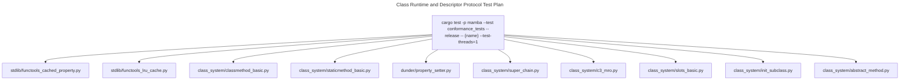

# Class System and Descriptor Protocol

Mamba's class registry, instance lifecycle, attribute lookup, and the
full Python descriptor protocol (data descriptors, non-data descriptors,
property, classmethod, staticmethod, cached_property, plus user-defined
`__get__` / `__set__` / `__delete__`). Method dispatch goes through an
MRO walk with a generation-counted method cache. Eight thread-local
registries hold the runtime state; class registration mutations bump
`METHOD_CACHE_GEN` to invalidate stale entries.

Three load-bearing invariants:

1. **`is_data_descriptor` precedence** — data descriptors win over
   instance `__dict__`; non-data descriptors lose to instance `__dict__`.
2. **`__cached_property__` is a real descriptor** — not an alias for the
   getter. First access runs the getter then writes the result onto the
   instance under the same name; subsequent accesses miss the descriptor
   and hit instance `__dict__` (commit `59480dd7`).
3. **`functools.lru_cache_wrapper` intercepts `cache_info` / `cache_clear`**
   at both `mb_getattr` (binds to `_lru_bound_method`) and
   `mb_call_method` (forwards to `functools_mod`) — the wrapper is a
   plain Instance but must dispatch like a callable (commit `7b4b6af4`).

## Type model
<!-- type: dependency lang: mermaid -->

```mermaid
---
id: class-types
types:
  MbClass:           { kind: struct }
  ClassRegistry:     { kind: struct, label: "thread_local HashMap<String, MbClass>" }
  CallableRegistry:  { kind: struct, label: "thread_local HashSet<u64> (registered fn pointers)" }
  SlotsRegistry:     { kind: struct, label: "thread_local HashMap<String, Vec<String>>" }
  DictSuppressed:    { kind: struct, label: "thread_local HashSet<String>" }
  KwargsRegistry:    { kind: struct, label: "thread_local HashMap<String, HashMap<String, MbValue>>" }
  MethodCache:       { kind: struct, label: "thread_local HashMap<(u64,u64), MbValue>" }
  MethodCacheGen:    { kind: struct, label: "thread_local Cell<u64>" }
  SimpleClassCache:  { kind: struct, label: "thread_local HashSet<String>" }
  PropertyDesc:      { kind: struct, label: "Instance class_name=__property__" }
  CachedPropertyDesc:{ kind: struct, label: "Instance class_name=__cached_property__" }
  ClassmethodDesc:   { kind: struct, label: "Instance class_name=__classmethod__" }
  StaticmethodDesc:  { kind: struct, label: "Instance class_name=__staticmethod__" }
  LruCacheWrapper:   { kind: struct, label: "Instance class_name=functools.lru_cache_wrapper" }
edges:
  - { from: ClassRegistry, to: MbClass, kind: owns,       label: "name → class" }
  - { from: MbClass,       to: MbClass, kind: references, label: "bases / mro names" }
  - { from: MbClass,       to: CallableRegistry, kind: references, label: "cached_init: (addr, registered)" }
  - { from: SlotsRegistry, to: DictSuppressed, kind: references }
  - { from: MethodCache,   to: MethodCacheGen, kind: references, label: "invalidate on bump" }
  - { from: SimpleClassCache, to: MethodCacheGen, kind: references }
  - { from: PropertyDesc,        to: MbClass, kind: references }
  - { from: CachedPropertyDesc,  to: MbClass, kind: references }
  - { from: ClassmethodDesc,     to: MbClass, kind: references }
  - { from: StaticmethodDesc,    to: MbClass, kind: references }
  - { from: LruCacheWrapper,     to: MbClass, kind: references }
---
classDiagram
    class MbClass
    class ClassRegistry
    class CallableRegistry
    class SlotsRegistry
    class DictSuppressed
    class KwargsRegistry
    class MethodCache
    class MethodCacheGen
    class SimpleClassCache
    class PropertyDesc
    class CachedPropertyDesc
    class ClassmethodDesc
    class StaticmethodDesc
    class LruCacheWrapper
    ClassRegistry --> MbClass : owns
    MbClass --> MbClass : bases / mro
    MbClass --> CallableRegistry : cached_init
    MethodCache --> MethodCacheGen : invalidate
    SimpleClassCache --> MethodCacheGen
```

## MbClass shape
<!-- type: schema lang: yaml -->

```yaml
$schema: "https://json-schema.org/draft/2020-12/schema"
$id: "class-types"
$defs:
  MbClass:
    type: object
    x-rust-type: MbClass
    properties:
      name:        { type: string }
      bases:       { type: array, items: { type: string }, description: "direct parent class names" }
      mro:         { type: array, items: { type: string }, description: "C3 linearization including self" }
      methods:     { type: object, additionalProperties: { x-rust-type: MbValue } }
      class_attrs: { type: object, additionalProperties: { x-rust-type: MbValue } }
      metaclass:
        oneOf:
          - { type: "null" }
          - { type: string }
        description: "explicit metaclass name; default is type"
      cached_init:
        oneOf:
          - { type: "null" }
          - type: object
            properties:
              addr:                  { type: integer, x-rust-type: u64 }
              registered_in_callable: { type: boolean }
            required: [addr, registered_in_callable]
        description: "resolved at registration time; avoids MRO walk at instance creation"
    required: [name, bases, mro, methods, class_attrs, metaclass, cached_init]
  DescriptorInstance:
    description: "Sentinel-class Instance carrying descriptor state"
    type: object
    oneOf:
      - { title: Property,        properties: { class_name: { const: __property__ },        fields: { properties: { fget: { x-rust-type: MbValue }, fset: { x-rust-type: MbValue }, fdel: { x-rust-type: MbValue } } } } }
      - { title: CachedProperty,  properties: { class_name: { const: __cached_property__ }, fields: { properties: { fget: { x-rust-type: MbValue }, "__name__": { x-rust-type: MbValue } } } } }
      - { title: Classmethod,     properties: { class_name: { const: __classmethod__ },     fields: { properties: { "__func__": { x-rust-type: MbValue } } } } }
      - { title: Staticmethod,    properties: { class_name: { const: __staticmethod__ },    fields: { properties: { "__func__": { x-rust-type: MbValue } } } } }
```

## Class registration lifecycle

```mermaid
---
id: class-lifecycle
initial: Unregistered
nodes:
  Unregistered:        { kind: initial,  label: "no entry in CLASS_REGISTRY" }
  Registering:         { kind: transient, label: "mb_class_register / mb_class_define inserting" }
  Registered:          { kind: normal,   label: "in registry; methods + class_attrs frozen until mutation" }
  MethodCacheValid:    { kind: normal,   label: "METHOD_CACHE entries match METHOD_CACHE_GEN" }
  MethodCacheStale:    { kind: normal,   label: "post-mutation; entries from prior gen no longer trusted" }
  InstanceCreated:     { kind: normal,   label: "mb_instance_new[_with_init] returned an Instance" }
edges:
  - { from: Unregistered,     to: Registering,      event: "mb_class_register" }
  - { from: Registering,      to: Registered,       event: "C3 linearize + cache_init resolve + insert" }
  - { from: Registering,      to: Registered,       event: "invalidate_method_cache" }
  - { from: Registered,       to: MethodCacheValid, event: "first attr lookup populates METHOD_CACHE" }
  - { from: MethodCacheValid, to: MethodCacheStale, event: "mb_class_set_class_attr / new class registered" }
  - { from: MethodCacheStale, to: MethodCacheValid, event: "next lookup repopulates" }
  - { from: Registered,       to: InstanceCreated,  event: "mb_instance_new_with_init" }
  - { from: InstanceCreated,  to: InstanceCreated,  event: "mb_setattr / mb_delattr" }
---
stateDiagram-v2
    [*] --> Unregistered
    Unregistered --> Registering: mb_class_register
    Registering --> Registered: linearize + insert
    Registered --> MethodCacheValid: first lookup
    MethodCacheValid --> MethodCacheStale: attr mutation
    MethodCacheStale --> MethodCacheValid: lookup repopulates
    Registered --> InstanceCreated: mb_instance_new_with_init
    InstanceCreated --> InstanceCreated: mb_setattr / mb_delattr
```

<!-- type: state-machine lang: mermaid -->



## Attribute lookup dispatch
<!-- type: logic lang: mermaid -->

```mermaid
---
id: getattr-dispatch
entry: enter
nodes:
  enter:        { kind: start,    label: "mb_getattr(obj, attr)" }
  is_native:    { kind: decision, label: "native typed wrapper?" }
  call_getter:  { kind: process,  label: "registry_bridge::lookup_getter; invoke" }
  attr_err:     { kind: terminal, label: "AttributeError; return none" }
  is_str_type:  { kind: decision, label: "str-typed unbound method? (str.lower etc)" }
  unbound:      { kind: process,  label: "build __unbound_method__ Instance" }
  ptr_kind:     { kind: decision, label: "ptr ObjData kind?" }
  dict_lookup:  { kind: process,  label: "Dict / module — read key" }
  is_lru_w:     { kind: decision, label: "Instance is functools.lru_cache_wrapper?" }
  bind_lru:     { kind: process,  label: "build _lru_bound_method Instance" }
  is_dict_supp: { kind: decision, label: "attr == __dict__ and DICT_SUPPRESSED has class?" }
  L1_data:      { kind: decision, label: "MRO lookup is data descriptor?" }
  L1_invoke:    { kind: process,  label: "invoke_descriptor_get(class_attr, obj)" }
  L2_inst:      { kind: decision, label: "instance fields has attr?" }
  L2_return:    { kind: process,  label: "return field value" }
  L3_nondata:   { kind: decision, label: "MRO lookup is non-data descriptor?" }
  L3_invoke:    { kind: process,  label: "invoke_descriptor_get / unwrap classmethod" }
  L4_class_attr:{ kind: decision, label: "MRO has plain class attr?" }
  L4_return:    { kind: process,  label: "return retained class_attr" }
  L5_getattr:   { kind: decision, label: "__getattr__ dunder?" }
  L5_call:      { kind: process,  label: "call __getattr__(self, attr)" }
  done:         { kind: terminal, label: "return value" }
edges:
  - { from: enter,         to: is_native }
  - { from: is_native,     to: call_getter, label: "yes + getter found" }
  - { from: is_native,     to: attr_err,    label: "yes + no getter" }
  - { from: is_native,     to: is_str_type, label: "no" }
  - { from: is_str_type,   to: unbound,     label: "yes" }
  - { from: is_str_type,   to: ptr_kind,    label: "no" }
  - { from: ptr_kind,      to: dict_lookup, label: "Dict" }
  - { from: ptr_kind,      to: is_lru_w,    label: "Instance" }
  - { from: is_lru_w,      to: bind_lru,    label: "yes + cache_info|cache_clear" }
  - { from: is_lru_w,      to: is_dict_supp,label: "no" }
  - { from: is_dict_supp,  to: attr_err,    label: "yes" }
  - { from: is_dict_supp,  to: L1_data,     label: "no" }
  - { from: L1_data,       to: L1_invoke,   label: "data desc" }
  - { from: L1_data,       to: L2_inst,     label: "not data" }
  - { from: L2_inst,       to: L2_return,   label: "found" }
  - { from: L2_inst,       to: L3_nondata,  label: "not found" }
  - { from: L3_nondata,    to: L3_invoke,   label: "non-data desc" }
  - { from: L3_nondata,    to: L4_class_attr, label: "no" }
  - { from: L4_class_attr, to: L4_return,   label: "found" }
  - { from: L4_class_attr, to: L5_getattr,  label: "not found" }
  - { from: L5_getattr,    to: L5_call,     label: "found" }
  - { from: L5_getattr,    to: attr_err,    label: "not found" }
  - { from: call_getter,   to: done }
  - { from: unbound,       to: done }
  - { from: dict_lookup,   to: done }
  - { from: bind_lru,      to: done }
  - { from: L1_invoke,     to: done }
  - { from: L2_return,     to: done }
  - { from: L3_invoke,     to: done }
  - { from: L4_return,     to: done }
  - { from: L5_call,       to: done }
---
flowchart TD
    enter([mb_getattr]) --> is_native{native typed?}
    is_native -->|yes + getter| call_getter[invoke]
    is_native -->|yes + none| attr_err([AttributeError])
    is_native -->|no| is_str_type{str-type unbound?}
    is_str_type -->|yes| unbound[__unbound_method__ Instance]
    is_str_type -->|no| ptr_kind{ObjData kind?}
    ptr_kind -->|Dict / module| dict_lookup[read key]
    ptr_kind -->|Instance| is_lru_w{lru_cache_wrapper?}
    is_lru_w -->|yes| bind_lru[_lru_bound_method]
    is_lru_w -->|no| is_dict_supp{__dict__ suppressed?}
    is_dict_supp -->|yes| attr_err
    is_dict_supp -->|no| L1_data{L1: data desc?}
    L1_data -->|yes| L1_invoke[invoke_descriptor_get]
    L1_data -->|no| L2_inst{L2: instance dict?}
    L2_inst -->|found| L2_return[return field]
    L2_inst -->|miss| L3_nondata{L3: non-data desc?}
    L3_nondata -->|yes| L3_invoke[invoke / unwrap]
    L3_nondata -->|no| L4_class_attr{L4: plain class attr?}
    L4_class_attr -->|yes| L4_return[return retained]
    L4_class_attr -->|no| L5_getattr{L5: __getattr__?}
    L5_getattr -->|yes| L5_call[call dunder]
    L5_getattr -->|no| attr_err
    call_getter --> done([return value])
    unbound --> done
    dict_lookup --> done
    bind_lru --> done
    L1_invoke --> done
    L2_return --> done
    L3_invoke --> done
    L4_return --> done
    L5_call --> done
```

## cached_property interaction
<!-- type: interaction lang: mermaid -->

```mermaid
---
id: cached-property-flow
actors:
  - { id: User,     kind: actor }
  - { id: JIT,      kind: system }
  - { id: GetAttr,  kind: system, label: "mb_getattr / invoke_descriptor_get" }
  - { id: Desc,     kind: system, label: "__cached_property__ Instance" }
  - { id: Instance, kind: system, label: "user instance" }
messages:
  - { from: User,     to: JIT,      name: "obj.x  (first access)" }
  - { from: JIT,      to: GetAttr,  name: mb_getattr(obj, x) }
  - { from: GetAttr,  to: Desc,     name: "lookup_method finds __cached_property__" }
  - { from: GetAttr,  to: GetAttr,  name: "is_data_descriptor false" }
  - { from: GetAttr,  to: Instance, name: "instance fields lookup x" }
  - { from: Instance, to: GetAttr,  name: "miss" }
  - { from: GetAttr,  to: GetAttr,  name: "is_descriptor true (cached_property branch)" }
  - { from: GetAttr,  to: Desc,     name: mb_cached_property_get(desc, obj) }
  - { from: Desc,     to: Instance, name: "fget(self)" }
  - { from: Instance, to: Desc,     name: computed_value, returns: MbValue }
  - { from: Desc,     to: Instance, name: mb_setattr(obj, name, computed_value) }
  - { from: Desc,     to: GetAttr,  name: computed_value }
  - { from: GetAttr,  to: User,     name: computed_value }
  - { from: User,     to: JIT,      name: "obj.x  (second access)" }
  - { from: JIT,      to: GetAttr,  name: mb_getattr(obj, x) }
  - { from: GetAttr,  to: Instance, name: "L2 instance fields lookup x" }
  - { from: Instance, to: GetAttr,  name: "found cached value" }
  - { from: GetAttr,  to: User,     name: cached_value }
---
sequenceDiagram
    actor User
    participant JIT
    participant GetAttr
    participant Desc
    participant Instance
    User->>JIT: obj.x [first access]
    JIT->>GetAttr: mb_getattr(obj, x)
    GetAttr->>Desc: lookup_method finds cached_property
    GetAttr->>Instance: L2 instance dict — miss
    GetAttr->>Desc: mb_cached_property_get
    Desc->>Instance: fget(self)
    Instance-->>Desc: computed
    Desc->>Instance: mb_setattr(obj, name, computed)
    Desc-->>GetAttr: computed
    GetAttr-->>User: computed
    User->>JIT: obj.x [second access]
    JIT->>GetAttr: mb_getattr(obj, x)
    GetAttr->>Instance: L2 instance dict — hit
    GetAttr-->>User: cached
```

## Acceptance scenarios
<!-- type: scenarios lang: yaml -->
```yaml
scenarios:
  - id: cached-property
    given: stdlib/functools_cached_property.py defines a cached property
    when: the property is accessed twice on the same instance
    then: fget runs once and the second access reads the instance field
  - id: lru-cache-wrapper
    given: stdlib/functools_lru_cache.py decorates a function with lru_cache
    when: cache_info or cache_clear is accessed
    then: lru_cache_wrapper dispatches through bound wrapper methods
  - id: classmethod-basic
    given: class_system/classmethod_basic.py defines a classmethod factory
    when: the factory is invoked through the class
    then: __classmethod__ unwraps to a bound function with cls
  - id: property-setter
    given: dunder/property_setter.py defines a property with a setter
    when: obj.x is assigned
    then: data descriptor precedence invokes fset before instance dict fallback
```

## Tests
<!-- type: test-plan lang: mermaid -->


## Changes
<!-- type: changes lang: yaml -->

```yaml
changes:
  - file: crates/mamba/src/runtime/class.rs
    action: modify
    impl_mode: hand-written
    description: "Class registry, instance lifecycle, descriptor protocol, MRO method cache, eight thread-local registries. Hand-written; spec is the design contract."
```
