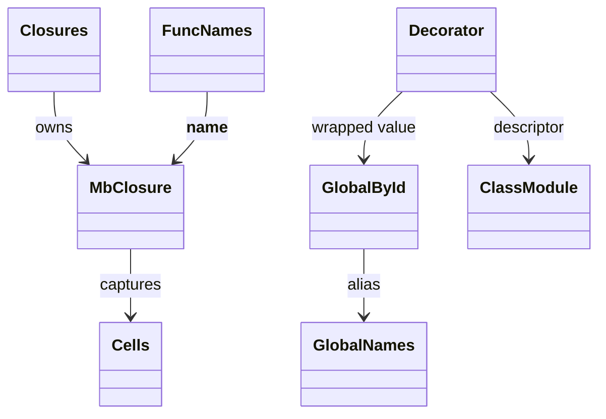
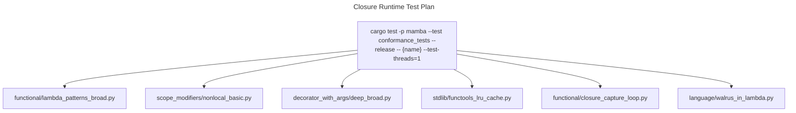

# Closures, Cells, Globals, Decorators

Mamba's function-object plumbing. Four registries live in this file:
`CLOSURES` (Vec-indexed function handles with captures + defaults),
`CELLS` (mutable boxed slots that close over assignments inside nested
functions), `FUNC_NAMES` (function-pointer → `__name__` reverse map),
and the per-module `GLOBAL_BY_ID` / `GLOBAL_NAMES` namespaces. Decorator
application (`mb_apply_decorator` / `mb_apply_decorators`) runs the
decorator chain right-to-left producing a wrapped value that the
caller stores under the original name.

Three load-bearing invariants:

1. **Closure IDs start at 1; iter IDs at `0x1_0000_0000`; generator IDs
   at 1 too** — closures collide with generators by ID range, so
   `is_known_generator` and `is_known_closure` checks gate every
   handle dispatch. Closures vs generators are told apart by registry
   membership only.
2. **`Var(sym)` lowering for decorated user funcs emits `LoadGlobal`,
   not `FuncRef`** (recent fix in commit `7b4b6af4`). A decorator
   replaces the bound name in globals with the wrapped value; `FuncRef`
   would short-circuit to the raw JIT entry, bypassing the wrapper.
   Read context lives in `lower/hir-to-mir.md`; here we only document
   the runtime side: the wrapped value lives in `GLOBAL_BY_ID` under
   the original symbol id.
3. **Cell-set drops the prior value** — `mb_cell_set` calls
   `release_if_ptr` on the previous cell content before overwriting.
   Skipping this leaks every reassignment in a closed-over variable.

## Type model
<!-- type: dependency lang: mermaid -->



## Closure shape
<!-- type: schema lang: yaml -->

```yaml
$schema: "https://json-schema.org/draft/2020-12/schema"
$id: "closure-types"
$defs:
  MbClosure:
    type: object
    x-rust-type: MbClosure
    properties:
      name:     { type: string, description: "function __name__; <closure> for unnamed lambdas" }
      captures: { type: array,  items: { x-rust-type: MbValue }, description: "may hold cell handles for assigned-in-nested vars" }
      func:     { x-rust-type: MbValue, description: "underlying function pointer (FUNC tag) or another closure handle" }
      defaults: { type: array,  items: { x-rust-type: MbValue }, description: "default arg values, evaluated at fn-creation time" }
    required: [name, captures, func, defaults]
  CellSlot:
    type: object
    x-rust-type: "Option<MbValue>"
    description: "Vec-indexed mutable slot; mb_cell_set replaces and releases prior value"
  GlobalNamespace:
    type: object
    description: "Two-tier: GLOBAL_BY_ID (i64 → value, hot path) and GLOBAL_NAMES (string → value, slow path / introspection)"
    properties:
      by_id:    { type: object, additionalProperties: { x-rust-type: MbValue } }
      by_name:  { type: object, additionalProperties: { x-rust-type: MbValue } }
    required: [by_id, by_name]
```

## Closure / cell / global lifecycle

```mermaid
---
id: closure-lifecycle
initial: Allocated
nodes:
  Allocated:    { kind: initial,  label: "mb_closure_new returns id" }
  WithDefaults: { kind: normal,   label: "mb_closure_set_defaults populated defaults Vec" }
  CellLive:     { kind: normal,   label: "mb_cell_new id; cell holds Some(MbValue)" }
  CellMutated:  { kind: normal,   label: "mb_cell_set: release_if_ptr prior; overwrite" }
  Decorated:    { kind: normal,   label: "wrapped via mb_apply_decorator(s); GLOBAL_BY_ID[id] points at wrapper" }
  Released:     { kind: terminal, label: "mb_closure_release / mb_cell_release; slot becomes None" }
edges:
  - { from: Allocated,    to: WithDefaults, event: "mb_closure_set_defaults" }
  - { from: Allocated,    to: Decorated,    event: "mb_apply_decorator" }
  - { from: WithDefaults, to: Decorated,    event: "mb_apply_decorator on closure" }
  - { from: Allocated,    to: Released,     event: "mb_closure_release" }
  - { from: WithDefaults, to: Released,     event: "mb_closure_release" }
  - { from: Decorated,    to: Released,     event: "module teardown" }
  - { from: CellLive,     to: CellMutated,  event: "mb_cell_set new value" }
  - { from: CellMutated,  to: CellMutated,  event: "mb_cell_set again" }
  - { from: CellMutated,  to: Released,     event: "module teardown / explicit release" }
  - { from: CellLive,     to: Released,     event: "explicit release" }
---
stateDiagram-v2
    [*] --> Allocated
    Allocated --> WithDefaults: set_defaults
    Allocated --> Decorated: apply_decorator
    WithDefaults --> Decorated: apply_decorator
    Allocated --> Released: closure_release
    WithDefaults --> Released: closure_release
    Decorated --> Released: teardown
    CellLive --> CellMutated: cell_set
    CellMutated --> CellMutated: cell_set
    CellMutated --> Released: teardown
    CellLive --> Released: release
    Released --> [*]
```

<!-- type: state-machine lang: mermaid -->



## Decorator application logic
<!-- type: logic lang: mermaid -->

```mermaid
---
id: decorator-apply
entry: enter
nodes:
  enter:        { kind: start,    label: "mb_apply_decorators(func, decorators_list)" }
  iter_dec:     { kind: process,  label: "for d in decorators reversed" }
  is_builtin:   { kind: decision, label: "decorator is built-in sentinel?" }
  call_prop:    { kind: process,  label: "@property → mb_property_new(fget=func)" }
  call_clsmtd:  { kind: process,  label: "@classmethod → mb_classmethod_new(func)" }
  call_static:  { kind: process,  label: "@staticmethod → mb_staticmethod_new(func)" }
  call_cached:  { kind: process,  label: "@cached_property → mb_cached_property_new(func, name)" }
  call_abstract:{ kind: process,  label: "@abstractmethod → mb_abstractmethod(func); mark in ABSTRACT_REGISTRY" }
  call_user:    { kind: process,  label: "user decorator: mb_call1(d, func) — wrapper returned" }
  store:        { kind: process,  label: "GLOBAL_BY_ID[sym_id] = wrapped (if applicable)" }
  done:         { kind: terminal, label: "return wrapped value" }
edges:
  - { from: enter,         to: iter_dec }
  - { from: iter_dec,      to: is_builtin }
  - { from: is_builtin,    to: call_prop,     label: "@property" }
  - { from: is_builtin,    to: call_clsmtd,   label: "@classmethod" }
  - { from: is_builtin,    to: call_static,   label: "@staticmethod" }
  - { from: is_builtin,    to: call_cached,   label: "@cached_property" }
  - { from: is_builtin,    to: call_abstract, label: "@abstractmethod" }
  - { from: is_builtin,    to: call_user,     label: "user callable" }
  - { from: call_prop,     to: store }
  - { from: call_clsmtd,   to: store }
  - { from: call_static,   to: store }
  - { from: call_cached,   to: store }
  - { from: call_abstract, to: store }
  - { from: call_user,     to: store }
  - { from: store,         to: iter_dec, label: "more decorators" }
  - { from: store,         to: done,     label: "chain done" }
---
flowchart TD
    enter([apply_decorators reversed]) --> iter_dec[for each d]
    iter_dec --> is_builtin{built-in sentinel?}
    is_builtin -->|@property| call_prop[mb_property_new]
    is_builtin -->|@classmethod| call_clsmtd[mb_classmethod_new]
    is_builtin -->|@staticmethod| call_static[mb_staticmethod_new]
    is_builtin -->|@cached_property| call_cached[mb_cached_property_new]
    is_builtin -->|@abstractmethod| call_abstract[mb_abstractmethod]
    is_builtin -->|user callable| call_user[d func]
    call_prop --> store[GLOBAL_BY_ID assign]
    call_clsmtd --> store
    call_static --> store
    call_cached --> store
    call_abstract --> store
    call_user --> store
    store --> iter_dec
    store --> done([wrapped value])
```

## Cell capture interaction
<!-- type: interaction lang: mermaid -->

```mermaid
---
id: cell-capture-flow
actors:
  - { id: Outer,    kind: system, label: "outer fn body" }
  - { id: Closure,  kind: system, label: "closure.rs" }
  - { id: Cell,     kind: system, label: "CELLS slot" }
  - { id: Inner,    kind: system, label: "nested fn body" }
messages:
  - { from: Outer,   to: Closure, name: "mb_cell_new(initial_value)" }
  - { from: Closure, to: Cell,    name: "CELLS.push(Some(initial))" }
  - { from: Cell,    to: Closure, name: "cell_id", returns: i64 }
  - { from: Closure, to: Outer,   name: cell_id }
  - { from: Outer,   to: Closure, name: "mb_closure_new(name, inner_fn, captures=[cell_id])" }
  - { from: Outer,   to: Inner,   name: "call inner_handle()" }
  - { from: Inner,   to: Closure, name: "mb_closure_get_capture(handle, 0)" }
  - { from: Closure, to: Inner,   name: "cell_id (captured slot)" }
  - { from: Inner,   to: Closure, name: "mb_cell_get(cell_id)" }
  - { from: Closure, to: Cell,    name: "read CELLS[cell_id]" }
  - { from: Cell,    to: Inner,   name: current_value }
  - { from: Inner,   to: Closure, name: "mb_cell_set(cell_id, new_value)" }
  - { from: Closure, to: Cell,    name: "release_if_ptr prior; CELLS[cell_id] = Some(new)" }
---
sequenceDiagram
    participant Outer
    participant Closure
    participant Cell
    participant Inner
    Outer->>Closure: mb_cell_new(initial)
    Closure->>Cell: CELLS.push
    Cell-->>Closure: cell_id
    Closure-->>Outer: cell_id
    Outer->>Closure: mb_closure_new with captures=[cell_id]
    Outer->>Inner: call inner_handle
    Inner->>Closure: mb_closure_get_capture
    Closure-->>Inner: cell_id
    Inner->>Closure: mb_cell_get
    Closure->>Cell: read
    Cell-->>Inner: current
    Inner->>Closure: mb_cell_set(new)
    Closure->>Cell: release_if_ptr; overwrite
```

## Acceptance scenarios
<!-- type: scenarios lang: yaml -->
```yaml
scenarios:
  - id: lambda-defaults
    given: functional/lambda_patterns_broad.py defines lambda defaults
    when: the lambda is invoked with missing arguments
    then: mb_closure_set_defaults supplies default values at call time
  - id: nonlocal-basic
    given: scope_modifiers/nonlocal_basic.py mutates an outer variable
    when: the inner function writes through nonlocal
    then: mb_cell_set overwrites the cell and the outer scope sees the new value
  - id: parameterized-decorator
    given: decorator_with_args/deep_broad.py uses a parameterized decorator
    when: decorator application runs right-to-left
    then: GLOBAL_BY_ID stores the wrapper under the original symbol
  - id: lru-cache-wrapper
    given: stdlib/functools_lru_cache.py decorates a function
    when: Var(sym) loads the function name
    then: LoadGlobal returns the wrapped value instead of the raw FuncRef
```

## Tests
<!-- type: test-plan lang: mermaid -->


## Changes
<!-- type: changes lang: yaml -->

```yaml
changes:
  - file: crates/mamba/src/runtime/closure.rs
    action: modify
    impl_mode: hand-written
    description: "MbClosure + thread-local Vec-indexed registries (CLOSURES, CELLS) + reverse-lookup HashMaps (FUNC_NAMES, GLOBAL_BY_ID, GLOBAL_NAMES). Decorator application path; cell-set release-prior protocol. Hand-written; the Var(sym)→LoadGlobal lowering rule lives in lower/hir-to-mir.md."
```
