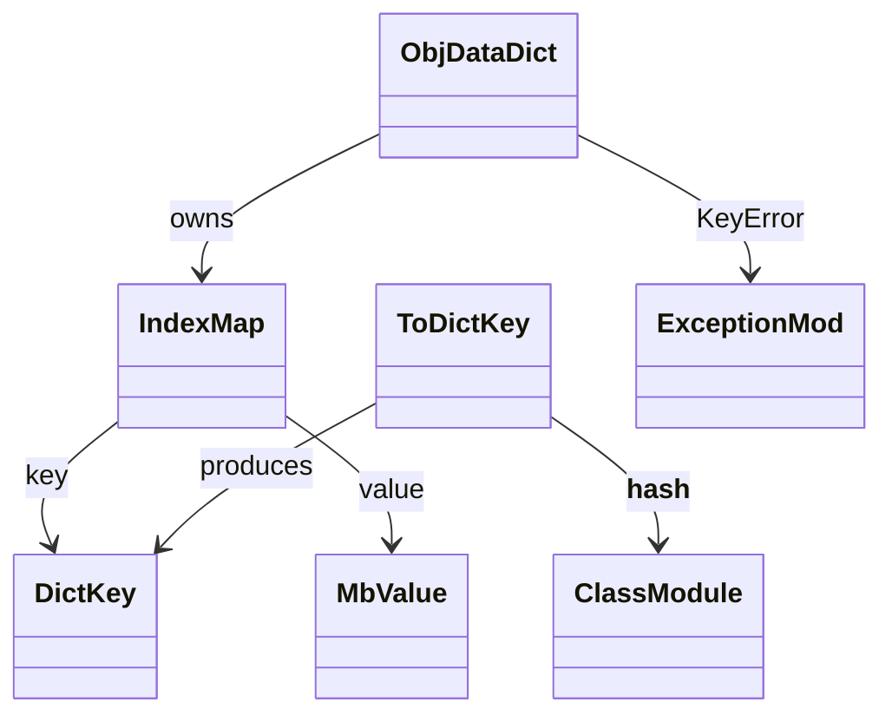
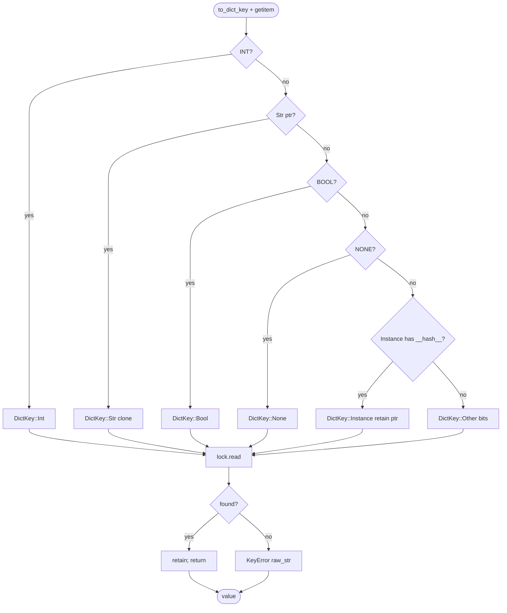
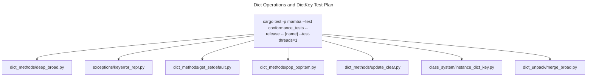

# Dict Operations and DictKey

Mamba dicts use `RwLock<IndexMap<DictKey, MbValue>>` so insertion order
is preserved (matching Python 3.7+ semantics) and the lock allows
concurrent readers across threads. The dict-key normaliser
`to_dict_key` collapses every Mamba value into a hashable `DictKey`
variant: primitives map to dedicated variants; user-class instances
hash via `__hash__` and compare via `__eq__` on collision; non-hashable
heap objects fall back to `Other(bits.to_string())` so identity-keyed
lookups still work.

Three load-bearing invariants:

1. **`d[1]` and `d["1"]` are distinct entries** — `DictKey::Int(1)`
   and `DictKey::Str("1")` hash to different buckets even though
   Python `1 == "1"` would be False; this matches CPython.
2. **`DictKey::Instance` retains the instance pointer** — clone-and-
   drop walk the rc; the comparison path uses the cached `hash_val`
   for bucket selection then dispatches `__eq__` on collision.
3. **`mb_dict_getitem` raises `KeyError` with the raw key text** —
   `dict_key_raw_str` returns the unquoted form; the printer in
   `string-ops.md` `value_to_string` adds the repr-quoting at output
   time. Pre-quoting at the raise site would double-up (commit
   `dbbaf7396`).

## Type model
<!-- type: dependency lang: mermaid -->



## DictKey variants
<!-- type: schema lang: yaml -->

```yaml
$schema: "https://json-schema.org/draft/2020-12/schema"
$id: "dict-key-types"
$defs:
  DictKey:
    description: "Hashable + Eq via Hash impl; Clone/Drop walk rc on Instance variant"
    oneOf:
      - { title: Int,       properties: { value: { type: integer, x-rust-type: i64 } } }
      - { title: Str,       properties: { value: { type: string } } }
      - { title: Bool,      properties: { value: { type: boolean } } }
      - { title: None,      type: object }
      - title: Instance
        properties:
          hash_val:   { type: integer, x-rust-type: i64, description: "from __hash__ at insert time" }
          ptr:        { type: integer, x-rust-type: usize, description: "instance pointer (retained); release on Drop" }
          class_name: { type: string }
        required: [hash_val, ptr, class_name]
        description: "user class instance; __eq__ dispatched on bucket collision"
      - title: Other
        properties:
          bits: { type: string, description: "MbValue::to_bits().to_string() — non-hashable heap fallback" }
        required: [bits]
        description: "identity-keyed for non-hashable heap objects we can't dunder-route today"
  DictEntry:
    type: object
    description: "IndexMap<DictKey, MbValue> entry"
    properties:
      key:   { $ref: "#/$defs/DictKey" }
      value: { x-rust-type: MbValue }
    required: [key, value]
```

## Key-conversion / lookup logic
<!-- type: logic lang: mermaid -->



## Method dispatch interaction
<!-- type: interaction lang: mermaid -->

```mermaid
---
id: dict-method-dispatch
actors:
  - { id: JIT,        kind: system, label: "JIT-emitted lower-method-call" }
  - { id: Dispatcher, kind: system, label: "dispatch_dict_method" }
  - { id: Handler,    kind: system, label: "mb_dict_get / mb_dict_pop / ..." }
  - { id: Storage,    kind: system, label: "RwLock<IndexMap<DictKey, MbValue>>" }
messages:
  - { from: JIT,        to: Dispatcher, name: "dispatch_dict_method('get', d, [key, default])" }
  - { from: Dispatcher, to: Handler,    name: "mb_dict_get(d, key, default)" }
  - { from: Handler,    to: Handler,    name: "to_dict_key(key)" }
  - { from: Handler,    to: Storage,    name: "lock.read; guard.get(&dk)" }
  - { from: Storage,    to: Handler,    name: "Some(&v) | None" }
  - { from: Handler,    to: Handler,    name: "retain_if_ptr or return default" }
  - { from: Handler,    to: Dispatcher, name: result, returns: MbValue }
  - { from: Dispatcher, to: JIT,        name: result, returns: MbValue }
  - { from: JIT,        to: Handler,    name: "direct: mb_dict_getitem(d, key) — __getitem__ path" }
  - { from: Handler,    to: Storage,    name: "lock.read; guard.get" }
  - { from: Storage,    to: Handler,    name: "Some | None (raises KeyError on None)" }
  - { from: Handler,    to: JIT,        name: result }
---
sequenceDiagram
    participant JIT
    participant Dispatcher
    participant Handler
    participant Storage
    JIT->>Dispatcher: dispatch get / pop / keys / ...
    Dispatcher->>Handler: forward to mb_dict_*
    Handler->>Handler: to_dict_key(key)
    Handler->>Storage: lock.read; guard.get
    Storage-->>Handler: Some or None
    Handler-->>Dispatcher: result
    Dispatcher-->>JIT: result
    JIT->>Handler: direct mb_dict_getitem (subscript)
    Handler->>Storage: lock.read; guard.get
    Storage-->>Handler: Some or KeyError
    Handler-->>JIT: result
```

## Acceptance scenarios
<!-- type: scenarios lang: yaml -->

```yaml
scenarios:
  - id: distinct-key-kinds
    given: dict_methods/deep_broad.py creates keys 1 and "1"
    when: both entries are inserted into the same dict
    then: DictKey::Int and DictKey::Str stay distinct and len is 2
  - id: keyerror-repr
    given: exceptions/keyerror_repr.py reads a missing string key
    when: mb_dict_getitem raises KeyError
    then: the raw key text is stored and output formatting quotes it exactly once
  - id: insertion-order
    given: dict_methods/insertion_order.py inserts keys in sequence
    when: keys, values, or items are observed
    then: IndexMap preserves Python 3.7+ insertion order
  - id: instance-dict-key
    given: class_system/instance_dict_key.py uses instances with __hash__ and __eq__
    when: a value-equal instance reads a stored key
    then: DictKey::Instance uses cached hash and __eq__ collision resolution
```

## Tests
<!-- type: test-plan lang: mermaid -->



## Changes
<!-- type: changes lang: yaml -->

```yaml
changes:
  - file: crates/mamba/src/runtime/dict_ops.rs
    action: modify
    impl_mode: hand-written
    description: "DictKey enum (6 variants) + to_dict_key + dict_key_raw_str + dict_key_display + IndexMap-backed mb_dict_* surface + dispatch_dict_method router. Hand-written; key normalisation algorithm is load-bearing for cross-test compatibility."
```
