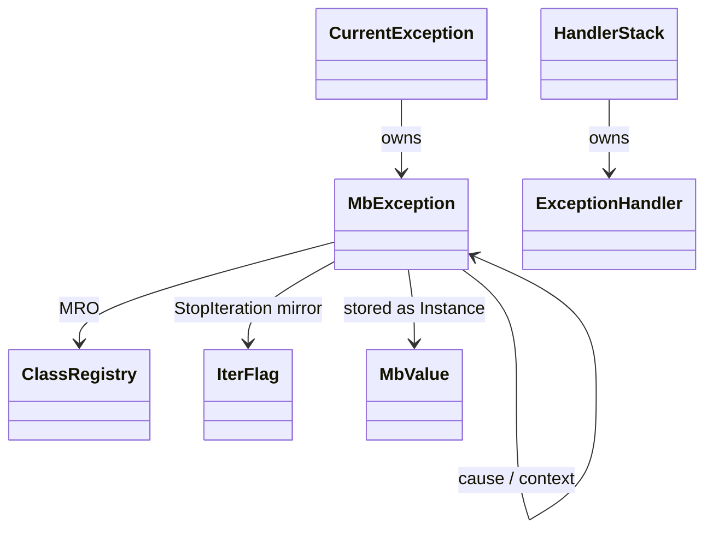
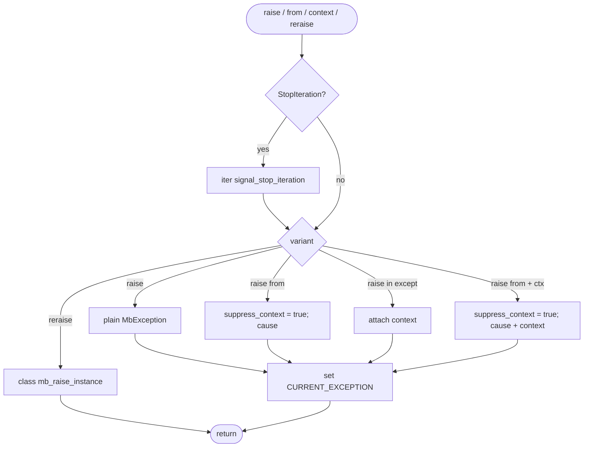
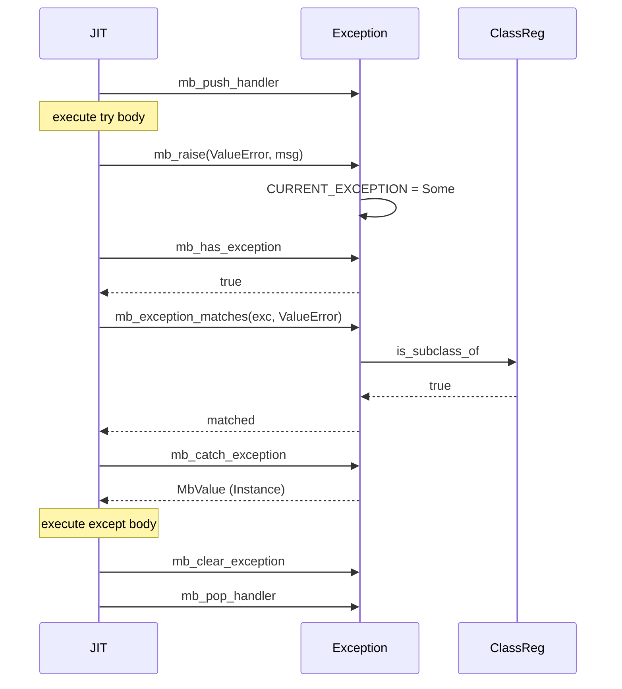
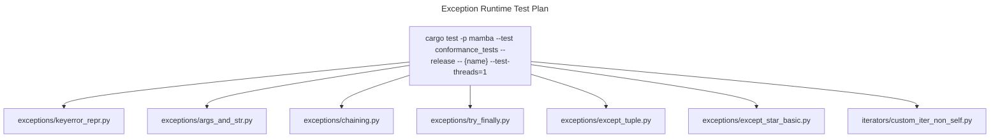

# Exception Runtime

Mamba's exception subsystem. One `MbException` value type plus a
thread-local pending-exception slot drives every Python control-flow
path that involves `raise` / `try` / `except` / `except*`. Two cross-cuts
are this spec's load-bearing invariants:

1. **`mb_raise("StopIteration")` mirrors the iterator flag**
   (`iter::signal_stop_iteration`) — `iter.md` consumes both.
2. **`raise X from Y` always sets `suppress_context = True`**, regardless
   of whether `Y` is None — controls how the printer walks the chain.

## Type model
<!-- type: dependency lang: mermaid -->



## Exception state shape
<!-- type: schema lang: yaml -->

```yaml
$schema: "https://json-schema.org/draft/2020-12/schema"
$id: "exception-types"
$defs:
  MbException:
    type: object
    x-rust-type: MbException
    properties:
      exc_type:         { type: string, description: "exception class name (e.g. ValueError)" }
      message:          { type: string }
      cause:
        oneOf:
          - { type: "null" }
          - { $ref: "#/$defs/MbException" }
        description: "raise X from Y — explicit chain"
      context:
        oneOf:
          - { type: "null" }
          - { $ref: "#/$defs/MbException" }
        description: "active exception when this was raised — implicit chain"
      suppress_context:
        type: boolean
        description: "set by raise-from (always true) or raise-from-None — printer skips context"
      traceback:
        type: array
        items:
          type: object
          properties:
            file:     { type: string }
            line:     { type: integer, x-rust-type: u32 }
            function: { type: string }
          required: [file, line, function]
    required: [exc_type, message, cause, context, suppress_context, traceback]
  ExceptionHandler:
    type: object
    x-rust-type: ExceptionHandler
    description: "try-frame entry"
    properties:
      catch_types:
        type: array
        items: { type: string }
        description: "empty = catch all"
      has_finally: { type: boolean }
    required: [catch_types, has_finally]
```

## Exception lifecycle

```mermaid
---
id: exception-lifecycle
initial: Idle
nodes:
  Idle:     { kind: initial,  label: "no pending exception" }
  Pending:  { kind: normal,   label: "CURRENT_EXCEPTION = Some(exc)" }
  Caught:   { kind: normal,   label: "value extracted; slot empty" }
  Uncaught: { kind: terminal, label: "module exit reports Traceback" }
edges:
  - { from: Idle,    to: Pending,  event: "mb_raise / mb_raise_from / mb_raise_with_context / mb_raise_from_with_context / mb_reraise" }
  - { from: Pending, to: Caught,   event: mb_catch_exception, guard: "matching except handler" }
  - { from: Pending, to: Idle,     event: "mb_clear_exception | iter clears for StopIteration leak" }
  - { from: Pending, to: Uncaught, event: mb_take_uncaught_traceback }
  - { from: Caught,  to: Pending,  event: "mb_reraise (re-raise from except)" }
  - { from: Caught,  to: Idle,     event: "handler completes" }
---
stateDiagram-v2
    [*] --> Idle
    Idle --> Pending: mb_raise*
    Pending --> Caught: mb_catch_exception [match]
    Pending --> Idle: mb_clear_exception
    Pending --> Uncaught: mb_take_uncaught_traceback
    Caught --> Pending: mb_reraise
    Caught --> Idle: handler done
    Uncaught --> [*]
```

<!-- type: state-machine lang: mermaid -->



## Raise dispatch
<!-- type: logic lang: mermaid -->



## Try-except interaction
<!-- type: interaction lang: mermaid -->



## Acceptance scenarios
<!-- type: scenarios lang: yaml -->

```yaml
scenarios:
  - id: keyerror-repr
    given: exceptions/keyerror_repr.py catches a missing dict key
    when: the exception is printed with str and repr
    then: formatting adds exactly one layer of CPython-compatible quoting
  - id: raise-from-context
    given: exceptions/chaining.py raises one exception from another
    when: raise X from Y executes
    then: cause is set and suppress_context is true so implicit context is not printed
  - id: except-star-split
    given: exceptions/except_star_basic.py raises an ExceptionGroup
    when: except* handles one subtype
    then: matched exceptions run the handler and unmatched rest re-propagates
```

## Tests
<!-- type: test-plan lang: mermaid -->



## Changes
<!-- type: changes lang: yaml -->

```yaml
changes:
  - file: crates/mamba/src/runtime/exception.rs
    action: modify
    impl_mode: hand-written
    description: "Exception object, thread-local pending slot, raise variants, ExceptionGroup, except*, MRO matching. Hand-written; spec is the design contract."
```
