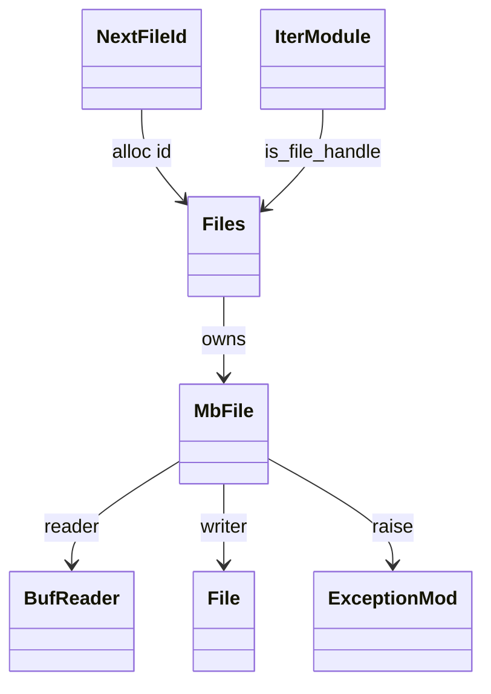
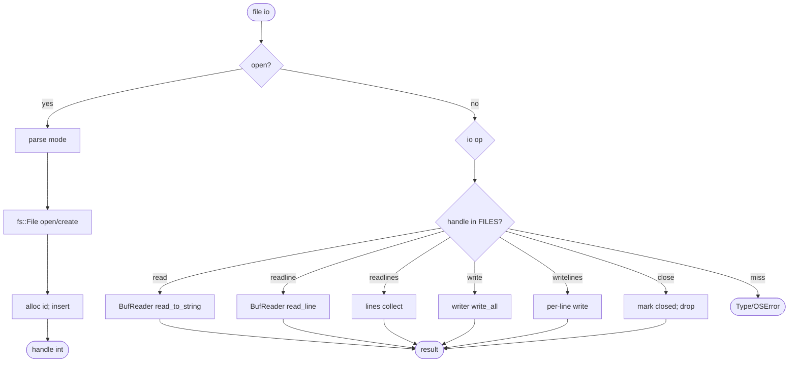
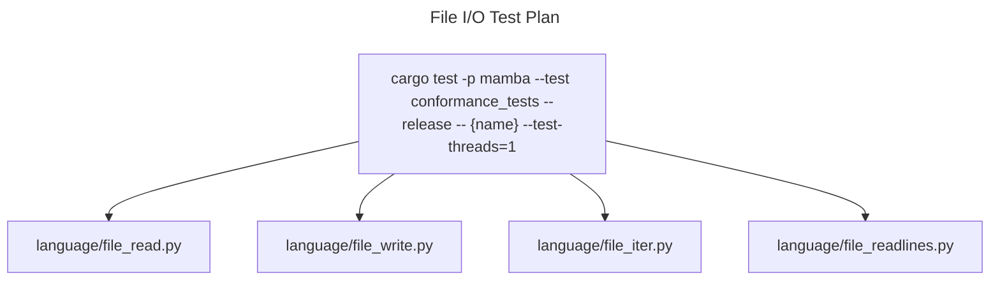

# File I/O

Mamba file objects are *not* heap `MbObject` — they are thread-local
handle table entries (`MbFile { reader, writer, mode, closed }`)
returned to JIT code as `i64` IDs. This sidesteps `ObjData` having to
hold non-`Send` `BufReader<File>` / `File` types.

Three load-bearing invariants:

1. **File handles are thread-local** — opening a file on thread A
   produces a handle that thread B cannot use. The thread-local
   `HashMap<u64, MbFile>` registry is intentional; cross-thread file
   sharing is not supported and is unlikely to be needed for
   conformance work.
2. **Mode parsing strictly mirrors Python** — `'r'`, `'w'`, `'a'`,
   `'rb'`, `'wb'`, `'ab'`, `'r+'`, `'w+'` etc. each open a fresh
   `BufReader` / `File` slot; binary modes do not currently differ
   from text modes (no decode step), which is an open gap for
   `bytes`-returning reads.
3. **`is_file_handle(id)` gates dispatch** — `mb_iter` (see
   `iter.md`) and other places that may receive a generic `i64`
   handle must check `is_file_handle` to decide whether the value
   is a file iterator vs. a generator vs. a closure. Disjoint ID
   ranges across registries (this one starts at 1, generator at 1,
   iter at `0x1_0000_0000`) keep collisions resolvable but are NOT
   sufficient on their own — the explicit registry-membership check
   is required.

Open gap: `bytes`-returning reads when mode contains `b`. Today the
binary mode is parsed but the read path still constructs a Str. CPython
returns `bytes`. Out of scope for this spec; tracked separately.

## Type model
<!-- type: dependency lang: mermaid -->



## File state shape
<!-- type: schema lang: yaml -->

```yaml
$schema: "https://json-schema.org/draft/2020-12/schema"
$id: "file-io-types"
$defs:
  MbFile:
    type: object
    x-rust-type: MbFile
    properties:
      reader:
        oneOf:
          - { type: "null" }
          - { x-rust-type: "BufReader<fs::File>" }
        description: "set when mode contains 'r' or '+'"
      writer:
        oneOf:
          - { type: "null" }
          - { x-rust-type: "fs::File" }
        description: "set when mode contains 'w' / 'a' / '+'"
      mode:   { type: string, description: "raw mode string from open() call" }
      closed: { type: boolean }
    required: [reader, writer, mode, closed]
  FileMode:
    type: string
    enum:
      - "r"
      - "w"
      - "a"
      - "rb"
      - "wb"
      - "ab"
      - "r+"
      - "w+"
      - "a+"
    description: "text vs binary modes parsed; binary read-as-bytes is open gap"
```

## Lifecycle

```mermaid
---
id: file-lifecycle
initial: Open
nodes:
  Open:    { kind: initial, label: "mb_open allocated id; reader/writer set per mode" }
  Reading: { kind: normal,  label: "in-progress read (read / readline / readlines / iter)" }
  Writing: { kind: normal,  label: "in-progress write (write / writelines)" }
  Closed:  { kind: terminal, label: "mb_file_close set closed=true; reader/writer dropped" }
edges:
  - { from: Open,    to: Reading, event: "mb_file_read | readline | readlines | iter" }
  - { from: Open,    to: Writing, event: "mb_file_write | writelines" }
  - { from: Reading, to: Open,    event: "read returns" }
  - { from: Writing, to: Open,    event: "write flushes (no auto-close)" }
  - { from: Open,    to: Closed,  event: "mb_file_close" }
  - { from: Reading, to: Closed,  event: "mb_file_close (mid-stream)" }
  - { from: Writing, to: Closed,  event: "mb_file_close" }
---
stateDiagram-v2
    [*] --> Open
    Open --> Reading: read / readline / readlines / iter
    Open --> Writing: write / writelines
    Reading --> Open: return
    Writing --> Open: flush
    Open --> Closed: close
    Reading --> Closed: close mid
    Writing --> Closed: close
    Closed --> [*]
```

<!-- type: state-machine lang: mermaid -->



## Open / read / write logic
<!-- type: logic lang: mermaid -->



## with-statement interaction
<!-- type: interaction lang: mermaid -->

```mermaid
---
id: with-open-flow
actors:
  - { id: User,    kind: actor }
  - { id: JIT,     kind: system }
  - { id: FileIO,  kind: system, label: "file_io.rs" }
  - { id: Class,   kind: system, label: "class.rs (__enter__/__exit__ on file handle proxy)" }
messages:
  - { from: User,   to: JIT,    name: "with open(path, 'r') as f: f.read()" }
  - { from: JIT,    to: FileIO, name: mb_open(path, mode) }
  - { from: FileIO, to: JIT,    name: handle_id, returns: MbValue }
  - { from: JIT,    to: Class,  name: "__enter__: returns handle as-is" }
  - { from: JIT,    to: FileIO, name: mb_file_read(handle) }
  - { from: FileIO, to: JIT,    name: contents, returns: MbValue }
  - { from: JIT,    to: Class,  name: "__exit__: regardless of exception" }
  - { from: Class,  to: FileIO, name: mb_file_close(handle) }
  - { from: FileIO, to: FileIO, name: "drop reader/writer; closed = true" }
---
sequenceDiagram
    actor User
    participant JIT
    participant FileIO
    participant Class
    User->>JIT: with open(path) as f
    JIT->>FileIO: mb_open
    FileIO-->>JIT: handle
    JIT->>Class: __enter__
    JIT->>FileIO: read
    FileIO-->>JIT: contents
    JIT->>Class: __exit__
    Class->>FileIO: mb_file_close
    FileIO->>FileIO: drop; closed
```

## Acceptance scenarios
<!-- type: scenarios lang: yaml -->
```yaml
scenarios:
  - id: file-read
    given: language/file_read.py opens a file in read mode
    when: with open(path, "r") as f reads the contents
    then: open, read, and close execute through the handle table and contents print
  - id: file-write
    given: language/file_write.py opens a file in write mode
    when: f.write writes text
    then: writer.write_all persists the data and close releases the descriptor
  - id: file-iter
    given: language/file_iter.py iterates over open(path)
    when: mb_iter receives the handle
    then: is_file_handle routes iteration to file lines
```

## Tests
<!-- type: test-plan lang: mermaid -->


## Changes
<!-- type: changes lang: yaml -->

```yaml
changes:
  - file: crates/mamba/src/runtime/file_io.rs
    action: modify
    impl_mode: hand-written
    description: "MbFile + thread-local FILES registry + alloc_file_id; mb_open / read / readline / readlines / write / writelines / close; is_file_handle gate. Hand-written; binary read-as-bytes is open gap."
```
