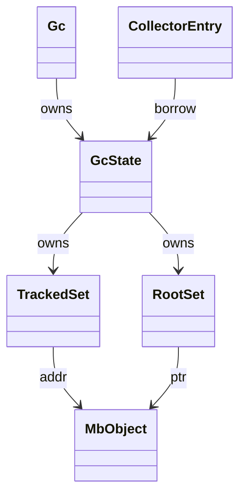
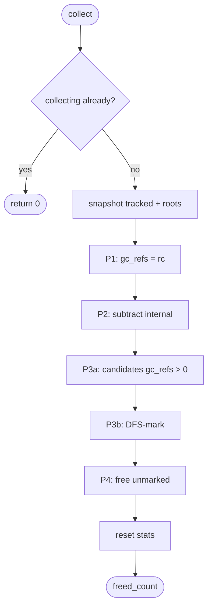
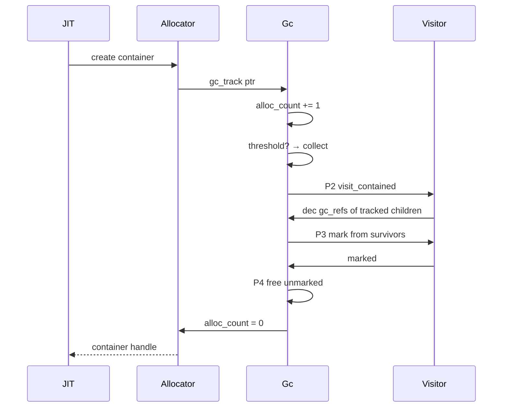
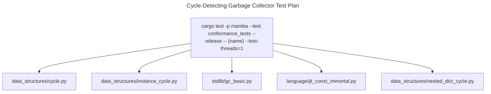

# Cycle-Detecting Garbage Collector

Mamba's GC is a CPython-style trial-deletion cycle collector running
on top of atomic reference counting. RC handles the common case (no
cycles); the GC sweeps periodically to break reference cycles in
container objects (list, dict, instance). Per-thread state — no
stop-the-world coordination, no cross-thread locks. The threshold
auto-triggers at 700 allocations since last collection.

Three load-bearing invariants:

1. **Trial deletion = refcount minus internal references** — Phase 2
   walks every tracked object's children; if a child is also tracked,
   decrement its `gc_refs`. Surviving `gc_refs > 0` means the object
   has *external* references (JIT locals, globals, non-tracked
   objects) and must be kept. This is the CPython algorithm; deviating
   from the visitor pattern (e.g., walking only one level) breaks
   cycle detection.
2. **`IMMORTAL_REFCOUNT` is unconditionally skipped** — JIT-embedded
   constants (rc = u32::MAX) are never enrolled in trial deletion,
   never marked, never freed.
3. **Re-entrant collection is forbidden** — the `collecting` flag
   gates `collect()`. If the visitor re-enters via a side effect
   (it shouldn't, but `Drop` impls might), the second call returns 0
   and the original sweep continues.

Safepoint protocol (`gc_safepoint`, `gc_register_thread`,
`gc_unregister_thread`) is now a no-op set kept only for call-site
compatibility with async_rt / class / iter — per-thread GC means no
cross-thread coordination is required.

## Type model
<!-- type: dependency lang: mermaid -->



## GC state shape
<!-- type: schema lang: yaml -->

```yaml
$schema: "https://json-schema.org/draft/2020-12/schema"
$id: "gc-types"
$defs:
  GcState:
    type: object
    x-rust-type: GcState
    properties:
      tracked:
        type: array
        items: { type: integer, x-rust-type: usize, description: "heap address of container" }
        description: "HashSet<usize> in code"
      alloc_count:
        type: integer
        minimum: 0
        description: "incremented on every container alloc; reset at end of collect"
      threshold:
        type: integer
        minimum: 1
        default: 700
        description: "auto-trigger collection when alloc_count >= threshold"
      collections:
        type: integer
        x-rust-type: u64
        description: "lifetime collection count (counter only, never reset)"
      collecting:
        type: boolean
        description: "re-entrancy guard"
      enabled:
        type: boolean
        description: "gc_disable / gc_enable toggles automatic collection"
      roots:
        type: array
        items: { x-rust-type: MbValue }
        description: "explicit roots — globals + JIT-marked stack values"
    required: [tracked, alloc_count, threshold, collections, collecting, enabled, roots]
```

## Collection lifecycle
<!-- type: state-machine lang: mermaid -->

```mermaid
---
id: gc-lifecycle
initial: Idle
nodes:
  Idle:        { kind: initial,  label: "alloc_count < threshold OR enabled = false" }
  Triggered:   { kind: transient, label: "alloc_count >= threshold AND enabled" }
  Snapshotting:{ kind: transient, label: "collecting = true; copy tracked + roots" }
  Phase1Init:  { kind: transient, label: "init gc_refs[addr] = rc (skip IMMORTAL)" }
  Phase2Sub:   { kind: transient, label: "subtract internal refs via visit_contained" }
  Phase3Mark:  { kind: transient, label: "mark survivors (gc_refs > 0 OR explicit roots)" }
  Phase4Sweep: { kind: transient, label: "free unmarked tracked objects" }
  PostSweep:   { kind: normal,    label: "alloc_count = 0; collections += 1; collecting = false" }
edges:
  - { from: Idle,         to: Triggered,    event: "container alloc → bump alloc_count" }
  - { from: Triggered,    to: Snapshotting, event: "collect() called" }
  - { from: Snapshotting, to: Phase1Init }
  - { from: Phase1Init,   to: Phase2Sub }
  - { from: Phase2Sub,    to: Phase3Mark }
  - { from: Phase3Mark,   to: Phase4Sweep }
  - { from: Phase4Sweep,  to: PostSweep }
  - { from: PostSweep,    to: Idle }
  - { from: Snapshotting, to: Idle, event: "re-entrant guard: collecting already true" }
---
stateDiagram-v2
    [*] --> Idle
    Idle --> Triggered: alloc threshold
    Triggered --> Snapshotting: collect
    Snapshotting --> Phase1Init: init gc_refs
    Phase1Init --> Phase2Sub: subtract internal
    Phase2Sub --> Phase3Mark: mark survivors
    Phase3Mark --> Phase4Sweep: free unmarked
    Phase4Sweep --> PostSweep: stats update
    PostSweep --> Idle: reset
    Snapshotting --> Idle: re-entrant skip
```

## Trial deletion logic
<!-- type: logic lang: mermaid -->



## Auto-trigger interaction
<!-- type: interaction lang: mermaid -->



## Acceptance scenarios
<!-- type: scenarios lang: yaml -->

```yaml
scenarios:
  - id: list-cycle
    given: data_structures/cycle.py creates a list that references itself
    when: the last external list reference is deleted and collection runs
    then: trial deletion identifies the cycle as unreachable and frees it
  - id: instance-cycle
    given: data_structures/instance_cycle.py creates two instances that reference each other
    when: both external instance references are deleted
    then: internal references subtract to zero and both instances are swept
  - id: manual-collect
    given: stdlib/gc_basic.py imports gc
    when: gc.collect executes
    then: explicit collection returns the freed count and preserves CPython-style API behavior
  - id: disable-enable
    given: stdlib/gc_basic.py disables automatic collection
    when: containers are allocated while gc.isenabled is false
    then: allocation count can rise without triggering auto-collection until gc.enable restores it
```

## Tests
<!-- type: test-plan lang: mermaid -->



## Changes
<!-- type: changes lang: yaml -->

```yaml
changes:
  - file: crates/mamba/src/runtime/gc.rs
    action: modify
    impl_mode: hand-written
    description: "Per-thread cycle-detecting GC: GcState (tracked / roots / alloc_count / threshold=700 / collecting / enabled), trial-deletion 4-phase collect, gc_track / gc_untrack / gc_add_root / gc_remove_root, gc_safepoint no-op stubs. Hand-written; visitor algorithm mirrors CPython."
```
