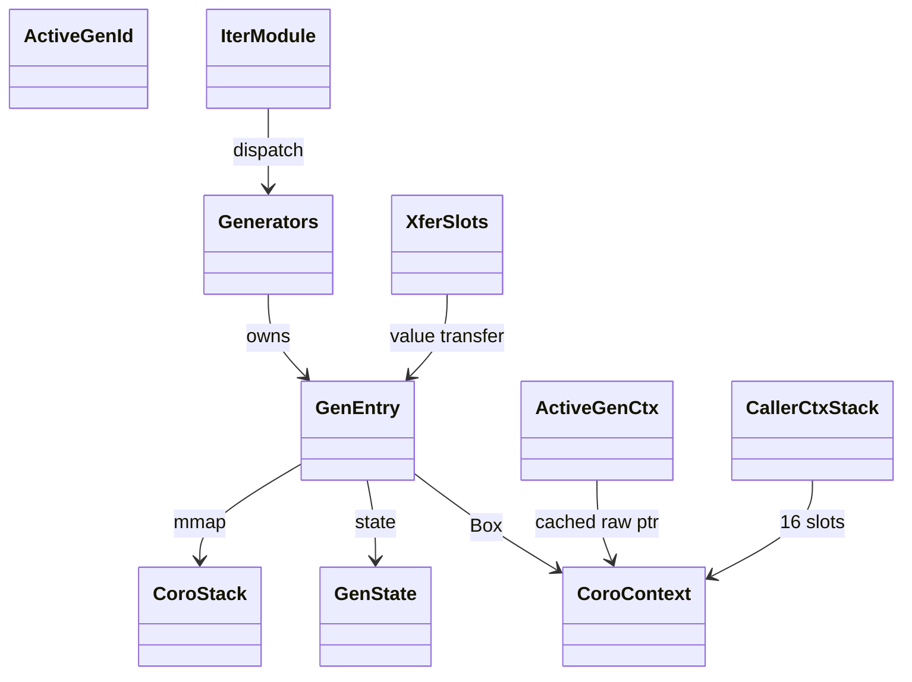
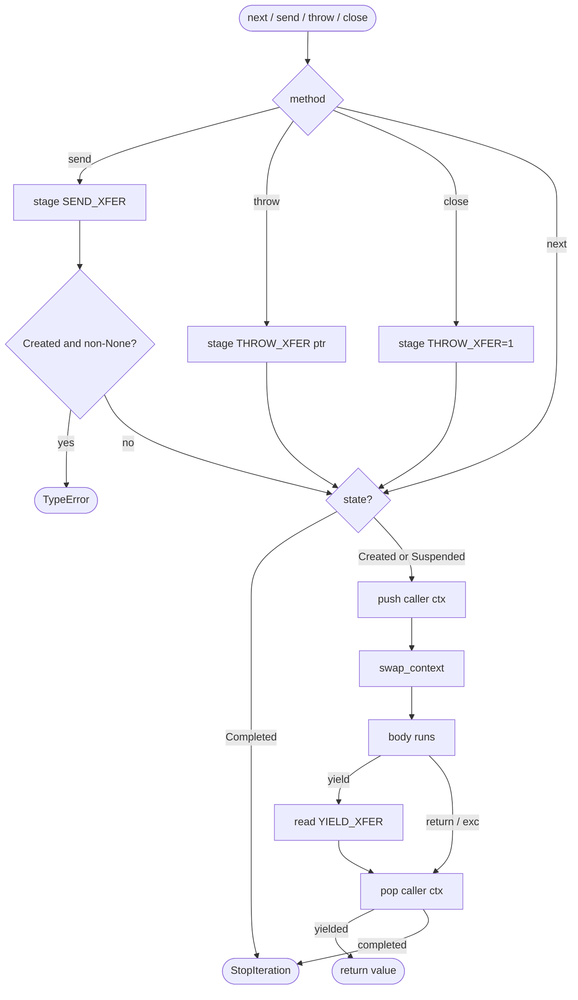
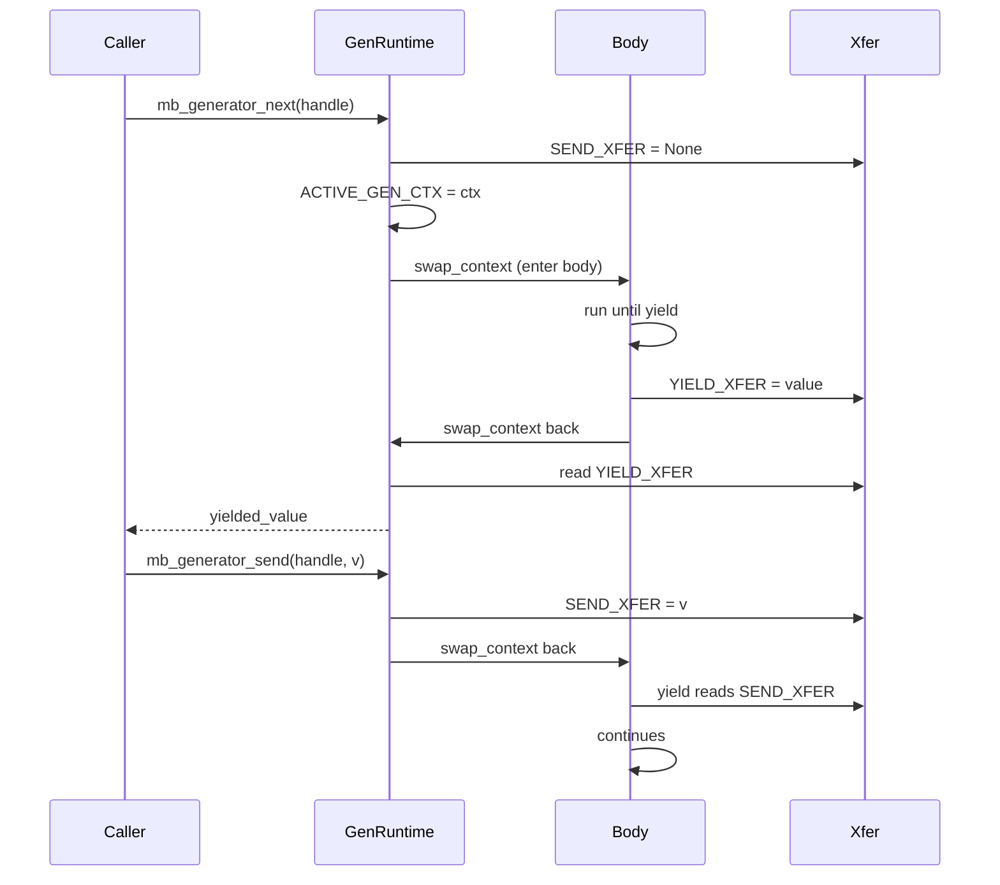
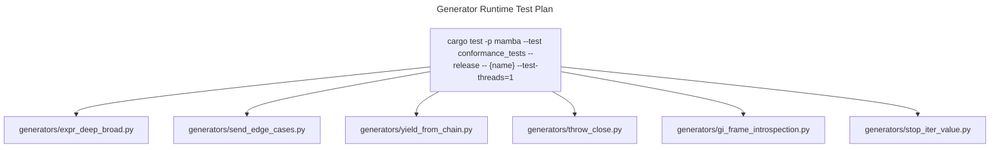

# Generator Functions and yield

Mamba generators are stackful coroutines on the same OS thread as the
caller. Each generator owns a private 64 KiB `mmap`'d stack with a
guard page; `next()` / `send()` / `throw()` swap CPU register context
and stack pointer between the caller and the generator body. Yield
overhead is one register save plus a stack-pointer swap (~10 ns) — no
channel hops, no cross-thread sync.

Three load-bearing invariants:

1. **Same-thread coroutines** — generators run on their creator's
   thread. `GENERATORS` is thread-local. Crossing a thread boundary
   with a generator handle would dereference an invalid registry slot.
2. **Coroutine context pointer stability** — `GenEntry.coro_ctx` is
   `Box<CoroContext>` so its address survives `HashMap` resizes;
   `swap_context` is called with that raw pointer. Inlining
   `CoroContext` directly into `GenEntry` would corrupt resumption
   after any registry growth.
3. **Generator IDs disjoint from iter IDs** — `NEXT_GEN_ID` is global
   atomic starting at 1; iterator IDs start at `0x1_0000_0000` (see
   `iter.md`). The disjoint ranges let `mb_iter` and `mb_next_raise`
   tell which registry to look at given just an `i64` handle.

## Type model
<!-- type: dependency lang: mermaid -->



## Generator entry shape
<!-- type: schema lang: yaml -->

```yaml
$schema: "https://json-schema.org/draft/2020-12/schema"
$id: "generator-types"
$defs:
  GenState:
    type: string
    enum: [Created, Suspended, Completed]
  GenEntry:
    type: object
    x-rust-type: GenEntry
    properties:
      coro_ctx:        { x-rust-type: "Box<CoroContext>" }
      coro_stack:      { x-rust-type: CoroStack, description: "64 KiB usable + 16 KiB guard" }
      state:           { $ref: "#/$defs/GenState" }
      body_fn_addr:    { type: integer, x-rust-type: u64, description: "NaN-boxed FUNC tag bits, 48-bit code address" }
      args:            { type: array, items: { x-rust-type: MbValue } }
      name:            { type: string }
      yielded_value:   { x-rust-type: MbValue, description: "set by yield_value, read by next" }
      sent_value:      { x-rust-type: MbValue, description: "set by send, read after yield" }
      return_value:    { x-rust-type: MbValue, description: "set when body returns; surfaces in StopIteration.value" }
      throw_request:
        oneOf:
          - { type: "null" }
          - type: object
            properties:
              exc_type: { type: string }
              message:  { type: string }
            required: [exc_type, message]
      close_request:   { type: boolean }
    required: [coro_ctx, coro_stack, state, body_fn_addr, args, name, yielded_value, sent_value, return_value, throw_request, close_request]
  CoroContext:
    type: object
    x-rust-type: CoroContext
    description: "Saved CPU regs — 21 u64 on aarch64 (x19-x28, x29, x30, SP, d8-d15), 8 u64 on x86_64 (rbx, rbp, r12-r15, rsp, rip)"
    properties:
      regs: { type: array, items: { type: integer, x-rust-type: u64 } }
    required: [regs]
  CoroStack:
    type: object
    x-rust-type: CoroStack
    properties:
      base:       { type: integer, x-rust-type: "*mut u8", description: "mmap base; guard page at base" }
      total_size: { type: integer, minimum: 1, description: "guard + usable, 16-byte aligned at top" }
    required: [base, total_size]
```

## Generator lifecycle

```mermaid
---
id: generator-lifecycle
initial: Created
nodes:
  Created:    { kind: initial,  label: "mb_generator_create; body not yet entered" }
  Suspended:  { kind: normal,   label: "yielded; coro_ctx holds saved regs" }
  Resuming:   { kind: transient, label: "swap_context active; body running" }
  Completed:  { kind: terminal, label: "body returned or close run; subsequent next raises StopIteration" }
edges:
  - { from: Created,   to: Resuming,  event: "mb_generator_next (with sent_value=None) | mb_generator_send(None)" }
  - { from: Created,   to: Completed, event: "mb_generator_send(non-None) → TypeError before swap" }
  - { from: Suspended, to: Resuming,  event: "mb_generator_next | mb_generator_send | mb_generator_throw" }
  - { from: Resuming,  to: Suspended, event: "mb_generator_yield_value (yield) — swap back" }
  - { from: Resuming,  to: Completed, event: "body returns | exception bubbles past body | close request honored" }
  - { from: Suspended, to: Completed, event: "mb_generator_close (suspended path)" }
---
stateDiagram-v2
    [*] --> Created
    Created --> Resuming: next [send=None]
    Created --> Completed: send [non-None] TypeError
    Suspended --> Resuming: next / send / throw
    Resuming --> Suspended: yield (swap back)
    Resuming --> Completed: body returns / exc bubbles / close
    Suspended --> Completed: close request
    Completed --> [*]
```

<!-- type: state-machine lang: mermaid -->



## Resume / yield dispatch
<!-- type: logic lang: mermaid -->



## yield_value / resume interaction
<!-- type: interaction lang: mermaid -->



## Acceptance scenarios
<!-- type: scenarios lang: yaml -->
```yaml
scenarios:
  - id: basic-yield
    given: generators/expr_deep_broad.py yields two values
    when: for-loop iteration advances the generator
    then: both values are returned before StopIteration
  - id: send-created
    given: a newly created generator has not been started
    when: send receives a non-None value
    then: TypeError is raised before context swap
  - id: yield-from-chain
    given: generators/yield_from_chain.py nests yield from three levels deep
    when: values yield through the chain
    then: CALLER_CTX_STACK preserves resumption and bubbles values to the outer caller
  - id: throw-close
    given: a suspended generator receives throw or close
    when: the runtime stages the request
    then: the request is raised at the suspended yield or closes the generator
```

## Tests
<!-- type: test-plan lang: mermaid -->


## Changes
<!-- type: changes lang: yaml -->

```yaml
changes:
  - file: crates/mamba/src/runtime/generator.rs
    action: modify
    impl_mode: hand-written
    description: "Stackful coroutines: GenEntry + CoroContext + CoroStack (mmap + guard page); thread-local GENERATORS registry, ACTIVE_GEN_ID/CTX, YIELD_XFER/SEND_XFER/THROW_XFER cells, CALLER_CTX_STACK (16 slots). Hand-written; the swap_context contract is target-arch dependent."
```
