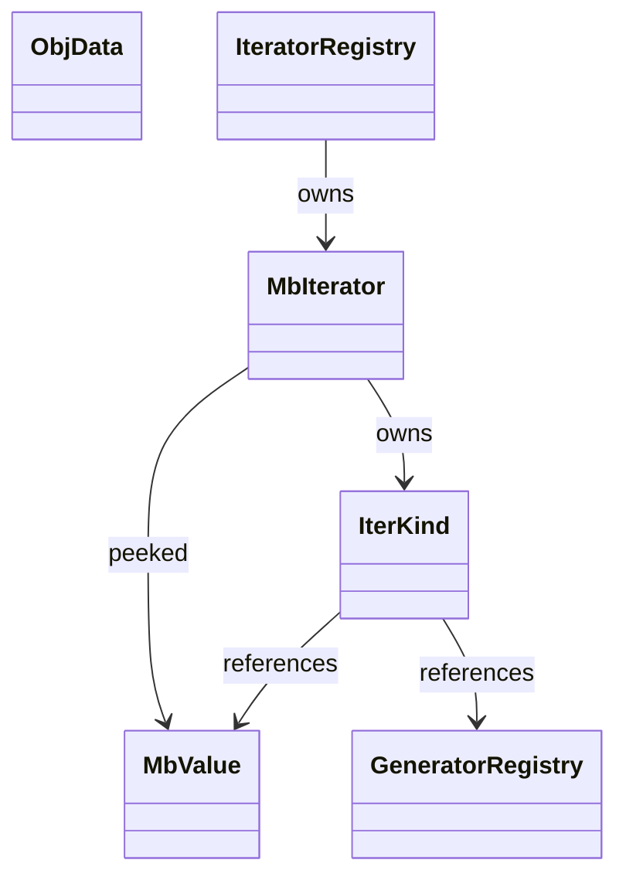
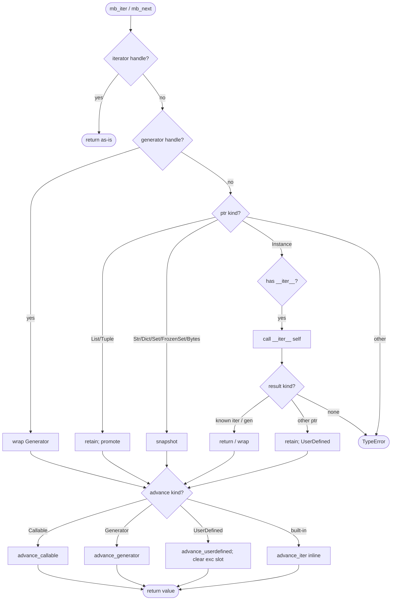
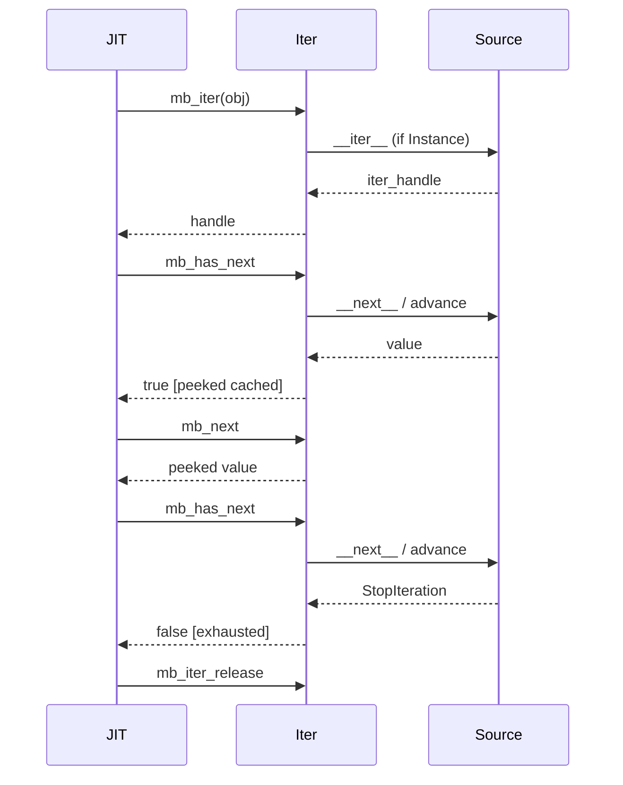
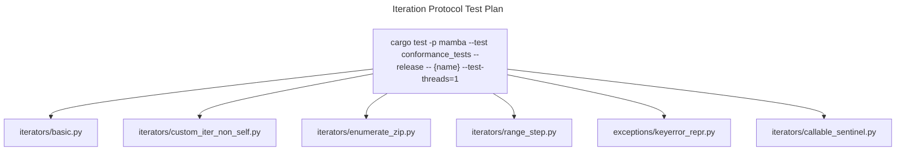

# Iteration Protocol

Mamba's iterator subsystem. Promotes any iterable (built-in container,
generator handle, or user-class instance with `__iter__`) to a uniform
iterator handle, then advances it with a single `mb_has_next` /
`mb_next` protocol that the JIT emits for every for-loop. Two
substrate-specific concerns — StopIteration's flag/exception duality and
the `peeked` cache — are this spec's load-bearing invariants.

## Type model
<!-- type: dependency lang: mermaid -->



## Iterator state shape
<!-- type: schema lang: yaml -->

```yaml
$schema: "https://json-schema.org/draft/2020-12/schema"
$id: "iter-types"
$defs:
  MbIterator:
    type: object
    x-rust-type: MbIterator
    properties:
      kind:      { $ref: "#/$defs/IterKind" }
      index:     { type: integer, minimum: 0, x-rust-type: usize, description: "monotonic index for index-based kinds" }
      exhausted: { type: boolean, description: "sticky once set" }
      peeked:
        oneOf:
          - { type: "null" }
          - { x-rust-type: MbValue }
        description: "pre-fetched value from has_next"
    required: [kind, index, exhausted, peeked]
  IterKind:
    oneOf:
      - { title: List,        type: object, properties: { value: { x-rust-type: MbValue } }, description: "retained ptr to ObjData::List" }
      - { title: Tuple,       type: object, properties: { value: { x-rust-type: MbValue } }, description: "retained ptr to ObjData::Tuple" }
      - { title: Str,         type: object, properties: { chars: { type: array, items: { x-rust-type: char } } }, description: "materialized chars" }
      - { title: DictKeys,    type: object, properties: { keys:  { type: array, items: { type: string } } }, description: "snapshotted keys" }
      - { title: Range,       type: object, properties: { current: { type: integer, x-rust-type: i64 }, stop: { type: integer, x-rust-type: i64 }, step: { type: integer, x-rust-type: i64 } } }
      - { title: Enumerate,   type: object, properties: { inner: { $ref: "#/$defs/MbIterator" }, count: { type: integer, x-rust-type: i64 } } }
      - { title: Zip,         type: object, properties: { iters: { type: array, items: { $ref: "#/$defs/MbIterator" } } } }
      - { title: Map,         type: object, properties: { func: { x-rust-type: MbValue }, inner: { $ref: "#/$defs/MbIterator" } } }
      - { title: Filter,      type: object, properties: { func: { x-rust-type: MbValue }, inner: { $ref: "#/$defs/MbIterator" } } }
      - { title: Reversed,    type: object, properties: { items: { type: array, items: { x-rust-type: MbValue } }, index: { type: integer, x-rust-type: usize } } }
      - { title: UserDefined, type: object, properties: { instance: { x-rust-type: MbValue } }, description: "instance with __next__ dunder" }
      - { title: Generator,   type: object, properties: { handle: { x-rust-type: MbValue } }, description: "wraps a generator handle" }
      - { title: Callable,    type: object, properties: { func: { x-rust-type: MbValue }, sentinel: { x-rust-type: MbValue } }, description: "iter(callable, sentinel) per PEP 234" }
```

## Iterator lifecycle

```mermaid
---
id: iter-lifecycle
initial: New
nodes:
  New:       { kind: initial,   label: "alloc_iter_id; insert into ITERATORS" }
  Active:    { kind: normal,    label: "Active (kind ready to advance)" }
  Peeked:    { kind: normal,    label: "Peeked (mb_has_next cached value)" }
  Exhausted: { kind: terminal,  label: "Exhausted (sticky)" }
  Released:  { kind: terminal,  label: "Released (entry dropped)" }
edges:
  - { from: New,       to: Active,    event: register }
  - { from: Active,    to: Peeked,    event: mb_has_next, guard: "advance succeeds" }
  - { from: Active,    to: Exhausted, event: mb_has_next, guard: "advance signals StopIteration; clear exception slot if user-defined" }
  - { from: Peeked,    to: Active,    event: mb_next, guard: "consume peeked value" }
  - { from: Active,    to: Exhausted, event: mb_next, guard: "advance signals StopIteration" }
  - { from: Active,    to: Released,  event: mb_iter_release }
  - { from: Peeked,    to: Released,  event: mb_iter_release }
  - { from: Exhausted, to: Released,  event: mb_iter_release }
---
stateDiagram-v2
    [*] --> New
    New --> Active: register
    Active --> Peeked: mb_has_next [advance ok]
    Active --> Exhausted: mb_has_next [StopIteration]
    Peeked --> Active: mb_next [consume]
    Active --> Exhausted: mb_next [StopIteration]
    Active --> Released: mb_iter_release
    Peeked --> Released: mb_iter_release
    Exhausted --> Released: mb_iter_release
    Released --> [*]
```

<!-- type: state-machine lang: mermaid -->



## Promote and advance dispatch
<!-- type: logic lang: mermaid -->



## For-loop interaction
<!-- type: interaction lang: mermaid -->



## Acceptance scenarios
<!-- type: scenarios lang: yaml -->

```yaml
scenarios:
  - id: custom-iter-non-self
    given: iterators/custom_iter_non_self.py defines __iter__ returning iter([1,2,3])
    when: a for-loop iterates over the custom object
    then: the returned iterator handle is reused and stdout is 1, 2, 3
  - id: stop-iteration-clear
    given: a user-defined __next__ raises StopIteration after yielding values
    when: a for-loop exits through the StopIteration path
    then: the runtime clears the exception slot so StopIteration does not leak past the loop
```

## Tests
<!-- type: test-plan lang: mermaid -->



## Changes
<!-- type: changes lang: yaml -->

```yaml
changes:
  - file: crates/mamba/src/runtime/iter.rs
    action: modify
    impl_mode: hand-written
    description: "Iterator state, allocation, advance protocol, combinators. Hand-written; spec is the design contract, not a codegen template."
```
