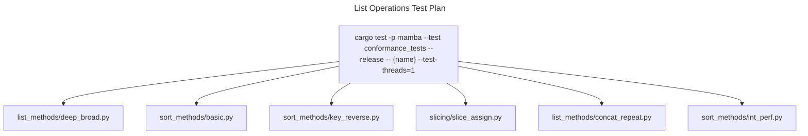

# List Operations

Mamba lists store `RwLock<Vec<MbValue>>` so multiple readers can run
in parallel and writes are guarded. The runtime exposes the
CPython-equivalent surface (`append` / `extend` / `pop` / `insert` /
`remove` / `clear` / `reverse` / `sort` / `index` / `count` / `copy` /
`+` / `*`) plus a kwargs-aware `sort` that accepts `key` and `reverse`.

Three load-bearing invariants:

1. **Type-specialized sort** — `mb_list_sort` checks if every element
   is `is_int()` and routes to `sort_unstable_by_key(as_int_unchecked)`
   (commit `0eb6e0cb7`); homogeneous int lists are ~10x faster than
   the dunder-comparison path. Mixed int+float, then heterogeneous,
   each have their own branch.
2. **Slice subscript returns a *list*** — `mb_list_getitem` with a
   slice index allocates a new `Vec` and wraps; CPython compatibility
   forbids returning a tuple here even for assignments. Slice-assign
   (commit `a992caff5`) writes back into the same source list.
3. **`mb_list_concat` allocates a fresh list, retains every shared
   item** — no sharing of inner pointers between the concatenated
   list and either operand. Aliasing (rc-only sharing) would propagate
   mutations, breaking Python `lst3 = lst1 + lst2` semantics.

## Type model
<!-- type: dependency lang: mermaid -->

```mermaid
---
id: list-types
types:
  ObjDataList:    { kind: struct, label: "ObjData::List(RwLock<Vec<MbValue>>)" }
  MbValue:        { kind: struct }
  Builtins:       { kind: struct, label: "from runtime::builtins (mb_value_cmp_pub, call_named_callable_pub)" }
  ExceptionMod:   { kind: struct, label: "exception.rs (IndexError / TypeError on bad subscript)" }
  IterModule:     { kind: struct, label: "iter.rs (List has dedicated IterKind variant)" }
  Slice:          { kind: struct, label: "ObjData::Tuple(start, stop, step) — slice triple" }
edges:
  - { from: ObjDataList, to: MbValue,      kind: references, label: "Vec elements" }
  - { from: ObjDataList, to: ExceptionMod, kind: references, label: "IndexError out-of-bounds" }
  - { from: ObjDataList, to: Builtins,     kind: references, label: "sort comparator" }
  - { from: ObjDataList, to: IterModule,   kind: references, label: "iter(list) wraps as IterKind::List" }
  - { from: ObjDataList, to: Slice,        kind: references, label: "lst[a:b:c] reads slice tuple" }
---
classDiagram
    class ObjDataList
    class MbValue
    class Builtins
    class ExceptionMod
    class IterModule
    class Slice
    ObjDataList --> MbValue : Vec elements
    ObjDataList --> ExceptionMod : IndexError
    ObjDataList --> Builtins : comparator
    ObjDataList --> IterModule : iter wrap
    ObjDataList --> Slice : a:b:c
```

## List shape
<!-- type: schema lang: yaml -->

```yaml
$schema: "https://json-schema.org/draft/2020-12/schema"
$id: "list-types"
$defs:
  MbList:
    type: object
    description: "ObjData::List(RwLock<Vec<MbValue>>)"
    properties:
      lock:
        type: array
        items: { x-rust-type: MbValue }
      capacity: { type: integer, minimum: 0, description: "Vec internal; not user-visible" }
    required: [lock]
  SliceTriple:
    type: object
    description: "Tuple(start, stop, step) used for slice subscript"
    properties:
      start: { x-rust-type: MbValue, description: "int or None" }
      stop:  { x-rust-type: MbValue, description: "int or None" }
      step:  { x-rust-type: MbValue, description: "int or None (defaults to 1)" }
    required: [start, stop, step]
  SortOptions:
    type: object
    description: "kwargs for mb_list_sort_kwargs"
    properties:
      key:     { x-rust-type: MbValue, description: "callable (FUNC tag) or None or attr-name string" }
      reverse: { x-rust-type: MbValue, description: "bool" }
    required: [key, reverse]
```

## Sort dispatch
<!-- type: logic lang: mermaid -->

```mermaid
---
id: list-sort-dispatch
entry: enter
nodes:
  enter:        { kind: start,    label: "mb_list_sort | mb_list_sort_kwargs" }
  has_kwargs:   { kind: decision, label: "kwargs path? (key or reverse provided)" }
  has_key:      { kind: decision, label: "key not None?" }
  resolve_key:  { kind: process,  label: "resolve_callable_pub(key) → addr or named_key" }
  build_indexed:{ kind: process,  label: "(item, key(item)) pairs" }
  sort_indexed: { kind: process,  label: "sort_by mb_value_cmp_pub on key" }
  reverse_idx:  { kind: process,  label: "reverse if reverse=True" }
  write_back:   { kind: process,  label: "items[i] = pair.0" }
  no_kwargs:    { kind: decision, label: "all items is_int?" }
  fast_int:     { kind: process,  label: "sort_unstable_by_key(as_int_unchecked)" }
  is_numeric:   { kind: decision, label: "all is_int or is_float?" }
  fast_num:     { kind: process,  label: "sort_unstable_by partial_cmp on f64" }
  general:      { kind: process,  label: "sort_by mb_value_cmp_pub (dunders)" }
  done:         { kind: terminal, label: "in-place sorted; lock dropped" }
edges:
  - { from: enter,         to: has_kwargs }
  - { from: has_kwargs,    to: has_key,        label: "yes" }
  - { from: has_kwargs,    to: no_kwargs,      label: "no" }
  - { from: has_key,       to: resolve_key,    label: "yes" }
  - { from: has_key,       to: no_kwargs,      label: "no (kwargs but key=None)" }
  - { from: resolve_key,   to: build_indexed }
  - { from: build_indexed, to: sort_indexed }
  - { from: sort_indexed,  to: reverse_idx }
  - { from: reverse_idx,   to: write_back }
  - { from: write_back,    to: done }
  - { from: no_kwargs,     to: fast_int,       label: "all int" }
  - { from: no_kwargs,     to: is_numeric,     label: "no" }
  - { from: is_numeric,    to: fast_num,       label: "all numeric" }
  - { from: is_numeric,    to: general,        label: "heterogeneous" }
  - { from: fast_int,      to: done }
  - { from: fast_num,      to: done }
  - { from: general,       to: done }
---
flowchart TD
    enter([sort / sort_kwargs]) --> has_kwargs{kwargs path?}
    has_kwargs -->|yes| has_key{key set?}
    has_kwargs -->|no| no_kwargs{all int?}
    has_key -->|yes| resolve_key[resolve callable]
    has_key -->|no| no_kwargs
    resolve_key --> build_indexed[item, key item pairs]
    build_indexed --> sort_indexed[sort_by mb_value_cmp_pub]
    sort_indexed --> reverse_idx[if reverse]
    reverse_idx --> write_back[in-place write]
    write_back --> done([sorted])
    no_kwargs -->|all int| fast_int[unstable_by_key i64]
    no_kwargs -->|else| is_numeric{all numeric?}
    is_numeric -->|yes| fast_num[partial_cmp f64]
    is_numeric -->|no| general[mb_value_cmp_pub dunders]
    fast_int --> done
    fast_num --> done
    general --> done
```

## Mutation interaction
<!-- type: interaction lang: mermaid -->

```mermaid
---
id: list-mutation
actors:
  - { id: JIT,     kind: system }
  - { id: Handler, kind: system, label: "mb_list_append / mb_list_pop / mb_list_extend" }
  - { id: Lock,    kind: system, label: "RwLock guard" }
  - { id: Vec,     kind: system, label: "underlying Vec<MbValue>" }
messages:
  - { from: JIT,     to: Handler, name: mb_list_append(lst, v) }
  - { from: Handler, to: Lock,    name: lock.write }
  - { from: Lock,    to: Handler, name: write_guard }
  - { from: Handler, to: Vec,     name: items.push(v) }
  - { from: Handler, to: Lock,    name: drop guard }
  - { from: Handler, to: JIT,     name: void }
  - { from: JIT,     to: Handler, name: mb_list_pop(lst) }
  - { from: Handler, to: Lock,    name: lock.write }
  - { from: Handler, to: Vec,     name: items.pop }
  - { from: Vec,     to: Handler, name: Some(v) | None }
  - { from: Handler, to: Handler, name: "if None: raise IndexError; else return v (rc preserved — was already owned by Vec, ownership transfers)" }
  - { from: Handler, to: JIT,     name: v, returns: MbValue }
---
sequenceDiagram
    participant JIT
    participant Handler
    participant Lock
    participant Vec
    JIT->>Handler: mb_list_append(lst, v)
    Handler->>Lock: lock.write
    Lock-->>Handler: write_guard
    Handler->>Vec: items.push
    Handler->>Lock: drop guard
    Handler-->>JIT: void
    JIT->>Handler: mb_list_pop(lst)
    Handler->>Lock: lock.write
    Handler->>Vec: items.pop
    Vec-->>Handler: Some(v) or None
    Note over Handler: None → IndexError; else transfer
    Handler-->>JIT: v
```

## Acceptance scenarios
<!-- type: scenarios lang: yaml -->

```yaml
scenarios:
  - id: sort-fast-path
    given: sort_methods/basic.py sorts homogeneous integer lists
    when: mb_list_sort runs without key kwargs
    then: it uses the all-int fast path and returns CPython-compatible ordering
  - id: sort-key-reverse
    given: sort_methods/key_reverse.py sorts strings with key and reverse
    when: mb_list_sort_kwargs receives a key callable and reverse true
    then: it sorts indexed key pairs and writes the items back in reversed order
  - id: slice-assign
    given: slicing/slice_assign.py assigns an iterable to a list slice
    when: the slice assignment handler runs
    then: the same list is mutated and slice reads still allocate list results
  - id: concat-repeat-fresh
    given: list_methods/concat_repeat.py uses + and *
    when: list concat or repeat executes
    then: a fresh Vec is allocated and shared elements are retained without operand aliasing
```

## Tests
<!-- type: test-plan lang: mermaid -->



## Changes
<!-- type: changes lang: yaml -->

```yaml
changes:
  - file: crates/mamba/src/runtime/list_ops.rs
    action: modify
    impl_mode: hand-written
    description: "RwLock<Vec<MbValue>>-backed list; CPython surface incl. type-specialized sort (all-int / numeric / heterogeneous), sort kwargs (key, reverse), slice get/set, concat/repeat with retain-walk. Hand-written; sort fast-path is perf-sensitive."
```
