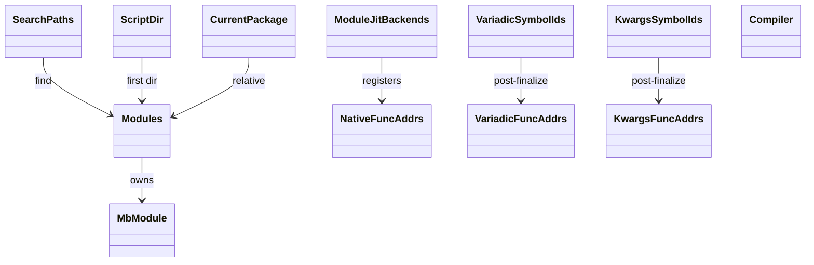
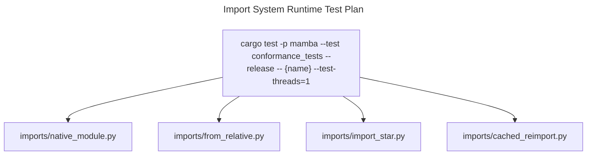

# Import System Runtime

Mamba's runtime side of the Python import system. Module objects
(`MbModule { name, file, attrs, is_package }`) live in a thread-local
`MODULES: HashMap<String, MbModule>` registry — Python's `sys.modules`.
The `mb_import` family resolves names against `SEARCH_PATHS`, parses
the file, JIT-compiles it, runs the body in a fresh namespace, and
caches the resulting module.

The runtime ALSO carries seven thread-local registries that are NOT
about importing per se but about *function dispatch* — they track
which JIT-compiled function pointers correspond to:

- native extern functions (calling-convention discriminator),
- user-defined variadic (`*args`) functions,
- user-defined `**kwargs` functions,
- and module-level JIT backends kept alive for cross-module callbacks.

Three load-bearing invariants:

1. **`MODULE_JIT_BACKENDS` is a leak-by-design `Vec`** — the JIT
   backend that produced the module's function pointers must stay
   alive for the lifetime of any code that calls into it. Dropping
   would invalidate every `extern "C" fn` pointer the module exported.
   Cleanup happens at process exit.
2. **`CURRENT_MODULE_PACKAGE` anchors relative imports** — `from . import X`
   resolves against this thread-local; it MUST be set before any
   module body runs (commit `#1190` R3). Forgetting to set it makes
   relative imports resolve to the script's package, which is wrong.
3. **`SCRIPT_DIR` differs from `SEARCH_PATHS[0]`** — `import X` first
   searches the directory of `__main__` (script dir), then walks
   `SEARCH_PATHS`. Conflating the two breaks fixtures that depend on
   CPython's "script-dir first" precedence.

## Type model
<!-- type: dependency lang: mermaid -->



## Module shape
<!-- type: schema lang: yaml -->

```yaml
$schema: "https://json-schema.org/draft/2020-12/schema"
$id: "module-types"
$defs:
  MbModule:
    type: object
    x-rust-type: MbModule
    properties:
      name:       { type: string, description: "fully-qualified dotted name" }
      file:
        oneOf:
          - { type: "null" }
          - { x-rust-type: PathBuf }
        description: "None for built-in modules registered via mb_register_native_modules"
      attrs:      { type: object, additionalProperties: { x-rust-type: MbValue } }
      is_package: { type: boolean, description: "true if loaded from __init__.py" }
    required: [name, file, attrs, is_package]
  ImportKind:
    type: string
    enum: [absolute, relative, star, native]
```

## Import dispatch logic
<!-- type: logic lang: mermaid -->

```mermaid
---
id: import-dispatch
entry: enter
nodes:
  enter:        { kind: start,    label: "mb_import | mb_import_from | mb_import_star | mb_import_relative" }
  classify:     { kind: decision, label: "import variant?" }
  rel_anchor:   { kind: process,  label: "relative: combine CURRENT_MODULE_PACKAGE + level dots + name" }
  cache_check:  { kind: decision, label: "MODULES already has key?" }
  return_cached:{ kind: terminal, label: "return cached module" }
  is_native:    { kind: decision, label: "name is built-in / native module?" }
  bind_native:  { kind: process,  label: "mb_register_native_modules path → MbModule with attrs" }
  find_file:    { kind: process,  label: "find_module: SCRIPT_DIR first, then SEARCH_PATHS; .py / __init__.py" }
  parse_compile:{ kind: process,  label: "parse + lower + JIT compile module body" }
  set_pkg:      { kind: process,  label: "save CURRENT_MODULE_PACKAGE; set to this module's package" }
  exec_body:    { kind: process,  label: "run module body — populates attrs" }
  restore_pkg:  { kind: process,  label: "restore CURRENT_MODULE_PACKAGE" }
  retain_jit:   { kind: process,  label: "MODULE_JIT_BACKENDS.push(Box::new(backend))" }
  cache_insert: { kind: process,  label: "MODULES.insert(name, MbModule)" }
  bind_names:   { kind: process,  label: "(import_from / *) bind names from attrs into caller scope" }
  done:         { kind: terminal, label: "return MbValue (module handle / bound names)" }
edges:
  - { from: enter,        to: classify }
  - { from: classify,     to: rel_anchor,   label: "relative" }
  - { from: classify,     to: cache_check,  label: "absolute / from / star" }
  - { from: rel_anchor,   to: cache_check }
  - { from: cache_check,  to: return_cached, label: "yes" }
  - { from: cache_check,  to: is_native,    label: "no" }
  - { from: is_native,    to: bind_native,  label: "yes" }
  - { from: is_native,    to: find_file,    label: "no" }
  - { from: bind_native,  to: cache_insert }
  - { from: find_file,    to: parse_compile }
  - { from: parse_compile, to: set_pkg }
  - { from: set_pkg,      to: exec_body }
  - { from: exec_body,    to: restore_pkg }
  - { from: restore_pkg,  to: retain_jit }
  - { from: retain_jit,   to: cache_insert }
  - { from: cache_insert, to: bind_names,   label: "if from / star" }
  - { from: cache_insert, to: done,         label: "absolute" }
  - { from: bind_names,   to: done }
  - { from: return_cached, to: bind_names,  label: "if from / star" }
---
flowchart TD
    enter([import]) --> classify{kind?}
    classify -->|relative| rel_anchor[anchor on CURRENT_MODULE_PACKAGE + level]
    classify -->|abs / from / star| cache_check{in MODULES?}
    rel_anchor --> cache_check
    cache_check -->|yes| return_cached([return cached])
    cache_check -->|no| is_native{built-in / native?}
    is_native -->|yes| bind_native[register attrs]
    is_native -->|no| find_file[find_module SCRIPT_DIR / SEARCH_PATHS]
    bind_native --> cache_insert[MODULES.insert]
    find_file --> parse_compile[parse + JIT]
    parse_compile --> set_pkg[set CURRENT_MODULE_PACKAGE]
    set_pkg --> exec_body[run body; populate attrs]
    exec_body --> restore_pkg[restore]
    restore_pkg --> retain_jit[MODULE_JIT_BACKENDS push]
    retain_jit --> cache_insert
    cache_insert --> bind_names[bind names]
    cache_insert --> done([done])
    bind_names --> done
    return_cached --> bind_names
```

## Native vs file module interaction
<!-- type: interaction lang: mermaid -->

```mermaid
---
id: import-flow
actors:
  - { id: User,    kind: actor }
  - { id: Module,  kind: system, label: "module.rs" }
  - { id: Native,  kind: system, label: "stdlib/*_mod.rs" }
  - { id: FS,      kind: system, label: "filesystem (find_module + parse + compile)" }
  - { id: JIT,     kind: system, label: "Cranelift JIT backend" }
messages:
  - { from: User,    to: Module,  name: "import math" }
  - { from: Module,  to: Module,  name: "MODULES.get('math')?" }
  - { from: Module,  to: Native,  name: "no — try mb_register_native_modules; math is native" }
  - { from: Native,  to: Module,  name: "MbModule with attrs (sin, cos, ...) bound to mb_math_*" }
  - { from: Module,  to: User,    name: "math module handle" }
  - { from: User,    to: Module,  name: "import my_pkg.sub" }
  - { from: Module,  to: FS,      name: "find_module: SCRIPT_DIR/my_pkg/sub.py" }
  - { from: FS,      to: Module,  name: "path resolved" }
  - { from: Module,  to: JIT,     name: "parse + lower + finalize" }
  - { from: JIT,     to: Module,  name: "module body fn pointer" }
  - { from: Module,  to: Module,  name: "set CURRENT_MODULE_PACKAGE = my_pkg" }
  - { from: Module,  to: JIT,     name: "execute body; populate attrs" }
  - { from: Module,  to: Module,  name: "MODULE_JIT_BACKENDS.push(boxed); MODULES.insert" }
  - { from: Module,  to: User,    name: "my_pkg.sub module handle" }
---
sequenceDiagram
    actor User
    participant Module
    participant Native
    participant FS
    participant JIT
    User->>Module: import math
    Module->>Module: MODULES.get('math')?
    Module->>Native: native lookup
    Native-->>Module: MbModule with attrs
    Module-->>User: math
    User->>Module: import my_pkg.sub
    Module->>FS: find_module
    FS-->>Module: path
    Module->>JIT: parse + lower + finalize
    JIT-->>Module: body fn ptr
    Module->>Module: set CURRENT_MODULE_PACKAGE
    Module->>JIT: execute body
    Module->>Module: retain JIT backend; cache module
    Module-->>User: my_pkg.sub
```

## Acceptance scenarios
<!-- type: scenarios lang: yaml -->

```yaml
scenarios:
  - id: native-import
    given: imports/native_module.py imports math and calls math.sqrt
    when: native module registration resolves math
    then: math.sqrt is available through module attrs
  - id: relative-import
    given: imports/from_relative.py runs inside a package
    when: from . import sibling executes
    then: CURRENT_MODULE_PACKAGE anchors resolution to the package
  - id: import-star
    given: imports/import_star.py imports all names from a module
    when: from mod import * executes
    then: attrs or __all__ filtered names bind into caller scope
  - id: cached-reimport
    given: imports/cached_reimport.py imports the same module twice
    when: the second import runs
    then: MODULES cache returns the existing module without re-executing the body
```

## Tests
<!-- type: test-plan lang: mermaid -->



## Changes
<!-- type: changes lang: yaml -->

```yaml
changes:
  - file: crates/mamba/src/runtime/module.rs
    action: modify
    impl_mode: hand-written
    description: "MbModule + 11 thread-local registries (MODULES / SEARCH_PATHS / SCRIPT_DIR / CURRENT_MODULE_PACKAGE / MODULE_JIT_BACKENDS / NATIVE_FUNC_ADDRS / VARIADIC_*  / KWARGS_*); mb_import / from / star / relative; native module registration. Hand-written; the JIT-backend retention contract is load-bearing."
```
