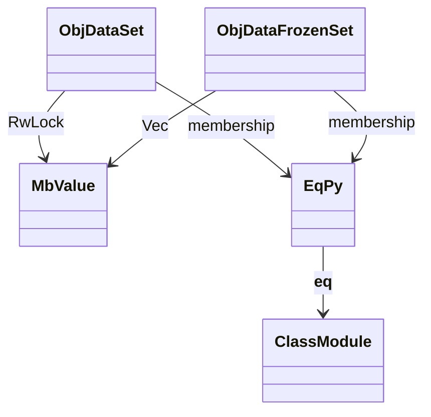
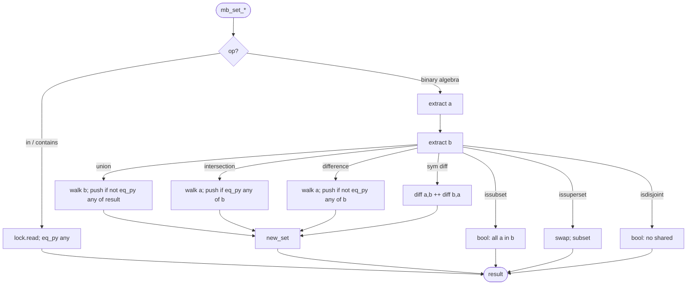
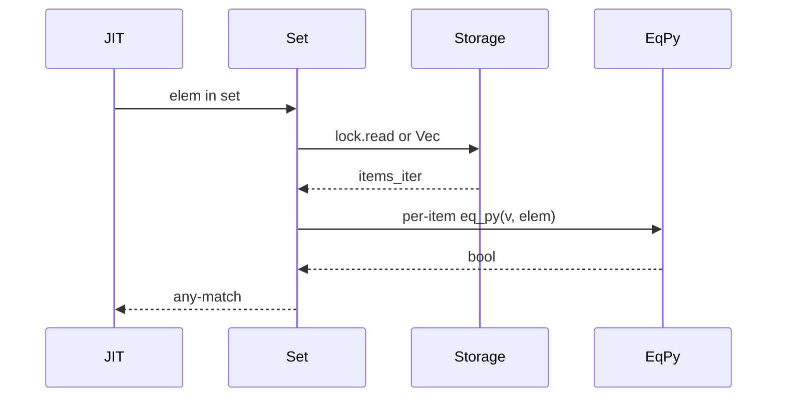
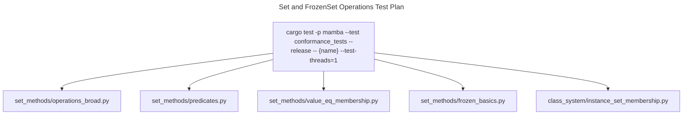

# Set and FrozenSet Operations

Mamba sets are `RwLock<Vec<MbValue>>` (mutable) and frozensets are
`Vec<MbValue>` (immutable). Membership uses linear scan with `eq_py`
for value-equality (so `1 in {1.0}` is True). Trade-off vs hash set:
linear scan keeps the storage simple and avoids the dunder-driven
`__hash__` complexity that DictKey has, at the cost of O(n) per
operation. Performance is not the load-bearing concern for the
conformance work today; correctness of value-equality is.

Three load-bearing invariants:

1. **Membership uses `eq_py`, not pointer identity** — `eq_py` walks
   the Python value-equality rules (numeric coercion, str/bytes
   compare, dunder `__eq__` on Instance). Otherwise `1 in {1.0}` would
   be False, breaking arithmetic-set fixtures.
2. **Set / FrozenSet share a unified read path** — `mb_set_contains`,
   `mb_set_len`, `mb_set_union`, etc. match on both `ObjData::Set`
   (RwLock-locked) and `ObjData::FrozenSet` (immutable Vec). User
   code shouldn't have to know which it has.
3. **Mutating ops on FrozenSet fail loudly** — `mb_set_add`,
   `mb_set_remove`, `mb_set_discard`, `mb_set_pop`, `mb_set_clear` all
   only match `ObjData::Set`; FrozenSet falls through to the no-op /
   default branch. Per Python semantics this should raise
   `AttributeError`; a future patch will surface that.

## Type model
<!-- type: dependency lang: mermaid -->



## Set shape
<!-- type: schema lang: yaml -->

```yaml
$schema: "https://json-schema.org/draft/2020-12/schema"
$id: "set-types"
$defs:
  MbSet:
    type: object
    description: "ObjData::Set(RwLock<Vec<MbValue>>)"
    properties:
      lock:
        type: array
        items: { x-rust-type: MbValue }
        description: "linear membership; insertion-order preserved"
    required: [lock]
  MbFrozenSet:
    type: object
    description: "ObjData::FrozenSet(Vec<MbValue>) — immutable"
    properties:
      items:
        type: array
        items: { x-rust-type: MbValue }
    required: [items]
```

## Membership and set-algebra logic
<!-- type: logic lang: mermaid -->



## Membership interaction
<!-- type: interaction lang: mermaid -->



## Acceptance scenarios
<!-- type: scenarios lang: yaml -->

```yaml
scenarios:
  - id: set-algebra
    given: set_methods/operations_broad.py combines overlapping sets
    when: union, intersection, difference, and symmetric difference run
    then: extract and filter logic returns CPython-compatible fresh set values
  - id: value-equality-membership
    given: set_methods/value_eq_membership.py checks numeric-equivalent values
    when: membership scans compare elements
    then: eq_py makes 1 in {1.0} and True in {1} match Python value equality
  - id: frozenset-read-path
    given: set_methods/frozen_basics.py creates frozensets
    when: membership and set algebra run
    then: FrozenSet uses the shared immutable read path
  - id: instance-membership
    given: class_system/instance_set_membership.py stores a user-class instance
    when: a value-equal instance is checked for membership
    then: eq_py dispatches __eq__ on Instance and returns true
```

## Tests
<!-- type: test-plan lang: mermaid -->



## Changes
<!-- type: changes lang: yaml -->

```yaml
changes:
  - file: crates/mamba/src/runtime/set_ops.rs
    action: modify
    impl_mode: hand-written
    description: "RwLock<Vec<MbValue>>-backed Set + immutable FrozenSet, linear-scan membership via eq_py, set algebra returns fresh allocations. Hand-written; storage is intentionally simple — perf is not load-bearing today."
```
