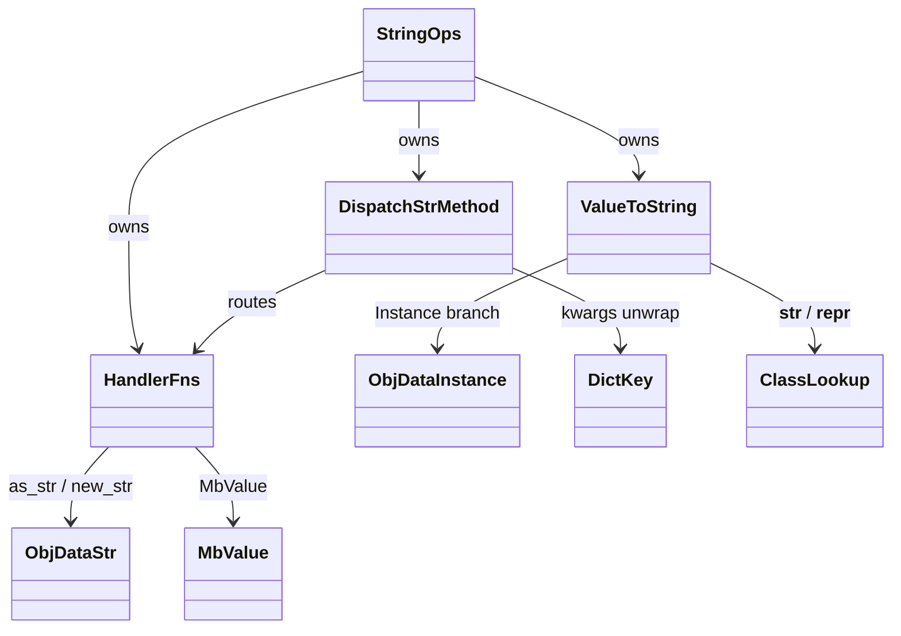
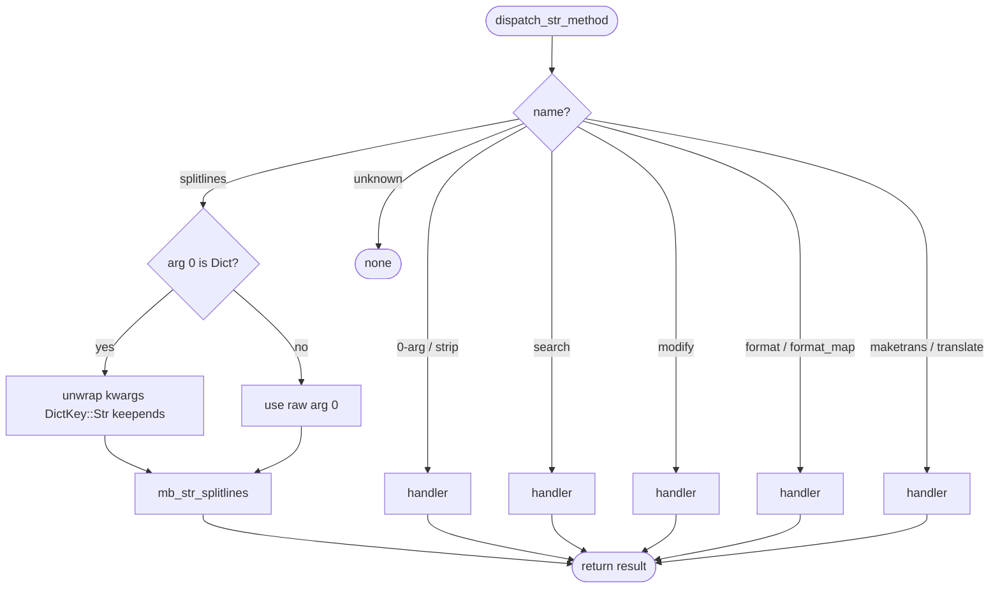
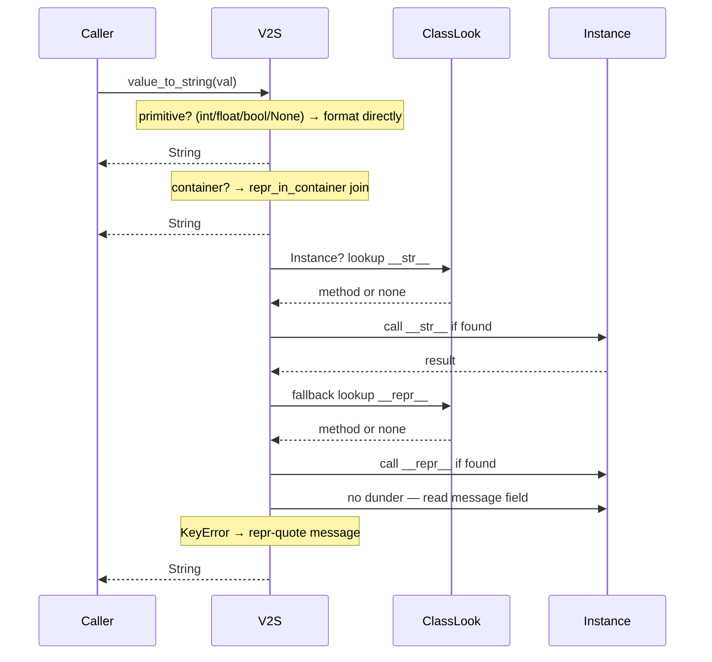
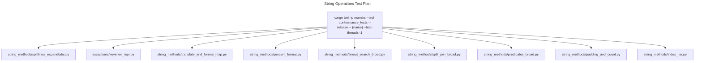

# String Operations and Stringification

Mamba's string operations module. Two concerns live here: the
`dispatch_str_method` table that routes per-method calls (`s.upper()`,
`s.split(...)`, `s.format(...)`) to individual handler functions, and
`value_to_string`, the public stringification that powers `print`,
`str(x)`, f-strings, and exception traceback rendering.

Three load-bearing invariants:

1. **`splitlines` unwraps a trailing kwargs dict** — JIT lowers
   `s.splitlines(keepends=True)` as a positional `Dict{"keepends": True}`;
   the dispatcher peels it off so the underlying `mb_str_splitlines`
   sees the bool (commit `dbbaf7396`).
2. **`value_to_string` for `KeyError` Instance applies repr-quoting**
   — `'x'` not `x` — matching CPython's `KeyError.__str__` override.
   The exception's `message` field is stored raw; the quoting lives in
   the printer (commit `dbbaf7396`).
3. **`__str__` precedes `__repr__` precedes raw `message`** — when a
   value is an Instance, `value_to_string` dispatches the dunder chain
   before falling through to the exception-message fast path.

## Type model
<!-- type: dependency lang: mermaid -->



## Method dispatch shape
<!-- type: schema lang: yaml -->

```yaml
$schema: "https://json-schema.org/draft/2020-12/schema"
$id: "string-ops-dispatch"
$defs:
  DispatchEntry:
    type: object
    properties:
      name:        { type: string, description: "Python str method name" }
      handler:     { type: string, description: "fn name in string_ops.rs" }
      arity:       { type: integer, minimum: 0, description: "positional arg count" }
      kwargs:
        type: array
        items: { type: string }
        description: "supported kwargs unwrapped from trailing dict (e.g. keepends)"
      cpython_ref:  { type: string, description: "https://docs.python.org section anchor" }
    required: [name, handler, arity]
  StringMethodTable:
    type: object
    properties:
      methods:
        type: array
        items: { $ref: "#/$defs/DispatchEntry" }
    examples:
      - methods:
          - { name: upper,       handler: mb_str_upper,       arity: 0 }
          - { name: lower,       handler: mb_str_lower,       arity: 0 }
          - { name: strip,       handler: mb_str_strip,       arity: 1 }
          - { name: find,        handler: mb_str_find,        arity: 3 }
          - { name: replace,     handler: mb_str_replace,     arity: 3 }
          - { name: split,       handler: mb_str_split,       arity: 2 }
          - { name: splitlines,  handler: mb_str_splitlines,  arity: 1, kwargs: [keepends] }
          - { name: format,      handler: mb_str_format,      arity: -1, description: "varargs" }
          - { name: format_map,  handler: mb_str_format_map,  arity: 1 }
          - { name: maketrans,   handler: mb_str_maketrans,   arity: 3 }
          - { name: translate,   handler: mb_str_translate,   arity: 1 }
```

## Method dispatch logic
<!-- type: logic lang: mermaid -->



## Stringification interaction (value_to_string)
<!-- type: interaction lang: mermaid -->



## Acceptance scenarios
<!-- type: scenarios lang: yaml -->
```yaml
scenarios:
  - id: splitlines-keepends
    given: string_methods/splitlines_expandtabs.py calls splitlines with keepends keyword
    when: dispatch_str_method receives a trailing kwargs dict
    then: it unwraps DictKey::Str keepends and preserves line terminators
  - id: keyerror-repr
    given: exceptions/keyerror_repr.py raises KeyError for a missing key
    when: print and repr render the exception
    then: value_to_string repr-quotes the message and mb_repr preserves KeyError formatting
  - id: translate-format-map
    given: string_methods/translate_and_format_map.py uses maketrans, translate, and format_map
    when: string ops dispatch those methods
    then: dictionary-backed mapping produces CPython-compatible strings
  - id: percent-format
    given: string_methods/percent_format.py uses percent formatting
    when: mb_str_format handles the binary operation
    then: formatted output matches CPython
```

## Tests
<!-- type: test-plan lang: mermaid -->


## Changes
<!-- type: changes lang: yaml -->

```yaml
changes:
  - file: crates/mamba/src/runtime/string_ops.rs
    action: modify
    impl_mode: hand-written
    description: "String method dispatch table, ~70 per-method handlers, value_to_string with __str__/__repr__/KeyError dispatch. Hand-written; spec is the design contract."
```
