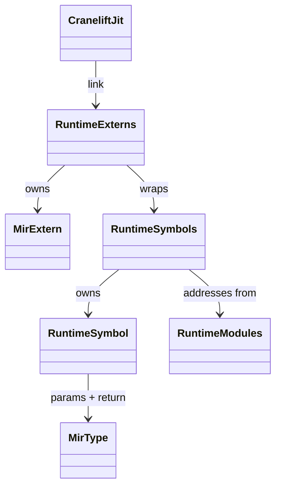
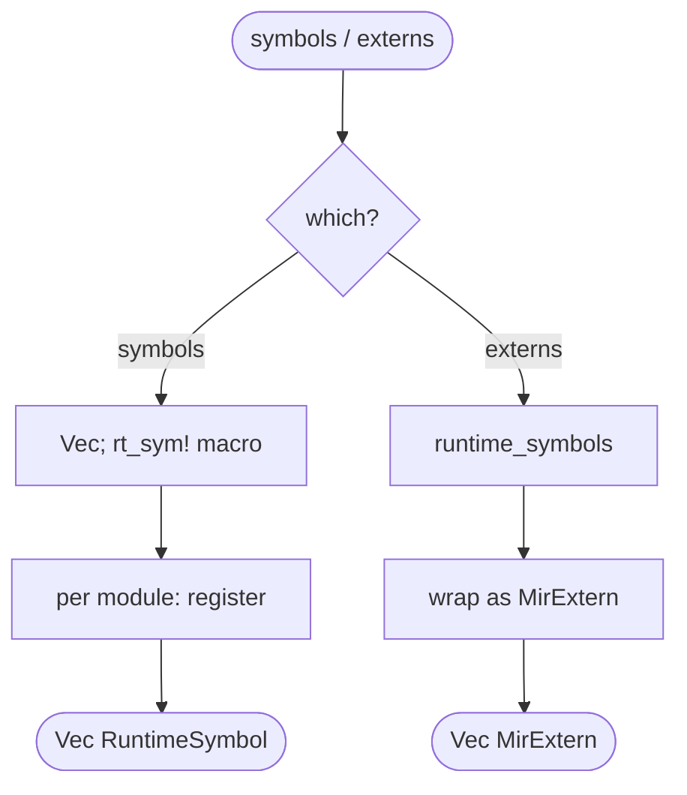
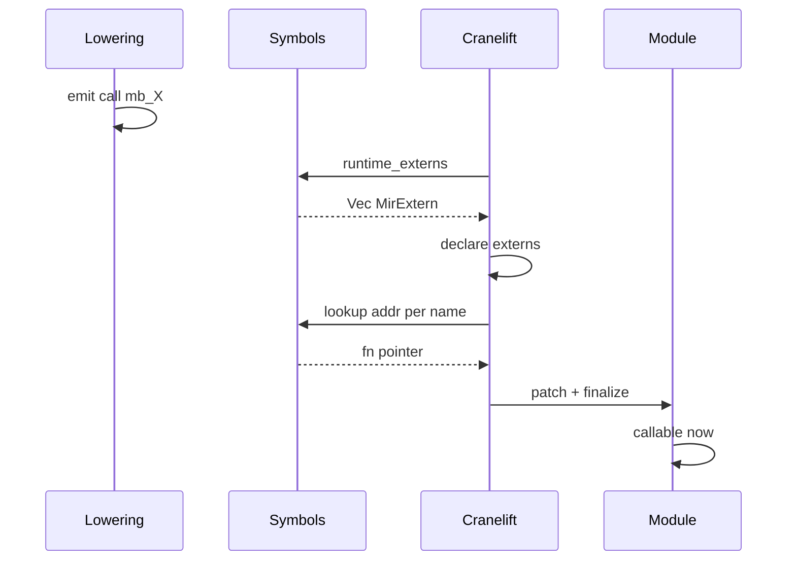
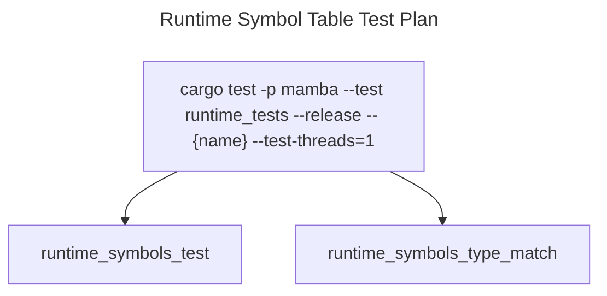

# Runtime Symbol Table

`runtime/symbols.rs` is the JIT linker's catalog. It enumerates every
`mb_*` function the runtime exposes — name, raw function pointer, MIR
parameter types, MIR return type — so the Cranelift backend can resolve
calls emitted by lowering. Two functions: `runtime_symbols()` returns
the catalog as `Vec<RuntimeSymbol>`; `runtime_externs()` wraps it as
`Vec<MirExtern>` for the MIR pre-link pass.

Three load-bearing invariants:

1. **Every JIT-emitted `mb_*` call must appear here** — symbol lookup
   at link time fails fast if missing, so a runtime function that's
   called but not registered produces a clear MIR-link error rather
   than a delayed unsafe pointer dereference.
2. **Function-pointer addresses are static-lifetime safe** — Rust's
   guarantee that `extern "C" fn` items live for `'static` is what
   makes `addr: *const u8` valid here without retain. If a function
   were ever generated dynamically, its address would have to be kept
   alive separately (see `module.md` `MODULE_JIT_BACKENDS`).
3. **MIR type signatures are part of the contract** — the JIT lowers
   call sites against the declared signature; passing a Rust fn with
   a different signature than what's declared would produce
   well-formed MIR but undefined behavior at runtime. Code-review
   guard: every entry in `runtime_symbols` must match the actual
   `pub fn` it points to.

## Type model
<!-- type: dependency lang: mermaid -->



## Symbol shape
<!-- type: schema lang: yaml -->

```yaml
$schema: "https://json-schema.org/draft/2020-12/schema"
$id: "symbols-types"
$defs:
  RuntimeSymbol:
    type: object
    x-rust-type: RuntimeSymbol
    properties:
      name:        { type: string, description: "exact mb_* identifier; matches lowering's call-site spelling" }
      addr:        { type: integer, x-rust-type: "*const u8", description: "function pointer cast to byte ptr" }
      params:      { type: array, items: { x-rust-type: MirType } }
      return_type: { x-rust-type: MirType }
    required: [name, addr, params, return_type]
  MirTypeUsedHere:
    description: "Subset of MirType used by runtime symbols (from crate::mir)"
    type: string
    enum: [Int, Float, Bool, Ptr, Str, List, Dict, Tuple, Void, Any]
```

## Registration logic
<!-- type: logic lang: mermaid -->



## Link-time interaction
<!-- type: interaction lang: mermaid -->



## Acceptance scenarios
<!-- type: scenarios lang: yaml -->
```yaml
scenarios:
  - id: registered-runtime-symbol
    given: a contributor adds mb_foo and an rt_sym entry with declared MirType params
    when: the JIT module declares and links mb_foo
    then: symbol lookup returns the static function pointer and module calls succeed
  - id: missing-runtime-symbol
    given: lowering emits a call to mb_foo without a runtime_symbols entry
    when: the JIT links the module
    then: MIR-link fails loudly before runtime execution
```

## Tests
<!-- type: test-plan lang: mermaid -->


## Changes
<!-- type: changes lang: yaml -->

```yaml
changes:
  - file: crates/mamba/src/runtime/symbols.rs
    action: modify
    impl_mode: hand-written
    description: "RuntimeSymbol struct, runtime_symbols() catalog (~all mb_* across runtime), runtime_externs() MIR-link wrapper, rt_sym! macro for entry construction. Hand-written; every new mb_* fn requires an rt_sym! entry."
```
