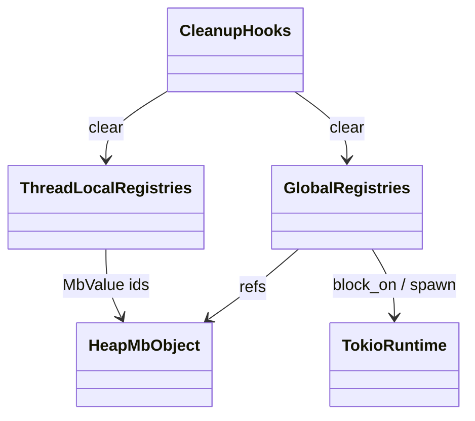
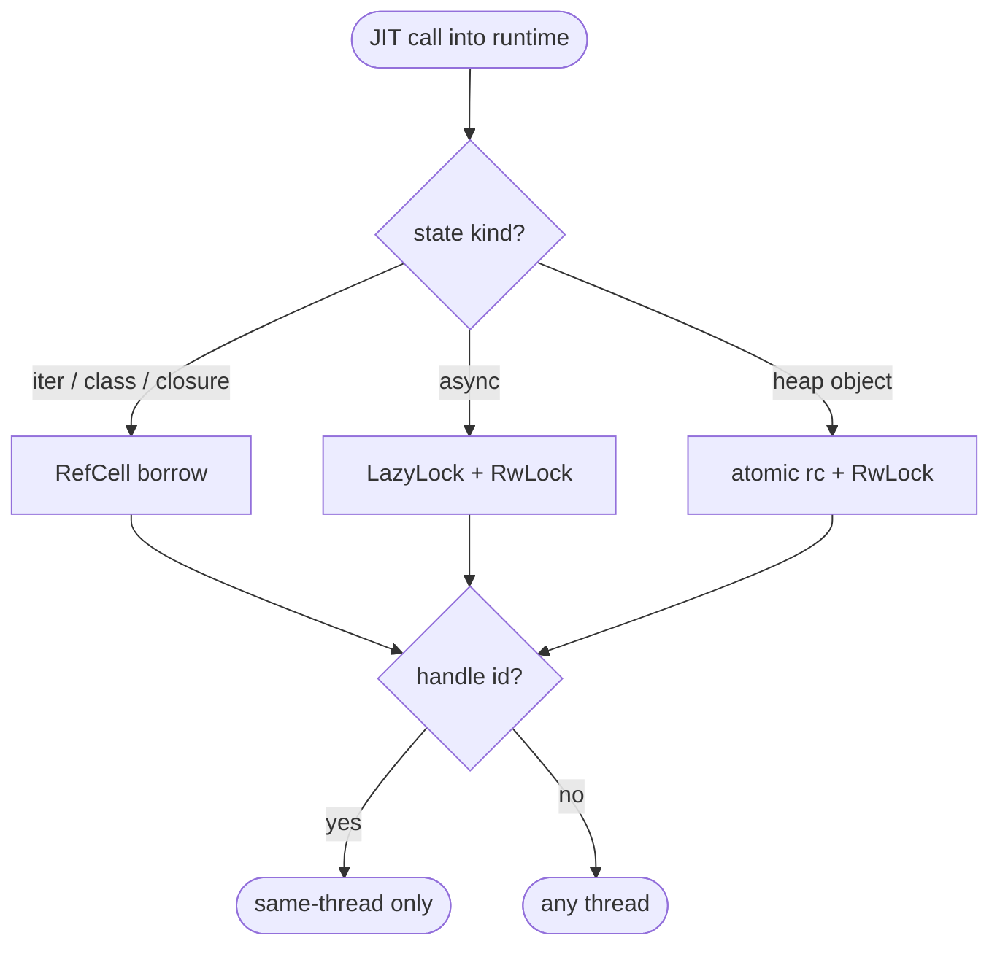
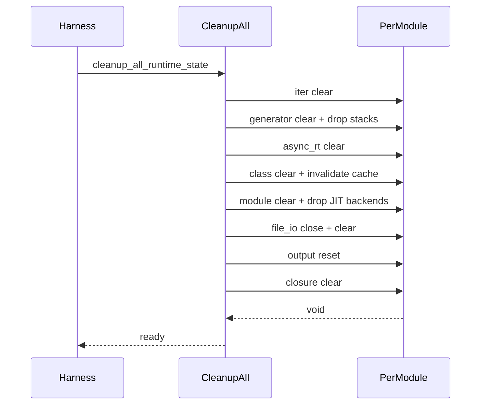
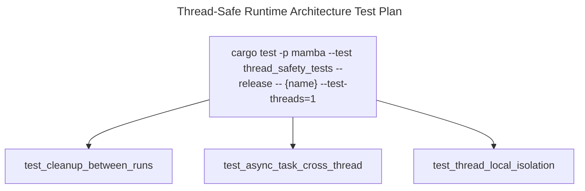

# Thread-Safe Runtime Architecture

Cross-cutting spec describing how Mamba's per-module runtime state is
distributed across threads. Two layers cooperate:

- **Thread-local registries** for state that is conceptually per-thread:
  iterators, exception slot, class registry method cache, closure
  cells, generator coroutines, GC state, modules, file handles, output
  capture. All accessed via `thread_local! { static X: RefCell<...> }`
  and dropped at thread exit.
- **Globally-shared registries** for state that must be visible
  across threads: async coroutines + tasks (`LazyLock<RwLock<HashMap>>`
  in `async_rt.rs`), heap `MbObject` allocations themselves
  (refcount + RwLock-protected mutable collections per
  `value-and-rc.md`), and Tokio runtime singletons.

The split exists because:

- Most Python code is single-threaded; thread-local avoids atomic
  contention on hot dispatch paths (`mb_iter`, `mb_lookup_dunder`,
  `mb_call_method`).
- Async code by definition must hop threads (Tokio's multi-thread
  scheduler), so its handles cannot live in thread-local registries.

Three load-bearing invariants:

1. **Generator coroutines are thread-local; async coroutines are
   global** — same name "coroutine" but completely different storage.
   `runtime/generator.rs` runs on the creator thread (stack-swapping
   at the same OS thread); `runtime/async_rt.rs` ships work to any
   Tokio worker. Mixing the two registries would corrupt the wrong
   one — see `generator.md` and `async.md`.
2. **`MbObject` itself is `Send + Sync` via atomic rc + RwLock** —
   the heap object is shareable; what's NOT shared is the
   thread-local handle registries that hand out non-pointer IDs.
   Any function returning a heap MbValue can pass it across threads;
   any function returning an iterator / generator / closure / file
   handle ID must NOT.
3. **`cleanup_all_*` between test runs is mandatory on aarch64** —
   stale function pointers in registries SIGBUS the next test.
   `cleanup_all_runtime_state` is called from the test harness; it
   walks each registry and clears it. Skipping it works on x86_64
   but flakes on M-series Macs.

## Type model
<!-- type: dependency lang: mermaid -->



## State partition shape
<!-- type: schema lang: yaml -->

```yaml
$schema: "https://json-schema.org/draft/2020-12/schema"
$id: "thread-safe-types"
$defs:
  ThreadLocalCategory:
    type: string
    description: "Per-thread state — RefCell<...> in thread_local! block"
    enum:
      - iter::ITERATORS
      - iter::STOP_ITERATION
      - iter::NEXT_ITER_ID
      - exception::CURRENT_EXCEPTION
      - exception::EXCEPTION_HANDLERS
      - class::CLASS_REGISTRY
      - class::CALLABLE_REGISTRY
      - class::SLOTS_REGISTRY
      - class::DICT_SUPPRESSED
      - class::KWARGS_REGISTRY
      - class::METHOD_CACHE
      - class::METHOD_CACHE_GEN
      - class::SIMPLE_CLASS_CACHE
      - closure::CLOSURES
      - closure::CELLS
      - closure::FUNC_NAMES
      - closure::GLOBAL_BY_ID
      - closure::GLOBAL_NAMES
      - generator::GENERATORS
      - generator::ACTIVE_GEN_ID
      - generator::ACTIVE_GEN_CTX
      - generator::YIELD_XFER
      - generator::SEND_XFER
      - generator::THROW_XFER
      - generator::CALLER_CTX_STACK
      - generator::LAST_STOP_VALUE
      - generator::SHARED_CAPTURE
      - gc::GC
      - module::MODULES
      - module::SEARCH_PATHS
      - module::SCRIPT_DIR
      - module::CURRENT_MODULE_PACKAGE
      - module::MODULE_JIT_BACKENDS
      - module::NATIVE_FUNC_ADDRS
      - module::VARIADIC_SYMBOL_IDS
      - module::VARIADIC_FUNC_ADDRS
      - module::KWARGS_SYMBOL_IDS
      - module::KWARGS_FUNC_ADDRS
      - file_io::FILES
      - file_io::NEXT_FILE_ID
      - output::CAPTURE
  GlobalCategory:
    type: string
    description: "Shared across threads — LazyLock<RwLock<HashMap>>"
    enum:
      - async_rt::COROUTINES
      - async_rt::TASKS
      - async_rt::NEXT_CORO_ID
      - async_rt::NEXT_TASK_ID
```

## Cleanup lifecycle

```mermaid
---
id: cleanup-lifecycle
initial: TestRunning
nodes:
  TestRunning:    { kind: initial,  label: "fixture executing; registries populated" }
  TestEnded:      { kind: normal,   label: "fixture returned; thread still alive" }
  CleanupRunning: { kind: transient, label: "cleanup_all_runtime_state walking registries" }
  Idle:           { kind: normal,   label: "registries empty; ready for next fixture" }
  ProcessExit:    { kind: terminal, label: "thread exit; thread_locals dropped" }
edges:
  - { from: TestRunning,    to: TestEnded,      event: "fixture body returns" }
  - { from: TestEnded,      to: CleanupRunning, event: "harness invokes cleanup_all_runtime_state (mandatory on aarch64)" }
  - { from: CleanupRunning, to: Idle,           event: "all per-module cleanup_all_* called" }
  - { from: Idle,           to: TestRunning,    event: "next fixture starts" }
  - { from: TestEnded,      to: ProcessExit,    event: "no more fixtures" }
  - { from: Idle,           to: ProcessExit,    event: "harness shutdown" }
---
stateDiagram-v2
    [*] --> TestRunning
    TestRunning --> TestEnded: body returns
    TestEnded --> CleanupRunning: cleanup_all_runtime_state
    CleanupRunning --> Idle: per-module clear
    Idle --> TestRunning: next fixture
    TestEnded --> ProcessExit: harness shutdown
    Idle --> ProcessExit: harness shutdown
    ProcessExit --> [*]
```

<!-- type: state-machine lang: mermaid -->



## Cross-thread dispatch logic
<!-- type: logic lang: mermaid -->



## Cleanup interaction
<!-- type: interaction lang: mermaid -->



## Acceptance scenarios
<!-- type: scenarios lang: yaml -->

```yaml
scenarios:
  - id: cleanup-between-tests
    given: a conformance fixture populates thread-local runtime registries
    when: cleanup_all_runtime_state runs before the next fixture
    then: every per-module registry is empty and stale function pointers cannot affect the next run
  - id: async-cross-thread-task
    given: async_await/gather.py schedules tasks on the Tokio runtime
    when: worker threads poll async task handles
    then: global async_rt registries resolve tasks consistently across threads
  - id: thread-local-isolation
    given: two OS threads create iterator, generator, closure, or file handles
    when: each thread resolves its own handle IDs
    then: thread-local registries keep same numeric IDs isolated per thread
```

## Tests
<!-- type: test-plan lang: mermaid -->



## Changes
<!-- type: changes lang: yaml -->

```yaml
changes:
  - file: crates/mamba/src/runtime/iter.rs
    action: modify
    impl_mode: hand-written
    description: "thread_local ITERATORS / STOP_ITERATION / NEXT_ITER_ID + cleanup hook"
  - file: crates/mamba/src/runtime/exception.rs
    action: modify
    impl_mode: hand-written
    description: "thread_local CURRENT_EXCEPTION / EXCEPTION_HANDLERS"
  - file: crates/mamba/src/runtime/class.rs
    action: modify
    impl_mode: hand-written
    description: "8 class-related thread_local registries"
  - file: crates/mamba/src/runtime/closure.rs
    action: modify
    impl_mode: hand-written
    description: "thread_local CLOSURES / CELLS / FUNC_NAMES / GLOBAL_BY_ID / GLOBAL_NAMES"
  - file: crates/mamba/src/runtime/generator.rs
    action: modify
    impl_mode: hand-written
    description: "thread_local GENERATORS + 7 hot-path cells + CALLER_CTX_STACK + cleanup_all_generators"
  - file: crates/mamba/src/runtime/gc.rs
    action: modify
    impl_mode: hand-written
    description: "thread_local GC state + safepoint stubs"
  - file: crates/mamba/src/runtime/module.rs
    action: modify
    impl_mode: hand-written
    description: "thread_local MODULES + 10 dispatch registries"
  - file: crates/mamba/src/runtime/file_io.rs
    action: modify
    impl_mode: hand-written
    description: "thread_local FILES / NEXT_FILE_ID"
  - file: crates/mamba/src/runtime/output.rs
    action: modify
    impl_mode: hand-written
    description: "thread_local CAPTURE buffer"
  - file: crates/mamba/src/runtime/async_rt.rs
    action: modify
    impl_mode: hand-written
    description: "GLOBAL LazyLock<RwLock<HashMap>> COROUTINES + TASKS + atomic ID counters + cleanup_all_async"
  - file: crates/mamba/src/runtime/async_task.rs
    action: modify
    impl_mode: hand-written
    description: "Public async surface and GIL stub"
```
