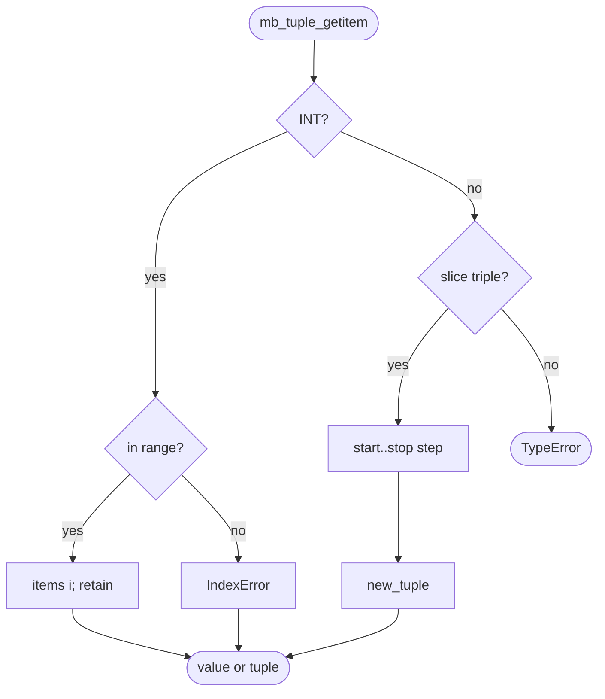
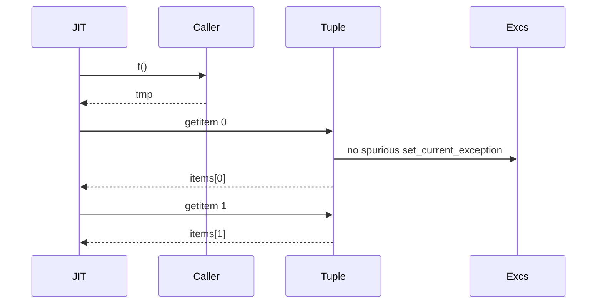
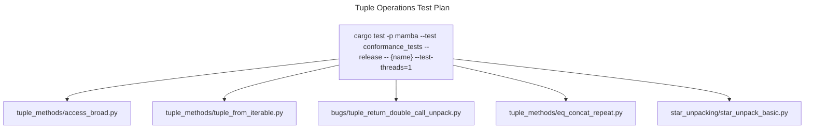

# Tuple Operations

Mamba tuples store `Vec<MbValue>` (no lock, no mutation primitives —
tuples are immutable). The runtime exposes the CPython-equivalent
read-only surface (`tup[i]` / slicing / `+` / `*` / `count` / `index`
/ equality), unpacking, plus some structural helpers used internally by
return-multiple-values lowering.

Three load-bearing invariants:

1. **Tuple equality is element-wise via `eq_py`** — same value-equality
   walk as set membership; `(1, 1.0) == (1.0, 1)` is True. Pointer
   equality alone would break arithmetic-tuple fixtures.
2. **`tup[i]` returns a *single* element; `tup[a:b:c]` returns a tuple**
   — `mb_tuple_getitem` dispatches by index type. Slice support
   matters for unpacking patterns like `*head, last = tup`.
3. **Tuple-return-unpack vs `set_current_exception`** — the JIT lowers
   `a, b = f()` as `tmp = f(); a = tmp[0]; b = tmp[1]`. A spurious
   `set_current_exception` from inside the tuple subscripting (commit
   `b34d575aa`) used to leak ValueError; the fix is now a precondition
   for any clean tuple-unpack fixture.

## Type model
<!-- type: dependency lang: mermaid -->

```mermaid
---
id: tuple-types
types:
  ObjDataTuple:  { kind: struct, label: "ObjData::Tuple(Vec<MbValue>)" }
  MbValue:       { kind: struct }
  EqPy:          { kind: struct, label: "eq_py from runtime::set_ops (shared)" }
  ExceptionMod:  { kind: struct, label: "exception.rs (IndexError on subscript out-of-range)" }
  IterModule:    { kind: struct, label: "iter.rs (Tuple has dedicated IterKind variant)" }
  Slice:         { kind: struct, label: "Tuple(start, stop, step)" }
edges:
  - { from: ObjDataTuple, to: MbValue,      kind: references, label: "Vec elements (immutable)" }
  - { from: ObjDataTuple, to: EqPy,         kind: references, label: "element-wise compare" }
  - { from: ObjDataTuple, to: ExceptionMod, kind: references, label: "IndexError" }
  - { from: ObjDataTuple, to: IterModule,   kind: references, label: "iter wrap" }
  - { from: ObjDataTuple, to: Slice,        kind: references, label: "tup[a:b:c]" }
---
classDiagram
    class ObjDataTuple
    class MbValue
    class EqPy
    class ExceptionMod
    class IterModule
    class Slice
    ObjDataTuple --> MbValue : Vec
    ObjDataTuple --> EqPy : element-wise
    ObjDataTuple --> ExceptionMod : IndexError
    ObjDataTuple --> IterModule : iter wrap
    ObjDataTuple --> Slice : tup[a:b:c]
```

## Tuple shape
<!-- type: schema lang: yaml -->

```yaml
$schema: "https://json-schema.org/draft/2020-12/schema"
$id: "tuple-types"
$defs:
  MbTuple:
    type: object
    description: "ObjData::Tuple(Vec<MbValue>) — immutable"
    properties:
      items:
        type: array
        items: { x-rust-type: MbValue }
    required: [items]
  TupleSubscript:
    description: "Index value passed to mb_tuple_getitem"
    oneOf:
      - { title: Int,   x-rust-type: i64,    description: "single-element index; negative wraps from end" }
      - { title: Slice, properties: { start: { x-rust-type: MbValue }, stop: { x-rust-type: MbValue }, step: { x-rust-type: MbValue } } }
```

## Subscript / equality logic
<!-- type: logic lang: mermaid -->



## Return-unpack interaction
<!-- type: interaction lang: mermaid -->



## Acceptance scenarios
<!-- type: scenarios lang: yaml -->

```yaml
scenarios:
  - id: tuple-access
    given: tuple_methods/access_broad.py exercises indexing, count, index, and negative wrap
    when: tuple operations read elements
    then: integer subscripts range-check and count/index use eq_py
  - id: tuple-from-iterable
    given: tuple_methods/tuple_from_iterable.py converts list, range, and generator inputs
    when: tuple(iterable) drains the source
    then: the runtime allocates a fresh immutable tuple with retained elements
  - id: tuple-return-unpack
    given: bugs/tuple_return_double_call_unpack.py unpacks a function-returned tuple
    when: subsequent calls execute after tuple subscripting
    then: no spurious ValueError remains in CURRENT_EXCEPTION
  - id: tuple-eq-concat-repeat
    given: tuple_methods/eq_concat_repeat.py uses tuple addition, repetition, and equality
    when: runtime operations combine or compare tuples
    then: concat and repeat allocate fresh tuples and equality is element-wise
```

## Tests
<!-- type: test-plan lang: mermaid -->



## Changes
<!-- type: changes lang: yaml -->

```yaml
changes:
  - file: crates/mamba/src/runtime/tuple_ops.rs
    action: modify
    impl_mode: hand-written
    description: "Vec<MbValue>-backed immutable tuple, subscript with int / slice, count / index via eq_py, concat / repeat allocate fresh tuples. Hand-written; subscript MUST not set CURRENT_EXCEPTION on success path (commit b34d575aa)."
```
