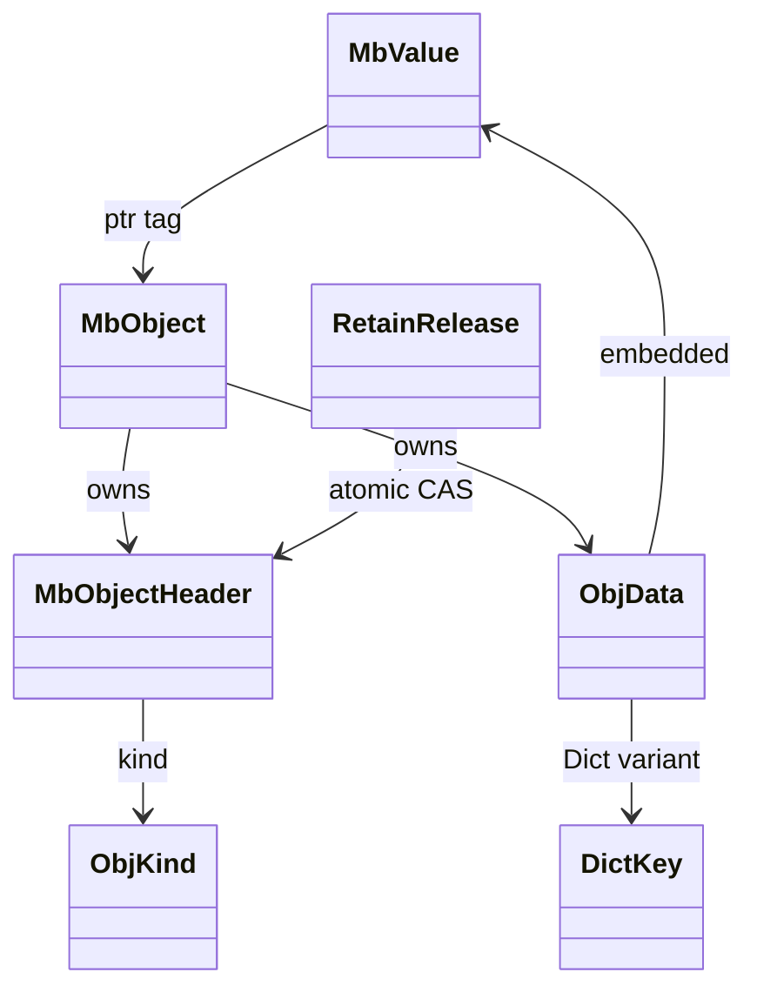
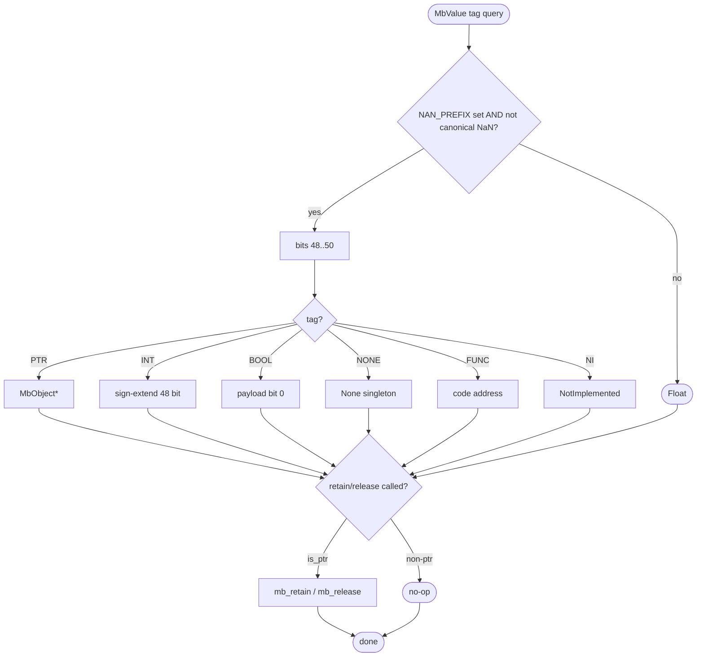
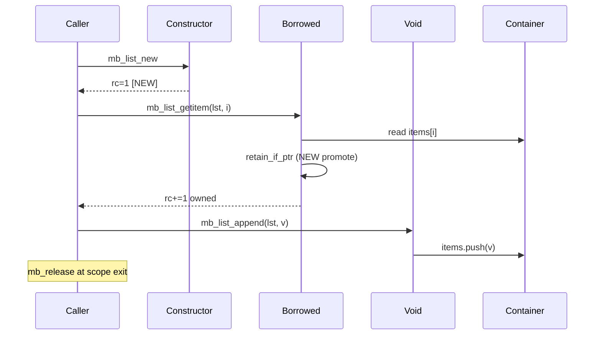
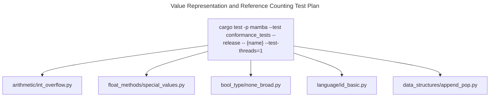

# Value Representation and Reference Counting

`MbValue` is a single 64-bit NaN-boxed word. Tagged integers, booleans,
None, NotImplemented, and JIT function pointers live entirely in the
NaN payload; floats live as plain non-tagged IEEE 754 doubles; heap
objects (str, list, dict, tuple, instance, set, frozenset, bytes,
bytearray, BigInt, Complex, CodeObject) live behind a 48-bit pointer
into a `MbObject` with an atomic refcount header.

Three load-bearing invariants:

1. **48-bit address bound** — `from_ptr` / `from_int` debug-assert that
   the payload fits 48 bits. ARM64 / x86-64 user space respects this
   today; if Mamba is ever ported to a target with wider pointers the
   NaN-boxing layout has to be revisited.
2. **NEW / BORROWED / VOID classification** — every public
   `mb_*` function that returns `MbValue` falls into one of three
   refcount classes (commit `#1129` ownership audit). NEW = caller
   owns rc=1; BORROWED = caller does NOT own, callee called
   `retain_if_ptr` so caller now does; VOID = no return value. Mismatch
   at any boundary leaks or double-frees.
3. **`IMMORTAL_REFCOUNT = u32::MAX`** — JIT-embedded constants
   (interned strings / bytes) have refcount sentinel `u32::MAX`;
   `mb_release` early-returns instead of decrementing so they are
   never freed.

## Type model
<!-- type: dependency lang: mermaid -->



## Value layout
<!-- type: schema lang: yaml -->

```yaml
$schema: "https://json-schema.org/draft/2020-12/schema"
$id: "value-rc-types"
$defs:
  MbValue:
    type: object
    x-rust-type: MbValue
    description: "NaN-boxed 64-bit; tag in bits 48..50 when NAN_PREFIX (0xFFF8_0000_0000_0000) set"
    properties:
      bits: { type: integer, x-rust-type: u64 }
    required: [bits]
    examples:
      - { bits: "0xFFF9_0000_0000_002A", description: "tag=INT(1), payload=42" }
      - { bits: "0xFFFA_0000_0000_0001", description: "tag=BOOL(2), payload=true" }
      - { bits: "0xFFFB_0000_0000_0000", description: "tag=NONE(3)" }
      - { bits: "0xFFFC_0000_0000_<addr>", description: "tag=FUNC(4), 48-bit code addr" }
      - { bits: "0xFFFD_0000_0000_0000", description: "tag=NOTIMPLEMENTED(5)" }
      - { bits: "0xFFF8_0000_0000_<addr>", description: "tag=PTR(0), 48-bit MbObject*" }
  Tag:
    type: string
    enum: [PTR, INT, BOOL, NONE, FUNC, NOTIMPLEMENTED]
    description: "tag values 0..5; remaining 3-bit values reserved"
  ObjKind:
    type: string
    enum:
      [Str, List, Dict, Tuple, Function, Class, Instance,
       Set, Bytes, ByteArray, FrozenSet, BigInt, Complex, CodeObject]
  MbObjectHeader:
    type: object
    x-rust-type: MbObjectHeader
    properties:
      rc:   { type: integer, x-rust-type: AtomicU32, description: "u32::MAX = IMMORTAL" }
      kind: { $ref: "#/$defs/ObjKind" }
    required: [rc, kind]
  ObjData:
    description: "12-variant data union, repr(C) follows MbObjectHeader"
    type: object
    oneOf:
      - { title: Str,        properties: { value: { type: string } } }
      - { title: List,       properties: { lock: { type: array, items: { x-rust-type: MbValue } } }, description: "RwLock<Vec<MbValue>>" }
      - { title: Dict,       properties: { lock: { type: object, additionalProperties: { x-rust-type: MbValue } } }, description: "RwLock<IndexMap<DictKey, MbValue>>" }
      - { title: Tuple,      properties: { items: { type: array, items: { x-rust-type: MbValue } } } }
      - { title: Instance,   properties: { class_name: { type: string }, fields: { type: object, additionalProperties: { x-rust-type: MbValue } } }, description: "fields wrapped in RwLock" }
      - { title: Set,        properties: { lock: { type: array, items: { x-rust-type: MbValue } } } }
      - { title: Bytes,      properties: { value: { type: array, items: { type: integer, minimum: 0, maximum: 255 } } } }
      - { title: ByteArray,  properties: { lock: { type: array, items: { type: integer, minimum: 0, maximum: 255 } } } }
      - { title: FrozenSet,  properties: { items: { type: array, items: { x-rust-type: MbValue } } } }
      - { title: BigInt,     properties: { value: { x-rust-type: "num_bigint::BigInt" } } }
      - { title: Complex,    properties: { real: { type: number }, imag: { type: number } } }
      - { title: CodeObject, properties: { source: { type: string }, filename: { type: string }, mode: { type: string }, ast: { x-rust-type: "Box<parser::ast::Module>" } } }
```

## Refcount lifecycle

```mermaid
---
id: rc-lifecycle
initial: Allocated
nodes:
  Allocated:    { kind: initial,  label: "MbObject::new_*; rc = 1" }
  Live:         { kind: normal,   label: "rc >= 1; mutable via RwLock if applicable" }
  Immortal:     { kind: normal,   label: "rc = IMMORTAL_REFCOUNT (u32::MAX)" }
  Released:     { kind: transient, label: "rc = 0; release children" }
  Freed:        { kind: terminal,  label: "Box::from_raw drop runs" }
edges:
  - { from: Allocated, to: Live,     event: "constructor returns" }
  - { from: Allocated, to: Immortal, event: "JIT embeds with rc=u32::MAX" }
  - { from: Live,      to: Live,     event: "mb_retain (rc += 1)" }
  - { from: Live,      to: Live,     event: "mb_release (rc > 1, rc -= 1)" }
  - { from: Live,      to: Released, event: "mb_release (rc == 1, rc → 0)" }
  - { from: Released,  to: Freed,    event: "drop_inner releases children + Box::from_raw" }
  - { from: Immortal,  to: Immortal, event: "mb_release no-op (rc unchanged at u32::MAX)" }
---
stateDiagram-v2
    [*] --> Allocated
    Allocated --> Live: constructor
    Allocated --> Immortal: JIT embed
    Live --> Live: mb_retain
    Live --> Live: mb_release [rc > 1]
    Live --> Released: mb_release [rc → 0]
    Released --> Freed: drop_inner
    Immortal --> Immortal: mb_release (no-op)
    Freed --> [*]
```

<!-- type: state-machine lang: mermaid -->



## Tag dispatch
<!-- type: logic lang: mermaid -->



## Ownership protocol interaction
<!-- type: interaction lang: mermaid -->



## Acceptance scenarios
<!-- type: scenarios lang: yaml -->

```yaml
scenarios:
  - id: int-overflow-promotes
    given: arithmetic/int_overflow.py creates a value outside the 48-bit inline integer range
    when: MbValue::from_int cannot encode the result inline
    then: the value promotes to a BigInt heap object and prints exactly
  - id: float-special-values
    given: float_methods/special_values.py manipulates NaN and infinity
    when: MbValue.tag sees a non-tagged IEEE 754 payload
    then: it stays on the float branch and preserves CPython NaN behavior
  - id: cycle-collection
    given: data_structures/cycle.py creates a self-referencing list
    when: normal rc cannot reclaim the cycle
    then: the cycle collector can break the cycle without violating retain/release ownership
  - id: immortal-constant
    given: arithmetic/jit_const_immortal.py reuses embedded constant heap objects
    when: mb_release sees IMMORTAL_REFCOUNT
    then: release is a no-op and the object is never freed
```

## Tests
<!-- type: test-plan lang: mermaid -->



## Changes
<!-- type: changes lang: yaml -->

```yaml
changes:
  - file: crates/mamba/src/runtime/value.rs
    action: modify
    impl_mode: hand-written
    description: "NaN-boxed MbValue: 6 tag values (PTR/INT/BOOL/NONE/FUNC/NOTIMPLEMENTED), 48-bit payload, debug-asserted bounds. Hand-written; layout is a load-bearing ABI."
  - file: crates/mamba/src/runtime/rc.rs
    action: modify
    impl_mode: hand-written
    description: "MbObject + MbObjectHeader + ObjData (12 variants) + ObjKind tag. retain_if_ptr / release_if_ptr / mb_retain / mb_release; IMMORTAL_REFCOUNT sentinel. Hand-written; NEW/BORROWED/VOID classification doc-block in this file is the authoritative ownership audit."
```
