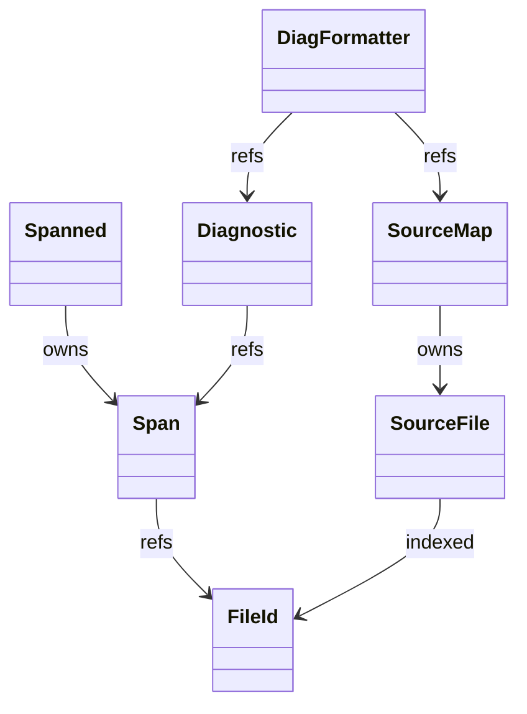
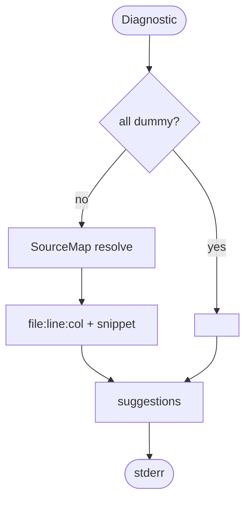
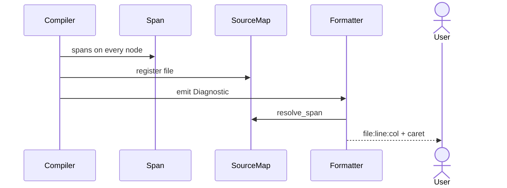
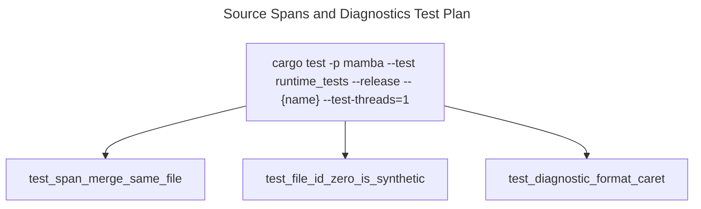

# Source Spans and Diagnostics

`source/span.rs` defines `FileId`, `Span`, and the `Spanned<T>` wrapper
used by every AST / HIR node to carry source-range info. `source/mod.rs`
defines `SourceMap` — the registry that maps `FileId` to file
contents + path so diagnostics can resolve byte offsets to line+column
+ file name.

Three load-bearing invariants:

1. **`Span { file, start, end }` is byte-offset-based** — line+column
   resolution is done lazily by `SourceMap::resolve_span` only when
   formatting a diagnostic. Storing line / column inline in every
   span would bloat the IR by ~50%.
2. **`Span::merge` requires same `FileId`** — debug-assert prevents
   accidentally merging spans from different files (which would
   produce a meaningless range).
3. **`FileId(0)` is reserved for the synthetic / dummy span** —
   compiler-generated nodes (e.g., desugar output) without a natural
   source location use `Span::dummy()`. Diagnostics format these as
   `<generated>` rather than pointing at file 0.

## Type model
<!-- type: dependency lang: mermaid -->



## Span shape
<!-- type: schema lang: yaml -->

```yaml
$schema: "https://json-schema.org/draft/2020-12/schema"
$id: "source-types"
$defs:
  FileId:
    type: integer
    x-rust-type: u32
    description: "0 = dummy / synthetic"
  Span:
    type: object
    x-rust-type: Span
    properties:
      file:  { x-rust-type: FileId }
      start: { type: integer, x-rust-type: u32, description: "byte offset" }
      end:   { type: integer, x-rust-type: u32 }
    required: [file, start, end]
  Spanned:
    type: object
    x-rust-type: "Spanned<T>"
    properties:
      node: { description: "wrapped value" }
      span: { $ref: "#/$defs/Span" }
    required: [node, span]
  Diagnostic:
    type: object
    properties:
      level:    { type: string, enum: [error, warning, note, help] }
      message:  { type: string }
      spans:    { type: array, items: { $ref: "#/$defs/Span" } }
      suggestions:
        type: array
        items:
          type: object
          properties:
            span:        { $ref: "#/$defs/Span" }
            replacement: { type: string }
          required: [span, replacement]
    required: [level, message, spans]
```

## Diagnostic emission logic
<!-- type: logic lang: mermaid -->



## Diagnostic flow interaction
<!-- type: interaction lang: mermaid -->



## Acceptance scenarios
<!-- type: scenarios lang: yaml -->
```yaml
scenarios:
  - id: syntax-diagnostic
    given: syntax_error.py contains an unexpected plus on line 2 column 3
    when: mamba run syntax_error.py is executed
    then: the parser diagnostic renders syntax_error.py:2:3 with a caret span
  - id: type-diagnostic
    given: type_error.py assigns a string literal to an int annotation
    when: type checking emits a typed diagnostic
    then: the formatter resolves the span to line 1 column 9 and reports the type mismatch
  - id: name-diagnostic
    given: name_error.py calls print(undefined)
    when: name resolution emits a diagnostic
    then: the formatter reports the undefined name at the source span
```

## Tests
<!-- type: test-plan lang: mermaid -->


## Changes
<!-- type: changes lang: yaml -->

```yaml
changes:
  - file: crates/mamba/src/source/span.rs
    action: modify
    impl_mode: hand-written
    description: "FileId / Span / Spanned<T> + merge / len / dummy. Hand-written; byte-offset shape is the contract."
  - file: crates/mamba/src/source/mod.rs
    action: modify
    impl_mode: hand-written
    description: "SourceMap (FileId → SourceFile); resolve_span → (file, line, col); line-offset cache. Hand-written."
```
