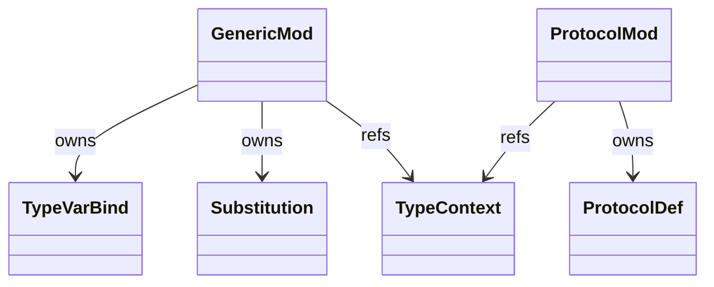
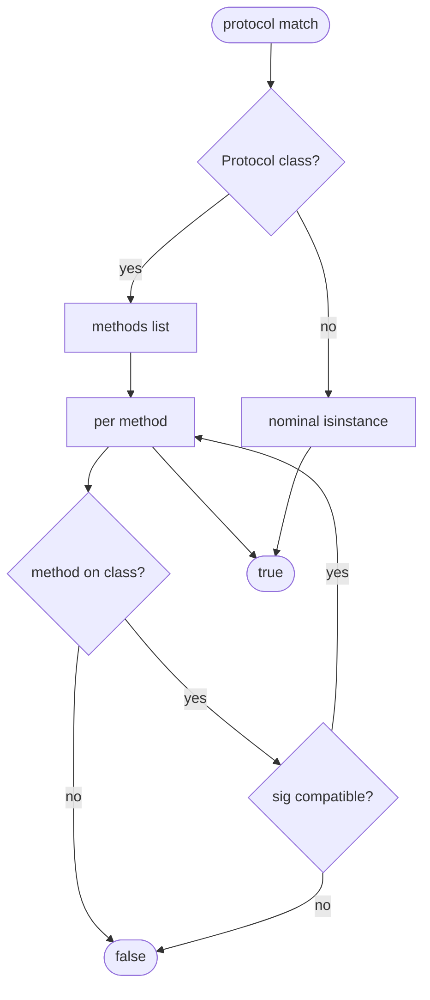
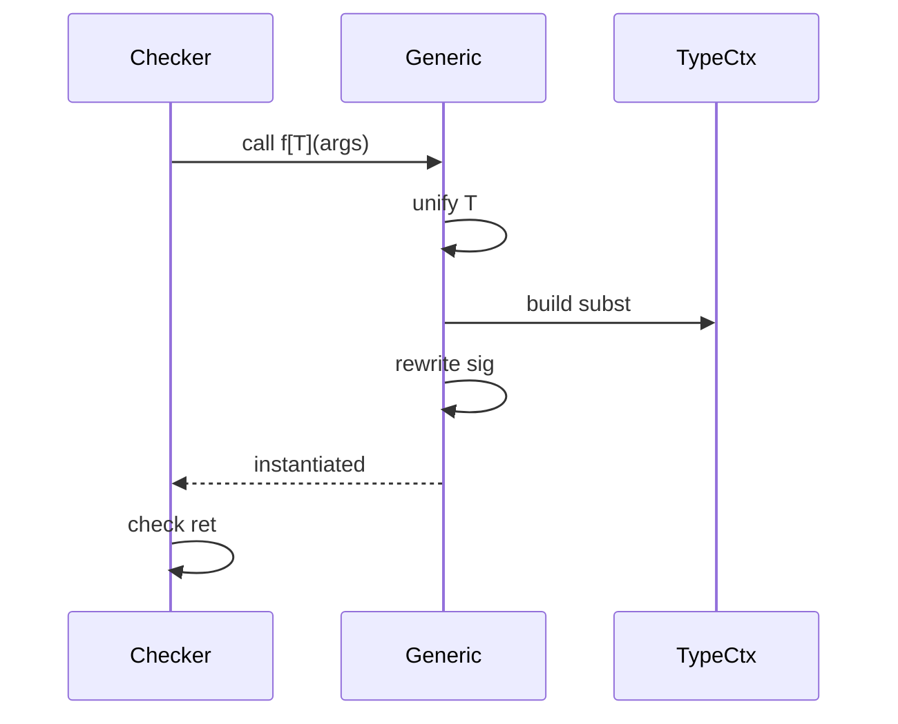
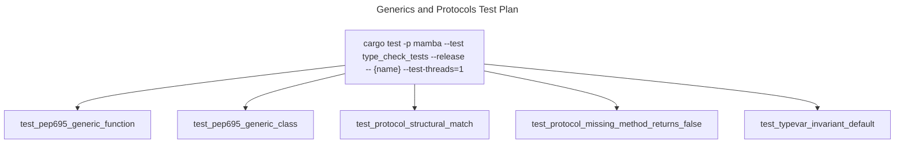

# Generics and Protocols

`types/generic.rs` (627 LOC) handles type parameters introduced by PEP
695 syntax (`def f[T]`, `class List[T]`) and their runtime
substitution. `types/protocol.rs` (537 LOC) handles structural typing
per PEP 544 — `Protocol` classes whose `isinstance` check reduces to
"does the value have these methods with these signatures?".

Three load-bearing invariants:

1. **PEP 695 type-params parse as `Vec<Name>` on FnDef / ClassDef** —
   no separate `TypeVar` declaration syntax needed; the bracket-list
   binds new TypeVars in the function / class scope. The lowerer
   creates `TypeVarId`s in the surrounding `TypeContext` automatically.
2. **Structural matching uses method-name + arity, NOT the `Protocol`
   class name** — `isinstance(x, Iterable)` succeeds if `x` has
   `__iter__`. Nominal subclass relation is unnecessary — that's the
   PEP 544 contract.
3. **Variance is invariant by default** — `List[Int] <: List[Object]`
   does NOT hold unless the user marks the TypeVar as covariant
   (`T_co`) or contravariant (`T_contra`). Mamba follows mypy's
   `_co` / `_contra` naming convention; future extension may add
   explicit `Covariant=True` kwargs.

## Type model
<!-- type: dependency lang: mermaid -->



## Generic + protocol shape
<!-- type: schema lang: yaml -->

```yaml
$schema: "https://json-schema.org/draft/2020-12/schema"
$id: "generics-types"
$defs:
  TypeVarBind:
    type: object
    properties:
      name:     { type: string }
      bound:
        oneOf:
          - { type: "null" }
          - { x-rust-type: TypeId }
        description: "T <: bound — used in subtype check"
      constraints:
        type: array
        items: { x-rust-type: TypeId }
        description: "T must be one of these (T = int | str pattern)"
      variance:
        type: string
        enum: [invariant, covariant, contravariant]
        default: invariant
    required: [name, bound, constraints, variance]
  ProtocolDef:
    type: object
    properties:
      name: { type: string }
      methods:
        type: array
        items:
          type: object
          properties:
            name: { type: string }
            sig:  { x-rust-type: TypeId, description: "Ty::Fn" }
          required: [name, sig]
    required: [name, methods]
  Substitution:
    type: object
    description: "TypeVarId → TypeId map applied at call site"
    additionalProperties:
      x-rust-type: TypeId
```

## Substitution lifecycle

```mermaid
---
id: generic-substitution
initial: Unbound
nodes:
  Unbound:    { kind: initial,  label: "TypeVar declared via PEP 695 brackets; no concrete type" }
  Inferred:   { kind: normal,   label: "call site provides argument; checker infers TypeVar = ConcreteTy" }
  Substituted: { kind: normal,  label: "Substitution map applied; signature instantiated" }
  Erased:     { kind: terminal, label: "post-codegen: runtime sees only concrete types (no generic dispatch)" }
edges:
  - { from: Unbound,   to: Inferred,    event: "checker unifies arg types with TypeVar bounds" }
  - { from: Inferred,  to: Substituted, event: "build Substitution; rewrite Fn signature" }
  - { from: Substituted, to: Erased,    event: "lower to MIR; concrete TypeIds only" }
---
stateDiagram-v2
    [*] --> Unbound
    Unbound --> Inferred: unify args
    Inferred --> Substituted: build subst
    Substituted --> Erased: lower to MIR
    Erased --> [*]
```

<!-- type: state-machine lang: mermaid -->



## Protocol matching logic
<!-- type: logic lang: mermaid -->



## Generic call interaction
<!-- type: interaction lang: mermaid -->



## Acceptance scenarios
<!-- type: scenarios lang: yaml -->

```yaml
scenarios:
  - id: pep695-generic-function
    given: language/pep695_generic_fn.py defines first[T](xs: list[T]) -> T
    when: Mamba type-checks calls with concrete argument types
    then: T is inferred per call site and the return type is concrete
  - id: pep695-generic-class
    given: language/pep695_generic_class.py defines class Box[T]
    when: methods are checked through the class TypeId
    then: type parameters are registered and substituted through method signatures
  - id: protocol-structural-match
    given: language/protocol_iter.py checks isinstance(my_iter, Iterable)
    when: protocol matching examines available methods
    then: __iter__ satisfies the structural protocol and the result is true
  - id: protocol-missing-method
    given: language/protocol_no_method.py checks isinstance(non_iter, Iterable)
    when: protocol matching cannot find __iter__
    then: the structural match fails and the result is false
```

## Tests
<!-- type: test-plan lang: mermaid -->



## Changes
<!-- type: changes lang: yaml -->

```yaml
changes:
  - file: crates/mamba/src/types/generic.rs
    action: modify
    impl_mode: hand-written
    description: "TypeVarBind + Substitution + per-call substitution at TypeChecker::check_call. Hand-written; PEP 695 syntax handled in parser, type machinery here."
  - file: crates/mamba/src/types/protocol.rs
    action: modify
    impl_mode: hand-written
    description: "ProtocolDef + structural matching (method name + signature compatibility per PEP 544). Hand-written."
```
