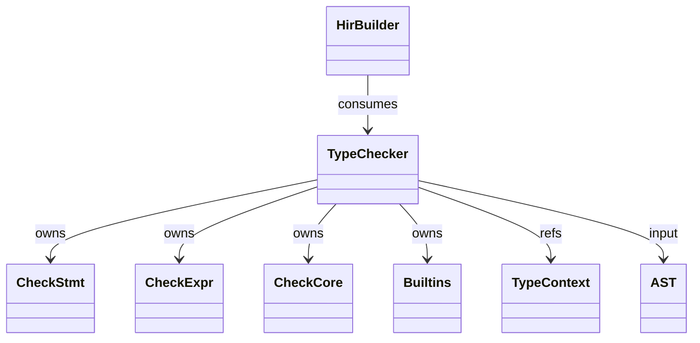
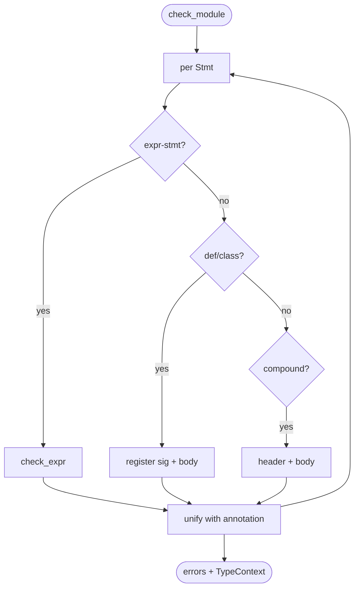
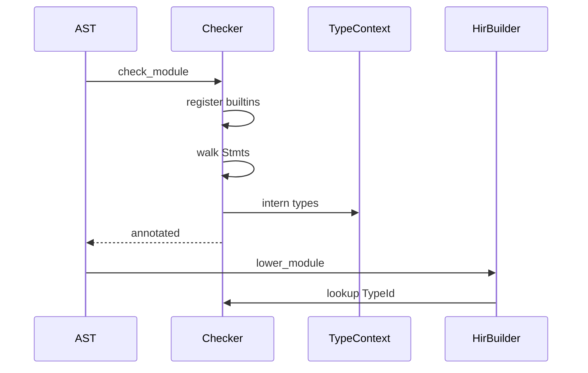
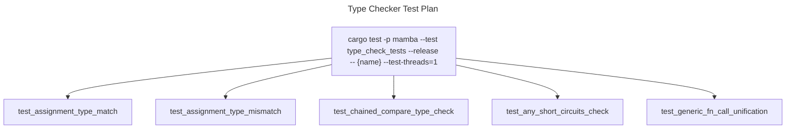

# Type Checker

Mamba's type checker walks `parser::ast::Module` building a
`TypeContext` of inferred / annotated types per AST node. Statements
are dispatched in `check_stmt.rs`; expressions in `check_expr.rs`;
shared utilities (subtype, unify, common-supertype) in `check.rs`;
builtin function signatures registered in `builtins.rs`.

The checker is **gradual** — `Ty::Any` makes any check succeed; this
matches Python's optional-typing model where unannotated code falls
back to dynamic.

Three load-bearing invariants:

1. **`Ty::Any` short-circuits subtype / unify** — every check that
   sees `Any` on either side returns success. Errors propagate via
   `Ty::Error` rather than panic so a single bad annotation doesn't
   cascade.
2. **Comparison chains type-check element-wise** — `1 < x < 10` is
   not `(int < int) < int`; the checker recognises `Expr::Compare`
   and verifies each adjacent pair.
3. **Generic type variables are unified post-call** — `def f[T](x: T) -> T`
   when called with `f(5)` first checks `T = int`, then sets the
   return as `int`. Out-of-order unification breaks `T` resolution.

## Type model
<!-- type: dependency lang: mermaid -->



## Check-result shape
<!-- type: schema lang: yaml -->

```yaml
$schema: "https://json-schema.org/draft/2020-12/schema"
$id: "type-checker-types"
$defs:
  CheckResult:
    type: object
    properties:
      ty:     { x-rust-type: TypeId, description: "result of expression / annotation" }
      errors: { type: array, items: { type: string } }
    required: [ty, errors]
  SubtypeRule:
    description: "When does `sub <: super` hold?"
    type: array
    items:
      type: object
      properties:
        rule:        { type: string }
        description: { type: string }
      required: [rule, description]
    examples:
      - - { rule: "Any-anywhere",     description: "Ty::Any <: T and T <: Ty::Any always" }
        - { rule: "Bool <: Int",      description: "True/False are valid ints" }
        - { rule: "Int <: Float",     description: "implicit numeric promotion" }
        - { rule: "Union-LR",         description: "T <: Union[U..] iff T <: any U" }
        - { rule: "Class-MRO",        description: "Sub <: Super iff Super in Sub.mro" }
        - { rule: "Generic-covariant", description: "List[T] <: List[U] iff T <: U" }
        - { rule: "Tuple-fixed",      description: "Tuple[T..] <: Tuple[U..] iff lens match and pointwise sub" }
        - { rule: "Literal-narrow",   description: "Literal[1] <: Int" }
```

## Check dispatch logic
<!-- type: logic lang: mermaid -->



## Type-check / lower interaction
<!-- type: interaction lang: mermaid -->



## Acceptance scenarios
<!-- type: scenarios lang: yaml -->

```yaml
scenarios:
  - id: assignment-type-match
    given: language/type_check_pass.py assigns int values to int variables
    when: Mamba checks the module
    then: no type errors are reported
  - id: assignment-type-mismatch
    given: language/type_check_fail.py assigns a str to an int variable
    when: Mamba checks the assignment
    then: a TypeError reports that str cannot be assigned to int
  - id: chained-compare
    given: language/chained_compare_check.py uses 1 < x < 10 with x typed as int
    when: comparison checking runs
    then: each adjacent pair is checked independently and succeeds
  - id: any-short-circuit
    given: a value typed Any is used through calls, indexing, and field access
    when: subtype and unification checks run
    then: Ty::Any short-circuits the checks and no errors are emitted
```

## Tests
<!-- type: test-plan lang: mermaid -->



## Changes
<!-- type: changes lang: yaml -->

```yaml
changes:
  - file: crates/mamba/src/types/check.rs
    action: modify
    impl_mode: hand-written
    description: "Subtype / unify / common_supertype core rules. Hand-written; the subtype table is the contract."
  - file: crates/mamba/src/types/check_stmt.rs
    action: modify
    impl_mode: hand-written
    description: "Per-Stmt type-check dispatch. Hand-written."
  - file: crates/mamba/src/types/check_expr.rs
    action: modify
    impl_mode: hand-written
    description: "Per-Expr type-check dispatch incl. comparison-chain element-wise + generic call unification. Hand-written."
  - file: crates/mamba/src/types/builtins.rs
    action: modify
    impl_mode: hand-written
    description: "Register builtin fn signatures (print, len, range, sorted, ...). Hand-written."
```
