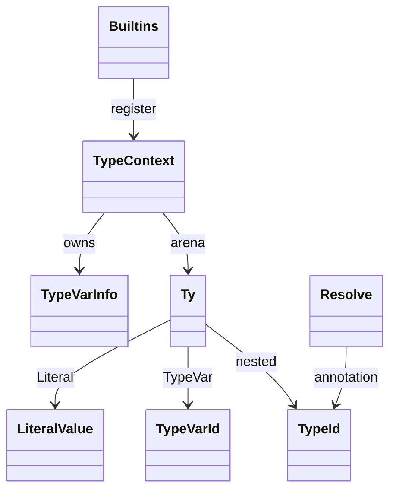
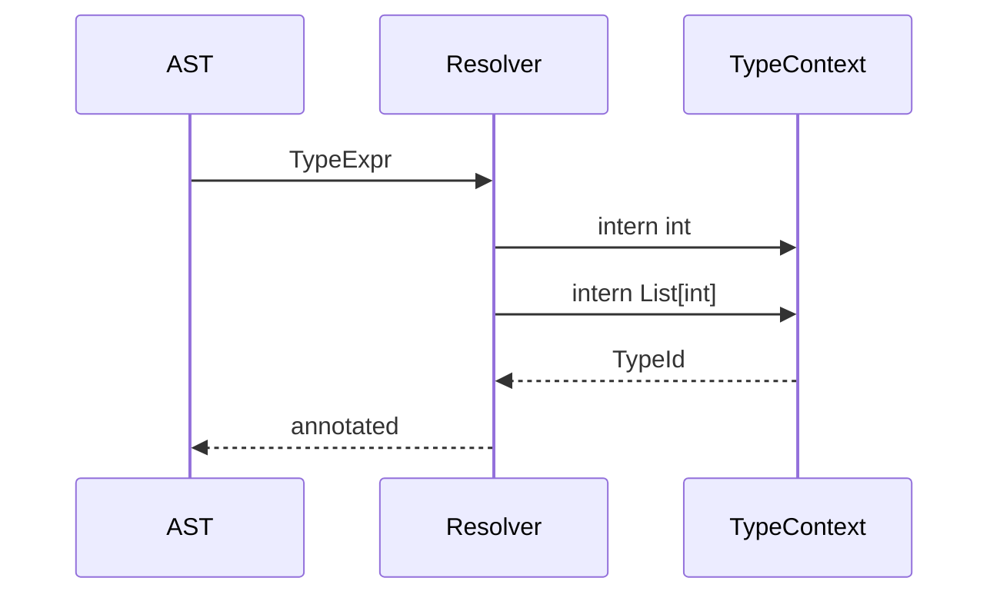
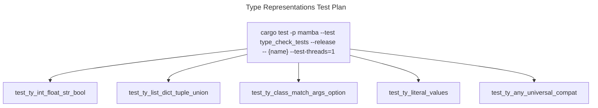

# Type Representations

`types/ty.rs` and `types/context.rs` define the core type IR. `Ty` is
the structural representation; `TypeId` indexes into a context-owned
arena so types can be interned and compared by ID. `TypeContext`
allocates `TypeId`s and tracks `TypeVarInfo` for inferred type
variables (`Infer(u32)`).

Three load-bearing invariants:

1. **`Ty::Any` is compatible with all types** — `Any` short-circuits
   subtype / unification checks. Removing this would force every
   dynamic operation through TypeError; `Any` is the escape hatch
   for gradually-typed Python code.
2. **`Ty::Class.match_args` is `Option<Vec<String>>`, NOT `Vec<String>`**
   — `None` means no explicit `__match_args__` (callers use field
   order); `Some(vec![])` means explicit empty (no positional
   matching allowed). The two are distinct cases per PEP 634.
3. **`Ty::Error` propagates** — type errors produce `Ty::Error`
   propagating through downstream checks; downstream handlers must
   check `is_error()` to suppress cascading reports.

## Type model
<!-- type: dependency lang: mermaid -->



## Type shape
<!-- type: schema lang: yaml -->

```yaml
$schema: "https://json-schema.org/draft/2020-12/schema"
$id: "type-repr-types"
$defs:
  Ty:
    description: "Core type IR — interned per TypeContext"
    oneOf:
      - { title: Never,    type: object, description: "bottom type — Ty::Never" }
      - { title: None,     type: object, description: "Ty::None — Python None type" }
      - { title: Bool,     type: object }
      - { title: Int,      type: object, description: "i64-shaped" }
      - { title: Float,    type: object }
      - { title: Str,      type: object }
      - { title: Any,      type: object, description: "compatible with everything (gradual typing escape)" }
      - title: List
        properties: { elem: { x-rust-type: TypeId } }
      - title: Dict
        properties: { key: { x-rust-type: TypeId }, value: { x-rust-type: TypeId } }
      - title: Tuple
        properties: { items: { type: array, items: { x-rust-type: TypeId } } }
      - title: Union
        properties: { variants: { type: array, items: { x-rust-type: TypeId } } }
      - title: Fn
        properties:
          params:   { type: array, items: { x-rust-type: TypeId } }
          ret:      { x-rust-type: TypeId }
          variadic: { type: boolean }
      - title: Class
        properties:
          name:       { type: string }
          fields:     { type: array, items: { type: array, description: "(name, TypeId)" } }
          match_args:
            oneOf:
              - { type: "null" }
              - { type: array, items: { type: string } }
            description: "None = fall back to field order; Some([]) = explicit empty"
      - title: Enum
        properties:
          name:     { type: string }
          variants: { type: array }
      - title: TypeVar
        properties: { id: { x-rust-type: TypeVarId } }
      - title: Literal
        properties: { values: { type: array, items: { x-rust-type: LiteralValue } } }
      - title: SelfType
        type: object
      - title: Infer
        properties: { id: { type: integer, x-rust-type: u32 } }
      - title: Error
        type: object
        description: "downstream checks ignore-and-propagate"
  LiteralValue:
    oneOf:
      - { title: Int,  properties: { value: { type: integer, x-rust-type: i64 } } }
      - { title: Str,  properties: { value: { type: string } } }
      - { title: Bool, properties: { value: { type: boolean } } }
```

## Type-arena lifecycle

```mermaid
---
id: type-arena-lifecycle
initial: Empty
nodes:
  Empty:        { kind: initial,  label: "TypeContext::new — arena empty except builtins" }
  Building:     { kind: normal,   label: "intern_ty allocates new TypeId or returns existing" }
  Stable:       { kind: normal,   label: "all module-level types interned; no further allocations expected" }
  Dropped:      { kind: terminal, label: "TypeContext drop releases arena" }
edges:
  - { from: Empty,    to: Building, event: "first intern_ty during type-check" }
  - { from: Building, to: Building, event: "interning during type-check" }
  - { from: Building, to: Stable,   event: "type-check pass complete" }
  - { from: Stable,   to: Dropped,  event: "module unload" }
---
stateDiagram-v2
    [*] --> Empty
    Empty --> Building: first intern
    Building --> Building: more interns
    Building --> Stable: pass complete
    Stable --> Dropped: unload
    Dropped --> [*]
```

<!-- type: state-machine lang: mermaid -->



## Interning logic

```mermaid
---
id: type-intern
entry: enter
nodes:
  enter:        { kind: start,    label: "TypeContext::intern_ty(Ty)" }
  hash_lookup:  { kind: decision, label: "hash(Ty) already in arena?" }
  return_existing: { kind: terminal, label: "return existing TypeId" }
  alloc_new:    { kind: process,  label: "push Ty into arena; TypeId = arena.len() - 1" }
  insert_index: { kind: process,  label: "hash → TypeId in lookup table" }
  done:         { kind: terminal, label: "return TypeId" }
edges:
  - { from: enter,        to: hash_lookup }
  - { from: hash_lookup,  to: return_existing, label: "hit" }
  - { from: hash_lookup,  to: alloc_new,       label: "miss" }
  - { from: alloc_new,    to: insert_index }
  - { from: insert_index, to: done }
---
flowchart TD
    enter([intern_ty]) --> hash_lookup{exists?}
    hash_lookup -->|hit| return_existing([existing TypeId])
    hash_lookup -->|miss| alloc_new[push to arena]
    alloc_new --> insert_index[hash to TypeId]
    insert_index --> done([new TypeId])
```

<!-- type: logic lang: mermaid -->



## Annotation interaction
<!-- type: interaction lang: mermaid -->



## Acceptance scenarios
<!-- type: scenarios lang: yaml -->

```yaml
scenarios:
  - id: type-annotations
    given: language/type_annotations.py declares int, List[str], and Optional[int] annotations
    when: Mamba resolves the annotations
    then: Ty::Int, Ty::List(Str), and Ty::Union(Int, None) are interned through TypeContext
  - id: match-args-default
    given: a dataclass Pt defines fields x and y without explicit __match_args__
    when: class type metadata is constructed
    then: Ty::Class stores match_args as None so positional matching uses field order
  - id: literal-type
    given: language/literal_type.py declares x as Literal[1, 2, 3]
    when: the annotation is resolved
    then: Ty::Literal stores LiteralValue::Int values for 1, 2, and 3
  - id: any-dynamic
    given: a value is annotated as Any and later receives dynamic operations
    when: subtype and unification checks run
    then: Ty::Any remains compatible with every type and does not produce a type-check error
```

## Tests
<!-- type: test-plan lang: mermaid -->



## Changes
<!-- type: changes lang: yaml -->

```yaml
changes:
  - file: crates/mamba/src/types/ty.rs
    action: modify
    impl_mode: hand-written
    description: "TypeId / TypeVarId newtypes; Ty enum (16 variants); LiteralValue. Hand-written; arena-interned types are the contract for downstream type-check + codegen."
  - file: crates/mamba/src/types/context.rs
    action: modify
    impl_mode: hand-written
    description: "TypeContext arena + intern_ty + TypeVarInfo. Hand-written."
```
