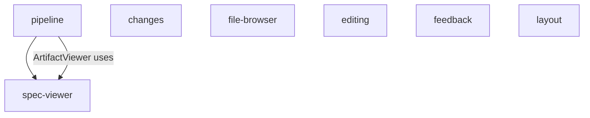

## Module Dependency Graph



## Package Contract

```yaml
package:
  name: "@cclab/ui"
  version: "0.1.0"
  type: module
  peerDependencies:
    react: ">=18"
    react-dom: ">=18"
    tailwindcss: ">=3"
  dependencies:
    lucide-react: "*"
    react-markdown: "*"
    remark-gfm: "*"
    js-yaml: "*"
    mermaid: "*"
    react-syntax-highlighter: "*"
    papaparse: "*"
    xlsx: "*"
  exports:
    "./spec-viewer": "./src/spec-viewer/index.ts"
    "./pipeline": "./src/pipeline/index.ts"
    "./changes": "./src/changes/index.ts"
    "./file-browser": "./src/file-browser/index.ts"
    "./editing": "./src/editing/index.ts"
    "./feedback": "./src/feedback/index.ts"
    "./layout": "./src/layout/index.ts"
```

## Module Map

```yaml
modules:
  spec-viewer:
    components: [SpecFileBrowser, MarkdownSpecRenderer, MermaidDiagram, OpenAPIViewer]
    description: "Spec file browsing and rendering"
  pipeline:
    components: [SpecPipelineHistory, RunEntry, ArtifactViewer]
    description: "Pipeline execution history and artifact viewing"
  changes:
    components: [ChangeList, CommentsSection]
    description: "Change tracking display"
  file-browser:
    components: [FileBrowser, FileTreeItem, FileViewer]
    description: "Repository file navigation and content viewing"
  editing:
    components: [InlineEditText, InlineEditSelect, InlineEditLabels, InlineEditDescription]
    description: "Inline editing controls"
  feedback:
    components: [SyncStatusBadge, ConfirmDialog, ConnectRepoForm]
    description: "Status indicators and confirmation dialogs"
  layout:
    components: [Header]
    description: "Generic layout components"
```

## Directory Structure

```yaml
structure:
  src/:
    spec-viewer/:
      - SpecFileBrowser.tsx
      - MarkdownSpecRenderer.tsx
      - MermaidDiagram.tsx
      - OpenAPIViewer.tsx
      - index.ts
    pipeline/:
      - SpecPipelineHistory.tsx
      - RunEntry.tsx
      - ArtifactViewer.tsx
      - index.ts
    changes/:
      - ChangeList.tsx
      - CommentsSection.tsx
      - index.ts
    file-browser/:
      - FileBrowser.tsx
      - FileTreeItem.tsx
      - FileViewer.tsx
      - index.ts
    editing/:
      - InlineEditText.tsx
      - InlineEditSelect.tsx
      - InlineEditLabels.tsx
      - InlineEditDescription.tsx
      - index.ts
    feedback/:
      - SyncStatusBadge.tsx
      - ConfirmDialog.tsx
      - ConnectRepoForm.tsx
      - index.ts
    layout/:
      - Header.tsx
      - index.ts
    index.ts: "barrel re-export all modules"
```
