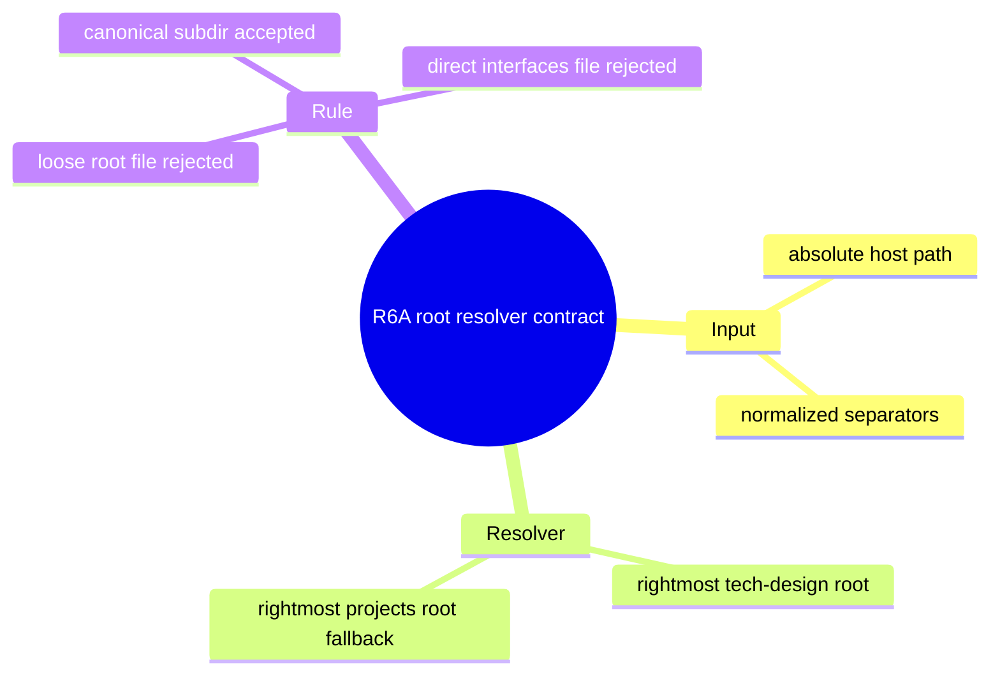
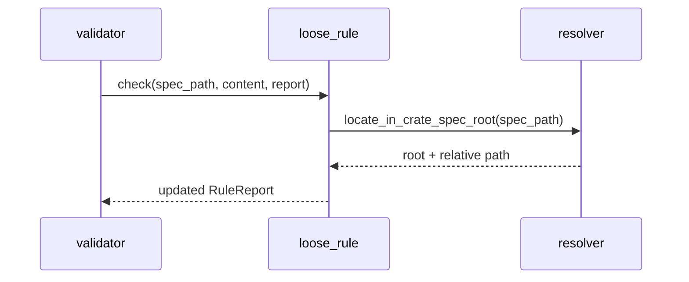
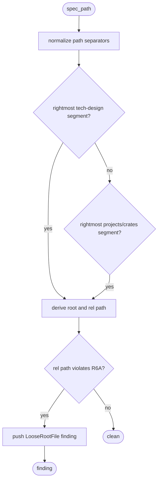
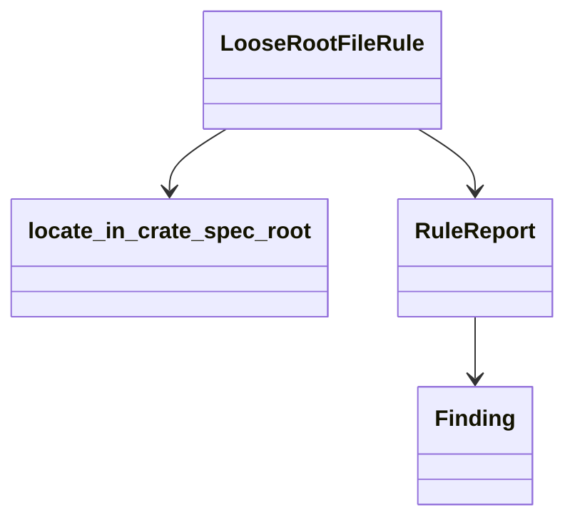
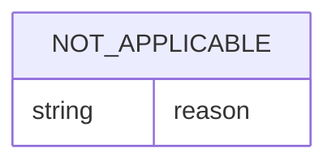

# R6A Absolute Host Path Root Detection

## Scenarios
<!-- type: scenarios lang: yaml -->

```yaml
id: r6a-absolute-host-path-scenarios
scenarios:
  - id: S1
    title: "absolute host path uses inner project segment"
    given:
      - "/Users/chrischeng/projects/cclab/project-aw/projects/agentic-workflow/tech-design/core/state.md"
      - "the host prefix contains an unrelated projects segment before the checkout"
    when:
      - "LooseRootFileRule checks the path"
    then:
      - "locate_in_crate_spec_root returns root agentic-workflow/core"
      - "the relative path is state.md"
      - "R6A emits one loose_root_file finding"
  - id: S2
    title: "absolute host path under canonical subdir remains accepted"
    given:
      - "/Users/chrischeng/projects/cclab/project-aw/projects/agentic-workflow/tech-design/core/logic/state.md"
    when:
      - "LooseRootFileRule checks the path"
    then:
      - "locate_in_crate_spec_root returns root agentic-workflow/core"
      - "the relative path is logic/state.md"
      - "R6A emits no finding"
  - id: S3
    title: "absolute host path directly under interfaces is still rejected"
    given:
      - "/Users/chrischeng/projects/cclab/project-aw/projects/agentic-workflow/tech-design/core/interfaces/commands.md"
    when:
      - "LooseRootFileRule checks the path"
    then:
      - "locate_in_crate_spec_root returns root agentic-workflow/core"
      - "the relative path is interfaces/commands.md"
      - "R6A emits one loose_root_file finding"
```
## Contract Map
<!-- type: mindmap lang: mermaid -->


## Contract State
<!-- type: state-machine lang: mermaid -->

```mermaid
---
id: r6a-absolute-host-path-contract-state
initial: normalize
nodes:
  normalize: { kind: initial, label: "normalize path" }
  root: { kind: normal, label: "select rightmost TD root" }
  relative: { kind: normal, label: "derive relative path" }
  evaluate: { kind: normal, label: "evaluate R6A" }
  terminal: { kind: terminal, label: "RuleReport updated" }
edges:
  - { from: normalize, to: root, event: "path segments ready" }
  - { from: root, to: relative, event: "root selected" }
  - { from: relative, to: evaluate, event: "rel path available" }
  - { from: evaluate, to: terminal, event: "finding or clean" }
---
stateDiagram-v2
    [*] --> root
    root --> relative
    relative --> evaluate
    evaluate --> terminal
```
## Contract Interaction
<!-- type: interaction lang: mermaid -->


## Contract Logic
<!-- type: logic lang: mermaid -->


## Contract Dependency
<!-- type: dependency lang: mermaid -->


## Contract Data Model
<!-- type: db-model lang: mermaid -->


## Contract Schema
<!-- type: schema lang: yaml -->

```yaml
not_applicable:
  reason: "No data schema contract is introduced by this path resolver fix."
```
## Contract REST API
<!-- type: rest-api lang: yaml -->

```yaml
not_applicable:
  reason: "No REST API contract is introduced by this path resolver fix."
```
## Contract RPC API
<!-- type: rpc-api lang: yaml -->

```yaml
not_applicable:
  reason: "No RPC API contract is introduced by this path resolver fix."
```
## Contract Async API
<!-- type: async-api lang: yaml -->

```yaml
not_applicable:
  reason: "No async API contract is introduced by this path resolver fix."
```
## Contract CLI
<!-- type: cli lang: yaml -->

```yaml
not_applicable:
  reason: "No CLI surface changes; verification is through Rust rule tests."
```
## Contract Wireframe
<!-- type: wireframe lang: yaml -->

```yaml
not_applicable:
  reason: "No UI wireframe is introduced by this path resolver fix."
```
## Contract Component
<!-- type: component lang: yaml -->

```yaml
not_applicable:
  reason: "No UI component contract is introduced by this path resolver fix."
```
## Contract Design Token
<!-- type: design-token lang: yaml -->

```yaml
not_applicable:
  reason: "No design token contract is introduced by this path resolver fix."
```
## Contract Config
<!-- type: config lang: yaml -->

```yaml
not_applicable:
  reason: "No config contract is introduced by this path resolver fix."
```
## Contract Manifest
<!-- type: manifest lang: yaml -->

```yaml
not_applicable:
  reason: "No package manifest contract is introduced by this path resolver fix."
```
## Contract Runtime Image
<!-- type: runtime-image lang: yaml -->

```yaml
not_applicable:
  reason: "No runtime image contract is introduced by this path resolver fix."
```
## Contract Deployment
<!-- type: deployment lang: yaml -->

```yaml
not_applicable:
  reason: "No deployment contract is introduced by this path resolver fix."
```
## Contract Test Plan
<!-- type: test-plan lang: mermaid -->

```mermaid
---
id: r6a-absolute-host-path-contract-test-plan
---
requirementDiagram
    requirement R1 {
      id: R1
      text: "Absolute host paths with an earlier projects segment resolve against the inner project TD root"
      risk: medium
      verifymethod: test
    }

    element T1 {
      type: test
      name: "absolute_host_projects_prefix_uses_inner_project_root"
    }

    element T2 {
      type: test
      name: "absolute_host_projects_prefix_keeps_canonical_subdir_clean"
    }

    element T3 {
      type: test
      name: "absolute_host_projects_prefix_rejects_direct_interfaces_file"
    }

    T1 - verifies -> R1
    T2 - verifies -> R1
    T3 - verifies -> R1
```
## Changes
<!-- type: changes lang: yaml -->

```yaml
changes:
  - path: projects/agentic-workflow/src/validate/rules/r6a_loose_root_file.rs
    action: modify
    section: logic
    impl_mode: hand-written
    description: "Add regression tests for absolute host paths with an unrelated earlier projects segment. If any test fails, repair locate_in_crate_spec_root to prefer the inner project TD root."
  - path: projects/agentic-workflow/tech-design/core/validate/source/projects-sdd-src-validate-rules-r6a_loose_root_file-rs.md
    action: modify
    section: source
    impl_mode: codegen
    description: "Refresh the semantic source projection for r6a_loose_root_file.rs after source changes."
```
## Contract Tests
<!-- type: tests lang: yaml -->

```yaml
tests:
  - id: absolute_host_projects_prefix_uses_inner_project_root
    file: projects/agentic-workflow/src/validate/rules/r6a_loose_root_file.rs
    command: cargo test -p agentic-workflow absolute_host_projects_prefix_uses_inner_project_root
    verifies: [S1, R1]
  - id: absolute_host_projects_prefix_keeps_canonical_subdir_clean
    file: projects/agentic-workflow/src/validate/rules/r6a_loose_root_file.rs
    command: cargo test -p agentic-workflow absolute_host_projects_prefix_keeps_canonical_subdir_clean
    verifies: [S2, R1]
  - id: absolute_host_projects_prefix_rejects_direct_interfaces_file
    file: projects/agentic-workflow/src/validate/rules/r6a_loose_root_file.rs
    command: cargo test -p agentic-workflow absolute_host_projects_prefix_rejects_direct_interfaces_file
    verifies: [S3, R1]
```

# Reviews

### Review 1
**Verdict:** approved

- [scenarios] The contract covers the regression path, accepted canonical subdir, and rejected direct interfaces path.
- [logic] The resolver contract is unambiguous: normalize path, prefer the rightmost tech-design root, then fall back to the rightmost projects/crates root.
- [test-plan] The three named Rust tests map directly to the scenario outcomes and requirement.
- [changes] The implementation scope is bounded to the R6A rule source and semantic projection refresh.
