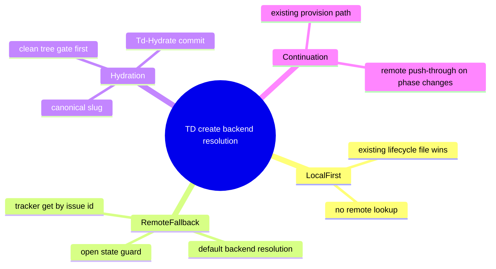
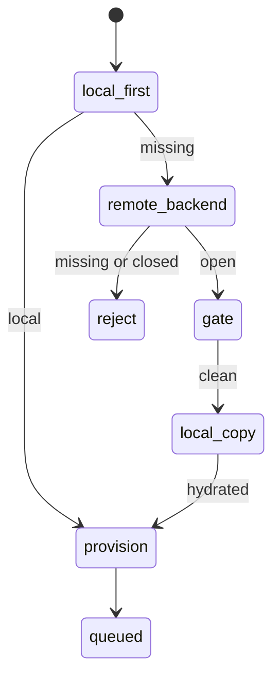
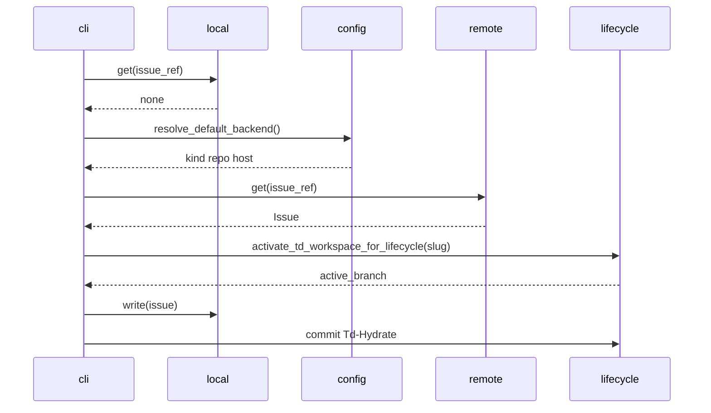
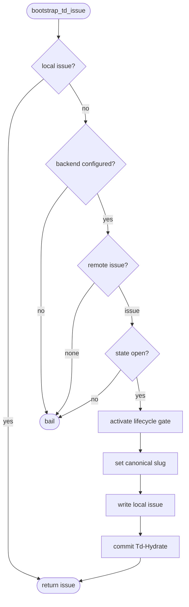
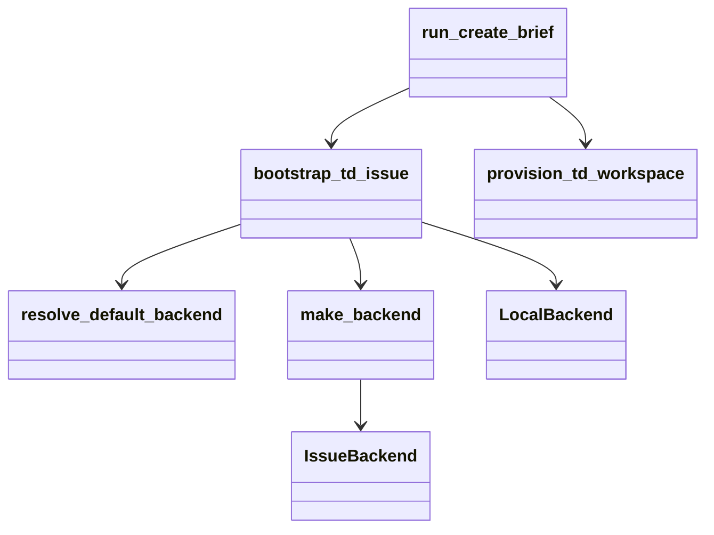
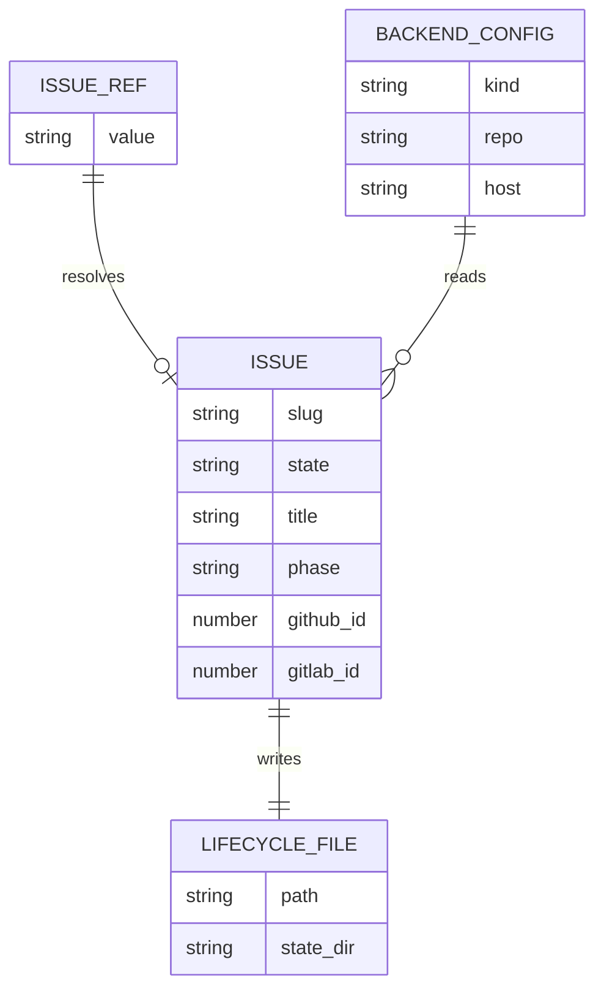

# Remote Work-Item TD Hydration

## Scenarios
<!-- type: scenarios lang: yaml -->

```yaml
id: remote-backed-td-create-contract-scenarios
scenarios:
  - id: S1
    title: "configured backend fallback hydrates remote issue"
    given:
      - "LocalBackend::get(issue_ref) returns none"
      - "resolve_default_backend returns github or gitlab"
      - "remote IssueBackend::get(issue_ref) returns an open issue"
    when:
      - "run_create_brief starts"
    then:
      - "the remote issue is written to LocalBackend with tracker id as slug"
      - "a Td-Hydrate commit records backend, issue ref, and active branch"
      - "provision_td_workspace continues with the hydrated local issue"
  - id: S2
    title: "local issue remains first-class"
    given:
      - "LocalBackend::get(issue_ref) returns an issue"
    when:
      - "run_create_brief starts"
    then:
      - "no configured backend lookup is attempted"
      - "existing in-place and td branch behavior remains unchanged"
  - id: S3
    title: "remote closed issue fails before write"
    given:
      - "remote IssueBackend::get(issue_ref) returns state closed"
    when:
      - "bootstrap_td_issue evaluates the issue"
    then:
      - "the command returns a state-open error"
      - "no local lifecycle file is written"
```
## Contract Map
<!-- type: mindmap lang: mermaid -->


## Contract State
<!-- type: state-machine lang: mermaid -->


## Contract Interaction
<!-- type: interaction lang: mermaid -->


## Contract Logic
<!-- type: logic lang: mermaid -->


## Contract Dependency
<!-- type: dependency lang: mermaid -->


## Contract Data Model
<!-- type: db-model lang: mermaid -->


## Contract Schema
<!-- type: schema lang: yaml -->

```yaml
schemas:
  BootstrapTdIssueInput:
    type: object
    required: [project_root, issue_ref]
    properties:
      project_root:
        type: string
      issue_ref:
        type: string
  BootstrapTdIssueOutput:
    type: object
    required: [slug, state, source]
    properties:
      slug:
        type: string
      state:
        type: string
        enum: [open]
      source:
        type: string
        enum: [local, remote]
```
## REST API
<!-- type: rest-api lang: yaml -->

```yaml
openapi: 3.1.0
info:
  title: Internal TD Bootstrap Contract
  version: "0.1.0"
paths: {}
components:
  schemas:
    BootstrapTdIssueOutput:
      type: object
      required: [slug, source]
      properties:
        slug:
          type: string
        source:
          type: string
          enum: [local, remote]
```
## RPC API
<!-- type: rpc-api lang: yaml -->

```yaml
openrpc: 1.3.2
info:
  title: TD Bootstrap Internal RPC Contract
  version: "0.1.0"
methods:
  - name: td.bootstrapIssue
    params:
      - name: issue_ref
        schema:
          type: string
    result:
      name: issue
      schema:
        type: object
        properties:
          slug:
            type: string
          source:
            type: string
```
## Async API
<!-- type: async-api lang: yaml -->

```yaml
asyncapi: 2.6.0
info:
  title: TD Bootstrap Lifecycle Events
  version: "0.1.0"
channels:
  td.lifecycle.hydrate:
    publish:
      message:
        name: TdHydrateCommitted
        payload:
          type: object
          properties:
            slug:
              type: string
            issue_backend:
              type: string
```
## CLI Contract
<!-- type: cli lang: yaml -->

```yaml
commands:
  - name: aw td create
    arguments:
      - name: slug
        required: true
    local_first_resolution:
      enabled: true
    remote_fallback:
      enabled: true
      configured_by: ".aw/config.toml"
    hydration_commit:
      stage: Td-Hydrate
```
## Wireframe
<!-- type: wireframe lang: yaml -->

```yaml
screens:
  - id: td-create-output
    elements:
      - id: issue-line
        text: "Issue: <slug> (<title>)"
      - id: workspace-line
        text: "Workspace: <path> (branch <branch>)"
      - id: issue-file-line
        text: "Issue file: .aw/issues/open/<slug>.md"
      - id: next-payload
        text: "Next section payload: <path>"
```
## Component Contract
<!-- type: component lang: yaml -->

```yaml
components:
  - name: BootstrapTdIssue
    inputs:
      issue_ref:
        type: string
      project_root:
        type: path
    outputs:
      issue:
        type: Issue
      source:
        type: string
        values: [local, remote]
```
## Design Tokens
<!-- type: design-token lang: yaml -->

```yaml
tokens:
  lifecycle.stage.tdHydrate:
    value: "Td-Hydrate"
    type: string
  lifecycle.trailer.issueBackend:
    value: "Issue-Backend"
    type: string
  lifecycle.trailer.issueRef:
    value: "Issue-Ref"
    type: string
```
## Config Contract
<!-- type: config lang: yaml -->

```yaml
type: object
properties:
  agentic_workflow:
    type: object
    oneOf:
      - required: [issue_platform]
      - required: [repo_platform]
    properties:
      issue_platform:
        type: object
        properties:
          type:
            type: string
            enum: [github, gitlab]
          repo:
            type: string
          host:
            type: string
```
## Manifest
<!-- type: manifest lang: yaml -->

```yaml
crate: agentic-workflow
source:
  - projects/agentic-workflow/src/cli/td.rs
interfaces:
  - IssueBackend
  - LocalBackend
config:
  - resolve_default_backend
```
## Runtime Image
<!-- type: runtime-image lang: yaml -->

```yaml
runtime:
  binaries:
    - aw
    - git
    - gh
  permissions:
    filesystem:
      - ".aw/issues"
      - ".aw/tech-design"
    network:
      - "configured issue backend read"
      - "configured issue backend update"
```
## Deployment
<!-- type: deployment lang: yaml -->

```yaml
deployment:
  kind: local-cli
  rollout_checks:
    - "cargo test -p agentic-workflow td_create"
    - "aw td create <remote-open-issue-id>"
  compatibility:
    local_issues:
      behavior: unchanged
    remote_issues:
      behavior: hydrated_on_first_td_entry
```
## Test Plan
<!-- type: test-plan lang: mermaid -->

```mermaid
---
id: remote-backed-td-create-contract-test-plan
---
requirementDiagram
    requirement R1 {
        id: R1
        text: "remote ids resolve through configured backend"
        risk: high
        verifymethod: test
    }
    requirement R2 {
        id: R2
        text: "hydration happens after lifecycle gate"
        risk: high
        verifymethod: test
    }
    requirement R3 {
        id: R3
        text: "local flow unchanged"
        risk: medium
        verifymethod: test
    }
    test_case T1 {
        id: T1
        text: "cargo test -p agentic-workflow td_create"
        verifymethod: test
    }
    test_case T2 {
        id: T2
        text: "live aw td create 3698"
        verifymethod: test
    }
    R1 - verifies -> T2
    R2 - verifies -> T2
    R3 - verifies -> T1
```
## Changes
<!-- type: changes lang: yaml -->

```yaml
changes:
  - path: projects/agentic-workflow/src/cli/td.rs
    action: modify
    section: source
    implementation:
      mode: codegen
      function: bootstrap_td_issue
    checks:
      - "local lookup remains first"
      - "configured backend fallback hydrates open tracker issues"
      - "closed tracker issues fail before local write"
  - path: .aw/tech-design/projects/agentic-workflow/specs/3698.md
    action: create
    section: source
    implementation:
      mode: codegen
      purpose: "TD contract for issue 3698"
```
## Tests
<!-- type: tests lang: yaml -->

```yaml
tests:
  - id: td-create-local-regression
    command: cargo test -p agentic-workflow td_create
    expected: pass
  - id: phase-regression
    command: cargo test -p agentic-workflow phase_migration_test
    expected: pass
  - id: live-remote-hydration
    command: aw td create 3698
    expected: "brief emitted with .aw/issues/open/3698.md"
```

# Reviews

### Review 1
**Verdict:** approved

- [scenarios] Local-first, remote-fallback, and closed-remote paths cover the lifecycle boundary without changing existing local issue behavior.
- [logic] The gate-before-hydrate ordering is explicit enough to preserve clean-tree lifecycle semantics.
- [changes] The implementation target, hydration commit trail, and verification expectations are concrete and bounded.
