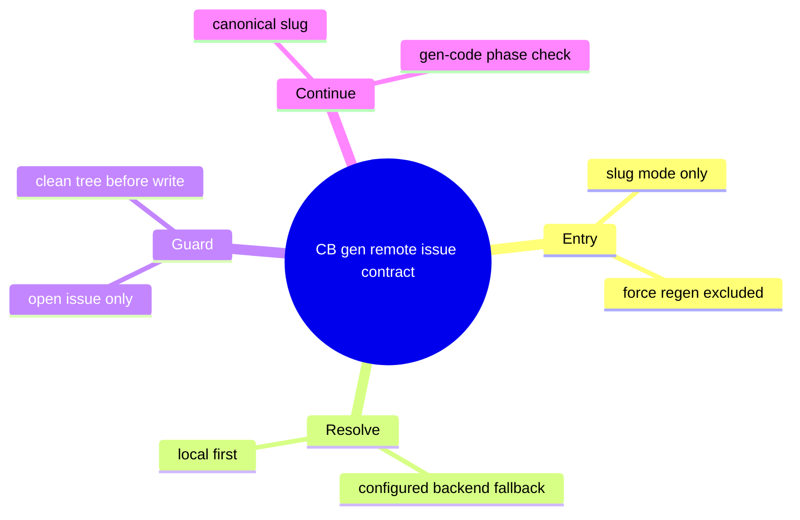
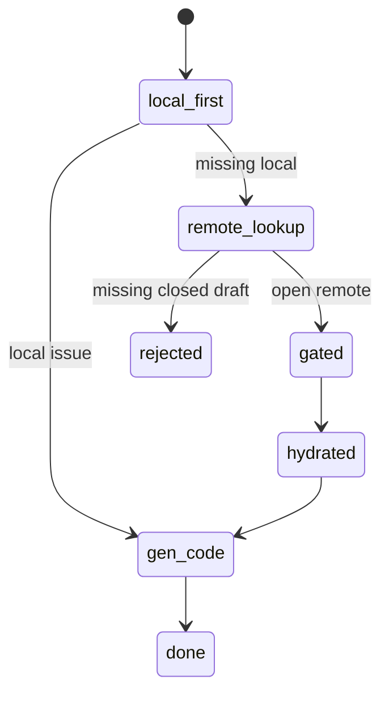
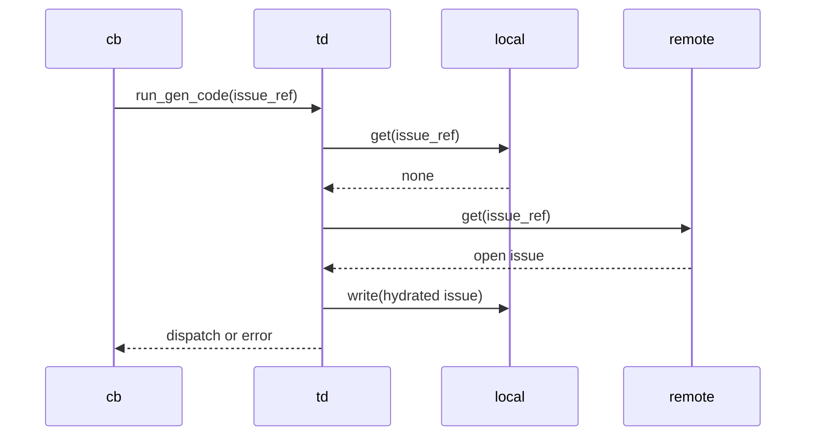
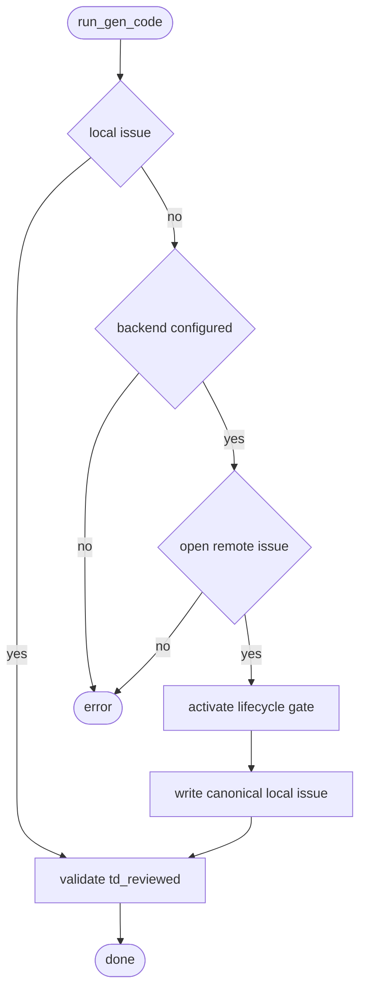
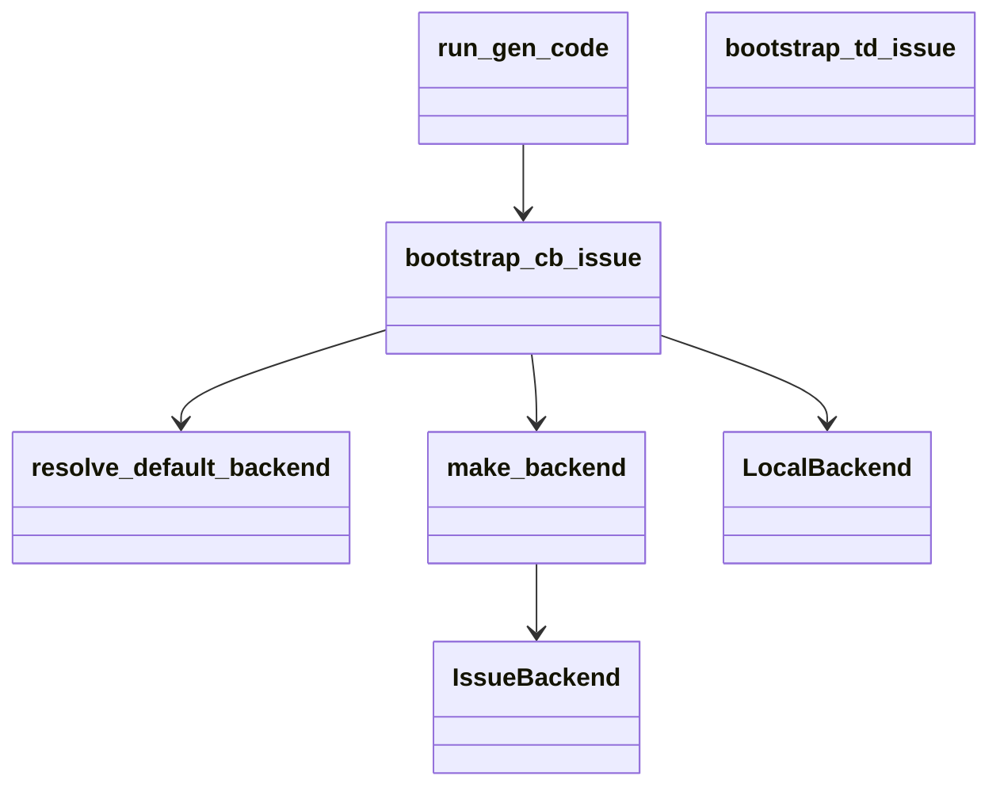
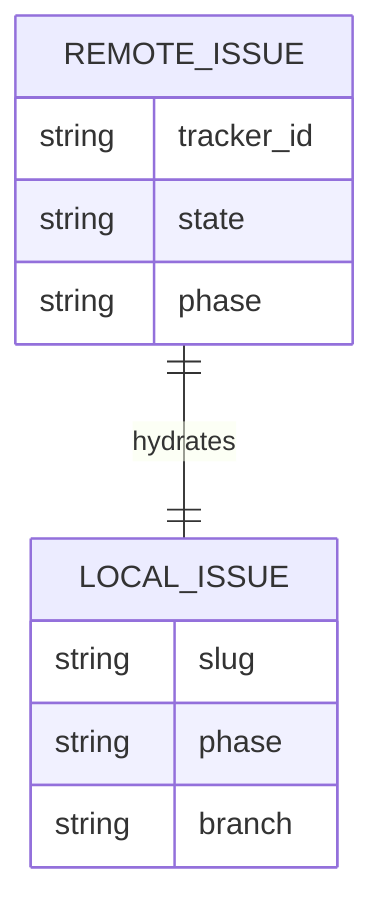

# Remote Work-Item CB Generation Hydration

## Contract Scenarios
<!-- type: scenarios lang: yaml -->

```yaml
id: remote-backed-cb-gen-contract-scenarios
scenarios:
  - id: S1
    title: "hydrate configured backend issue before CB phase validation"
    given:
      - "slug-mode CB generation receives issue_ref"
      - "the local lifecycle backend has no matching issue"
      - "the configured backend returns an open issue with phase td_reviewed"
    when:
      - "the hydration helper runs"
    then:
      - "the helper writes a local issue copy using the tracker id slug"
      - "gen-code phase validation observes td_reviewed"
      - "existing dispatch behavior continues"
  - id: S2
    title: "local lifecycle state bypasses remote hydration"
    given:
      - "the local lifecycle backend returns an issue"
    when:
      - "slug-mode CB generation starts"
    then:
      - "the configured backend is not required"
      - "phase validation remains local"
  - id: S3
    title: "non-open remote issue is rejected atomically"
    given:
      - "the configured backend returns state closed or draft"
    when:
      - "hydration evaluates the remote issue"
    then:
      - "the command returns a state error"
      - "no new local issue file is written"
```
## Contract Map
<!-- type: mindmap lang: mermaid -->


## Contract State
<!-- type: state-machine lang: mermaid -->


## Contract Interaction
<!-- type: interaction lang: mermaid -->


## Contract Logic
<!-- type: logic lang: mermaid -->


## Contract Dependency
<!-- type: dependency lang: mermaid -->


## Contract Data Model
<!-- type: db-model lang: mermaid -->


## Contract Schema
<!-- type: schema lang: yaml -->

```yaml
definitions:
  HydratedCbIssue:
    type: object
    required: [slug, phase, state]
    properties:
      slug: { type: string }
      phase: { type: string, enum: [td_reviewed] }
      state: { type: string, enum: [open] }
```
## Contract REST API
<!-- type: rest-api lang: yaml -->

```yaml
openapi: 3.1.0
info: { title: "CB gen hydration REST contract", version: "0.0.0" }
paths: {}
```
## Contract RPC API
<!-- type: rpc-api lang: yaml -->

```yaml
openrpc: 1.3.2
info: { title: "CB gen hydration RPC contract", version: "0.0.0" }
methods: []
```
## Contract Async API
<!-- type: async-api lang: yaml -->

```yaml
asyncapi: 2.6.0
info: { title: "CB gen hydration async contract", version: "0.0.0" }
channels: {}
```
## Contract CLI
<!-- type: cli lang: yaml -->

```yaml
commands:
  - name: aw
    subcommands:
      - name: cb
        subcommands:
          - name: gen
            args:
              - { name: slug, required: true, type: string }
            guarantees:
              - "local issue lookup remains first"
              - "configured backend fallback hydrates open remote issues"
              - "non-open remote issues fail before local writes"
```
## Contract Wireframe
<!-- type: wireframe lang: yaml -->

```yaml
layout: { kind: none, reason: "CLI-only change." }
```
## Contract Component
<!-- type: component lang: yaml -->

```yaml
schemaVersion: "1.0.0"
modules: []
```
## Contract Design Tokens
<!-- type: design-token lang: yaml -->

```yaml
tokens: {}
```
## Contract Config
<!-- type: config lang: yaml -->

```yaml
type: object
additionalProperties: true
description: "Uses existing backend configuration only."
```
## Contract Manifest
<!-- type: manifest lang: yaml -->

```yaml
cargo:
  dependencies: []
  dev_dependencies: []
```
## Contract Runtime Image
<!-- type: runtime-image lang: yaml -->

```yaml
images: []
```
## Contract Deployment
<!-- type: deployment lang: yaml -->

```yaml
manifests: []
```
## Contract Test Plan
<!-- type: test-plan lang: mermaid -->

```mermaid
---
id: remote-backed-cb-gen-contract-tests
requirements:
  R1: { id: R1, text: "Remote td_reviewed issues hydrate before CB generation", kind: functional, risk: high, verify: test }
  R2: { id: R2, text: "Local issue behavior remains first", kind: regression, risk: medium, verify: test }
  R3: { id: R3, text: "Non-open remote issues are rejected before writes", kind: functional, risk: high, verify: test }
tests:
  cb_gen_remote_issue_hydrates: { verifies: [R1], kind: integration }
  cb_gen_local_issue_still_first: { verifies: [R2], kind: integration }
  cb_gen_remote_closed_issue_rejected: { verifies: [R3], kind: integration }
---
requirementDiagram
    requirement R1 {
      id: R1
      text: "remote hydration"
      risk: high
      verifymethod: test
    }
    requirement R2 {
      id: R2
      text: "local first"
      risk: medium
      verifymethod: test
    }
    requirement R3 {
      id: R3
      text: "reject non-open"
      risk: high
      verifymethod: test
    }
    element cb_gen_remote_issue_hydrates {
      type: test
    }
    element cb_gen_local_issue_still_first {
      type: test
    }
    element cb_gen_remote_closed_issue_rejected {
      type: test
    }
    cb_gen_remote_issue_hydrates - verifies -> R1
    cb_gen_local_issue_still_first - verifies -> R2
    cb_gen_remote_closed_issue_rejected - verifies -> R3
```
## Contract Changes
<!-- type: changes lang: yaml -->

```yaml
changes:
  - path: projects/agentic-workflow/src/cli/td.rs
    action: modify
    impl_mode: hand-written
    section: source
    description: "Expose or add a CB-safe remote issue bootstrap before gen-code local issue lookup."
  - path: projects/agentic-workflow/tests/cli_tests.rs
    action: modify
    impl_mode: hand-written
    section: tests
    description: "Add CB gen remote hydration regressions."
```
## Contract Tests
<!-- type: tests lang: yaml -->

```yaml
tests:
  - name: cb_gen_remote_issue_hydrates
    command: "cargo test -p agentic-workflow cb_gen_remote_issue_hydrates"
  - name: cb_gen_local_issue_still_first
    command: "cargo test -p agentic-workflow cb_gen_local_issue_still_first"
  - name: cb_gen_remote_closed_issue_rejected
    command: "cargo test -p agentic-workflow cb_gen_remote_closed_issue_rejected"
```

# Reviews

### Review 1
**Verdict:** approved

- [scenarios] The contract covers remote td_reviewed hydration, local-first behavior, and atomic rejection for non-open remote issues.
- [logic] The clean lifecycle gate is placed before local writes, which preserves project-branch safety.
- [changes] The implementation target is narrowed to `run_gen_code` hydration and regression tests, with force-regen and spec reconstruction explicitly excluded.
