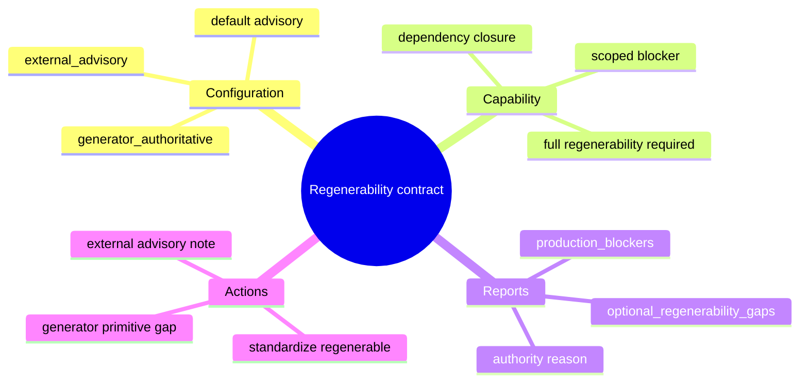
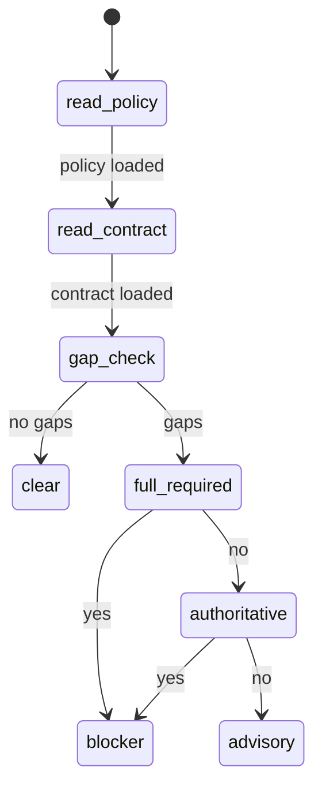
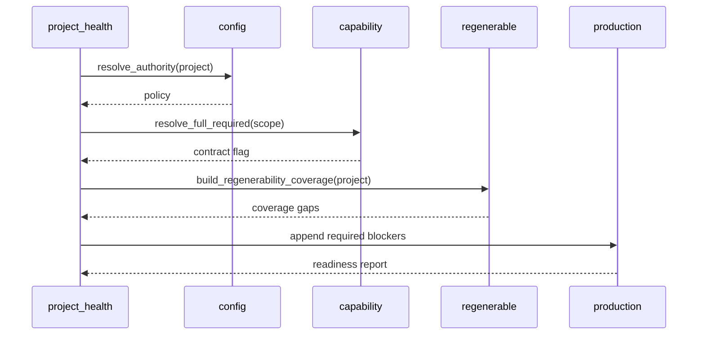
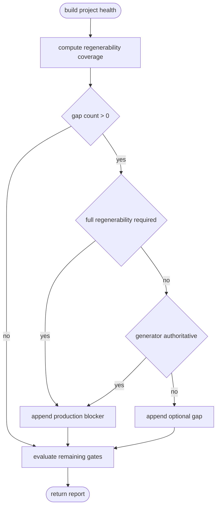
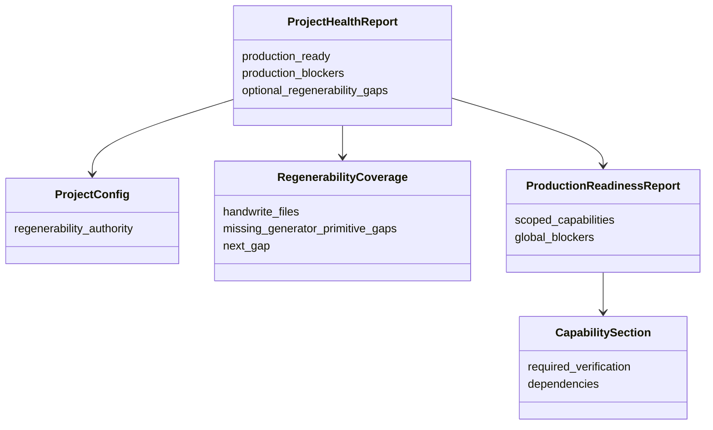
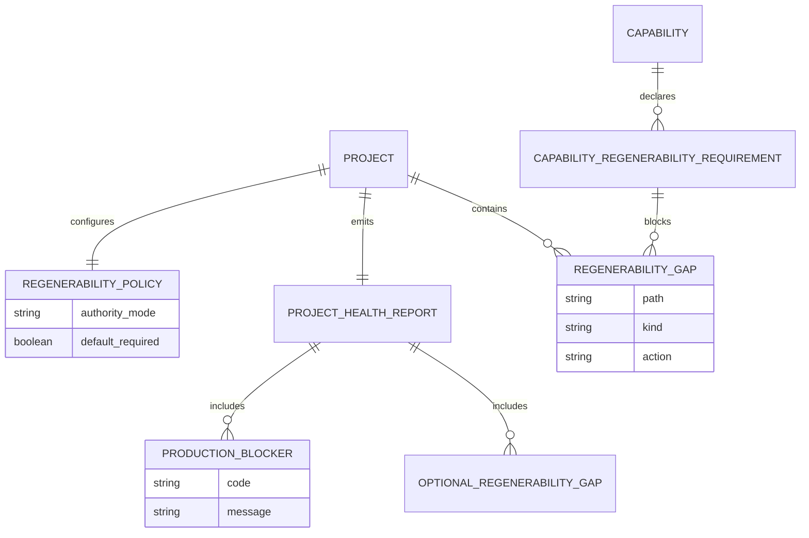

# Regenerability Authority Policy

## Contract Scenarios
<!-- type: scenarios lang: yaml -->

```yaml
id: regenerability-authority-contract-scenarios
scenarios:
  - id: C1
    title: "authoritative gaps are production blockers"
    given:
      - "project config marks the project as generator_authoritative"
      - "regenerability coverage reports handwrite_files or missing_generator_primitive_gaps"
    when:
      - "project health composes production blockers"
    then:
      - "production_ready is false"
      - "production_blockers includes a regenerability blocker"
      - "next_gap remains actionable for standardize regenerable work"
  - id: C2
    title: "external gaps remain advisory"
    given:
      - "project config omits generator authority or marks external_advisory"
      - "required governance, CB, semantic, dirty, and test gates are clean"
      - "regenerability coverage still reports handwrite gaps"
    when:
      - "project health composes production blockers"
    then:
      - "production_ready can be true"
      - "optional_regenerability_gaps lists the remaining maturity work"
      - "the report states generator strengthening is outside this checkout"
  - id: C3
    title: "capability contract overrides project default"
    given:
      - "a scoped capability requires full regenerability"
      - "the project is otherwise external_advisory"
      - "regenerability gaps remain in that scoped path"
    when:
      - "production readiness is evaluated for that capability scope"
    then:
      - "the capability production_ready is false"
      - "unrelated capability scopes do not inherit the blocker"
```
## Contract Mindmap
<!-- type: mindmap lang: mermaid -->


## Contract State Machine
<!-- type: state-machine lang: mermaid -->


## Contract Interaction
<!-- type: interaction lang: mermaid -->


## Contract Logic
<!-- type: logic lang: mermaid -->


## Contract Dependency
<!-- type: dependency lang: mermaid -->


## Contract Data Model
<!-- type: db-model lang: mermaid -->


## Contract Schema
<!-- type: schema lang: yaml -->

```yaml
$schema: "https://json-schema.org/draft/2020-12/schema"
$id: "aw.regenerability-authority-contract"
definitions:
  RegenerabilityAuthority:
    type: string
    enum:
      - generator_authoritative
      - external_advisory
  RegenerabilityAuthorityReport:
    type: object
    required:
      - authority
      - required_for_production
      - gap_count
      - reason
    properties:
      authority:
        $ref: "#/definitions/RegenerabilityAuthority"
      required_for_production:
        type: boolean
      gap_count:
        type: integer
        minimum: 0
      reason:
        type: string
      blockers:
        type: array
        items:
          type: string
      advisory_gaps:
        type: array
        items:
          type: string
  ProjectHealthReportExtension:
    type: object
    properties:
      regenerability_authority:
        $ref: "#/definitions/RegenerabilityAuthorityReport"
      optional_regenerability_gaps:
        type: array
        items:
          type: string
```
## Contract REST API
<!-- type: rest-api lang: yaml -->

```yaml
openapi: 3.1.0
info:
  title: Regenerability Authority Contract REST Surface
  version: "0.0.0"
paths: {}
x-aw-contract:
  rest_api_required: false
  public_surface: "existing CLI only"
```
## Contract RPC API
<!-- type: rpc-api lang: yaml -->

```yaml
openrpc: 1.3.2
info:
  title: Regenerability Authority Contract RPC Surface
  version: "0.0.0"
methods: []
x-aw-contract:
  rpc_api_required: false
  public_surface: "existing CLI JSON reports only"
```
## Contract Async API
<!-- type: async-api lang: yaml -->

```yaml
asyncapi: "2.6.0"
info:
  title: Regenerability Authority Contract Async Surface
  version: "0.0.0"
channels: {}
x-aw-contract:
  async_api_required: false
  event_surface: "none"
```
## Contract CLI
<!-- type: cli lang: yaml -->

```yaml
commands:
  aw project health:
    json_contract:
      add_fields:
        regenerability_authority:
          type: object
          fields:
            authority: "generator_authoritative|external_advisory"
            required_for_production: "boolean"
            gap_count: "integer"
            reason: "string"
        optional_regenerability_gaps:
          type: array
          item: string
      production_rule:
        - "if regenerability_authority.required_for_production and gap_count > 0 then production_ready=false"
        - "otherwise optional_regenerability_gaps does not block production readiness"
    text_contract:
      - "prints whether regenerability is required or advisory"
      - "prints why the mode was selected"
  aw standardize regenerable report:
    json_contract:
      add_fields:
        authority_mode: "generator_authoritative|external_advisory"
        required_for_production: "boolean"
        authority_reason: "string"
  aw run:
    completion_rule:
      - "project root cannot complete while required regenerability blockers remain"
```
## Contract Wireframe
<!-- type: wireframe lang: yaml -->

```yaml
layout:
  surfaces:
    - id: project-health-json
      kind: json-report
      fields:
        - production_ready
        - production_blockers
        - regenerability_authority
        - optional_regenerability_gaps
    - id: project-health-text
      kind: terminal-report
      rows:
        - label: "regenerability"
          value: "required|advisory"
        - label: "authority"
          value: "generator_authoritative|external_advisory"
        - label: "reason"
          value: "selected policy reason"
```
## Contract Component
<!-- type: component lang: yaml -->

```yaml
customElements:
  schemaVersion: "1.0.0"
  modules: []
x-aw-components:
  report_blocks:
    - name: RegenerabilityAuthorityBlock
      kind: terminal-json-shape
      attributes:
        authority: "generator_authoritative|external_advisory"
        required_for_production: "boolean"
        gap_count: "number"
        reason: "string"
      events: []
  browser_component_required: false
```
## Contract Design Token
<!-- type: design-token lang: yaml -->

```yaml
tokens:
  regenerability.authority.generator_authoritative:
    $type: string
    $value: "generator_authoritative"
  regenerability.authority.external_advisory:
    $type: string
    $value: "external_advisory"
  regenerability.production.required:
    $type: string
    $value: "required_for_production"
  regenerability.production.advisory:
    $type: string
    $value: "advisory_maturity"
```
## Contract Config
<!-- type: config lang: yaml -->

```yaml
$schema: "https://json-schema.org/draft/2020-12/schema"
$id: "aw.project.regenerability-authority-config-contract"
type: object
properties:
  regenerability:
    type: object
    properties:
      authority:
        type: string
        enum: [generator_authoritative, external_advisory]
      full_required:
        type: boolean
      reason:
        type: string
    additionalProperties: false
defaults:
  authority: external_advisory
  full_required: false
authoritative_projects:
  - agentic-workflow
compatibility:
  - "Missing config keeps external advisory behavior."
  - "Capability contract may still require full regenerability for scoped readiness."
```
## Contract Manifest
<!-- type: manifest lang: yaml -->

```yaml
package_manifests:
  cargo:
    path: projects/agentic-workflow/Cargo.toml
    dependency_changes: []
    feature_changes: []
compatibility:
  dependency_update_required: false
  reason: "Uses existing serde/clap/reporting dependencies."
```
## Contract Runtime Image
<!-- type: runtime-image lang: yaml -->

```yaml
runtime_image:
  required: false
  build_context: null
  dockerfile: null
  reason: "Local CLI/reporting behavior only."
```
## Contract Deployment
<!-- type: deployment lang: yaml -->

```yaml
deployment:
  required: false
  manifests: []
  reason: "No service deployment change."
validation:
  commands:
    - "cargo test -p agentic-workflow"
    - "target/debug/aw project health agentic-workflow --verify-tests --json"
```
## Contract Unit Test
<!-- type: unit-test lang: mermaid -->

```mermaid
---
id: regenerability-authority-contract-unit-test
requirements:
  R1: { id: R1, text: "authoritative gaps block project health", risk: high, verify: test }
  R2: { id: R2, text: "external gaps stay optional when other gates pass", risk: high, verify: test }
  R3: { id: R3, text: "explicit capability full regenerability blocks scoped readiness", risk: high, verify: test }
tests:
  project_health_authoritative_regenerability_blocker:
    verifies: [R1]
    target: "ProjectHealthReport"
  project_health_external_regenerability_advisory:
    verifies: [R2]
    target: "ProjectHealthReport"
  capability_contract_regenerability_override:
    verifies: [R3]
    target: "ProductionReadinessReport"
---
requirementDiagram
    requirement R1 {
      id: R1
      text: "authoritative gaps block project health"
      risk: high
      verifymethod: test
    }
    requirement R2 {
      id: R2
      text: "external gaps stay optional"
      risk: high
      verifymethod: test
    }
    requirement R3 {
      id: R3
      text: "capability full regenerability blocks scoped readiness"
      risk: high
      verifymethod: test
    }
    element project_health_authoritative_regenerability_blocker {
      type: test
    }
    element project_health_external_regenerability_advisory {
      type: test
    }
    element capability_contract_regenerability_override {
      type: test
    }
    project_health_authoritative_regenerability_blocker - verifies -> R1
    project_health_external_regenerability_advisory - verifies -> R2
    capability_contract_regenerability_override - verifies -> R3
```
## Contract E2E Test
<!-- type: e2e-test lang: yaml -->

```yaml
e2e_tests:
  - name: authoritative_fixture_blocks_on_regenerability_gap
    command: "bash projects/agentic-workflow/tests/fixtures/regenerability_authority/assert_authoritative_blocker.sh"
    cwd: "."
    expect:
      exit_code: 0
      stdout_contains:
        - "authoritative_regenerability_gaps_block_project_health"
      stderr_contains: []
      artifacts: []
  - name: external_fixture_reports_advisory_gap
    command: "bash projects/agentic-workflow/tests/fixtures/regenerability_authority/assert_external_advisory.sh"
    cwd: "."
    expect:
      exit_code: 0
      stdout_contains:
        - "regenerability_gaps_are_advisory_when_production_gates_clean"
      stderr_contains: []
      artifacts: []
```
## Contract Changes
<!-- type: changes lang: yaml -->

```yaml
changes:
  - path: AGENTS.md
    action: modify
    impl_mode: hand-written
    section: changes
    description: "Document generator-authoritative regenerability as required production work for AW/cclab-owned projects."
  - path: projects/agentic-workflow/src/cli/project.rs
    action: modify
    impl_mode: hand-written
    section: source
    description: "Add regenerability authority fields and production blocker composition."
  - path: projects/agentic-workflow/src/cli/regenerability_policy.rs
    action: add
    impl_mode: hand-written
    section: source
    description: "Resolve project regenerability authority from config with Agentic Workflow's authoritative default."
  - path: projects/agentic-workflow/src/cli/standardize.rs
    action: modify
    impl_mode: hand-written
    section: source
    description: "Expose required/advisory regenerability mode in standardize regenerable reports."
  - path: projects/agentic-workflow/src/cli/production.rs
    action: modify
    impl_mode: hand-written
    section: source
    description: "Honor capability full-regenerability requirements in scoped production readiness."
  - path: projects/agentic-workflow/tests/cli/tests/project_health_test.rs
    action: modify
    impl_mode: hand-written
    section: unit-test
    description: "Cover authoritative blocker and external advisory behavior."
  - path: projects/agentic-workflow/tests/fixtures/regenerability_authority/assert_authoritative_blocker.sh
    action: add
    impl_mode: hand-written
    section: e2e-test
    description: "Build or select a fixture with known regenerability gaps and assert generator-authoritative health blocks production readiness."
  - path: projects/agentic-workflow/tests/fixtures/regenerability_authority/assert_external_advisory.sh
    action: add
    impl_mode: hand-written
    section: e2e-test
    description: "Build or select a fixture with the same gaps and assert external advisory health remains production-ready when other gates pass."
  - path: projects/agentic-workflow/tech-design/surface/specs/project-health-governance-report.md
    action: modify
    impl_mode: hand-written
    section: changes
    description: "Keep production health TD aligned with new regenerability fields."
```

# Reviews

### Review 2
**Verdict:** approved

- [e2e-test] Prior live-state dependency was replaced with fixture-runner commands, so authoritative and external advisory assertions can be deterministic.
- [changes] Fixture runner paths are now explicit implementation scope, giving CB/fill concrete files to add alongside project health and standardize changes.
