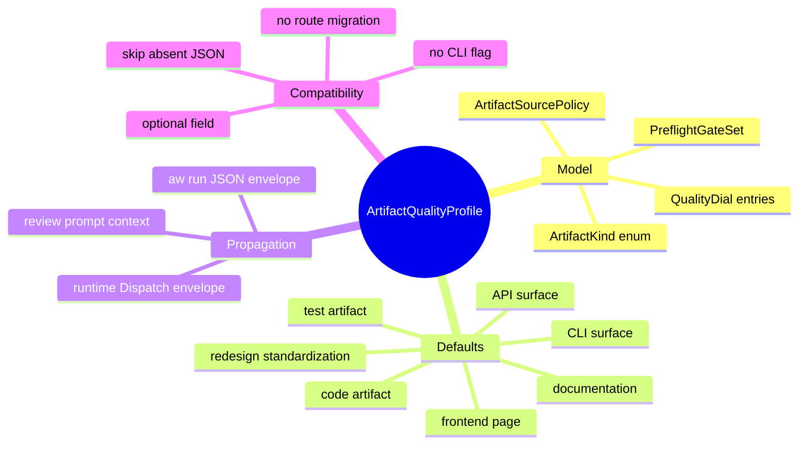
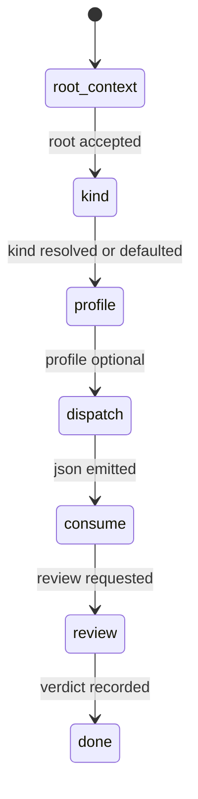
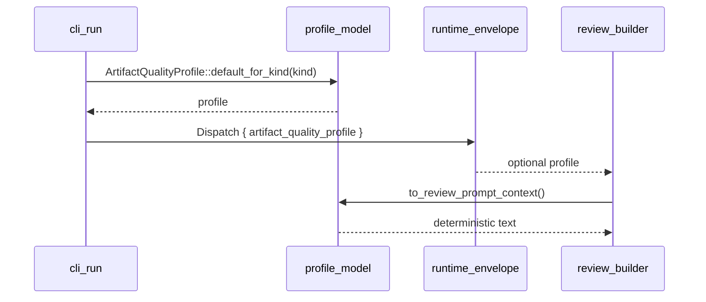
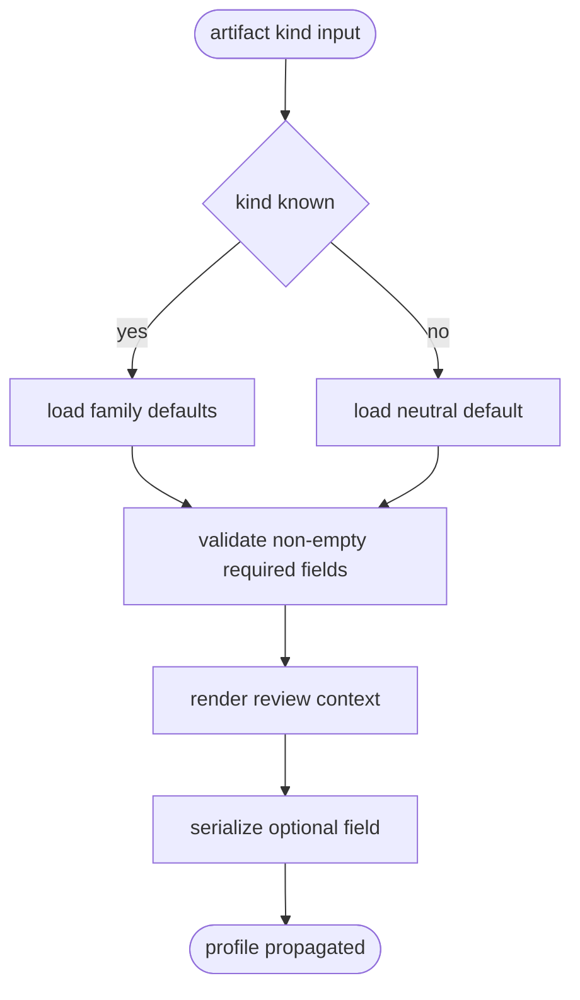
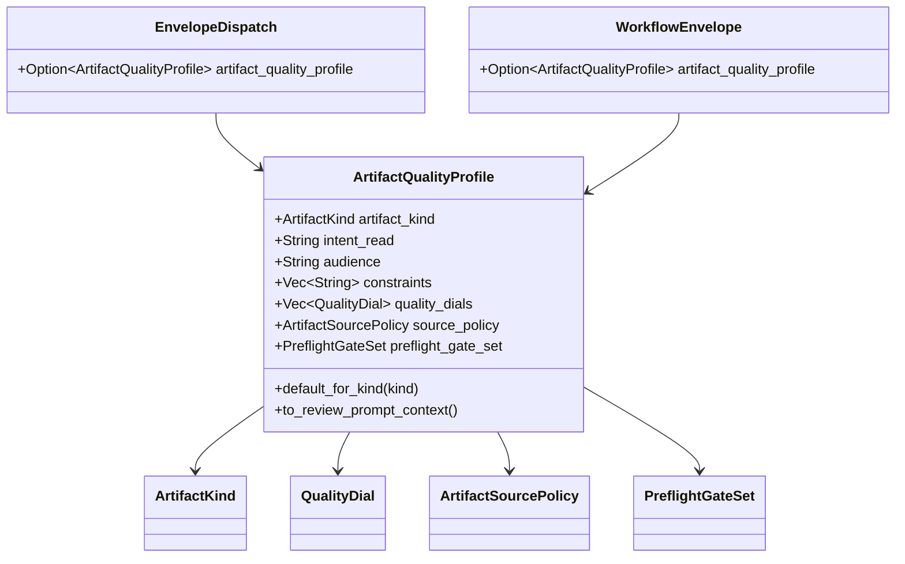
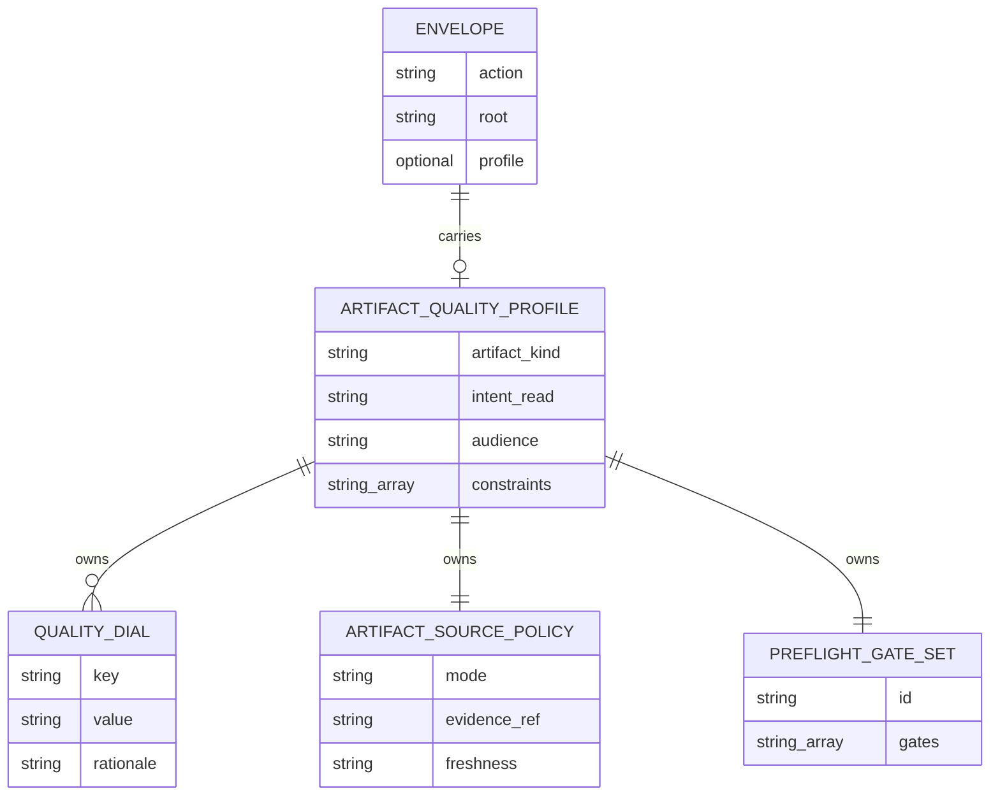

# Artifact Quality Profile Schema And Propagation

## Contract Scenarios
<!-- type: scenarios lang: yaml -->

```yaml
id: artifact-quality-profile-contract-scenarios
scenarios:
  - id: C1
    title: "default family profiles are complete"
    given:
      - "ArtifactKind is one of frontend_page, documentation, cli_surface, api_surface, code_artifact, test_artifact, or redesign_standardization"
    when:
      - "default_profile(kind) is called"
    then:
      - "artifact_kind, intent_read, audience, source_policy, and preflight_gate_set are populated"
      - "quality_dials contains kind-specific keys"
  - id: C2
    title: "runtime dispatch envelope stays backward compatible"
    given:
      - "a serialized runtime Dispatch envelope omits artifact_quality_profile"
    when:
      - "the envelope is deserialized"
    then:
      - "deserialization succeeds"
      - "artifact_quality_profile is None"
  - id: C3
    title: "runtime dispatch envelope carries profile when present"
    given:
      - "a Dispatch envelope includes artifact_quality_profile"
    when:
      - "the envelope is serialized and deserialized"
    then:
      - "artifact_quality_profile roundtrips without lossy conversion"
  - id: C4
    title: "aw run JSON can expose a profile without requiring one"
    given:
      - "WorkflowEnvelope is serialized for aw run --json"
    when:
      - "artifact_quality_profile is absent"
    then:
      - "the JSON omits the field"
      - "existing consumers remain compatible"
  - id: C5
    title: "review context renders profile contract"
    given:
      - "a profile has intent_read, audience, constraints, dials, source policy, and gates"
    when:
      - "profile.to_review_prompt_context() is called"
    then:
      - "the output contains profile intent, source policy, and gate bundle"
      - "the output is deterministic for test fixtures"
```
## Contract Mindmap
<!-- type: mindmap lang: mermaid -->


## Contract State Machine
<!-- type: state-machine lang: mermaid -->


## Contract Interaction
<!-- type: interaction lang: mermaid -->


## Contract Logic
<!-- type: logic lang: mermaid -->


## Contract Dependency
<!-- type: dependency lang: mermaid -->


## Contract Data Model
<!-- type: db-model lang: mermaid -->


## Contract Schema
<!-- type: schema lang: yaml -->

```yaml
$schema: "https://json-schema.org/draft/2020-12/schema"
$id: "aw.artifact-quality-profile.contract"
type: object
required:
  - artifact_kind
  - intent_read
  - audience
  - quality_dials
  - source_policy
  - preflight_gate_set
properties:
  artifact_kind:
    type: string
    enum:
      - frontend_page
      - redesign_standardization
      - documentation
      - cli_surface
      - api_surface
      - code_artifact
      - test_artifact
      - other
  intent_read:
    type: string
    minLength: 1
  audience:
    type: string
    minLength: 1
  constraints:
    type: array
    items: { type: string }
  quality_dials:
    type: array
    minItems: 1
    items:
      type: object
      required: [key, value]
      properties:
        key: { type: string, minLength: 1 }
        value: { type: string, minLength: 1 }
        rationale: { type: string }
  source_policy:
    type: object
    required: [mode]
    properties:
      mode:
        type: string
        enum:
          - spec
          - screenshot_reference
          - cli_transcript
          - api_contract
          - validation_inventory
          - code_ownership_map
          - mixed
      evidence_ref: { type: string }
      freshness: { type: string }
  preflight_gate_set:
    type: object
    required: [id, gates]
    properties:
      id: { type: string, minLength: 1 }
      gates:
        type: array
        items: { type: string }
additionalProperties: false
```
## Contract REST API
<!-- type: rest-api lang: yaml -->

```yaml
status: not_applicable
reason: "No HTTP route is added; the profile is serialized through local lifecycle envelopes."
routes: []
```
## Contract RPC API
<!-- type: rpc-api lang: yaml -->

```yaml
status: not_applicable
reason: "No RPC method is added."
methods: []
```
## Contract Async API
<!-- type: async-api lang: yaml -->

```yaml
status: not_applicable
reason: "No async channel or queue payload is added."
channels: {}
```
## Contract CLI
<!-- type: cli lang: yaml -->

```yaml
commands:
  - name: aw run --json
    contract:
      artifact_quality_profile: "optional object serialized only when present"
      absent_behavior: "field omitted with serde skip_serializing_if"
      compatibility: "existing workflows and JSON consumers remain valid"
  - name: aw td review
    contract:
      profile_context: "review prompt builders may render ArtifactQualityProfile::to_review_prompt_context()"
      absent_behavior: "review proceeds without profile context"
  - name: aw cb review
    contract:
      profile_context: "same profile context can be used by code-artifact review in follow-on WIs"
      absent_behavior: "review proceeds without profile context"
```
## Contract Wireframe
<!-- type: wireframe lang: yaml -->

```yaml
status: not_applicable
reason: "No UI is introduced by the core schema and envelope propagation change."
views: []
```
## Contract Component
<!-- type: component lang: yaml -->

```yaml
status: not_applicable
reason: "No frontend component contract changes."
components: []
```
## Contract Design Token
<!-- type: design-token lang: yaml -->

```yaml
status: not_applicable
reason: "No design token contract changes."
tokens: []
```
## Contract Config
<!-- type: config lang: yaml -->

```yaml
config:
  artifact_quality_profile:
    required: false
    source: "runtime default or future project/capability policy"
    default_kind: other
compatibility:
  missing_profile: "None in envelope, neutral profile available from model API"
  unknown_kind: "ArtifactKind::Other"
```
## Contract Manifest
<!-- type: manifest lang: yaml -->

```yaml
artifacts:
  - path: "projects/agentic-workflow/tech-design/surface/specs/aw-artifact-quality-profile.md"
    section_refs: [schema, logic, cli, unit-test, e2e-test, changes]
  - path: "projects/agentic-workflow/src/models/artifact_quality.rs"
    section_refs: [schema, logic, unit-test]
  - path: "projects/agentic-workflow/src/models/mod.rs"
    section_refs: [dependency, changes]
  - path: "projects/agentic-workflow/src/runtime/envelope.rs"
    section_refs: [schema, dependency, unit-test]
  - path: "projects/agentic-workflow/src/cli/run.rs"
    section_refs: [cli, schema, unit-test]
  - path: "projects/agentic-workflow/tests/fixtures/artifact_quality_profiles"
    section_refs: [schema, e2e-test]
```
## Contract Runtime Image
<!-- type: runtime-image lang: yaml -->

```yaml
status: not_applicable
reason: "No image build or runtime packaging changes."
images: []
```
## Contract Deployment
<!-- type: deployment lang: yaml -->

```yaml
status: not_applicable
reason: "The change is delivered in the agentic-workflow crate and installed binary only."
steps: []
rollback:
  - "Remove profile field usage from envelopes."
  - "Keep deserialization compatibility because the field is optional."
```
## Contract Unit Test
<!-- type: unit-test lang: mermaid -->

```mermaid
---
id: artifact-quality-profile-contract-unit-test
coverage_kind: behavioral
strategy: unit tests cover default profile families, serialization compatibility, and deterministic review context
---
requirementDiagram

requirement UT_DEFAULT_PROFILE_FAMILIES {
  id: 3903-UT-DEFAULTS
  text: default_for_kind returns complete profiles for at least five artifact families
  risk: medium
  verifymethod: test
}

requirement UT_RUNTIME_ENVELOPE_COMPAT {
  id: 3903-UT-RUNTIME
  text: runtime Dispatch deserializes without artifact_quality_profile and roundtrips with it
  risk: medium
  verifymethod: test
}

requirement UT_CLI_ENVELOPE_COMPAT {
  id: 3903-UT-CLI
  text: aw run WorkflowEnvelope omits absent profile and serializes present profile
  risk: medium
  verifymethod: test
}

requirement UT_REVIEW_CONTEXT {
  id: 3903-UT-REVIEW
  text: profile review context renders intent, audience, dials, source policy, and preflight gates deterministically
  risk: medium
  verifymethod: test
}
```
## Contract E2E Test
<!-- type: e2e-test lang: yaml -->

```yaml
e2e_tests:
  - name: artifact_quality_fixture_roundtrip
    command: "cargo test -p agentic-workflow artifact_quality -- --nocapture"
    asserts:
      - "fixture profiles deserialize"
      - "fixture profiles render deterministic review context"
  - name: runtime_envelope_backward_compatibility
    command: "cargo test -p agentic-workflow envelope_profile -- --nocapture"
    asserts:
      - "legacy Dispatch JSON without artifact_quality_profile remains accepted"
      - "Dispatch JSON with artifact_quality_profile roundtrips"
  - name: project_health_no_regression
    command: "cargo test -p agentic-workflow project_health -- --nocapture"
    asserts:
      - "unrelated workflow envelope change does not regress project health reporting"
```
## Contract Changes
<!-- type: changes lang: yaml -->

```yaml
changes:
  - path: "projects/agentic-workflow/tech-design/surface/specs/aw-artifact-quality-profile.md"
    action: add
    impl_mode: hand-written
    section: source
    description: "Canonical AW Core contract for ArtifactQualityProfile and envelope propagation."
  - path: "projects/agentic-workflow/src/models/artifact_quality.rs"
    action: add
    impl_mode: hand-written
    section: changes
    description: "Serializable ArtifactQualityProfile, ArtifactKind, QualityDial, ArtifactSourcePolicy, PreflightGateSet, family defaults, and review-context renderer."
  - path: "projects/agentic-workflow/src/models/mod.rs"
    action: modify
    impl_mode: hand-written
    section: source
    description: "Export the artifact_quality model module."
  - path: "projects/agentic-workflow/src/runtime/envelope.rs"
    action: modify
    impl_mode: hand-written
    section: source
    description: "Add optional artifact_quality_profile on Dispatch envelopes with serde default/skip behavior."
  - path: "projects/agentic-workflow/src/cli/run.rs"
    action: modify
    impl_mode: hand-written
    section: source
    description: "Add optional artifact_quality_profile to aw run WorkflowEnvelope JSON."
  - path: "projects/agentic-workflow/tests/fixtures/artifact_quality_profiles"
    action: add
    impl_mode: hand-written
    section: source
    description: "Fixture profiles for at least five artifact families."
```

# Reviews

### Review 1
**Verdict:** approved

- [schema] The contract defines the complete ArtifactQualityProfile shape, artifact kind enum, source policy modes, preflight gates, and optional-envelope compatibility.
- [dependency] Runtime and CLI envelopes depend on the profile through optional fields, so the existing artifact route model is not migrated or broken.
- [cli] CLI behavior is explicitly backward-compatible: no required flag and absent profile fields are omitted.
- [unit-test] The test contract covers default family completeness, runtime envelope roundtrip, aw run JSON compatibility, and deterministic review context rendering.
- [changes] The planned file set is bounded to the canonical spec, model module/export, runtime envelope, aw run envelope, and fixtures.
