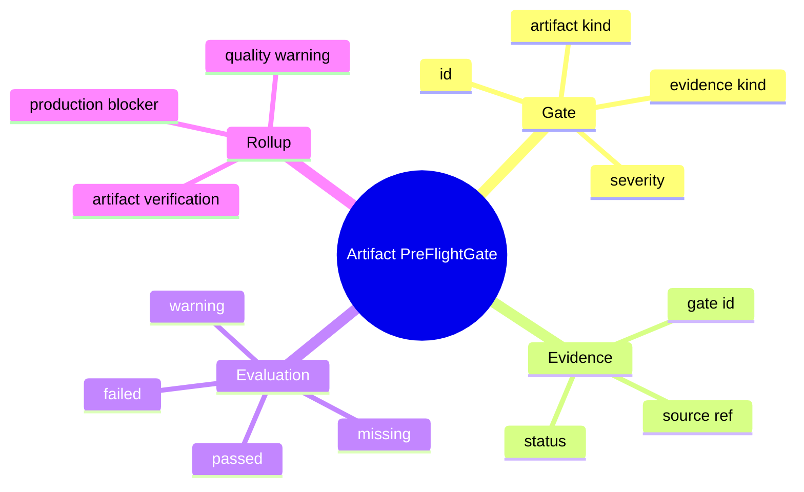
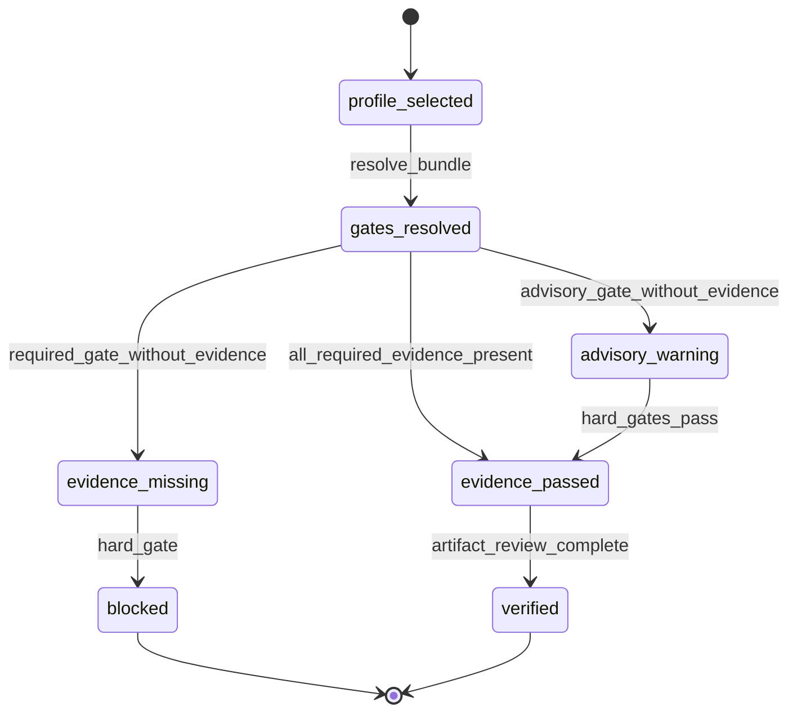
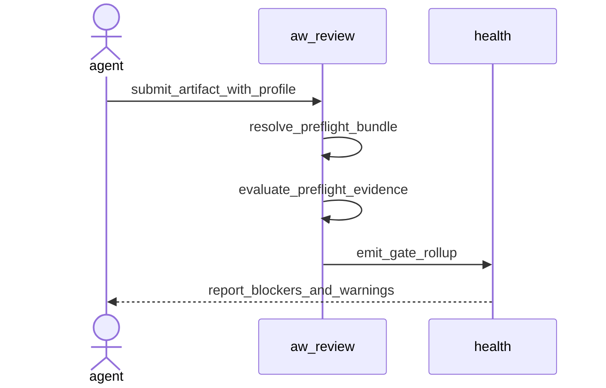
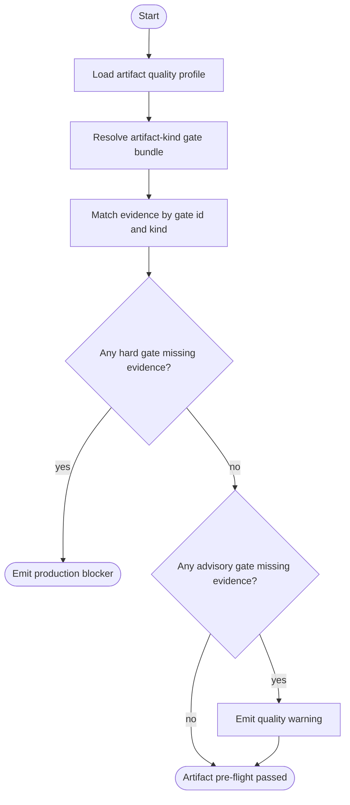
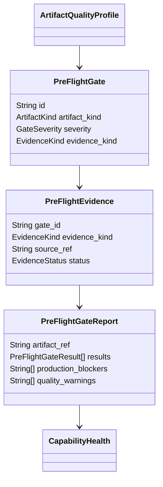
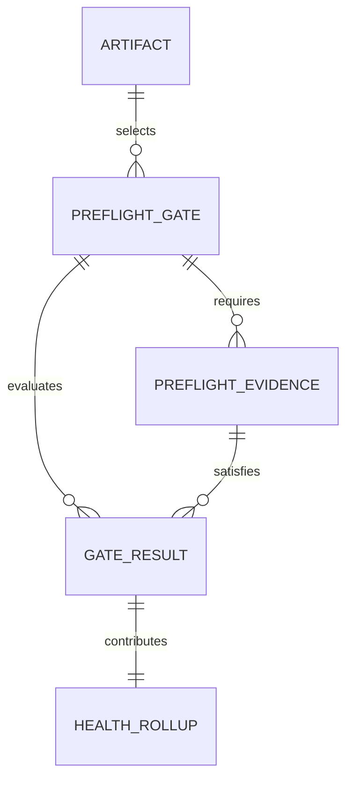

# Artifact Pre-Flight Gates

## Contract Scenarios
<!-- type: scenarios lang: yaml -->

```yaml
id: artifact-preflight-gates-contract-scenarios
scenarios:
  - id: C1
    title: "required pre-flight gate without evidence blocks verification"
    given: ["an artifact profile requires a hard pre-flight gate", "no matching evidence is attached"]
    when: ["artifact verification is evaluated"]
    then: ["gate status is missing", "artifact is not verified", "capability health reports a production blocker"]
  - id: C2
    title: "required pre-flight gate with accepted evidence passes"
    given: ["a hard gate declares an evidence kind", "matching accepted evidence is attached"]
    when: ["artifact verification is evaluated"]
    then: ["gate status is passed", "evidence reference is preserved", "artifact can be verified when all hard gates pass"]
  - id: C3
    title: "advisory gate reports warning without blocking"
    given: ["an advisory gate has no matching evidence"]
    when: ["capability health is computed"]
    then: ["quality warning is reported", "production readiness is not blocked by that advisory gate alone"]
  - id: C4
    title: "artifact kind selects its own gate bundle"
    given: ["artifact kind is documentation, cli_surface, frontend_page, or code_artifact"]
    when: ["the default bundle is resolved"]
    then: ["only relevant gates are required", "shared Gate, Evidence, and Rollup semantics remain reusable"]
```
## Contract Mindmap
<!-- type: mindmap lang: mermaid -->


## Contract State Machine
<!-- type: state-machine lang: mermaid -->


## Contract Interaction
<!-- type: interaction lang: mermaid -->


## Contract Logic
<!-- type: logic lang: mermaid -->


## Contract Dependency
<!-- type: dependency lang: mermaid -->


## Contract DB Model
<!-- type: db-model lang: mermaid -->


## Contract Schema
<!-- type: schema lang: yaml -->

```yaml
$schema: "https://json-schema.org/draft/2020-12/schema"
$id: "aw.artifact-preflight-gates.contract"
title: "ArtifactPreFlightGates"
type: object
required: [gates, evidence, report]
definitions:
  PreFlightGate:
    type: object
    required: [id, artifact_kind, severity, evidence_kind, description]
    properties:
      id: { type: string, minLength: 1 }
      artifact_kind: { type: string }
      severity: { type: string, enum: [hard, advisory] }
      evidence_kind: { type: string, enum: [test, screenshot, transcript, link_check, source_annotation, review_note] }
      description: { type: string }
  PreFlightEvidence:
    type: object
    required: [gate_id, evidence_kind, source_ref, status]
    properties:
      gate_id: { type: string }
      evidence_kind: { type: string }
      source_ref: { type: string, minLength: 1 }
      status: { type: string, enum: [accepted, rejected, missing] }
  PreFlightGateResult:
    type: object
    required: [gate_id, severity, status]
    properties:
      gate_id: { type: string }
      severity: { type: string, enum: [hard, advisory] }
      status: { type: string, enum: [passed, missing, failed, warning] }
      evidence_ref: { type: [string, "null"] }
  PreFlightGateReport:
    type: object
    required: [artifact_ref, results, production_blockers, quality_warnings]
    properties:
      artifact_ref: { type: string }
      results: { type: array, items: { $ref: "#/definitions/PreFlightGateResult" } }
      production_blockers: { type: array, items: { type: string } }
      quality_warnings: { type: array, items: { type: string } }
properties:
  gates: { type: array, items: { $ref: "#/definitions/PreFlightGate" } }
  evidence: { type: array, items: { $ref: "#/definitions/PreFlightEvidence" } }
  report: { $ref: "#/definitions/PreFlightGateReport" }
```
## Contract REST API
<!-- type: rest-api lang: yaml -->

```yaml
openapi: 3.1.0
info: { title: Artifact Pre-Flight Gates, version: 0.1.0 }
paths: {}
components:
  schemas:
    PreFlightGate:
      type: object
      required: [id, artifact_kind, severity, evidence_kind]
      properties:
        id: { type: string }
        artifact_kind: { type: string }
        severity: { type: string, enum: [hard, advisory] }
        evidence_kind: { type: string }
    PreFlightEvidence:
      type: object
      required: [gate_id, evidence_kind, source_ref, status]
      properties:
        gate_id: { type: string }
        evidence_kind: { type: string }
        source_ref: { type: string }
        status: { type: string, enum: [accepted, rejected, missing] }
    PreFlightGateReport:
      type: object
      required: [artifact_ref, results, production_blockers, quality_warnings]
      properties:
        artifact_ref: { type: string }
        results: { type: array, items: { type: object } }
        production_blockers: { type: array, items: { type: string } }
        quality_warnings: { type: array, items: { type: string } }
```
## Contract RPC API
<!-- type: rpc-api lang: yaml -->

```yaml
openrpc: 1.3.2
info: { title: Artifact Pre-Flight Gate RPC, version: 0.1.0 }
methods:
  - name: artifact.preflight.evaluate
    params:
      - { name: artifact_ref, schema: { type: string } }
      - { name: gates, schema: { type: array, items: { $ref: "#/components/schemas/PreFlightGate" } } }
      - { name: evidence, schema: { type: array, items: { $ref: "#/components/schemas/PreFlightEvidence" } } }
    result:
      name: report
      schema: { $ref: "#/components/schemas/PreFlightGateReport" }
components:
  schemas:
    PreFlightGate: { type: object }
    PreFlightEvidence: { type: object }
    PreFlightGateReport: { type: object }
```
## Contract Async API
<!-- type: async-api lang: yaml -->

```yaml
asyncapi: 2.6.0
info: { title: Artifact Pre-Flight Gate Events, version: 0.1.0 }
channels: {}
components:
  messages:
    PreFlightGateEvaluated:
      payload:
        type: object
        required: [artifact_ref, results]
        properties:
          artifact_ref: { type: string }
          results: { type: array, items: { type: object } }
```
## Contract CLI
<!-- type: cli lang: yaml -->

```yaml
commands:
  - name: aw
    subcommands:
      - name: project
        subcommands:
          - name: health
            flags:
              - name: verify-tests
              - name: json
            description: Reports production_blockers, optional_quality_warnings, and preflight_gate_reports.
      - name: cb
        subcommands:
          - name: review
            description: Reports missing required pre-flight evidence as a blocking validation item.
```
## Contract Wireframe
<!-- type: wireframe lang: yaml -->

```yaml
screen: artifact-preflight-gate-report
layout:
  type: table
  columns: [gate, severity, evidence, status, rollup]
states:
  missing_required: { row_status: blocker }
  missing_advisory: { row_status: warning }
  passed: { row_status: clean }
```
## Contract Component
<!-- type: component lang: yaml -->

```yaml
customElements:
  - name: aw-preflight-gate-report
    attributes:
      - { name: artifact-ref, type: string }
      - { name: status, type: string }
    properties:
      - { name: results, type: "PreFlightGateResult[]" }
      - { name: productionBlockers, type: "string[]" }
      - { name: qualityWarnings, type: "string[]" }
    events: []
```
## Contract Design Token
<!-- type: design-token lang: yaml -->

```yaml
tokens:
  aw.preflight.status.passed: { $type: color, $value: "#167C3A" }
  aw.preflight.status.warning: { $type: color, $value: "#B7791F" }
  aw.preflight.status.blocker: { $type: color, $value: "#B42318" }
  aw.preflight.status.missing: { $type: color, $value: "#6B7280" }
```
## Contract Config
<!-- type: config lang: yaml -->

```yaml
$schema: "https://json-schema.org/draft/2020-12/schema"
title: ArtifactPreFlightConfig
type: object
properties:
  artifact_preflight:
    type: object
    properties:
      enabled: { type: boolean, default: true }
      hard_gate_blocks_production: { type: boolean, default: true }
      advisory_gate_blocks_production: { type: boolean, default: false }
```
## Contract Manifest
<!-- type: manifest lang: yaml -->

```yaml
package:
  name: agentic-workflow
  workspace: projects/agentic-workflow
dependencies:
  runtime: { serde: existing, serde_json: existing }
  test: { tempfile: existing }
changes:
  add_dependencies: []
  remove_dependencies: []
```
## Contract Runtime Image
<!-- type: runtime-image lang: yaml -->

```yaml
runtime_image:
  required: false
  reason: "Pre-flight gates run in the existing AW CLI binary."
  build_context: null
  dockerfile: null
```
## Contract Deployment
<!-- type: deployment lang: yaml -->

```yaml
deployment:
  required: false
  reason: "No service deployment surface changes."
  manifests: []
  rollout_steps: []
```
## Contract Unit Test
<!-- type: unit-test lang: mermaid -->

```mermaid
---
id: artifact-preflight-gates-contract-unit-test
coverage_kind: unit
strategy: prove missing hard gate, passing hard gate, and advisory-only warning behavior
evidence:
  source_tests:
    - projects/agentic-workflow/src/models/preflight.rs
    - projects/agentic-workflow/src/cli/project.rs
---
requirementDiagram
  requirement hard_gate_missing {
    id: UT1
    text: missing hard pre-flight evidence creates a production blocker
    risk: high
    verifymethod: test
  }
  requirement hard_gate_passed {
    id: UT2
    text: accepted evidence satisfies the required gate
    risk: medium
    verifymethod: test
  }
  requirement advisory_warning {
    id: UT3
    text: missing advisory evidence reports a warning without blocking production
    risk: medium
    verifymethod: test
  }
```
## Contract E2E Test
<!-- type: e2e-test lang: yaml -->

```yaml
e2e_tests:
  - id: artifact-preflight-health-rollup
    name: "artifact pre-flight health rollup"
    command: "aw project health agentic-workflow --verify-tests --json"
    assertions:
      - "missing hard evidence appears in production_blockers"
      - "missing advisory evidence appears in quality warnings"
      - "passing evidence keeps production_ready true when no other blockers exist"
side_effects:
  - "no remote tracker mutation from health evaluation"
```
## Contract Changes
<!-- type: changes lang: yaml -->

```yaml
changes:
  - path: "projects/agentic-workflow/tech-design/surface/specs/aw-artifact-preflight-gates.md"
    action: create
    section: source
    impl_mode: hand-written
    description: "Canonical contract for pre-flight gate and evidence semantics."
  - path: "projects/agentic-workflow/src/models/preflight.rs"
    action: create
    section: source
    impl_mode: hand-written
    description: "Runtime model and evaluator for hard/advisory gates."
  - path: "projects/agentic-workflow/src/models/mod.rs"
    action: modify
    section: source
    impl_mode: hand-written
    description: "Export pre-flight gate models."
  - path: "projects/agentic-workflow/src/cli/project.rs"
    action: modify
    section: source
    impl_mode: hand-written
    description: "Surface pre-flight blockers and warnings in project health."
  - path: "projects/agentic-workflow/src/cli/cb_review.rs"
    action: modify
    section: source
    impl_mode: hand-written
    description: "Report missing required evidence as review validation."
```

# Reviews

### Review 1
**Verdict:** approved

- [scenarios] Hard gate, passing gate, advisory warning, and artifact-kind bundle selection scenarios cover the work-item acceptance criteria.
- [schema] PreFlightGate, PreFlightEvidence, PreFlightGateResult, and PreFlightGateReport give implementation-ready typed contracts.
- [logic] Evaluation flow unambiguously separates production blockers from quality warnings.
- [cli] Health and review reporting surfaces are bounded to existing AW command areas.
- [changes] File plan is scoped to the canonical spec, preflight model/evaluator, model exports, health rollup, and review validation.
