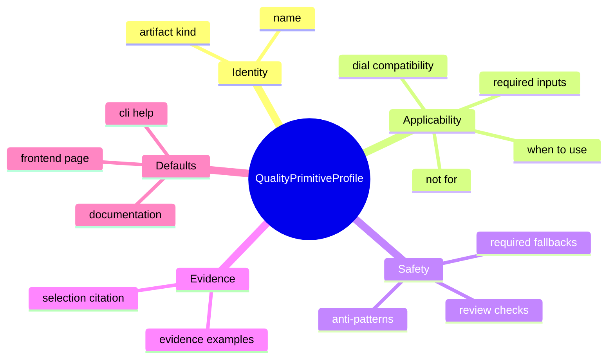
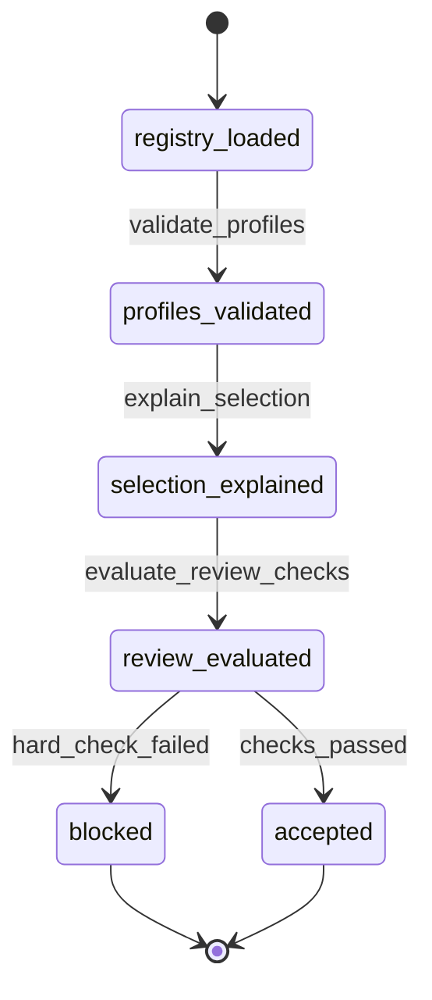
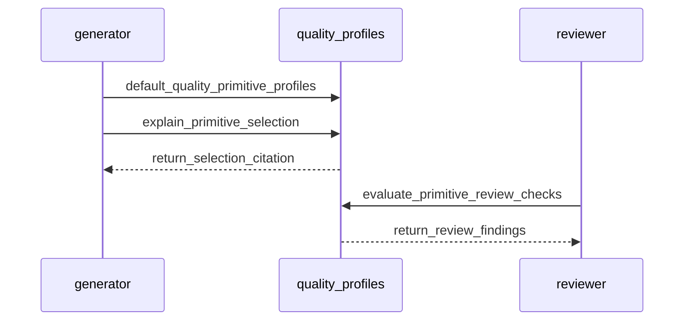
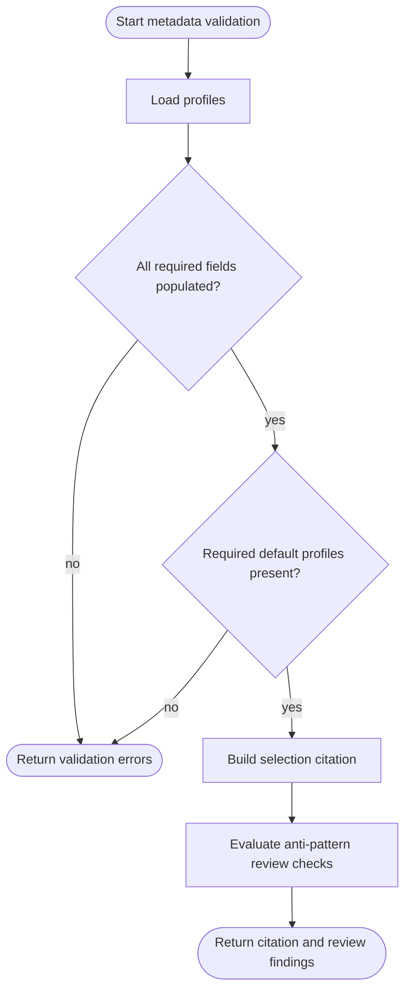
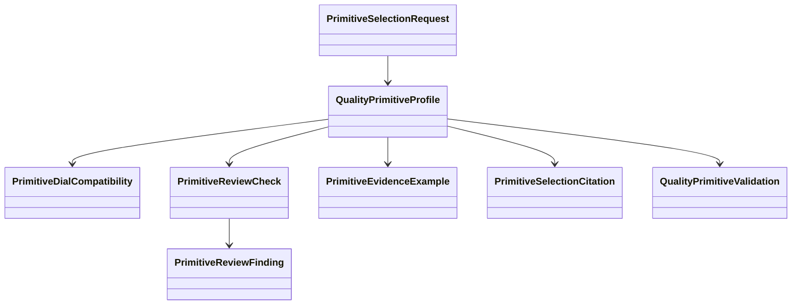
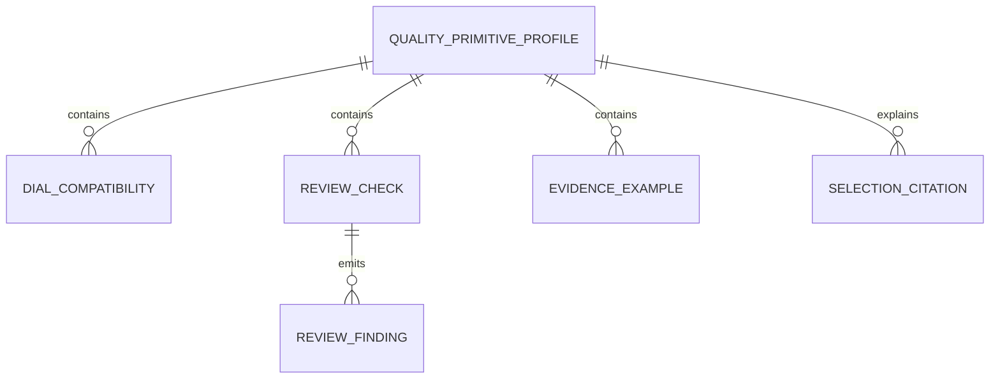

# Quality Primitive Metadata

## Contract Scenarios
<!-- type: scenarios lang: yaml -->

```yaml
id: quality-primitive-metadata-contract-scenarios
scenarios:
  - id: C1
    title: "default profiles validate"
    given: ["the quality primitive registry loads default profiles"]
    when: ["profile validation runs"]
    then: ["frontend_page_responsive_shell, cli_help_command_tree, and documentation_capability_contract are present", "each profile has applicability, fallback, review, and evidence fields"]
  - id: C2
    title: "selection citation explains applicability"
    given: ["a primitive profile matches artifact kind and requested dials"]
    when: ["selection explanation is requested"]
    then: ["the citation reports applicable=true", "matched fields include artifact_kind and dial_compatibility", "evidence expectations are copied from the profile"]
  - id: C3
    title: "anti-pattern review check fails"
    given: ["a cited artifact contains text matching a profile anti-pattern"]
    when: ["primitive review checks are evaluated"]
    then: ["a hard review finding names the anti-pattern", "the caller receives the violated check id"]
  - id: C4
    title: "metadata does not change code emission"
    given: ["quality primitive metadata is loaded"]
    when: ["existing primitive emitters run"]
    then: ["emit templates and primitive lookup behavior are unchanged", "metadata is available through a separate module"]
```
## Contract Mindmap
<!-- type: mindmap lang: mermaid -->


## Contract State Machine
<!-- type: state-machine lang: mermaid -->


## Contract Interaction
<!-- type: interaction lang: mermaid -->


## Contract Logic
<!-- type: logic lang: mermaid -->


## Contract Dependency
<!-- type: dependency lang: mermaid -->


## Contract DB Model
<!-- type: db-model lang: mermaid -->


## Contract Schema
<!-- type: schema lang: yaml -->

```yaml
$schema: "https://json-schema.org/draft/2020-12/schema"
$id: "aw.quality-primitive-metadata.contract"
title: "QualityPrimitiveMetadataContract"
type: object
required: [profiles]
definitions:
  PrimitiveDialCompatibility:
    type: object
    required: [dial, support, rationale]
    properties:
      dial: { type: string, minLength: 1 }
      support: { type: string, enum: [required, supported, unsupported] }
      rationale: { type: string, minLength: 1 }
  PrimitiveReviewCheck:
    type: object
    required: [id, severity, description]
    properties:
      id: { type: string, minLength: 1 }
      severity: { type: string, enum: [hard, advisory] }
      description: { type: string, minLength: 1 }
  PrimitiveEvidenceExample:
    type: object
    required: [kind, description]
    properties:
      kind: { type: string, enum: [test, screenshot, transcript, link_check, source_annotation, review_note] }
      description: { type: string, minLength: 1 }
  QualityPrimitiveProfile:
    type: object
    required: [name, artifact_kind, dial_compatibility, when_to_use, not_for, required_inputs, required_fallbacks, anti_patterns, review_checks, evidence_examples]
    properties:
      name: { type: string, minLength: 1 }
      artifact_kind: { type: string, enum: [frontend_page, cli_help, documentation, code_artifact] }
      dial_compatibility: { type: array, minItems: 1, items: { $ref: "#/definitions/PrimitiveDialCompatibility" } }
      when_to_use: { type: array, minItems: 1, items: { type: string, minLength: 1 } }
      not_for: { type: array, minItems: 1, items: { type: string, minLength: 1 } }
      required_inputs: { type: array, minItems: 1, items: { type: string, minLength: 1 } }
      required_fallbacks: { type: array, minItems: 1, items: { type: string, minLength: 1 } }
      anti_patterns: { type: array, minItems: 1, items: { type: string, minLength: 1 } }
      review_checks: { type: array, minItems: 1, items: { $ref: "#/definitions/PrimitiveReviewCheck" } }
      evidence_examples: { type: array, minItems: 1, items: { $ref: "#/definitions/PrimitiveEvidenceExample" } }
  PrimitiveSelectionCitation:
    type: object
    required: [primitive_name, applicable, matched_fields, rejected_fields, evidence_expectations]
    properties:
      primitive_name: { type: string, minLength: 1 }
      applicable: { type: boolean }
      matched_fields: { type: array, items: { type: string, minLength: 1 } }
      rejected_fields: { type: array, items: { type: string, minLength: 1 } }
      evidence_expectations: { type: array, items: { type: string, minLength: 1 } }
  PrimitiveReviewFinding:
    type: object
    required: [check_id, severity, message]
    properties:
      check_id: { type: string, minLength: 1 }
      severity: { type: string, enum: [hard, advisory] }
      message: { type: string, minLength: 1 }
properties:
  profiles:
    type: array
    minItems: 3
    items: { $ref: "#/definitions/QualityPrimitiveProfile" }
```
## Contract REST API
<!-- type: rest-api lang: yaml -->

```yaml
openapi: 3.1.0
info: { title: Quality Primitive Metadata Contract, version: 0.1.0 }
paths: {}
components:
  schemas:
    QualityPrimitiveProfile: { type: object }
    PrimitiveSelectionCitation: { type: object }
    PrimitiveReviewFinding: { type: object }
```
## Contract RPC API
<!-- type: rpc-api lang: yaml -->

```yaml
openrpc: 1.3.2
info: { title: Quality Primitive Metadata Contract RPC, version: 0.1.0 }
methods:
  - name: qualityPrimitive.validate
    params:
      - { name: profiles, schema: { type: array, items: { $ref: "#/components/schemas/QualityPrimitiveProfile" } } }
    result:
      name: errors
      schema: { type: array, items: { type: string } }
  - name: qualityPrimitive.explainSelection
    params:
      - { name: primitive_name, schema: { type: string } }
      - { name: artifact_kind, schema: { type: string } }
      - { name: requested_dials, schema: { type: array, items: { type: string } } }
    result:
      name: citation
      schema: { $ref: "#/components/schemas/PrimitiveSelectionCitation" }
components:
  schemas:
    QualityPrimitiveProfile: { type: object }
    PrimitiveSelectionCitation: { type: object }
```
## Contract Async API
<!-- type: async-api lang: yaml -->

```yaml
asyncapi: 2.6.0
info: { title: Quality Primitive Metadata Contract Events, version: 0.1.0 }
channels: {}
components:
  messages:
    PrimitiveSelectionCitationCreated:
      payload:
        type: object
        required: [primitive_name, applicable]
        properties:
          primitive_name: { type: string }
          applicable: { type: boolean }
```
## Contract CLI
<!-- type: cli lang: yaml -->

```yaml
commands:
  - name: aw
    subcommands:
      - name: quality-primitive
        about: "Inspect quality primitive metadata"
        subcommands:
          - name: list
            about: "List default quality primitive profiles"
            args:
              - { name: artifact-kind, long: artifact-kind, value_name: KIND, required: false }
          - name: show
            about: "Show one default profile"
            args:
              - { name: name, value_name: NAME, required: true }
          - name: explain
            about: "Explain primitive selection using metadata"
            args:
              - { name: name, value_name: NAME, required: true }
              - { name: artifact-kind, long: artifact-kind, value_name: KIND, required: true }
              - { name: dial, long: dial, value_name: DIAL, multiple: true, required: false }
```
## Contract Wireframe
<!-- type: wireframe lang: yaml -->

```yaml
layout:
  type: inspector
  title: "Quality primitive metadata"
  regions:
    - id: profile-table
      component: table
      columns: [name, artifact_kind, when_to_use]
    - id: selected-profile
      component: detail-panel
      fields: [dial_compatibility, required_fallbacks, anti_patterns, review_checks]
    - id: citation-panel
      component: evidence-panel
      fields: [matched_fields, rejected_fields, evidence_expectations]
```
## Contract Component
<!-- type: component lang: yaml -->

```yaml
schemaVersion: 1.0.0
modules:
  - kind: javascript-module
    path: quality-primitive-inspector.ts
    declarations:
      - kind: class
        name: QualityPrimitiveInspector
        tagName: quality-primitive-inspector
        members:
          - { kind: field, name: profiles, type: { text: "QualityPrimitiveProfile[]" } }
          - { kind: field, name: citation, type: { text: PrimitiveSelectionCitation } }
        events:
          - { name: quality-primitive-explained, type: { text: CustomEvent } }
```
## Contract Design Token
<!-- type: design-token lang: yaml -->

```yaml
tokens:
  qualityPrimitive:
    status:
      applicable: { $type: color, $value: "#146C43" }
      rejected: { $type: color, $value: "#9F1239" }
      advisory: { $type: color, $value: "#8A5A00" }
```
## Contract Config
<!-- type: config lang: yaml -->

```yaml
$schema: "https://json-schema.org/draft/2020-12/schema"
$id: "aw.quality-primitive-runtime-config"
title: "QualityPrimitiveRuntimeConfig"
type: object
properties:
  require_selection_citation: { type: boolean, default: false }
  fail_on_hard_review_check: { type: boolean, default: false }
```
## Contract Manifest
<!-- type: manifest lang: yaml -->

```yaml
package:
  name: agentic-workflow
  changes:
    dependencies: []
    features: []
```
## Contract Runtime Image
<!-- type: runtime-image lang: yaml -->

```yaml
image:
  name: agentic-workflow-quality-primitives
  base: local-toolchain
  build_context: .
  entrypoint: []
```
## Contract Deployment
<!-- type: deployment lang: yaml -->

```yaml
deployment:
  kind: local-cli
  name: quality-primitive-metadata
  rollout_gates:
    - default-profile-validation
    - selection-citation-test
    - review-finding-test
```
## Contract Unit Test
<!-- type: unit-test lang: mermaid -->

```mermaid
---
id: quality-primitive-metadata-contract-unit-test
coverage_kind: unit
strategy: validate profiles, explain selection, and emit review findings
evidence:
  source_tests:
    - projects/agentic-workflow/src/generate/generators/quality_primitives.rs
---
requirementDiagram
  requirement validates_profiles {
    id: UT1
    text: default quality primitive profiles have all required fields
    risk: medium
    verifymethod: test
  }
  requirement explains_selection {
    id: UT2
    text: selection citation includes matched fields and evidence expectations
    risk: medium
    verifymethod: test
  }
  requirement emits_review_finding {
    id: UT3
    text: anti-pattern checks produce review findings
    risk: medium
    verifymethod: test
  }
```
## Contract E2E Test
<!-- type: e2e-test lang: yaml -->

```yaml
e2e_tests:
  - id: quality-primitive-metadata-contract-test
    name: "quality primitive metadata contract test"
    command: "cargo test -p agentic-workflow quality_primitives -- --nocapture"
    assertions:
      - "default profiles validate"
      - "selection citation explains a matching primitive"
      - "review finding reports an anti-pattern"
```
## Contract Changes
<!-- type: changes lang: yaml -->

```yaml
changes:
  - path: projects/agentic-workflow/tech-design/surface/specs/aw-quality-primitive-metadata.md
    action: create
    section: schema
    impl_mode: hand-written
    description: |
      Add the canonical metadata contract and default profile examples.
  - path: projects/agentic-workflow/src/generate/generators/quality_primitives.rs
    action: create
    section: schema
    impl_mode: hand-written
    description: |
      Add quality primitive profile models, default profiles, validation,
      selection explanation, and review finding helpers.
  - path: projects/agentic-workflow/src/generate/generators/mod.rs
    action: modify
    section: dependency
    impl_mode: hand-written
    description: |
      Expose the metadata module beside the existing primitive registry.
  - path: projects/agentic-workflow/tech-design/core/generate/generators/module_registry.md
    action: modify
    section: dependency
    impl_mode: hand-written
    description: |
      Record the public re-export snapshot for quality primitive metadata.
```

# Reviews

### Review 1
**Verdict:** approved

- [schema] The contract defines the required metadata fields, selection citation, and review finding shapes clearly enough for implementation.
- [changes] The implementation plan keeps quality metadata in a separate generator module, preserving existing primitive emission behavior.
