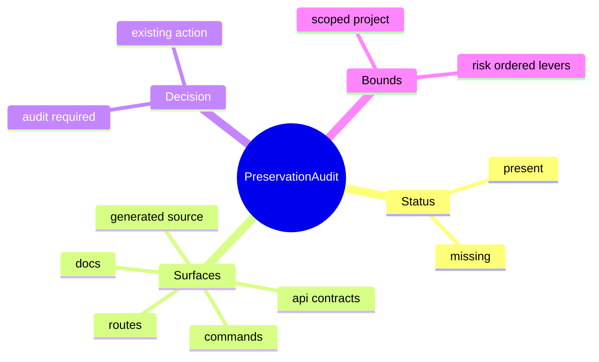
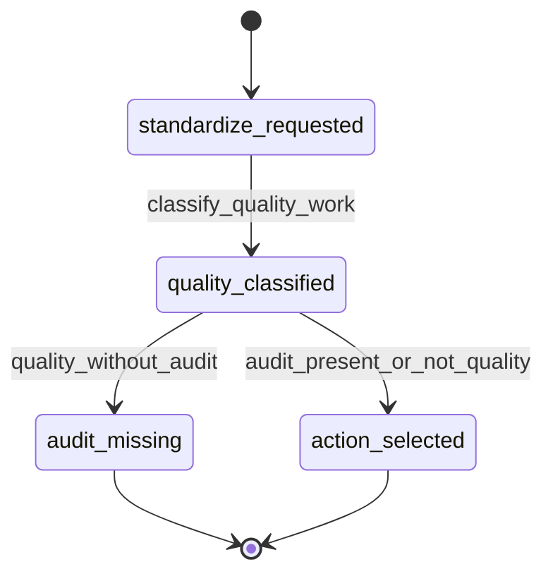
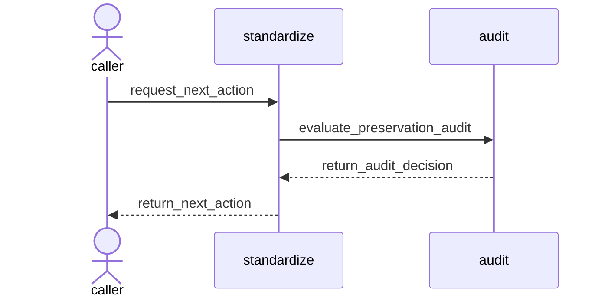
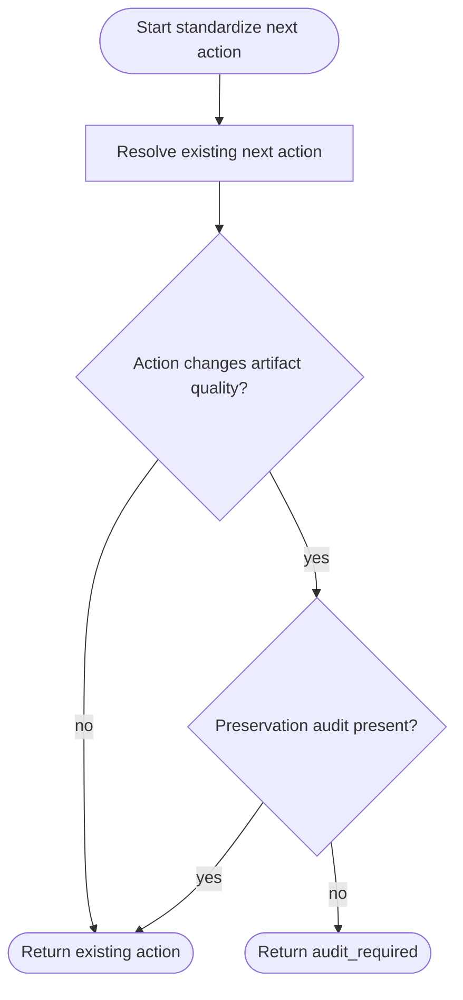
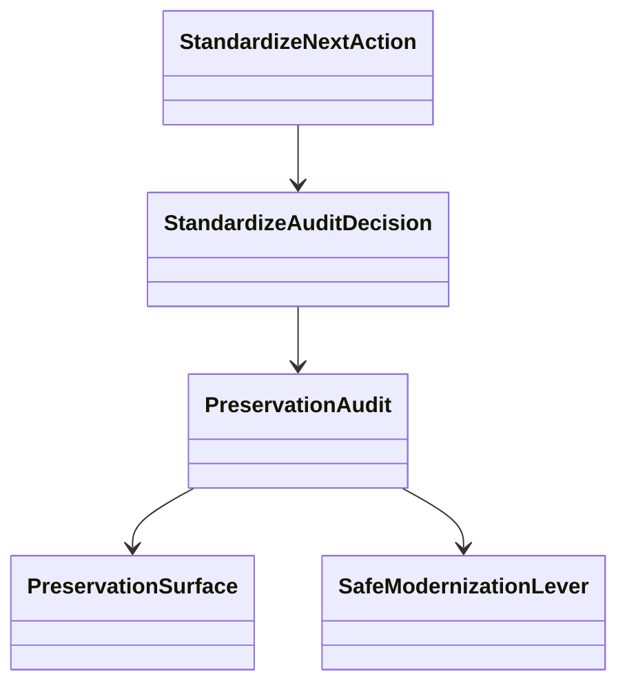
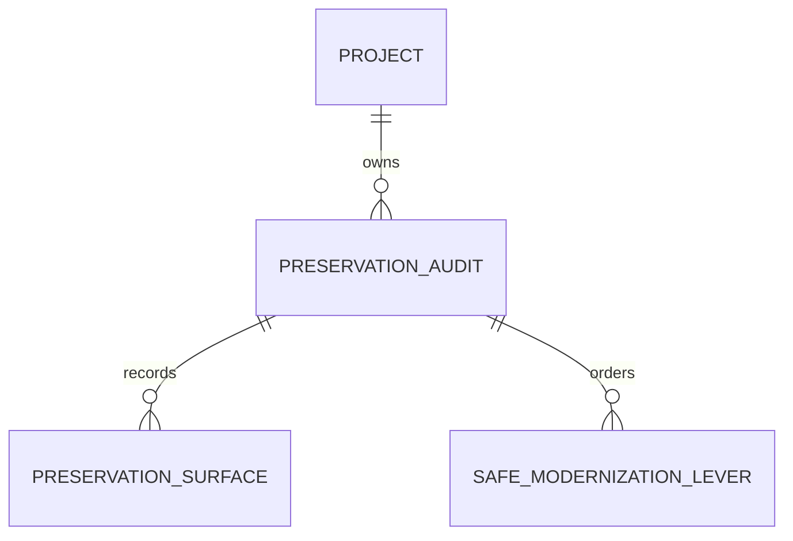

# Standardize Audit-First Quality Protocol

## Contract Scenarios
<!-- type: scenarios lang: yaml -->

```yaml
id: standardize-audit-first-contract-scenarios
scenarios:
  - id: C1
    title: "missing preservation baseline blocks quality action"
    given: ["standardization work is quality-changing", "no preservation audit exists"]
    when: ["the next action is selected"]
    then: ["next_action.kind is audit_required", "the action describes the audit path and preserved surfaces"]
  - id: C2
    title: "existing preservation baseline allows normal next action"
    given: ["a preservation audit exists for the scoped project"]
    when: ["the next action is selected"]
    then: ["standardization proceeds to the existing managed, semantic, cold verify, or regenerable action"]
  - id: C3
    title: "preservation audit covers route and command surfaces"
    given: ["a target exposes routes and CLI commands"]
    when: ["a preservation baseline is built"]
    then: ["route and command surfaces are recorded as preserve-before-change evidence"]
```
## Contract Mindmap
<!-- type: mindmap lang: mermaid -->


## Contract State Machine
<!-- type: state-machine lang: mermaid -->


## Contract Interaction
<!-- type: interaction lang: mermaid -->


## Contract Logic
<!-- type: logic lang: mermaid -->


## Contract Dependency
<!-- type: dependency lang: mermaid -->


## Contract DB Model
<!-- type: db-model lang: mermaid -->


## Contract Schema
<!-- type: schema lang: yaml -->

```yaml
$schema: "https://json-schema.org/draft/2020-12/schema"
$id: "aw.standardize-audit-first.contract"
title: "StandardizeAuditFirstContract"
type: object
definitions:
  PreservationSurface:
    type: object
    required: [kind, name, preserve]
    properties:
      kind: { type: string, enum: [route, command, api, doc, generated_source, behavior, accessibility, operations] }
      name: { type: string, minLength: 1 }
      preserve: { type: string, minLength: 1 }
  SafeModernizationLever:
    type: object
    required: [name, risk]
    properties:
      name: { type: string, minLength: 1 }
      risk: { type: string, enum: [low, medium, high] }
  PreservationAudit:
    type: object
    required: [project, surfaces, quality_debt, safe_levers]
    properties:
      project: { type: string, minLength: 1 }
      scope: { type: string }
      surfaces: { type: array, items: { $ref: "#/definitions/PreservationSurface" } }
      quality_debt: { type: array, items: { type: string } }
      safe_levers: { type: array, items: { $ref: "#/definitions/SafeModernizationLever" } }
  StandardizeAuditDecision:
    type: object
    required: [audit_required, audit_path, surfaces_to_preserve]
    properties:
      audit_required: { type: boolean }
      audit_path: { type: string }
      surfaces_to_preserve: { type: array, items: { type: string } }
properties:
  audit: { $ref: "#/definitions/PreservationAudit" }
  decision: { $ref: "#/definitions/StandardizeAuditDecision" }
```
## Contract REST API
<!-- type: rest-api lang: yaml -->

```yaml
openapi: 3.1.0
info: { title: Standardize Audit First Contract, version: 0.1.0 }
paths: {}
components:
  schemas:
    PreservationAudit: { type: object }
    StandardizeAuditDecision: { type: object }
```
## Contract RPC API
<!-- type: rpc-api lang: yaml -->

```yaml
openrpc: 1.3.2
info: { title: Standardize Audit Contract RPC, version: 0.1.0 }
methods:
  - name: standardize.audit.evaluate
    params:
      - { name: project, schema: { type: string } }
      - { name: requested_action, schema: { type: string } }
    result:
      name: decision
      schema: { $ref: "#/components/schemas/StandardizeAuditDecision" }
components:
  schemas:
    StandardizeAuditDecision: { type: object }
```
## Contract Async API
<!-- type: async-api lang: yaml -->

```yaml
asyncapi: 2.6.0
info: { title: Standardize Audit Contract Events, version: 0.1.0 }
channels: {}
components:
  messages:
    StandardizeAuditRequired:
      payload:
        type: object
        required: [project, audit_path]
        properties:
          project: { type: string }
          audit_path: { type: string }
```
## Contract CLI
<!-- type: cli lang: yaml -->

```yaml
commands:
  - name: aw
    subcommands:
      - name: standardize
        subcommands:
          - name: next
            about: "Returns audit_required before quality work when preservation baseline is missing"
          - name: run
            about: "Stops on audit_required unless an audit baseline exists"
          - name: audit
            about: "Inspect preservation baseline state"
```
## Contract Wireframe
<!-- type: wireframe lang: yaml -->

```yaml
layout:
  type: inspector
  title: "Standardize audit decision"
  regions:
    - id: audit-required
      component: status
      fields: [audit_required, audit_path]
    - id: preserve
      component: table
      columns: [surface, reason]
```
## Contract Component
<!-- type: component lang: yaml -->

```yaml
schemaVersion: 1.0.0
modules:
  - kind: javascript-module
    path: standardize-audit-decision.ts
    declarations:
      - kind: class
        name: StandardizeAuditDecisionView
        tagName: standardize-audit-decision
        members:
          - { kind: field, name: decision, type: { text: StandardizeAuditDecision } }
```
## Contract Design Token
<!-- type: design-token lang: yaml -->

```yaml
tokens:
  standardizeAudit:
    status:
      required: { $type: color, $value: "#9F1239" }
      ready: { $type: color, $value: "#146C43" }
```
## Contract Config
<!-- type: config lang: yaml -->

```yaml
$schema: "https://json-schema.org/draft/2020-12/schema"
$id: "aw.standardize-audit-config.contract"
title: "StandardizeAuditConfig"
type: object
properties:
  audit_first_quality_enabled: { type: boolean, default: true }
  audit_path: { type: string, default: ".aw/standardize/audit" }
```
## Contract Manifest
<!-- type: manifest lang: yaml -->

```yaml
package:
  name: agentic-workflow
  changes:
    dependencies: []
    features: []
```
## Contract Runtime Image
<!-- type: runtime-image lang: yaml -->

```yaml
image:
  name: agentic-workflow-standardize-audit
  base: local-toolchain
  build_context: .
  entrypoint: []
```
## Contract Deployment
<!-- type: deployment lang: yaml -->

```yaml
deployment:
  kind: local-cli
  name: standardize-audit-first
  rollout_gates:
    - standardize-audit-unit-tests
    - standardize-audit-td-check
```
## Contract Unit Test
<!-- type: unit-test lang: mermaid -->

```mermaid
---
id: standardize-audit-first-contract-unit-test
coverage_kind: unit
strategy: test audit-required decision and preservation surface recording
evidence:
  source_tests:
    - projects/agentic-workflow/src/cli/standardize_audit.rs
---
requirementDiagram
  requirement quality_action_requires_audit {
    id: UT1
    text: quality-changing standardize action returns audit_required without baseline
    risk: medium
    verifymethod: test
  }
  requirement baseline_allows_action {
    id: UT2
    text: preservation baseline allows existing next action to continue
    risk: medium
    verifymethod: test
  }
  requirement route_command_surfaces {
    id: UT3
    text: audit fixture records route and command preservation surfaces
    risk: medium
    verifymethod: test
  }
```
## Contract E2E Test
<!-- type: e2e-test lang: yaml -->

```yaml
e2e_tests:
  - id: standardize-audit-first-contract-test
    name: "standardize audit-first contract"
    command: "cargo test -p agentic-workflow standardize_audit -- --nocapture"
    assertions:
      - "audit_required is true without a preservation baseline"
      - "audit_required is false when a baseline exists"
      - "route and command surfaces are included in the fixture baseline"
```
## Contract Changes
<!-- type: changes lang: yaml -->

```yaml
changes:
  - path: projects/agentic-workflow/tech-design/surface/specs/aw-standardize-audit-first-quality.md
    action: create
    section: schema
    impl_mode: hand-written
    description: "Canonical audit-first standardization protocol."
  - path: projects/agentic-workflow/src/cli/standardize_audit.rs
    action: create
    section: schema
    impl_mode: hand-written
    description: "Preservation audit model, audit-required decision helper, and fixtures."
  - path: projects/agentic-workflow/src/cli/standardize.rs
    action: modify
    section: logic
    impl_mode: hand-written
    description: "Surface audit-required as a first-class standardize next action."
```

# Reviews

### Review 1
**Verdict:** approved

- [schema] The preservation audit and audit decision shapes cover surfaces, bounded debt, and safe modernization levers.
- [logic] The audit-first decision wraps existing standardize action selection without changing non-quality standardization behavior.

# Reviews

### Review 1
**Verdict:** approved

- [schema] The contract names the audit decision, preservation surface, and audit model required by implementation.
- [logic] The wrapper behavior is explicit: audit-first only intercepts quality-changing work without a baseline.
