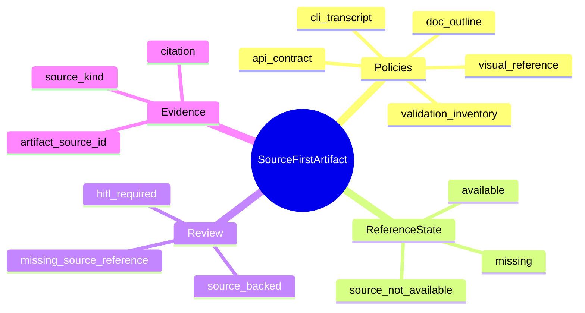
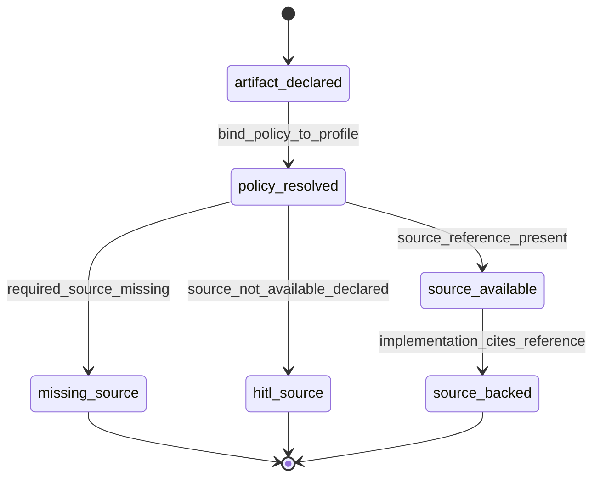
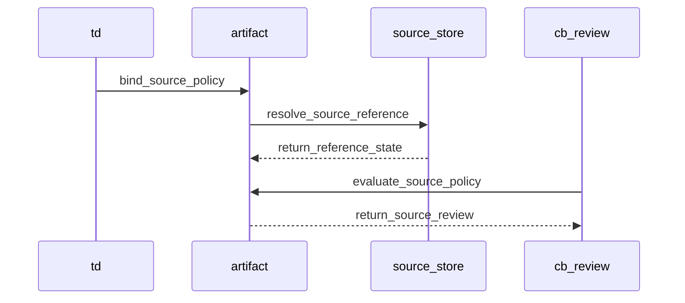
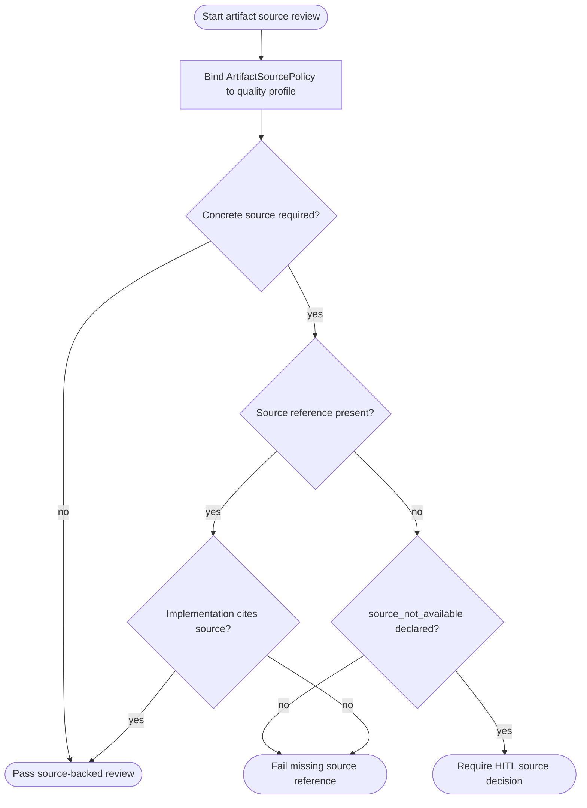
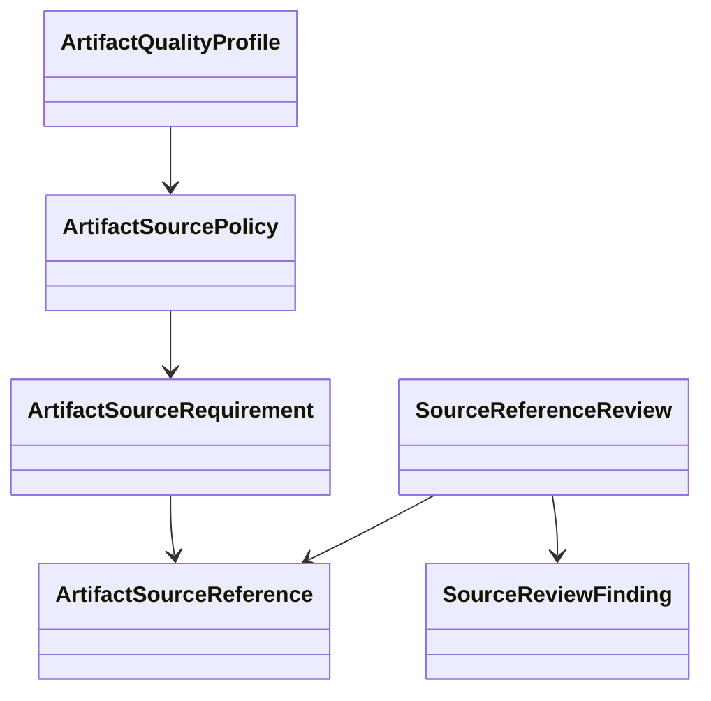
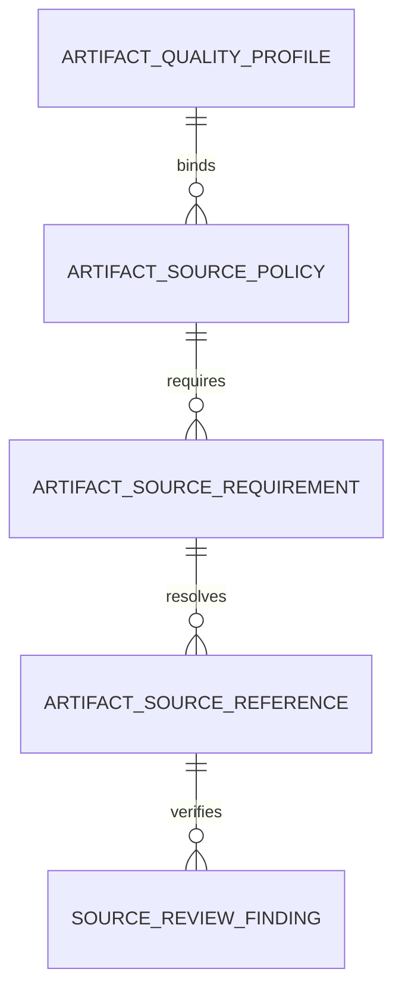

# Source-First Reference Artifacts

## Contract Scenarios
<!-- type: scenarios lang: yaml -->

```yaml
id: source-first-reference-artifacts-scenarios
scenarios:
  - id: S1
    title: required source blocks missing-reference implementation
    given:
      - "an artifact quality profile requires a concrete source reference"
      - "the implementation claims fidelity to that source"
      - "the source reference is missing"
    when:
      - "CB review evaluates artifact source policies"
    then:
      - "review emits a hard missing_source_reference finding"
      - "the artifact does not pass as source-backed"
  - id: S2
    title: source-backed artifact passes with reference evidence
    given:
      - "the artifact carries a CLI transcript or API contract source reference"
      - "the source reference is available"
      - "the implementation cites that source reference"
    when:
      - "CB review evaluates artifact source policies"
    then:
      - "review records source_backed=true"
      - "no missing_source_reference finding is emitted"
  - id: S3
    title: unavailable source is explicit HITL
    given:
      - "the source reference cannot be produced by the agent"
      - "the policy allows source_not_available"
    when:
      - "the artifact gate evaluates the policy"
    then:
      - "the artifact is marked hitl_required"
      - "fake generated references are rejected"
```
## Contract Mindmap
<!-- type: mindmap lang: mermaid -->


## Contract State Machine
<!-- type: state-machine lang: mermaid -->


## Contract Interaction
<!-- type: interaction lang: mermaid -->


## Contract Logic
<!-- type: logic lang: mermaid -->


## Contract Dependency
<!-- type: dependency lang: mermaid -->


## Contract DB Model
<!-- type: db-model lang: mermaid -->


## Contract Schema
<!-- type: schema lang: yaml -->

```yaml
$schema: "https://json-schema.org/draft/2020-12/schema"
$id: "aw.source-first-reference-artifacts.contract"
title: SourceFirstReferenceArtifacts
type: object
definitions:
  ArtifactSourceKind:
    type: string
    enum: [visual_reference, cli_transcript, api_contract, doc_outline, validation_inventory]
  ArtifactSourceAvailability:
    type: string
    enum: [available, missing, source_not_available]
  SourceFailureMode:
    type: string
    enum: [hard_fail, hitl_required, advisory]
  ArtifactSourceRequirement:
    type: object
    required: [kind, required, failure_mode]
    properties:
      kind: { $ref: "#/definitions/ArtifactSourceKind" }
      required: { type: boolean }
      failure_mode: { $ref: "#/definitions/SourceFailureMode" }
      rationale: { type: string }
  ArtifactSourceReference:
    type: object
    required: [id, kind, availability]
    properties:
      id: { type: string, minLength: 1 }
      kind: { $ref: "#/definitions/ArtifactSourceKind" }
      availability: { $ref: "#/definitions/ArtifactSourceAvailability" }
      citation: { type: string }
      transcript: { type: string }
      request_response: { type: string }
      outline: { type: string }
  ArtifactSourcePolicy:
    type: object
    required: [profile_name, requirements]
    properties:
      profile_name: { type: string, minLength: 1 }
      requirements:
        type: array
        items: { $ref: "#/definitions/ArtifactSourceRequirement" }
  SourceReviewFinding:
    type: object
    required: [code, severity, message]
    properties:
      code: { type: string }
      severity: { type: string, enum: [hard, advisory, hitl] }
      message: { type: string }
  SourceReferenceReview:
    type: object
    required: [source_backed, findings]
    properties:
      source_backed: { type: boolean }
      findings:
        type: array
        items: { $ref: "#/definitions/SourceReviewFinding" }
properties:
  policy: { $ref: "#/definitions/ArtifactSourcePolicy" }
  references:
    type: array
    items: { $ref: "#/definitions/ArtifactSourceReference" }
  review: { $ref: "#/definitions/SourceReferenceReview" }
```
## Contract REST API
<!-- type: rest-api lang: yaml -->

```yaml
openapi: 3.1.0
info:
  title: Source First Reference Artifact Contract
  version: 0.1.0
paths: {}
components:
  schemas:
    ArtifactSourcePolicy:
      type: object
      required: [profile_name, requirements]
    ArtifactSourceReference:
      type: object
      required: [id, kind, availability]
    SourceReferenceReview:
      type: object
      required: [source_backed, findings]
```
## Contract RPC API
<!-- type: rpc-api lang: yaml -->

```yaml
openrpc: 1.3.2
info:
  title: Source First Reference Artifact RPC
  version: 0.1.0
methods:
  - name: artifact.source.evaluate
    params:
      - name: policy
        schema: { type: object }
      - name: references
        schema: { type: array, items: { type: object } }
    result:
      name: review
      schema: { type: object }
components:
  schemas:
    ArtifactSourcePolicy: { type: object }
    ArtifactSourceReference: { type: object }
    SourceReferenceReview: { type: object }
```
## Contract Async API
<!-- type: async-api lang: yaml -->

```yaml
asyncapi: 2.6.0
info:
  title: Source First Reference Artifact Events
  version: 0.1.0
channels: {}
components:
  messages:
    SourceReferenceMissing:
      payload:
        type: object
        required: [artifact_id, policy_kind]
        properties:
          artifact_id: { type: string }
          policy_kind: { type: string }
```
## Contract CLI
<!-- type: cli lang: yaml -->

```yaml
commands:
  - name: aw
    subcommands:
      - name: cb
        subcommands:
          - name: review
            source_policy_inputs:
              - artifact_quality_profile
              - artifact_source_policy
              - artifact_source_reference
      - name: project
        subcommands:
          - name: health
            reports:
              - missing_source_reference
              - source_not_available
```
## Contract Wireframe
<!-- type: wireframe lang: yaml -->

```yaml
layout:
  kind: non_visual_contract
  screens: []
  note: source-first reference artifacts add model and review behavior only
```
## Contract Component
<!-- type: component lang: yaml -->

```yaml
customElementsManifest:
  schemaVersion: "1.0.0"
  modules: []
  note: no browser component surface
```
## Contract Design Token
<!-- type: design-token lang: yaml -->

```yaml
tokens:
  sourceReference:
    required:
      value: "#b42318"
      type: color
    available:
      value: "#027a48"
      type: color
    hitl:
      value: "#b54708"
      type: color
```
## Contract Config
<!-- type: config lang: yaml -->

```yaml
$schema: "https://json-schema.org/draft/2020-12/schema"
title: SourceFirstReferenceConfig
type: object
properties:
  source_first_reference_artifacts:
    type: object
    properties:
      enabled: { type: boolean, default: true }
      fail_missing_required_source: { type: boolean, default: true }
      allow_source_not_available_hitl: { type: boolean, default: true }
```
## Contract Manifest
<!-- type: manifest lang: yaml -->

```yaml
package:
  name: agentic-workflow
  dependencies:
    serde: existing
    serde_json: existing
  new_dependencies: []
```
## Contract Runtime Image
<!-- type: runtime-image lang: yaml -->

```yaml
runtime_image:
  required: false
  reason: source-first reference artifact review is compiled into the existing aw binary
  build_context: null
```
## Contract Deployment
<!-- type: deployment lang: yaml -->

```yaml
deployment:
  required: false
  manifests: []
  operational_effect: local CLI review behavior only
```
## Contract Unit Test
<!-- type: unit-test lang: mermaid -->

```mermaid
---
id: source-first-reference-artifacts-unit-test
coverage_kind: unit
strategy: validate source policy binding and review findings
evidence:
  source_tests:
    - projects/agentic-workflow/src/models/source_reference.rs
---
requirementDiagram
  requirement missing_required_source {
    id: UT1
    text: required policy with missing source emits hard missing_source_reference
    risk: medium
    verifymethod: test
  }
  requirement source_backed_pass {
    id: UT2
    text: available CLI transcript or API contract source passes as source-backed
    risk: medium
    verifymethod: test
  }
  requirement source_not_available_hitl {
    id: UT3
    text: explicit source_not_available emits hitl finding instead of fake source evidence
    risk: medium
    verifymethod: test
  }
```
## Contract E2E Test
<!-- type: e2e-test lang: yaml -->

```yaml
e2e_tests:
  - id: missing-source-review-fails
    name: missing source review fails
    command: cargo test -p agentic-workflow source_reference_missing_required_source -- --nocapture
    steps:
      - create artifact source policy requiring cli_transcript
      - omit matching artifact source reference
      - run source reference review
    assertions:
      - source_backed is false
      - finding code is missing_source_reference
  - id: api-contract-source-passes
    name: api contract source passes
    command: cargo test -p agentic-workflow source_reference_api_contract_source_backed -- --nocapture
    steps:
      - create artifact source policy requiring api_contract
      - attach source reference with request_response evidence
      - run source reference review
    assertions:
      - source_backed is true
      - findings is empty
```
## Contract Changes
<!-- type: changes lang: yaml -->

```yaml
changes:
  - path: projects/agentic-workflow/tech-design/surface/specs/aw-source-first-reference-artifacts.md
    action: create
    section: schema
    impl_mode: hand-written
    description: "Canonical source-first reference artifact policy."
  - path: projects/agentic-workflow/src/models/source_reference.rs
    action: create
    section: schema
    impl_mode: hand-written
    description: "ArtifactSourcePolicy, source references, review findings, and source-backed evaluation helper."
  - path: projects/agentic-workflow/src/models/mod.rs
    action: modify
    section: dependency
    impl_mode: hand-written
    description: "Expose source reference models beside artifact quality models."
```

# Reviews

### Review 1
**Verdict:** approved

- [schema] Contract includes source kinds, availability, failure modes, requirements, references, and review findings needed for implementation.
- [logic] Review path distinguishes pass, hard missing-source failure, and HITL source_not_available handling.
- [unit-test] Unit coverage maps directly to missing required source, source-backed pass, and HITL unavailable source cases.
- [changes] Implementation scope is bounded to a new model module plus canonical surface spec.
