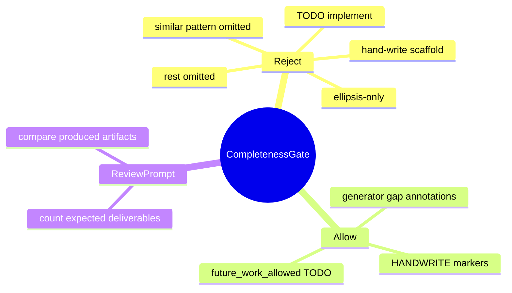
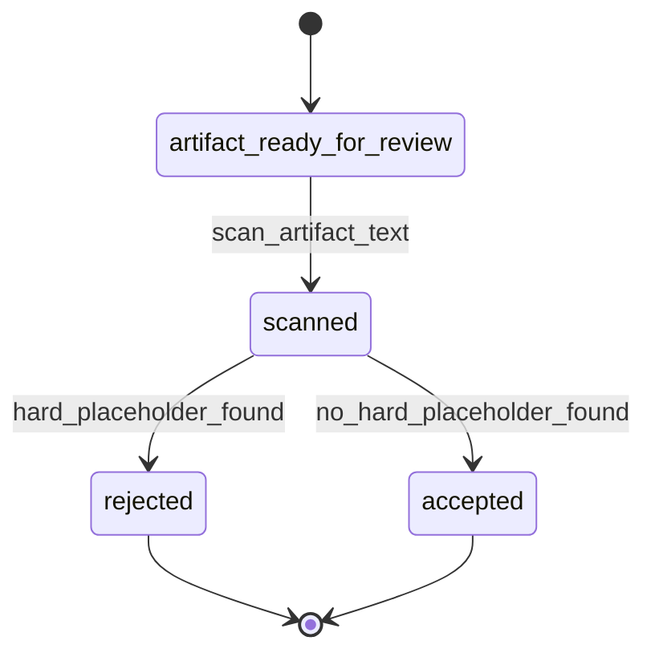
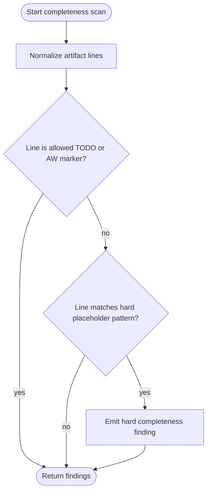
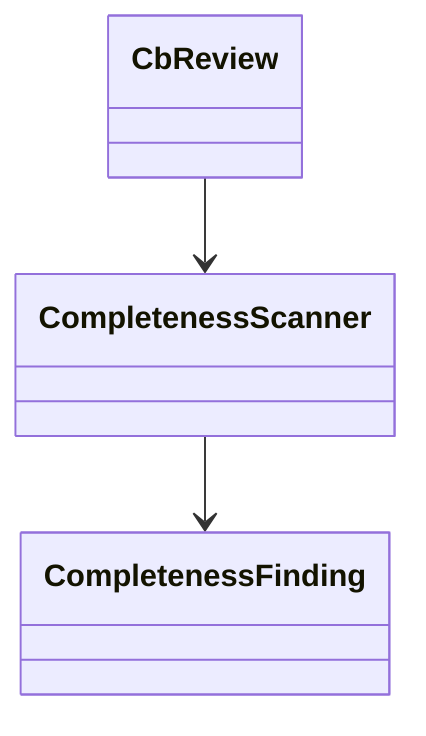
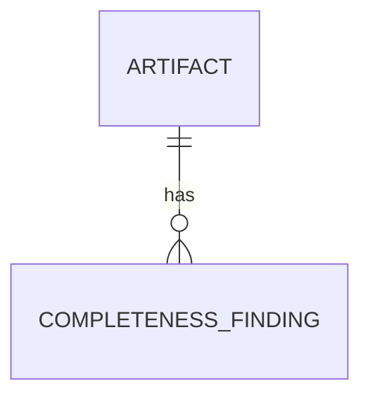
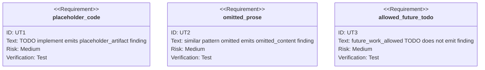

# Completeness Placeholder Gate

## Contract Scenarios
<!-- type: scenarios lang: yaml -->

```yaml
id: completeness-placeholder-gate-scenarios
scenarios:
  - id: S1
    title: placeholder code is rejected
    given: ["an artifact is reviewed as complete", "the artifact contains TODO implement text"]
    when: ["CB review evaluates completeness placeholders"]
    then: ["a hard placeholder_artifact finding is emitted"]
  - id: S2
    title: omitted prose is rejected
    given: ["a markdown artifact says similar pattern omitted"]
    when: ["CB review evaluates completeness placeholders"]
    then: ["a hard omitted_content finding is emitted"]
  - id: S3
    title: allowed future TODO passes
    given: ["a TODO is explicitly marked future_work_allowed"]
    when: ["CB review evaluates completeness placeholders"]
    then: ["no placeholder finding is emitted"]
```
## Contract Mindmap
<!-- type: mindmap lang: mermaid -->


## Contract State Machine
<!-- type: state-machine lang: mermaid -->


## Contract Interaction
<!-- type: interaction lang: mermaid -->

```mermaid
---
id: completeness-placeholder-gate-interaction
actors:
  - { id: reviewer, kind: system }
  - { id: artifact, kind: participant }
  - { id: scanner, kind: system }
messages:
  - { from: reviewer, to: artifact, name: read_artifact_text }
  - { from: reviewer, to: scanner, name: scan_for_placeholders }
  - { from: scanner, to: reviewer, name: return_findings, returns: CompletenessFinding[] }
---
sequenceDiagram
  participant reviewer
  participant artifact
  participant scanner
  reviewer->>artifact: read_artifact_text
  reviewer->>scanner: scan_for_placeholders
  scanner-->>reviewer: return_findings
```
## Contract Logic
<!-- type: logic lang: mermaid -->


## Contract Dependency
<!-- type: dependency lang: mermaid -->


## Contract DB Model
<!-- type: db-model lang: mermaid -->


## Contract Schema
<!-- type: schema lang: yaml -->

```yaml
definitions:
  CompletenessFinding:
    fields:
      code: string
      artifact_ref: string
      line: integer
      pattern: string
      message: string
  CompletenessScan:
    fields:
      artifact_ref: string
      findings: CompletenessFinding[]
allowed_markers:
  - HANDWRITE-BEGIN
  - HANDWRITE-END
  - generator-gap
  - future_work_allowed
```
## Contract REST API
<!-- type: rest-api lang: yaml -->

```yaml
openapi: 3.1.0
info: { title: Completeness Placeholder Gate, version: 0.1.0 }
paths: {}
components:
  schemas:
    CompletenessFinding: { type: object }
```
## Contract RPC API
<!-- type: rpc-api lang: yaml -->

```yaml
openrpc: 1.3.2
info: { title: Completeness Placeholder Gate RPC, version: 0.1.0 }
methods:
  - name: artifact.completeness.scan
    params:
      - { name: artifact_text, schema: { type: string } }
    result:
      name: findings
      schema: { type: array, items: { type: object } }
components:
  schemas:
    CompletenessFinding: { type: object }
```
## Contract Async API
<!-- type: async-api lang: yaml -->

```yaml
asyncapi: 2.6.0
info: { title: Completeness Placeholder Gate Events, version: 0.1.0 }
channels: {}
components:
  messages:
    PlaceholderArtifactRejected:
      payload:
        type: object
        required: [artifact_ref, code]
```
## Contract CLI
<!-- type: cli lang: yaml -->

```yaml
commands:
  - name: aw
    subcommands:
      - name: cb
        subcommands:
          - name: review
            prompt_requirements:
              - count expected deliverables
              - reject placeholder or omitted artifacts
              - allow explicit AW ownership markers
```
## Contract Wireframe
<!-- type: wireframe lang: yaml -->

```yaml
layout:
  kind: non_visual_contract
  screens: []
```
## Contract Component
<!-- type: component lang: yaml -->

```yaml
customElementsManifest:
  schemaVersion: "1.0.0"
  modules: []
```
## Contract Design Token
<!-- type: design-token lang: yaml -->

```yaml
tokens:
  completenessFinding:
    hard:
      value: "#b42318"
      type: color
```
## Contract Config
<!-- type: config lang: yaml -->

```yaml
placeholder_completeness_gate:
  enabled: true
  allow_aw_ownership_markers: true
  allow_future_work_marker: future_work_allowed
```
## Contract Manifest
<!-- type: manifest lang: yaml -->

```yaml
package:
  name: agentic-workflow
  new_dependencies: []
```
## Contract Runtime Image
<!-- type: runtime-image lang: yaml -->

```yaml
runtime_image:
  required: false
  reason: local review helper only
```
## Contract Deployment
<!-- type: deployment lang: yaml -->

```yaml
deployment:
  required: false
  manifests: []
```
## Contract Unit Test
<!-- type: unit-test lang: mermaid -->


## Contract E2E Test
<!-- type: e2e-test lang: yaml -->

```yaml
e2e_tests:
  - id: placeholder-completeness-unit-gate
    name: placeholder completeness unit gate
    command: cargo test -p agentic-workflow completeness_placeholder -- --nocapture
    steps:
      - run targeted completeness placeholder tests
    assertions:
      - placeholder code rejected
      - omitted prose rejected
      - explicit future TODO allowed
```
## Contract Changes
<!-- type: changes lang: yaml -->

```yaml
changes:
  - path: projects/agentic-workflow/tech-design/surface/specs/aw-completeness-placeholder-gate.md
    action: create
    section: schema
    impl_mode: hand-written
    description: "Canonical completeness placeholder gate contract."
  - path: projects/agentic-workflow/src/cli/cb_review.rs
    action: modify
    section: logic
    impl_mode: hand-written
    description: "Completeness placeholder scanner, review prompt context, and unit tests."
```

# Reviews

### Review 1
**Verdict:** approved

- [logic] The scanner flow is implementable and clearly separates allowed AW ownership markers from hard placeholder findings.
- [schema] CompletenessFinding carries the fields needed for deterministic unit assertions and review output.
- [cli] Review prompt requirements cover deliverable counting, produced artifact comparison, and explicit placeholder rejection.
- [unit-test] The tests cover placeholder code, omitted prose, and the explicit future-work allowance required by the issue.
- [changes] The implementation scope is bounded to the canonical spec and CB review module.
