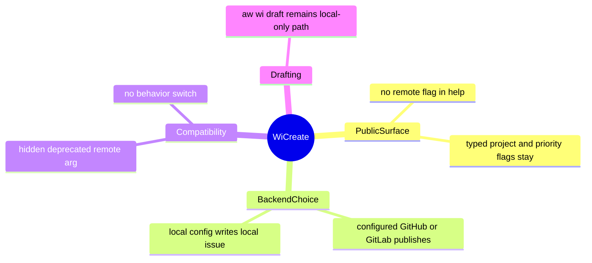
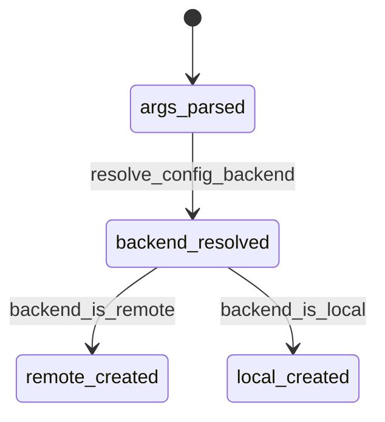
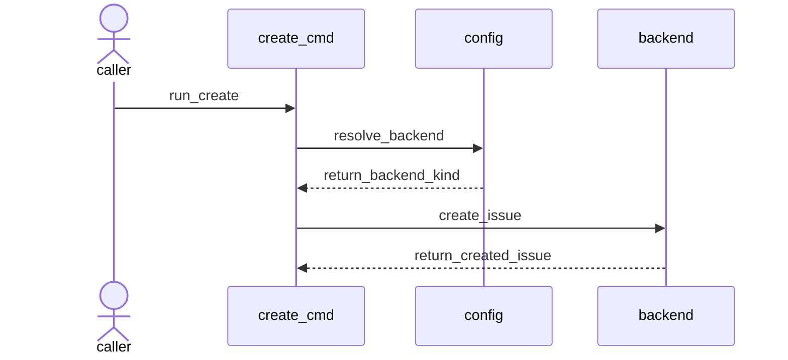
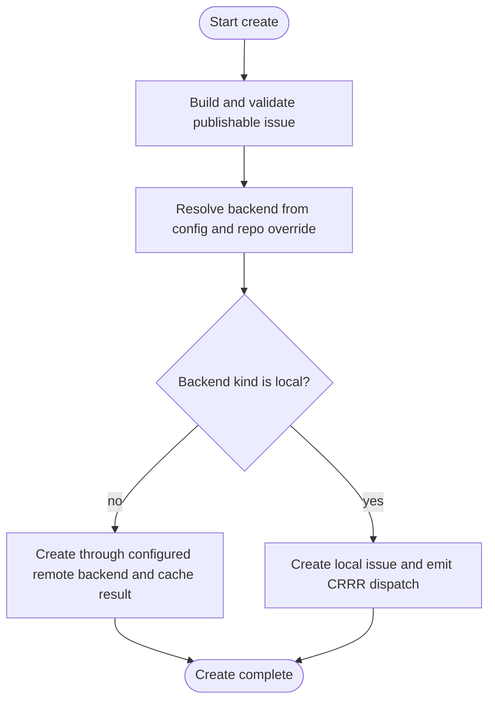
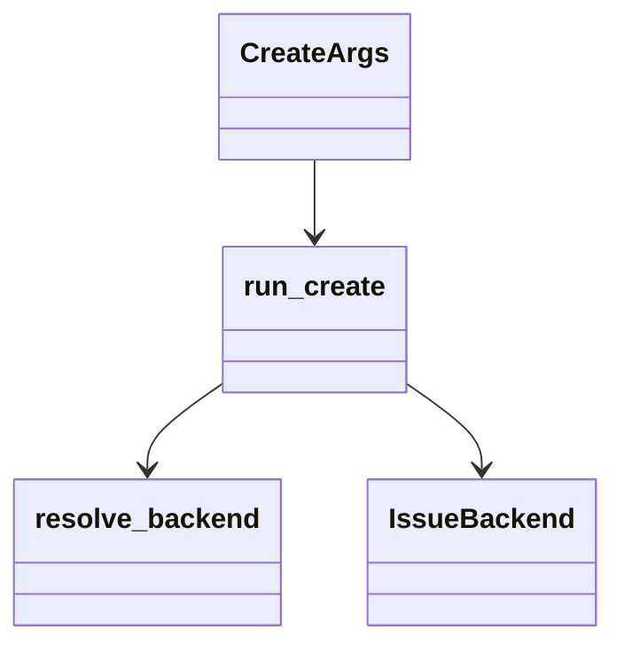
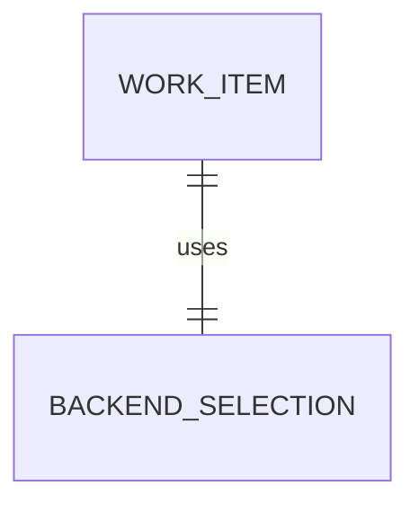

# WI Create Configured Backend

## Contract Scenarios
<!-- type: scenarios lang: yaml -->

```yaml
id: wi-create-configured-backend-scenarios
scenarios:
  - id: S1
    title: create help hides remote flag
    given: ["a user runs aw wi create --help"]
    when: ["clap renders CreateArgs help"]
    then: ["--remote is not listed as a public option"]
  - id: S2
    title: create uses configured remote backend by default
    given: ["the configured issue backend is GitHub or GitLab"]
    when: ["aw wi create receives a publishable work item without --remote"]
    then: ["the work item is created through the configured backend"]
  - id: S3
    title: old remote flag remains hidden no-op
    given: ["an old caller still passes --remote"]
    when: ["clap parses aw wi create arguments"]
    then: ["the invocation parses successfully", "backend selection remains config-driven"]
  - id: S4
    title: explicit draft path owns local drafting
    given: ["a user wants local-only draft authoring"]
    when: ["the user runs aw wi draft"]
    then: ["local draft behavior remains separate from aw wi create"]
```
## Contract Mindmap
<!-- type: mindmap lang: mermaid -->


## Contract State Machine
<!-- type: state-machine lang: mermaid -->


## Contract Interaction
<!-- type: interaction lang: mermaid -->


## Contract Logic
<!-- type: logic lang: mermaid -->


## Contract Dependency
<!-- type: dependency lang: mermaid -->


## Contract DB Model
<!-- type: db-model lang: mermaid -->


## Contract Schema
<!-- type: schema lang: yaml -->

```yaml
definitions:
  CreateCompatibility:
    fields:
      public_remote_flag: boolean
      accepts_hidden_remote_arg: boolean
      backend_source: string
values:
  public_remote_flag: false
  accepts_hidden_remote_arg: true
  backend_source: ".aw/config.toml"
```
## Contract REST API
<!-- type: rest-api lang: yaml -->

```yaml
openapi: 3.1.0
info: { title: WI Create Configured Backend, version: 0.1.0 }
paths: {}
components: {}
```
## Contract RPC API
<!-- type: rpc-api lang: yaml -->

```yaml
openrpc: 1.3.2
info: { title: WI Create Configured Backend RPC, version: 0.1.0 }
methods: []
components: {}
```
## Contract Async API
<!-- type: async-api lang: yaml -->

```yaml
asyncapi: 2.6.0
info: { title: WI Create Configured Backend Events, version: 0.1.0 }
channels: {}
components: {}
```
## Contract CLI
<!-- type: cli lang: yaml -->

```yaml
commands:
  - name: aw
    subcommands:
      - name: wi
        subcommands:
          - name: create
            public_args:
              - --title
              - --type
              - --body
              - --body-file
              - --project
              - --priority
              - --agent
              - --json
              - --repo
            hidden_compat_args:
              - --remote
            behavior:
              backend_selection: configured_backend
              local_draft_path: aw wi draft
```
## Contract Wireframe
<!-- type: wireframe lang: yaml -->

```yaml
layout:
  kind: cli_help_text
  screens:
    - id: wi-create-help
      hidden_options: ["--remote"]
```
## Contract Component
<!-- type: component lang: yaml -->

```yaml
customElementsManifest:
  schemaVersion: "1.0.0"
  modules: []
```
## Contract Design Token
<!-- type: design-token lang: yaml -->

```yaml
tokens: {}
```
## Contract Config
<!-- type: config lang: yaml -->

```yaml
config:
  issue_platform:
    source: .aw/config.toml
    create_default: configured_backend
```
## Contract Manifest
<!-- type: manifest lang: yaml -->

```yaml
package:
  name: agentic-workflow
  new_dependencies: []
```
## Contract Runtime Image
<!-- type: runtime-image lang: yaml -->

```yaml
runtime_image:
  required: false
```
## Contract Deployment
<!-- type: deployment lang: yaml -->

```yaml
deployment:
  required: false
```
## Contract Unit Test
<!-- type: unit-test lang: mermaid -->

```mermaid
---
id: wi-create-configured-backend-unit-test
coverage_kind: unit
strategy: clap help and compatibility parsing
evidence:
  source_tests:
    - projects/agentic-workflow/src/cli/issues.rs
---
requirementDiagram
  requirement help_hides_remote {
    id: UT1
    text: CreateArgs rendered help omits --remote
    risk: medium
    verifymethod: test
  }
  requirement remote_compat_parse {
    id: UT2
    text: hidden deprecated --remote parses for old callers
    risk: medium
    verifymethod: test
  }
  requirement default_backend_logic {
    id: UT3
    text: run_create resolves configured backend before selecting local or remote create path
    risk: medium
    verifymethod: inspection
  }
```
## Contract E2E Test
<!-- type: e2e-test lang: yaml -->

```yaml
e2e_tests:
  - id: wi-create-remote-flag-tests
    name: wi create remote flag compatibility tests
    command: cargo test -p agentic-workflow wi_create_remote -- --nocapture
    assertions:
      - create help hides remote flag
      - hidden remote compatibility flag parses
      - create behavior is config-driven
  - id: wi-create-help-smoke
    name: wi create help hides remote flag
    command: ./target/debug/aw wi create --help
    assertions:
      - stdout does not contain --remote
```
## Contract Changes
<!-- type: changes lang: yaml -->

```yaml
changes:
  - path: projects/agentic-workflow/src/cli/issues.rs
    action: modify
    section: cli
    impl_mode: hand-written
    description: "Hide deprecated --remote, make create backend selection config-driven, and add compatibility tests."
  - path: projects/agentic-workflow/tech-design/surface/specs/aw-wi-create-remove-remote-flag.md
    action: create
    section: schema
    impl_mode: hand-written
    description: "Canonical contract for configured-backend wi create behavior."
```

# Reviews

### Review 1
**Verdict:** approved

- [scenarios] Acceptance paths cover public help removal, configured backend default, compatibility parsing, and draft separation.
- [logic] Backend resolution and local-vs-remote branching are explicit enough to implement from `issues.rs`.
- [cli] The public and hidden compatibility arg surfaces are unambiguous.
- [unit-test] The tests directly cover help output and hidden old-caller behavior.
- [changes] Implementation is scoped to `issues.rs` and the canonical TD.
