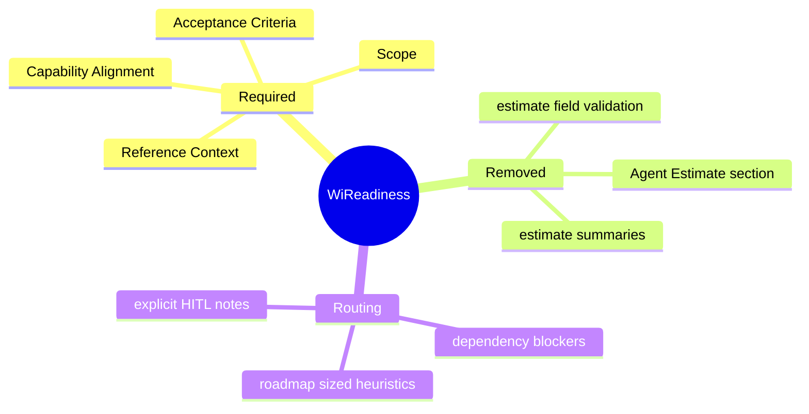
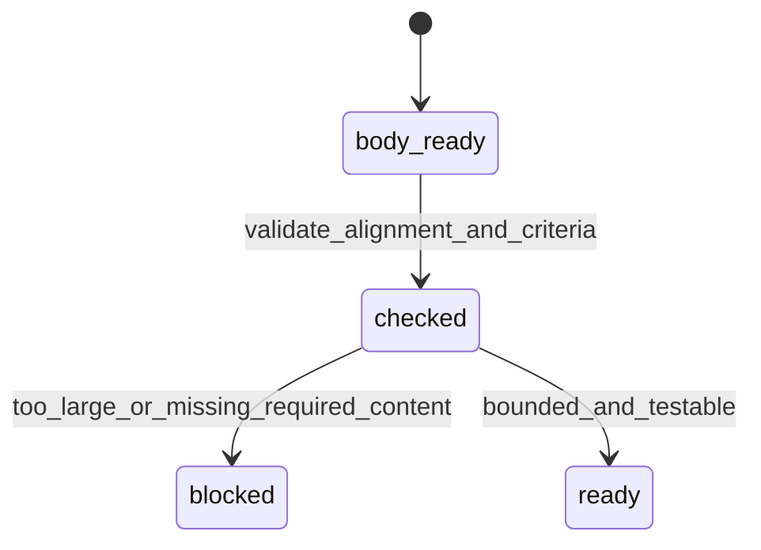
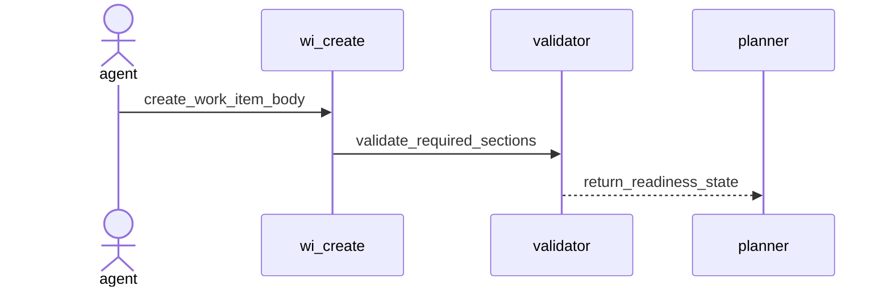
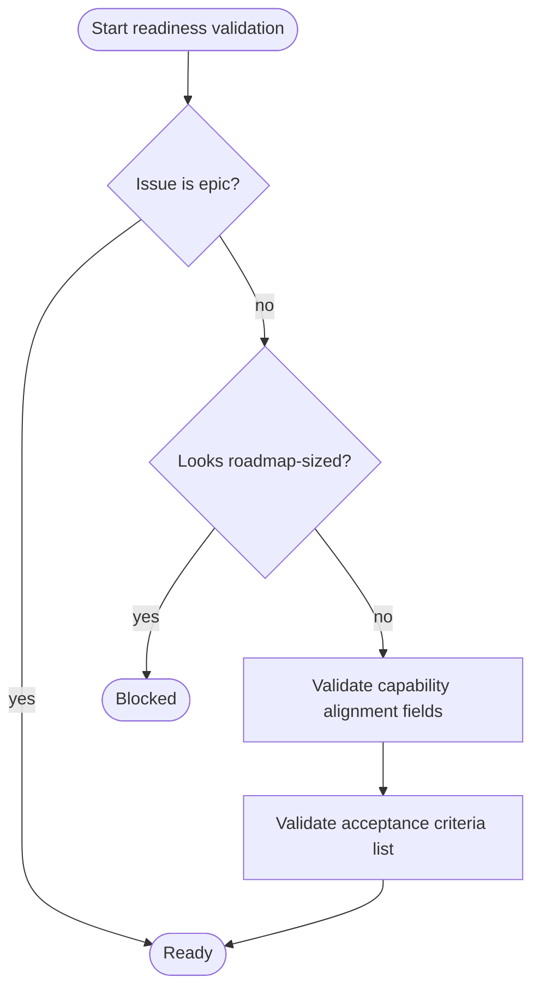
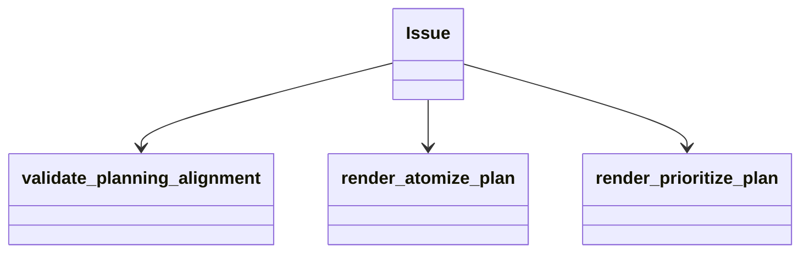
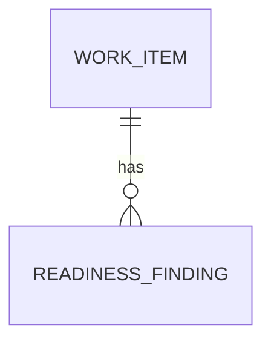

# WI Readiness Without Agent Estimate

## Contract Scenarios
<!-- type: scenarios lang: yaml -->

```yaml
id: wi-readiness-without-agent-estimate-scenarios
scenarios:
  - id: S1
    title: bounded non-epic passes without estimate section
    given: ["a non-epic work item has capability alignment and acceptance criteria"]
    when: ["work-item readiness validation runs"]
    then: ["no estimate-field error is emitted"]
  - id: S2
    title: old estimate section remains readable
    given: ["a legacy work item still contains an Agent Estimate section"]
    when: ["the work item is parsed or updated"]
    then: ["the old section is treated as inert body content"]
  - id: S3
    title: planning output avoids estimate summaries
    given: ["atomize or prioritize renders planning artifacts"]
    when: ["the artifact is inspected"]
    then: ["agent-time estimate fields are absent"]
  - id: S4
    title: create template omits estimate section
    given: ["aw wi create generates a default body"]
    when: ["the body is inspected"]
    then: ["no Agent Estimate section is included"]
```
## Contract Mindmap
<!-- type: mindmap lang: mermaid -->


## Contract State Machine
<!-- type: state-machine lang: mermaid -->


## Contract Interaction
<!-- type: interaction lang: mermaid -->


## Contract Logic
<!-- type: logic lang: mermaid -->


## Contract Dependency
<!-- type: dependency lang: mermaid -->


## Contract DB Model
<!-- type: db-model lang: mermaid -->


## Contract Schema
<!-- type: schema lang: yaml -->

```yaml
definitions:
  ReadinessFinding:
    fields:
      code: string
      message: string
required_sections:
  - Capability Alignment
  - Acceptance Criteria
  - Scope
  - Reference Context
removed_sections:
  - Agent Estimate
```
## Contract REST API
<!-- type: rest-api lang: yaml -->

```yaml
openapi: 3.1.0
info: { title: WI Readiness Without Estimate, version: 0.1.0 }
paths: {}
components: {}
```
## Contract RPC API
<!-- type: rpc-api lang: yaml -->

```yaml
openrpc: 1.3.2
info: { title: WI Readiness Without Estimate RPC, version: 0.1.0 }
methods: []
components: {}
```
## Contract Async API
<!-- type: async-api lang: yaml -->

```yaml
asyncapi: 2.6.0
info: { title: WI Readiness Without Estimate Events, version: 0.1.0 }
channels: {}
components: {}
```
## Contract CLI
<!-- type: cli lang: yaml -->

```yaml
commands:
  - name: aw
    subcommands:
      - name: wi
        affected:
          - create
          - validate
          - fill-section
          - atomize
          - prioritize
        removed_public_surface:
          - Agent Estimate section requirement
          - estimate field validation
```
## Contract Wireframe
<!-- type: wireframe lang: yaml -->

```yaml
layout:
  kind: markdown_body_template
  removed_sections: ["Agent Estimate"]
```
## Contract Component
<!-- type: component lang: yaml -->

```yaml
customElementsManifest:
  schemaVersion: "1.0.0"
  modules: []
```
## Contract Design Token
<!-- type: design-token lang: yaml -->

```yaml
tokens: {}
```
## Contract Config
<!-- type: config lang: yaml -->

```yaml
config:
  required: false
```
## Contract Manifest
<!-- type: manifest lang: yaml -->

```yaml
package:
  name: agentic-workflow
  new_dependencies: []
```
## Contract Runtime Image
<!-- type: runtime-image lang: yaml -->

```yaml
runtime_image:
  required: false
```
## Contract Deployment
<!-- type: deployment lang: yaml -->

```yaml
deployment:
  required: false
```
## Contract Unit Test
<!-- type: unit-test lang: mermaid -->

```mermaid
---
id: wi-readiness-without-agent-estimate-unit-test
coverage_kind: unit
strategy: readiness validation and output text
evidence:
  source_tests:
    - projects/agentic-workflow/src/cli/issues.rs
---
requirementDiagram
  requirement no_estimate_required {
    id: UT1
    text: bounded non-epic passes without estimate section
    risk: medium
    verifymethod: test
  }
  requirement legacy_estimate_ok {
    id: UT2
    text: legacy estimate section is accepted as inert content
    risk: medium
    verifymethod: test
  }
  requirement output_text_clean {
    id: UT3
    text: planning output omits estimate summaries
    risk: medium
    verifymethod: test
  }
```
## Contract E2E Test
<!-- type: e2e-test lang: yaml -->

```yaml
e2e_tests:
  - id: wi-remove-agent-estimate-unit-command
    name: wi remove agent estimate unit tests
    command: cargo test -p agentic-workflow wi_remove_agent_estimate -- --nocapture
    assertions:
      - bounded non-epic validates without estimate section
      - legacy estimate section remains parseable
      - generated body and planning output omit estimate fields
```
## Contract Changes
<!-- type: changes lang: yaml -->

```yaml
changes:
  - path: projects/agentic-workflow/src/cli/issues.rs
    action: modify
    section: logic
    impl_mode: hand-written
    description: "Remove estimate section from templates, prompts, readiness validation, and planning output."
  - path: AGENTS.md
    action: modify
    section: cli
    impl_mode: hand-written
    description: "Remove estimate requirements from operating instructions."
  - path: CLAUDE.md
    action: modify
    section: cli
    impl_mode: hand-written
    description: "Remove estimate requirements from operating instructions."
  - path: .agents/skills/aw-wi/SKILL.md
    action: modify
    section: cli
    impl_mode: hand-written
    description: "Remove bounded WI gate references to estimate fields."
  - path: projects/agentic-workflow/tech-design/surface/specs/aw-wi-remove-agent-estimate.md
    action: create
    section: schema
    impl_mode: hand-written
    description: "Canonical contract for readiness without estimate fields."
```

# Reviews

### Review 1
**Verdict:** approved

- [logic] Readiness validation is clear: keep boundedness and testability checks, remove estimate-field gates.
- [cli] Create, validate, fill-section, atomize, and prioritize surfaces are identified.
- [schema] Required and removed section lists make compatibility behavior explicit.
- [unit-test] Tests cover no-estimate validation, legacy inert content, and clean planning output.
- [changes] The affected files match the issue scope and include repo instructions plus skill docs.
