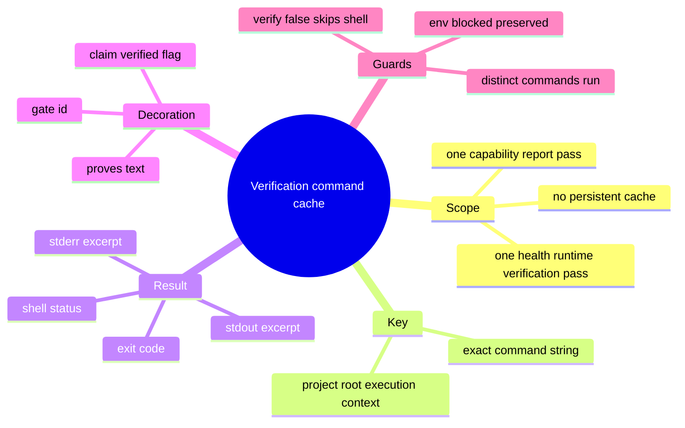
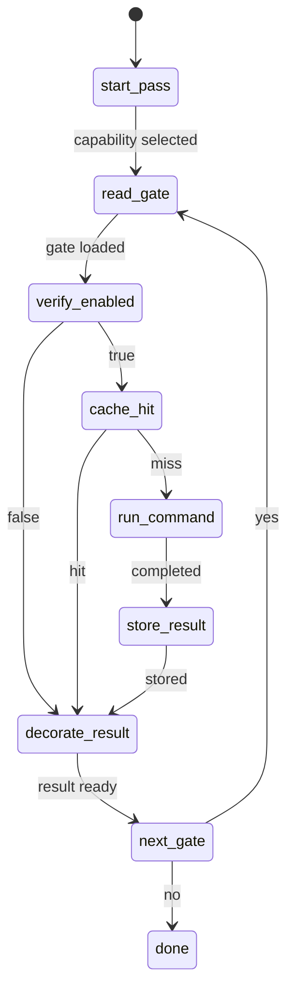
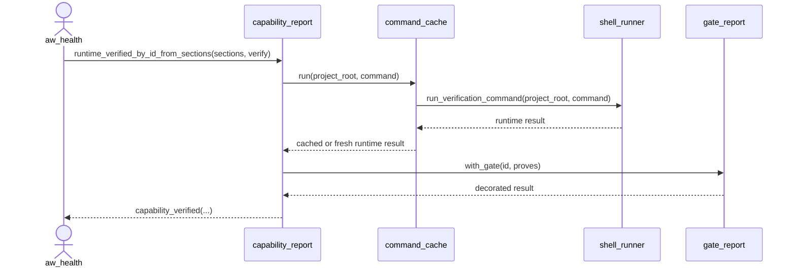
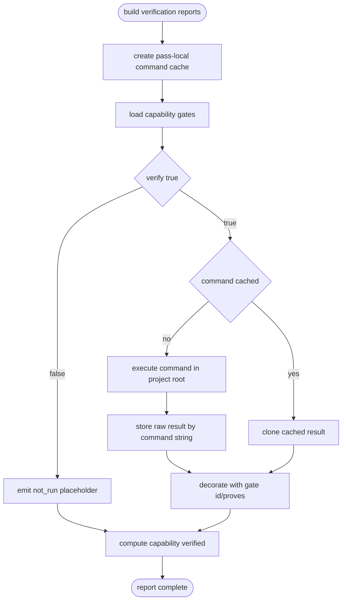
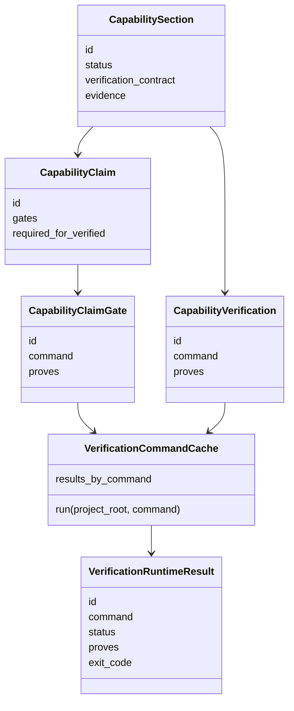
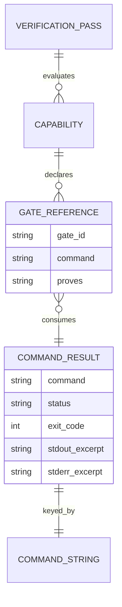

# Deduplicate Capability Verification Commands

## Contract Scenarios
<!-- type: scenarios lang: yaml -->

```yaml
id: aw-verification-command-cache-scenarios
scenarios:
  - id: duplicate_claim_gate_command_runs_once
    given:
      - "two capability roots declare claim gates with the same command string"
      - "the same AW verification pass evaluates both roots"
    when:
      - "capability verification executes the gates"
    then:
      - "the shell command is executed once"
      - "both claim reports receive gate-specific id/proves metadata"
      - "both capability verified flags are computed from the shared result"
  - id: duplicate_evidence_command_runs_once
    given:
      - "two legacy evidence verification entries share the same command string"
      - "the same AW verification pass evaluates both roots"
    when:
      - "verification results are built for the capability report"
    then:
      - "the command result is reused"
      - "each result is decorated with the consuming gate id and proves text"
  - id: non_verify_mode_does_not_run_cache
    given:
      - "verification is disabled"
    when:
      - "capability reports are built"
    then:
      - "no shell command is executed"
      - "not_run placeholders remain unchanged"
  - id: command_string_is_cache_key
    given:
      - "two commands differ by any byte"
    when:
      - "the verification pass evaluates both commands"
    then:
      - "each distinct command executes independently"
```
## Contract Mindmap
<!-- type: mindmap lang: mermaid -->


## Contract State Machine
<!-- type: state-machine lang: mermaid -->


## Contract Interaction
<!-- type: interaction lang: mermaid -->


## Contract Logic
<!-- type: logic lang: mermaid -->


## Contract Dependency
<!-- type: dependency lang: mermaid -->


## Contract Data Model
<!-- type: db-model lang: mermaid -->


## Contract Schema
<!-- type: schema lang: yaml -->

```yaml
$schema: "https://json-schema.org/draft/2020-12/schema"
$id: "aw-verification-command-cache.schema.json"
title: "Verification command cache contract"
type: object
required: [command, status]
properties:
  command:
    type: string
    description: "Exact shell command string used as the pass-local cache key."
  status:
    type: string
    enum: [pass, fail, env_blocked, error, not_run]
  exit_code:
    type: [integer, "null"]
  stdout:
    type: [string, "null"]
  stderr:
    type: [string, "null"]
additionalProperties: false
```
## Contract REST API
<!-- type: rest-api lang: yaml -->

```yaml
openapi: 3.1.0
info:
  title: "No REST API change"
  version: "0.0.0"
paths: {}
components:
  schemas: {}
x-aw-contract:
  surface: none
  reason: "The change is internal CLI verification execution behavior."
```
## Contract RPC API
<!-- type: rpc-api lang: yaml -->

```yaml
openrpc: 1.3.2
info:
  title: "No JSON-RPC API change"
  version: "0.0.0"
methods: []
x-aw-contract:
  surface: none
  reason: "No RPC server or method schema is changed."
```
## Contract Async API
<!-- type: async-api lang: yaml -->

```yaml
asyncapi: 2.6.0
info:
  title: "No async API change"
  version: "0.0.0"
channels: {}
x-aw-contract:
  surface: none
  reason: "No pub-sub, WebSocket, or event stream contract is changed."
```
## Contract CLI
<!-- type: cli lang: yaml -->

```yaml
commands:
  - name: aw health
    behavior:
      - "When capability verification is enabled, duplicate capability gate commands are executed once per verification pass."
      - "JSON output shape remains unchanged."
  - name: aw capability report --verify
    behavior:
      - "Duplicate claim or evidence gate commands are executed once per report pass."
      - "Per-gate id, proves, stdout, stderr, exit_code, and status fields remain available."
  - name: aw capability check --verify
    behavior:
      - "Uses the same report-building path and inherits command de-duplication."
```
## Contract Wireframe
<!-- type: wireframe lang: yaml -->

```yaml
layout:
  id: aw-verification-command-cache-wireframe
  surfaces: []
  note: "No UI surface is added or changed."
```
## Contract Component
<!-- type: component lang: yaml -->

```yaml
schemaVersion: "1.0.0"
readme: "No web component contract is changed."
modules: []
```
## Contract Design Token
<!-- type: design-token lang: yaml -->

```yaml
$schema: "https://design-tokens.github.io/community-group/format/"
tokens: {}
metadata:
  reason: "No visual design token is introduced."
```
## Contract Config
<!-- type: config lang: yaml -->

```yaml
$schema: "https://json-schema.org/draft/2020-12/schema"
$id: "aw-verification-command-cache-config.schema.json"
title: "No configuration change"
type: object
properties: {}
additionalProperties: true
x-aw-contract:
  new_config_keys: []
  reason: "The cache is pass-local and always enabled for verification runs."
```
## Contract Manifest
<!-- type: manifest lang: yaml -->

```yaml
manifests:
  - path: projects/agentic-workflow/Cargo.toml
    changes: []
    reason: "No dependency is required for a BTreeMap-backed pass-local cache."
```
## Contract Runtime Image
<!-- type: runtime-image lang: yaml -->

```yaml
images: []
build_contexts: []
x-aw-contract:
  surface: none
  reason: "No container image or runtime packaging behavior is changed."
```
## Contract Deployment
<!-- type: deployment lang: yaml -->

```yaml
deployments: []
operations:
  - id: local-aw-cli
    action: "rebuild the aw binary after source changes"
    verification:
      - "cargo test -p agentic-workflow capability"
      - "./target/debug/aw health jet --verify-traceability --verify-cb --verify-cold --verify-tests --json"
```
## Contract Unit Test
<!-- type: unit-test lang: mermaid -->

```mermaid
---
id: aw-verification-command-cache-unit-tests
---
requirementDiagram
    requirement duplicate_command_once {
      id: UT1
      text: "A runtime verification pass with duplicate gate commands executes the shell command once."
      risk: high
      verifymethod: test
    }
    requirement decorated_results {
      id: UT2
      text: "Cached command results are decorated per consuming gate."
      risk: medium
      verifymethod: test
    }
    requirement verify_disabled {
      id: UT3
      text: "verify=false does not execute shell commands."
      risk: low
      verifymethod: inspection
    }
    test capability_cache_test {
      type: functional
      verifies: duplicate_command_once
    }
    test gate_decoration_assertions {
      type: functional
      verifies: decorated_results
    }
```
## Contract E2E Test
<!-- type: e2e-test lang: yaml -->

```yaml
e2e_tests:
  - id: jet_health_verification_dedup_smoke
    name: "Jet health verification de-duplicates repeated commands"
    command: "./target/debug/aw health jet --verify-traceability --verify-cb --verify-cold --verify-tests --json"
    assertions:
      - "health command succeeds or reports only real project blockers"
      - "duplicate README gate commands do not multiply command execution inside one AW verification pass"
    side_effects:
      - "No README, issue, or TD output schema changes."
```
## Changes
<!-- type: changes lang: yaml -->

```yaml
changes:
  - path: projects/agentic-workflow/src/cli/capability.rs
    action: modify
    impl_mode: hand-written
    refs:
      - ".aw/tech-design/projects/agentic-workflow/specs/4124.md#logic"
      - ".aw/tech-design/projects/agentic-workflow/specs/4124.md#unit-test"
      - ".aw/tech-design/projects/agentic-workflow/specs/4124.md#changes"
    summary: "Add pass-local command result caching for capability verification gates and cover duplicate command reuse."
```

# Reviews

### Review 1
**Verdict:** approved

- [scenarios] Acceptance cases cover duplicate claim gates, duplicate legacy evidence gates, non-verify mode, and exact-command cache key behavior.
- [logic] Pass-local cache flow is unambiguous and preserves per-gate decoration after result reuse.
- [changes] Source scope is limited to capability verification report construction and targeted tests.

# Reviews

### Review 1
**Verdict:** approved

- [scenarios] Contract cases define duplicate command reuse, command-key semantics, and non-verify behavior clearly enough to implement.
- [cli] Public CLI behavior keeps JSON/report shape stable while changing only command execution reuse inside one verification pass.
- [unit-test] Targeted test requirements cover duplicate execution and per-gate result decoration.
- [changes] Source scope is limited to `capability.rs`, matching the observed health/capability verification duplication path.
