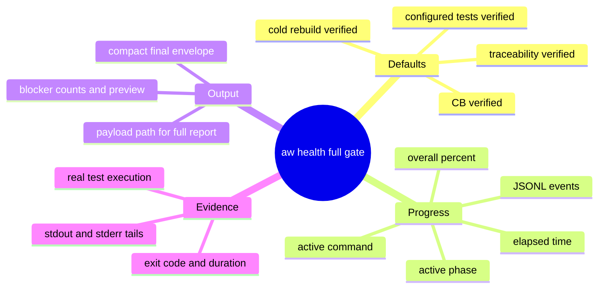
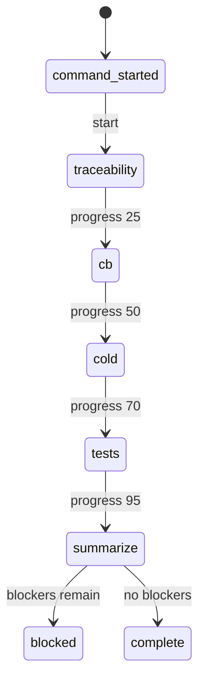
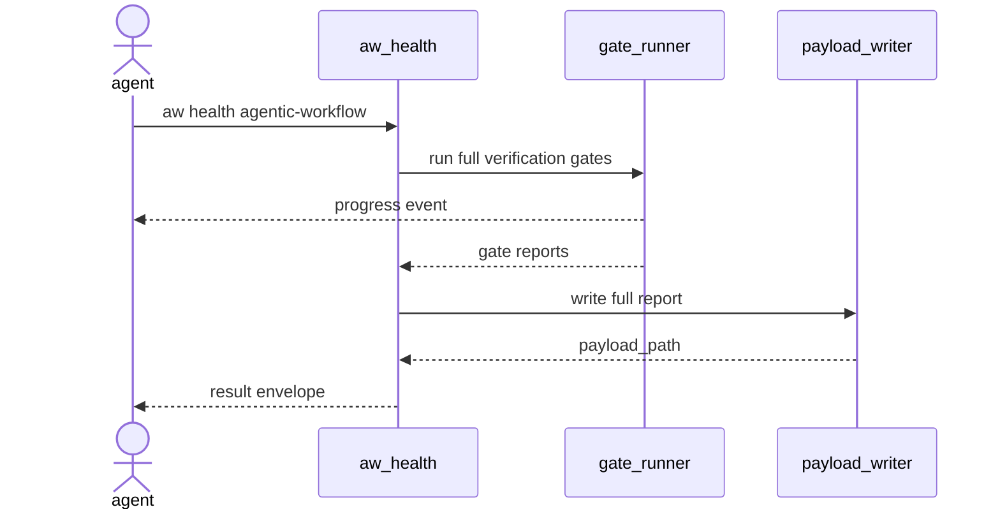
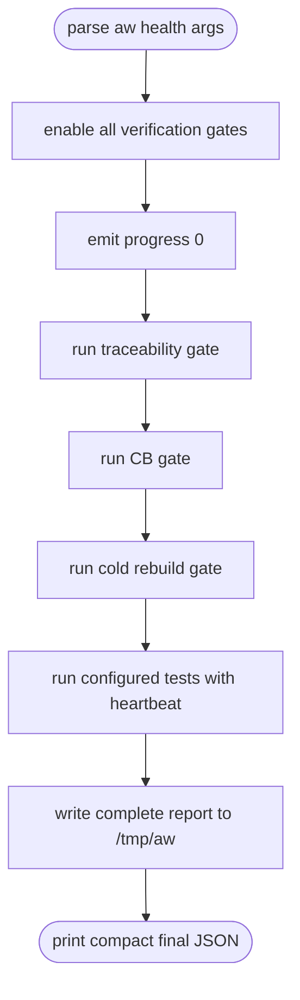
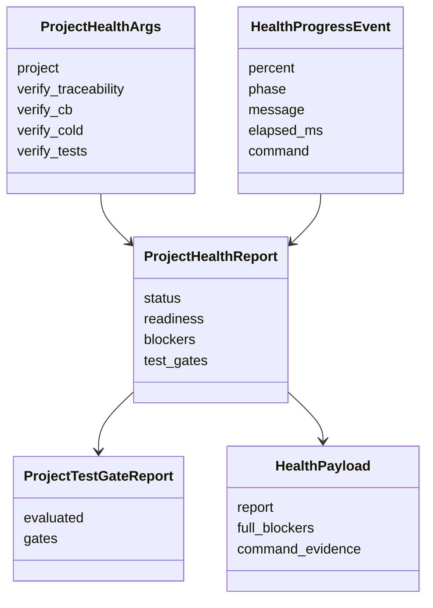
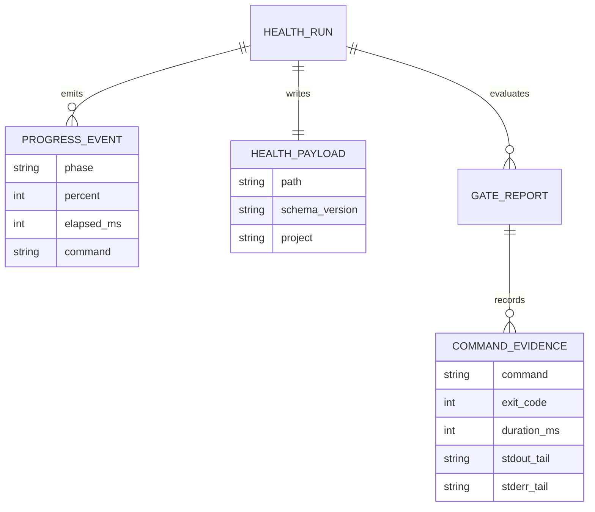
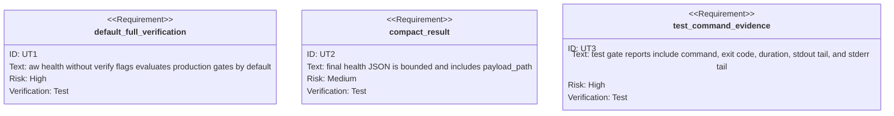

# Health Defaults To Streaming Full Verification

## Scenarios
<!-- type: scenarios lang: yaml -->

```yaml
id: aw-health-streaming-full-verification-scenarios
scenarios:
  - id: default_health_runs_all_production_gates
    title: aw health defaults to full verification
    given:
      - "a configured project has traceability, CB, cold rebuild, and test gates"
      - "an agent runs aw health for that project without verify flags"
    when:
      - "the health command builds the project readiness report"
    then:
      - "traceability verification is evaluated"
      - "CB verification is evaluated"
      - "cold rebuild verification is evaluated"
      - "configured test gates execute instead of reporting not evaluated"
  - id: long_health_gates_emit_bounded_progress
    title: long-running gates stream bounded progress events
    given:
      - "a health gate may compile or run tests for longer than an agent turn heartbeat"
    when:
      - "the gate starts and remains running"
    then:
      - "stdout receives progress JSON lines with schema_version, event, project, percent, phase, message, and elapsed_ms"
      - "the progress line reports the active command when a shell command is running"
      - "the command does not stream full blocker lists or full test output during progress"
  - id: final_health_output_points_to_payload
    title: final health result is capped and links full payload
    given:
      - "a full health run produces many blockers or long command output"
    when:
      - "the health command completes"
    then:
      - "the final stdout line is a compact result envelope"
      - "the result includes readiness, completion, next action, and payload_path"
      - "the payload file contains complete blockers and command execution evidence"
```
## Contract Mindmap
<!-- type: mindmap lang: mermaid -->


## Contract State Machine
<!-- type: state-machine lang: mermaid -->


## Contract Interaction
<!-- type: interaction lang: mermaid -->


## Contract Logic
<!-- type: logic lang: mermaid -->


## Contract Dependency
<!-- type: dependency lang: mermaid -->


## Contract Data Model
<!-- type: db-model lang: mermaid -->


## Contract Schema
<!-- type: schema lang: yaml -->

```yaml
$schema: "https://json-schema.org/draft/2020-12/schema"
$id: "aw-health-streaming-full-verification.schema.json"
title: "AW health streaming envelope"
oneOf:
  - type: object
    required: [schema_version, event, project, percent, phase, message, elapsed_ms]
    properties:
      schema_version: { const: "aw.cli.v1" }
      event: { const: "progress" }
      project: { type: string }
      percent: { type: integer, minimum: 0, maximum: 100 }
      phase: { type: string }
      message: { type: string }
      elapsed_ms: { type: integer, minimum: 0 }
      command: { type: [string, "null"] }
  - type: object
    required: [schema_version, event, status, completion, next, readiness, payload_path]
    properties:
      schema_version: { const: "aw.cli.v1" }
      event: { const: "result" }
      status: { enum: ["continue", "done", "blocked"] }
      completion: { type: object }
      next: { type: object }
      readiness: { type: object }
      payload_path: { type: string }
```
## Contract REST API
<!-- type: rest-api lang: yaml -->

```yaml
openapi: "3.1.0"
info:
  title: "No REST API change"
  version: "0.0.0"
paths: {}
x-aw-contract:
  surface: none
  reason: "This change only affects the local aw CLI health command."
```
## Contract RPC API
<!-- type: rpc-api lang: yaml -->

```yaml
services: []
x-aw-contract:
  surface: none
  reason: "No RPC service or method contract is changed."
```
## Contract Async API
<!-- type: async-api lang: yaml -->

```yaml
asyncapi: "3.0.0"
info:
  title: "No async API change"
  version: "0.0.0"
channels: {}
x-aw-contract:
  surface: none
  reason: "Progress is stdout JSONL from the CLI, not a pub-sub or socket channel."
```
## Contract CLI
<!-- type: cli lang: yaml -->

```yaml
commands:
  - name: aw health <project>
    default_behavior:
      - "runs traceability, CB, cold rebuild, and configured test verification gates"
      - "emits progress JSONL while long gates are running"
      - "prints one compact final result JSON line"
      - "writes the complete report to payload_path"
    compatibility:
      - "existing --verify-* flags remain accepted as explicit debug/scoping flags"
      - "--pretty remains a final-result formatting aid and does not expand blocker payloads"
    stdout:
      progress_event: "bounded aw.cli.v1 JSON object"
      result_event: "bounded aw.cli.v1 JSON object with payload_path"
```
## Contract Wireframe
<!-- type: wireframe lang: yaml -->

```yaml
layout:
  id: aw-health-streaming-full-verification-wireframe
  surfaces: []
  note: "No graphical UI surface is introduced. The user-visible surface is CLI stdout JSONL."
```
## Contract Component
<!-- type: component lang: yaml -->

```yaml
schemaVersion: "1.0.0"
readme: "No UI component contract is changed."
modules: []
```
## Contract Design Token
<!-- type: design-token lang: yaml -->

```yaml
$schema: "https://design-tokens.github.io/community-group/format/"
tokens: {}
metadata:
  reason: "No visual design tokens are introduced."
```
## Contract Config
<!-- type: config lang: yaml -->

```yaml
$schema: "https://json-schema.org/draft/2020-12/schema"
$id: "aw-health-streaming-full-verification-config.schema.json"
title: "No new health configuration"
type: object
properties: {}
additionalProperties: true
x-aw-contract:
  new_config_keys: []
  reason: "The default verification behavior changes without adding project config keys."
```
## Contract Manifest
<!-- type: manifest lang: yaml -->

```yaml
manifests:
  - path: projects/agentic-workflow/Cargo.toml
    changes: []
    reason: "The implementation uses existing serde, filesystem, and process primitives."
```
## Contract Runtime Image
<!-- type: runtime-image lang: yaml -->

```yaml
images: []
build_contexts: []
x-aw-contract:
  surface: none
  reason: "No container image or runtime packaging behavior is changed."
```
## Contract Deployment
<!-- type: deployment lang: yaml -->

```yaml
deployments: []
operations:
  - id: local-aw-cli
    action: "rebuild the aw binary after source changes"
    verification:
      - "cargo test -p agentic-workflow project_health -- --nocapture"
      - "./target/debug/aw health agentic-workflow"
```
## Contract Unit Test
<!-- type: unit-test lang: mermaid -->


## Contract E2E Test
<!-- type: e2e-test lang: yaml -->

```yaml
e2e_tests:
  - id: aw-health-default-full-verification-smoke
    name: "aw health defaults to full verification"
    command: "./target/debug/aw health agentic-workflow"
    assertions:
      - "stdout includes progress JSONL events before the final result when long gates run"
      - "the final result includes payload_path"
      - "the payload file contains complete blocker and command evidence"
    side_effects:
      - "Runs configured local verification commands for the project."
```

# Reviews

### Review 1
**Verdict:** approved

- [scenarios] Covers default full verification, progress streaming, and compact payload-backed result.
- [cli] States the public command contract and keeps legacy verify flags as accepted debug/scoping flags.
- [unit-test] Requires focused project health coverage for default gates, compact result, and command evidence.

# Reviews

### Review 1
**Verdict:** approved

- [cli] Public contract clearly changes `aw health <project>` default to full verification and bounded JSONL progress.
- [logic] Flow covers default gate enabling, per-phase progress, real test execution, payload writing, and compact final result.
- [unit-test] Requires focused tests for default full verification, payload path, bounded result, and command evidence.

## Contract Changes
<!-- type: changes lang: yaml -->

```yaml
changes:
  - path: projects/agentic-workflow/src/cli/project.rs
    action: modify
    impl_mode: hand-written
    refs:
      - "R1: default aw health runs all production verification gates"
      - "R2: long gates emit bounded progress events"
      - "R3: final result is compact and links full payload"
  - path: projects/agentic-workflow/tests/cli/tests/project_health_test.rs
    action: modify
    impl_mode: hand-written
    refs:
      - "UT1: default full verification"
      - "UT2: compact final result"
      - "UT3: test command evidence"
```

# Reviews

### Review 2
**Verdict:** approved

- [changes] Target files are explicit for `project.rs` and `project_health_test.rs`, so CB generation can infer handwrite work.
- [cli] Public health output contract remains bounded and payload-backed.
- [unit-test] Verification path is scoped to project health behavior.
