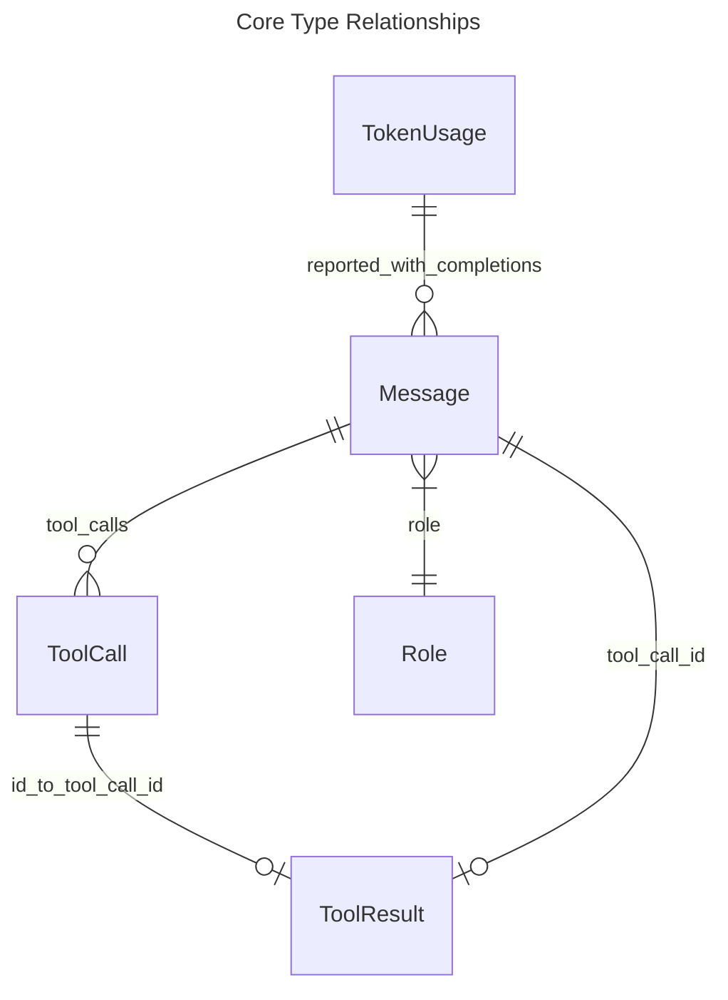

# Core Types

## Overview
<!-- type: overview lang: markdown -->

Core agent message types live in `projects/agent/core/src/types.rs`. They define
the shared conversation envelope used by LLM providers, storage, streaming, and
SDD agents: `AgentId`, `Role`, `ToolCall`, `ToolResult`, `Message`, and
`TokenUsage`.

## Schema
<!-- type: schema lang: yaml -->

```yaml
{
  "$schema": "https://json-schema.org/draft/2020-12/schema",
  "$id": "agent/interfaces/core/types",
  "$defs": {
    "AgentId": {
      "type": "string",
      "description": "Unique agent instance identifier."
    },
    "Role": {
      "type": "string",
      "enum": ["system", "user", "assistant", "tool"],
      "description": "Message role in the conversation."
    },
    "ToolCall": {
      "type": "object",
      "required": ["id", "name", "arguments"],
      "properties": {
        "id": {"type": "string"},
        "name": {"type": "string"},
        "arguments": {
          "description": "JSON arguments passed to the tool.",
          "type": ["object", "array", "string", "number", "boolean", "null"]
        }
      }
    },
    "ToolResult": {
      "type": "object",
      "required": ["tool_call_id", "output", "error"],
      "properties": {
        "tool_call_id": {"type": "string"},
        "output": {
          "description": "JSON value returned by the tool.",
          "type": ["object", "array", "string", "number", "boolean", "null"]
        },
        "error": {
          "type": ["string", "null"],
          "description": "Optional error text; null means success."
        }
      }
    },
    "Message": {
      "type": "object",
      "required": ["role", "content", "metadata", "timestamp"],
      "properties": {
        "role": {"$ref": "#/$defs/Role"},
        "content": {"type": "string"},
        "name": {"type": ["string", "null"]},
        "tool_calls": {
          "type": ["array", "null"],
          "items": {"$ref": "#/$defs/ToolCall"}
        },
        "tool_call_id": {"type": ["string", "null"]},
        "metadata": {
          "type": "object",
          "additionalProperties": true
        },
        "timestamp": {
          "type": "string",
          "format": "date-time"
        }
      }
    },
    "TokenUsage": {
      "type": "object",
      "required": ["prompt_tokens", "completion_tokens", "total_tokens"],
      "properties": {
        "prompt_tokens": {"type": "integer", "minimum": 0},
        "completion_tokens": {"type": "integer", "minimum": 0},
        "total_tokens": {"type": "integer", "minimum": 0}
      }
    }
  }
}
```

## Dependency
<!-- type: dependency lang: mermaid -->



## Changes
<!-- type: changes lang: yaml -->

```yaml
changes:
  - path: projects/agent/core/src/types.rs
    action: modify
    section: schema
    impl_mode: hand-written
    description: "Maintain AgentId, Role, ToolCall, ToolResult, Message, and TokenUsage definitions."
  - path: .aw/tech-design/projects/agent/core/interfaces/llm/providers.md
    action: modify
    section: schema
    impl_mode: hand-written
    description: "Reference Message, ToolCall, and TokenUsage from this canonical core type spec."
  - path: .aw/tech-design/projects/agent/core/interfaces/storage/storage.md
    action: modify
    section: schema
    impl_mode: hand-written
    description: "Reference Message from this canonical core type spec."
```
