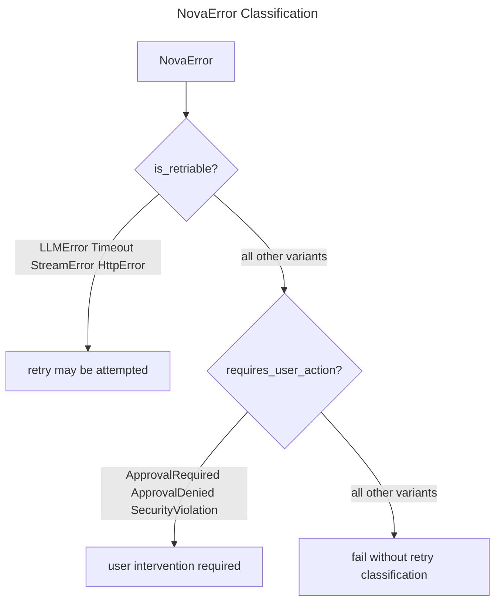

# Error Handling

## Overview
<!-- type: overview lang: markdown -->

`NovaError` in `projects/agent/core/src/error.rs` is the shared error boundary
for agent orchestration, LLM providers, tools, storage, integrations, and SDD
agents. `NovaResult<T>` is the crate-wide result alias. Error classification is
implemented by `is_retriable` and `requires_user_action`.

## Schema
<!-- type: schema lang: yaml -->

```yaml
definitions:
  NovaResult:
    type: object
    required: [ok, error]
    properties:
      ok:
        description: "Successful result payload when no error occurred."
        nullable: true
      error:
        oneOf:
          - type: "null"
          - $ref: "#/definitions/NovaError"

  NovaError:
    type: object
    required: [variant, payload]
    properties:
      variant:
        type: string
        enum:
          - LLMError
          - ToolError
          - ToolNotFound
          - ApprovalRequired
          - ApprovalDenied
          - SecurityViolation
          - PathNotAllowed
          - CommandNotAllowed
          - MaxTurnsReached
          - MaxRevisionsExceeded
          - MalformedLLMResponse
          - PlatformError
          - ContextOverflow
          - StreamError
          - ConfigError
          - Timeout
          - NotInitialized
          - NotSupported
          - HttpError
          - ApiError
          - ModelNotFound
          - InvalidRequest
          - StreamingError
          - InvalidArguments
          - ValidationFailed
          - FileNotFound
          - FileError
          - PatternError
          - EditFailed
          - SchemaValidationError
          - CommandFailed
          - CommandTimeout
          - SerializationError
          - IoError
          - Other
      payload:
        description: "Variant payload: string, u32, u64, null, or source error text depending on variant."
        nullable: true

  ErrorClassification:
    type: object
    required: [retriable_variants, user_action_variants]
    properties:
      retriable_variants:
        type: array
        items:
          type: string
          enum: [LLMError, Timeout, StreamError, HttpError]
      user_action_variants:
        type: array
        items:
          type: string
          enum: [ApprovalRequired, ApprovalDenied, SecurityViolation]
```

## Logic
<!-- type: logic lang: mermaid -->



## Changes
<!-- type: changes lang: yaml -->

```yaml
changes:
  - path: projects/agent/core/src/error.rs
    action: modify
    section: schema
    impl_mode: hand-written
    description: "Maintain the NovaError enum and NovaResult alias."
  - path: projects/agent/core/src/error.rs
    action: modify
    section: logic
    impl_mode: hand-written
    description: "Classify only LLMError, Timeout, StreamError, and HttpError as retriable."
  - path: projects/agent/core/src/error.rs
    action: modify
    section: logic
    impl_mode: hand-written
    description: "Classify only approval and security-policy variants as requiring user action."
```
