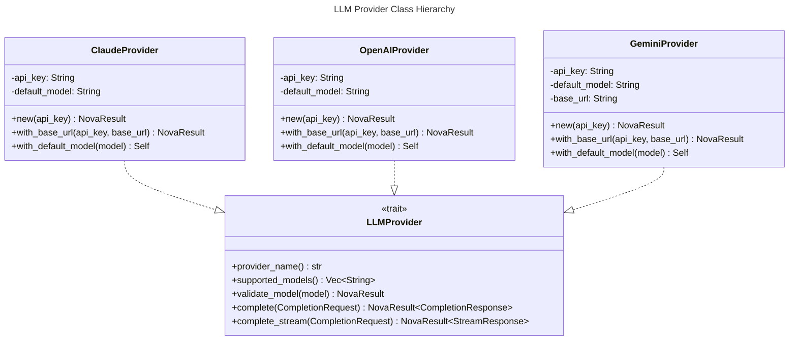
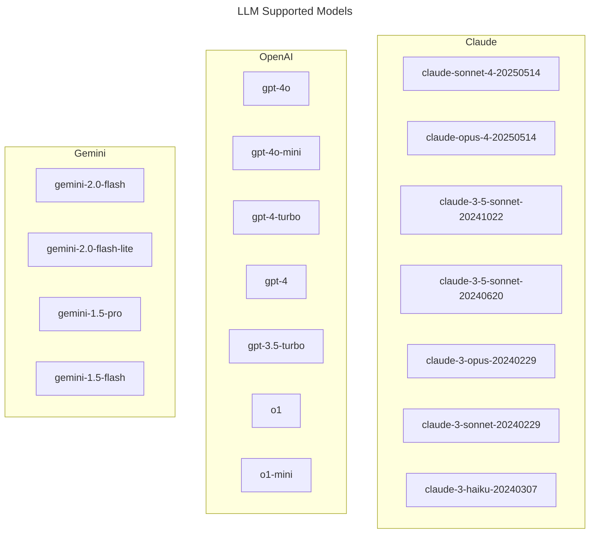
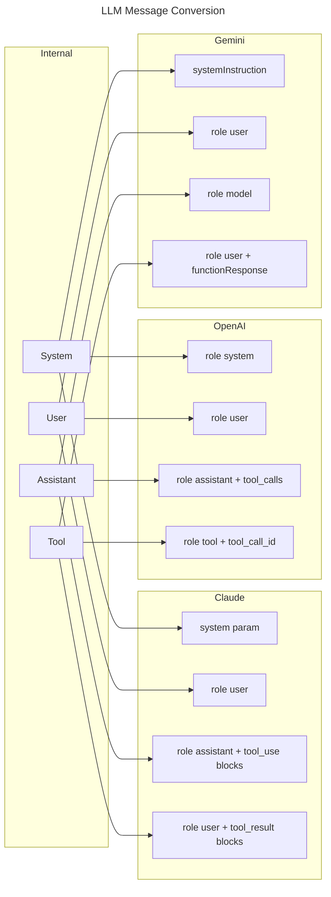
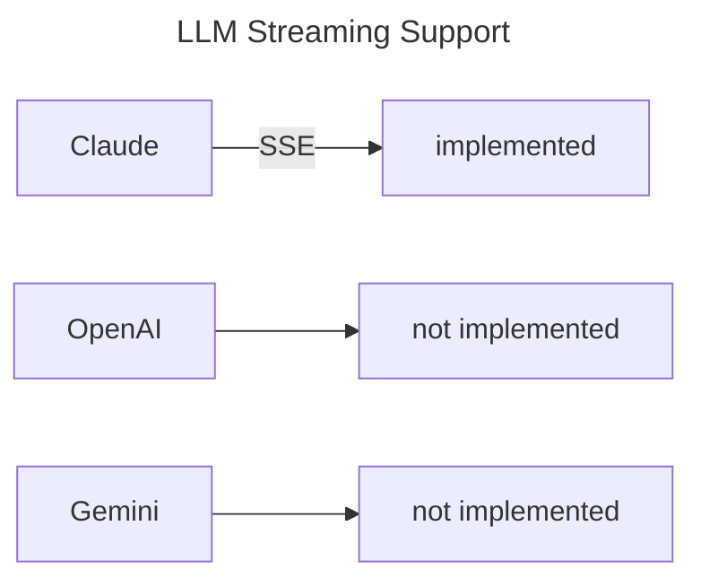

# LLM Providers Spec

## Overview
<!-- type: overview lang: markdown -->

The LLM provider interface defines the shared completion contract for
`agent`. `LLMProvider` exposes provider identity, supported model
validation, non-streaming completion, and streaming completion through one async
trait.

Claude, OpenAI, and Gemini providers adapt the shared `CompletionRequest`,
`CompletionResponse`, `ToolDefinition`, and `StreamChunk` DTOs to
provider-specific HTTP APIs. All providers support a custom base URL so callers
can route through internal gateways or compatible proxy services.

## Schema
<!-- type: schema lang: yaml -->

```yaml
definitions:
  CompletionRequest:
    type: object
    required: [messages, model, stream, extras]
    properties:
      messages:
        type: array
        items:
          $ref: "agent/interfaces/core/types.md#/definitions/Message"
      model: {type: string}
      temperature:
        type: number
        minimum: 0
        maximum: 2
      max_tokens:
        type: integer
        minimum: 1
      top_p:
        type: number
        minimum: 0
        maximum: 1
      stop:
        type: array
        items: {type: string}
      stream: {type: boolean}
      tools:
        type: array
        items:
          $ref: "#/definitions/ToolDefinition"
      response_schema:
        type: object
        additionalProperties: true
      extras:
        type: object
        additionalProperties: true

  ToolDefinition:
    type: object
    required: [name, description, parameters]
    properties:
      name: {type: string}
      description: {type: string}
      parameters:
        type: object
        additionalProperties: true

  CompletionResponse:
    type: object
    required: [content, finish_reason, usage, model, metadata]
    properties:
      content: {type: string}
      tool_calls:
        type: array
        items:
          $ref: "agent/interfaces/core/types.md#/definitions/ToolCall"
      finish_reason: {type: string}
      usage:
        $ref: "agent/interfaces/core/types.md#/definitions/TokenUsage"
      model: {type: string}
      metadata:
        type: object
        additionalProperties: true

  StreamChunk:
    type: object
    required: [content, is_final]
    properties:
      content: {type: string}
      tool_calls:
        type: array
        items:
          $ref: "agent/interfaces/core/types.md#/definitions/ToolCall"
      finish_reason: {type: string}
      is_final: {type: boolean}

  ProviderBaseUrls:
    type: object
    required: [anthropic, openai, google]
    properties:
      anthropic: {type: string, const: "https://api.anthropic.com"}
      openai: {type: string, const: "https://api.openai.com"}
      google: {type: string, const: "https://generativelanguage.googleapis.com"}
```

## Interaction
<!-- type: interaction lang: mermaid -->









## Changes
<!-- type: changes lang: yaml -->

```yaml
changes:
  - path: projects/agent/core/src/llm/provider.rs
    action: modify
    section: schema
    impl_mode: hand-written
    description: "Define CompletionRequest, ToolDefinition, CompletionResponse, StreamChunk, StreamResponse, and the LLMProvider trait."
  - path: projects/agent/core/src/llm/claude.rs
    action: modify
    section: interaction
    impl_mode: hand-written
    description: "Adapt shared provider DTOs to Anthropic Messages API requests, tool calls, structured output, and SSE streaming."
  - path: projects/agent/core/src/llm/openai.rs
    action: modify
    section: interaction
    impl_mode: hand-written
    description: "Adapt shared provider DTOs to OpenAI-compatible chat completion requests and tool calls."
  - path: projects/agent/core/src/llm/gemini.rs
    action: modify
    section: interaction
    impl_mode: hand-written
    description: "Adapt shared provider DTOs to Gemini generateContent requests, function calls, and response schema settings."
```
