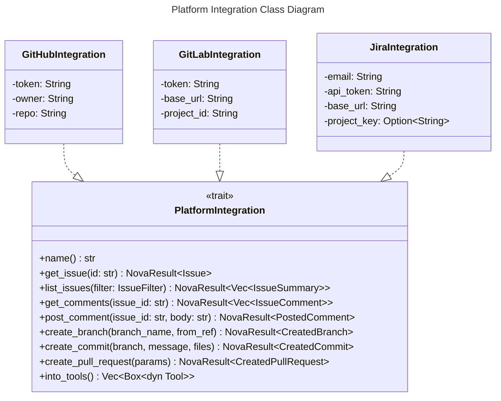
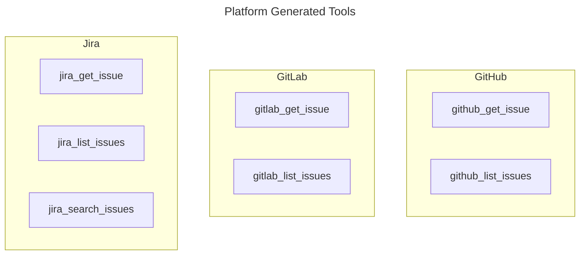

# Platform Integrations Spec

## Overview
<!-- type: overview lang: markdown -->

Platform integrations provide a shared interface for issue tracking, comments,
and source-control operations across GitHub, GitLab, and Jira. The
`PlatformIntegration` trait normalizes issue reads, issue searches, comment
reads, comment writes, branch creation, commit creation, pull or merge request
creation, and tool exposure for agent workflows.

GitHub and GitLab implement issue and source-control behavior. Jira implements
issue and comment behavior while source-control methods use the trait's default
unsupported-platform error.

## Schema
<!-- type: schema lang: yaml -->

```yaml
definitions:
  Issue:
    type: object
    required:
      - id
      - title
      - body
      - state
      - author
      - labels
      - assignees
      - created_at
      - updated_at
      - url
      - comments
      - metadata
    properties:
      id: {type: string}
      title: {type: string}
      body: {type: string}
      state:
        $ref: "#/definitions/IssueState"
      author: {type: string}
      labels:
        type: array
        items: {type: string}
      assignees:
        type: array
        items: {type: string}
      created_at: {type: string, format: date-time}
      updated_at: {type: string, format: date-time}
      url: {type: string}
      comments:
        type: array
        items:
          $ref: "#/definitions/IssueComment"
      metadata:
        type: object
        additionalProperties: true

  IssueState:
    type: string
    enum: [open, closed, in_progress, resolved, wontfix]

  IssueComment:
    type: object
    required: [id, author, body, created_at]
    properties:
      id: {type: string}
      author: {type: string}
      body: {type: string}
      created_at: {type: string, format: date-time}

  IssueSummary:
    type: object
    required: [id, title, state, labels, created_at, url]
    properties:
      id: {type: string}
      title: {type: string}
      state:
        $ref: "#/definitions/IssueState"
      labels:
        type: array
        items: {type: string}
      created_at: {type: string, format: date-time}
      url: {type: string}

  IssueFilter:
    type: object
    properties:
      state:
        $ref: "#/definitions/IssueState"
      labels:
        type: array
        items: {type: string}
      assignee: {type: string}
      query: {type: string}
      limit: {type: integer, minimum: 1}

  PostedComment:
    type: object
    required: [id, url]
    properties:
      id: {type: string}
      url: {type: string}

  CommitFile:
    type: object
    required: [path, content]
    properties:
      path: {type: string}
      content: {type: string}

  CreatedBranch:
    type: object
    required: [name, sha]
    properties:
      name: {type: string}
      sha: {type: string}

  CreatedCommit:
    type: object
    required: [sha, url]
    properties:
      sha: {type: string}
      url: {type: string}

  PullRequestParams:
    type: object
    required: [title, body, head, base]
    properties:
      title: {type: string}
      body: {type: string}
      head: {type: string}
      base: {type: string}

  CreatedPullRequest:
    type: object
    required: [id, url, number]
    properties:
      id: {type: string}
      url: {type: string}
      number: {type: integer, minimum: 0}

openapi_mappings:
  github:
    server: https://api.github.com
    issue_paths:
      - /repos/{owner}/{repo}/issues/{number}
      - /repos/{owner}/{repo}/issues
      - /repos/{owner}/{repo}/issues/{number}/comments
    source_control_paths:
      - /repos/{owner}/{repo}/git/refs
      - /repos/{owner}/{repo}/contents/{path}
      - /repos/{owner}/{repo}/pulls
  gitlab:
    server: "{base_url}/api/v4"
    issue_paths:
      - /projects/{id}/issues/{iid}
      - /projects/{id}/issues
      - /projects/{id}/issues/{iid}/notes
    source_control_paths:
      - /projects/{id}/repository/branches
      - /projects/{id}/repository/commits
      - /projects/{id}/merge_requests
  jira:
    server: "{base_url}/rest/api/3"
    issue_paths:
      - /issue/{issueKey}
      - /search
      - /issue/{issueKey}/comment
```

## Interaction
<!-- type: interaction lang: mermaid -->





## Changes
<!-- type: changes lang: yaml -->

```yaml
changes:
  - path: projects/agent/core/src/integrations/mod.rs
    action: modify
    section: schema
    impl_mode: hand-written
    description: "Define normalized issue DTOs, comment DTOs, source-control DTOs, clarification helpers, and the PlatformIntegration trait."
  - path: projects/agent/core/src/integrations/github.rs
    action: modify
    section: interaction
    impl_mode: hand-written
    description: "Implement GitHub issue, comment, branch, commit, pull request, and tool adapter behavior."
  - path: projects/agent/core/src/integrations/gitlab.rs
    action: modify
    section: interaction
    impl_mode: hand-written
    description: "Implement GitLab issue, note, branch, commit, merge request, and tool adapter behavior."
  - path: projects/agent/core/src/integrations/jira.rs
    action: modify
    section: interaction
    impl_mode: hand-written
    description: "Implement Jira issue, comment, search, and tool adapter behavior."
```
