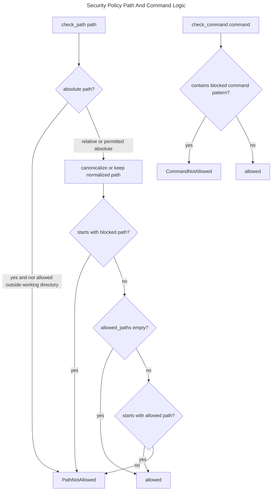
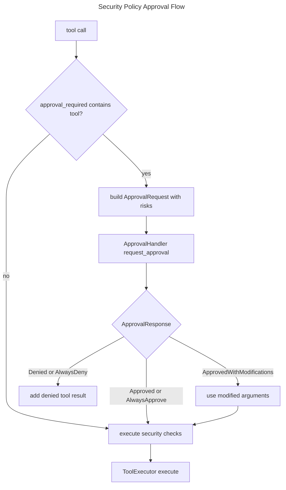

# Security Policy

## Overview
<!-- type: overview lang: markdown -->

`SecurityPolicy` in `projects/agent/core/src/security.rs` bounds tool execution
for agent runtimes. It validates paths against blocked and allowed prefixes,
rejects blocked shell command patterns, records tools that require approval,
and carries shell/file timeout settings. `ApprovalRequest` and
`ApprovalResponse` model the human approval contract used by `CodingAgent`.

## Schema
<!-- type: schema lang: yaml -->

```yaml
definitions:
  SecurityPolicy:
    type: object
    required:
      - allowed_paths
      - blocked_paths
      - approval_required
      - blocked_commands
      - shell_timeout
      - file_timeout
      - allow_absolute_paths
      - working_directory
    properties:
      allowed_paths:
        type: array
        items: {type: string}
        description: "If non-empty, normalized paths must start with one allowed prefix."
      blocked_paths:
        type: array
        items: {type: string}
        default: ["/etc", "/var", "/usr", "/bin", "/sbin", "/root", "/System"]
      approval_required:
        type: array
        uniqueItems: true
        items: {type: string}
        default: ["write_file", "bash", "git_commit"]
      blocked_commands:
        type: array
        items: {type: string}
        default:
          - "rm -rf /"
          - "rm -rf /*"
          - ":(){ :|:& };:"
          - "dd if=/dev/zero"
          - "mkfs"
          - "chmod 777 /"
      shell_timeout:
        type: integer
        description: "Shell timeout in seconds."
        default: 120
      file_timeout:
        type: integer
        description: "File timeout in seconds."
        default: 30
      allow_absolute_paths:
        type: boolean
        default: false
      working_directory:
        type: string
        description: "Base directory used to resolve relative paths and bound absolute paths."

  ApprovalRequest:
    type: object
    required: [tool_name, arguments, description, risks]
    properties:
      tool_name: {type: string}
      arguments:
        type: object
        additionalProperties: true
      description: {type: string}
      risks:
        type: array
        items: {type: string}

  ApprovalResponse:
    oneOf:
      - type: string
        const: Approved
      - type: object
        required: [Denied]
        properties:
          Denied:
            type: object
            required: [reason]
            properties:
              reason:
                type: string
                nullable: true
      - type: object
        required: [ApprovedWithModifications]
        properties:
          ApprovedWithModifications:
            type: object
            required: [modifications]
            properties:
              modifications:
                type: object
                additionalProperties: true
      - type: string
        const: AlwaysApprove
      - type: string
        const: AlwaysDeny
```

## Logic
<!-- type: logic lang: mermaid -->



## Interaction
<!-- type: interaction lang: mermaid -->



## Changes
<!-- type: changes lang: yaml -->

```yaml
changes:
  - path: projects/agent/core/src/security.rs
    action: modify
    section: schema
    impl_mode: hand-written
    description: "Maintain SecurityPolicy, SecurityPolicyBuilder, ApprovalRequest, and ApprovalResponse."
  - path: projects/agent/core/src/security.rs
    action: modify
    section: logic
    impl_mode: hand-written
    description: "Normalize paths, reject blocked prefixes, enforce optional allowed prefixes, and reject blocked command substrings."
  - path: projects/agentic-workflow/src/agents/coding.rs
    action: modify
    section: interaction
    impl_mode: hand-written
    description: "Use SecurityPolicy.requires_approval before tool execution and add denied approval as a tool result."
```
