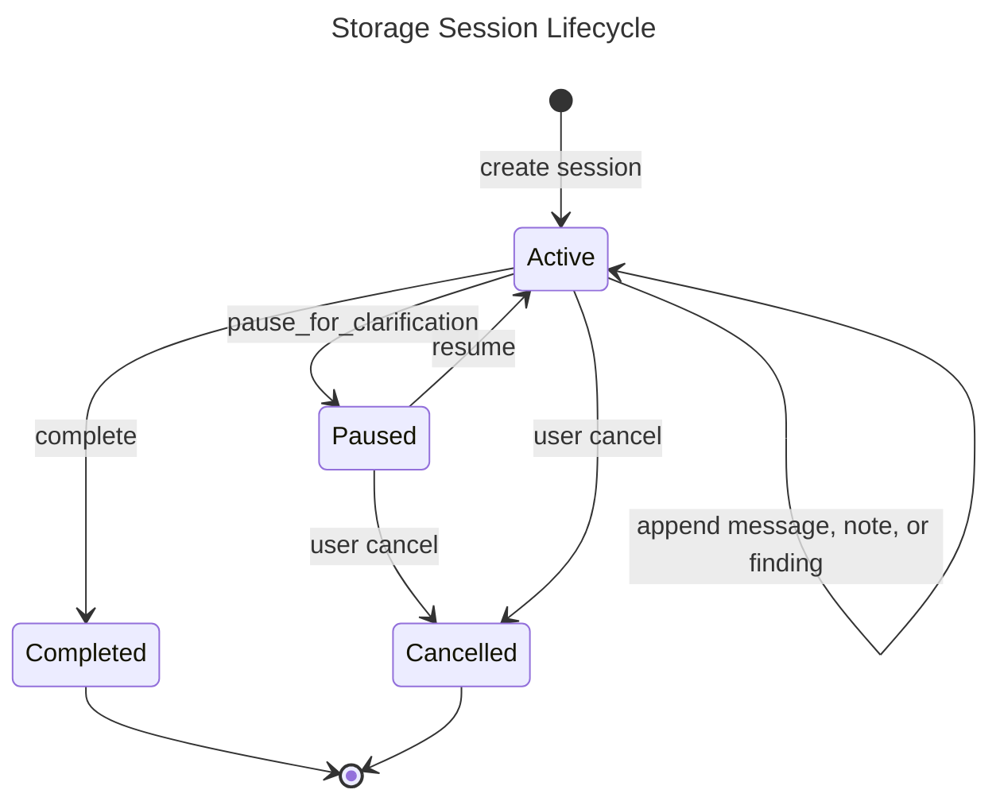
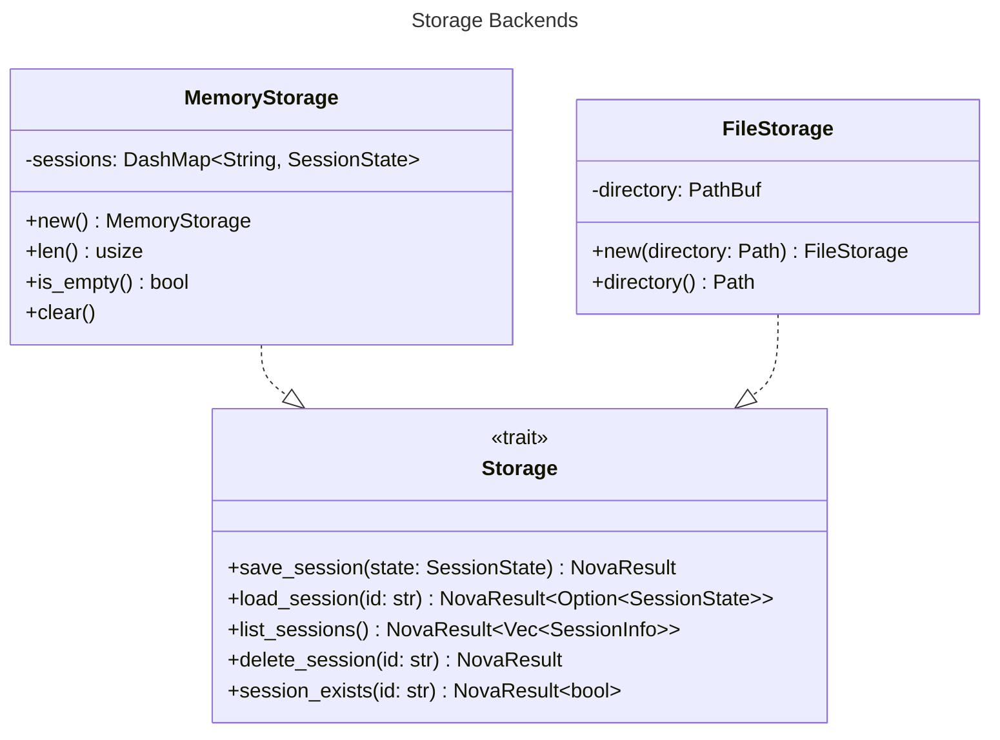
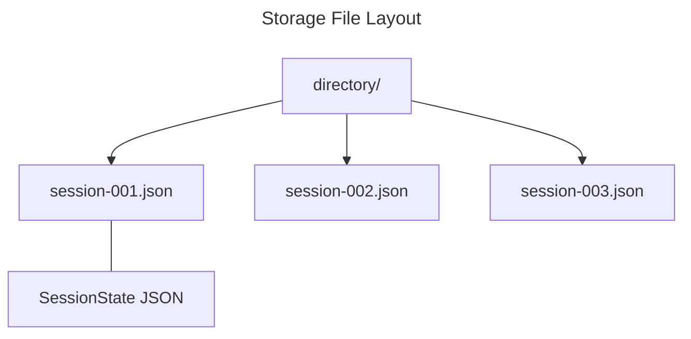

# Storage Spec

## Overview
<!-- type: overview lang: markdown -->

The storage interface persists `agent` analysis sessions. It defines the
async `Storage` port, the in-memory and file-backed adapters, and the session
DTOs exchanged with agent runtimes that need pause, resume, list, and delete
behavior.

`MemoryStorage` is the fast process-local implementation used by tests and
short-lived runs. `FileStorage` stores one JSON document per session id and
returns session summaries sorted by most-recent update.

## Schema
<!-- type: schema lang: yaml -->

```yaml
definitions:
  StoragePort:
    type: object
    required: [operations]
    properties:
      operations:
        type: array
        items:
          type: string
          enum:
            - save_session
            - load_session
            - list_sessions
            - delete_session
            - session_exists

  SessionState:
    type: object
    required:
      - id
      - title
      - created_at
      - updated_at
      - status
      - messages
      - notes
      - findings
      - metadata
    properties:
      id: {type: string}
      title: {type: string}
      created_at: {type: string, format: date-time}
      updated_at: {type: string, format: date-time}
      status:
        $ref: "#/definitions/SessionStatus"
      messages:
        type: array
        items:
          $ref: "agent/interfaces/core/types.md#/definitions/Message"
      pending_clarification:
        $ref: "#/definitions/PendingClarification"
      notes:
        type: array
        items:
          $ref: "#/definitions/Note"
      findings:
        type: array
        items:
          $ref: "#/definitions/Finding"
      metadata:
        type: object
        additionalProperties: true

  SessionStatus:
    type: string
    enum: [active, paused, completed, cancelled]

  PendingClarification:
    type: object
    required:
      - platform
      - issue_id
      - comment_id
      - question
      - options
      - multi_select
      - requested_at
    properties:
      platform: {type: string}
      issue_id: {type: string}
      comment_id: {type: string}
      question: {type: string}
      options:
        type: array
        items:
          $ref: "#/definitions/ClarificationOption"
      multi_select: {type: boolean}
      requested_at: {type: string, format: date-time}

  ClarificationOption:
    type: object
    required: [label, recommended]
    properties:
      label: {type: string}
      recommended: {type: boolean}

  Note:
    type: object
    required: [content, created_at]
    properties:
      content: {type: string}
      category: {type: string}
      created_at: {type: string, format: date-time}

  Finding:
    type: object
    required: [title, description, severity, sources, created_at]
    properties:
      title: {type: string}
      description: {type: string}
      severity:
        $ref: "#/definitions/FindingSeverity"
      sources:
        type: array
        items: {type: string}
      created_at: {type: string, format: date-time}

  FindingSeverity:
    type: string
    enum: [info, low, medium, high, critical]

  SessionInfo:
    type: object
    required:
      - id
      - title
      - status
      - created_at
      - updated_at
      - note_count
      - finding_count
    properties:
      id: {type: string}
      title: {type: string}
      status:
        $ref: "#/definitions/SessionStatus"
      created_at: {type: string, format: date-time}
      updated_at: {type: string, format: date-time}
      note_count: {type: integer, minimum: 0}
      finding_count: {type: integer, minimum: 0}

  FileStorageLayout:
    type: object
    required: [directory, session_files]
    properties:
      directory: {type: string}
      session_files:
        type: string
        const: "{session_id}.json"
```

## Interaction
<!-- type: interaction lang: mermaid -->







## Changes
<!-- type: changes lang: yaml -->

```yaml
changes:
  - path: projects/agent/core/src/storage/mod.rs
    action: modify
    section: schema
    impl_mode: hand-written
    description: "Define SessionState, SessionStatus, SessionInfo, and the async Storage trait."
  - path: projects/agent/core/src/storage/memory.rs
    action: modify
    section: interaction
    impl_mode: hand-written
    description: "Implement process-local Storage behavior with DashMap-backed session state."
  - path: projects/agent/core/src/storage/file.rs
    action: modify
    section: interaction
    impl_mode: hand-written
    description: "Implement JSON-file-backed Storage behavior using one {session_id}.json file per session."
```
