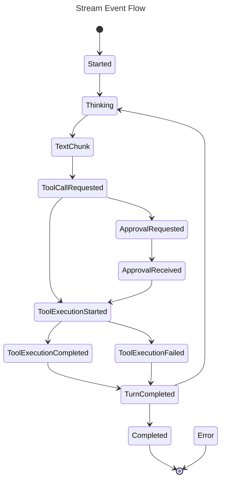
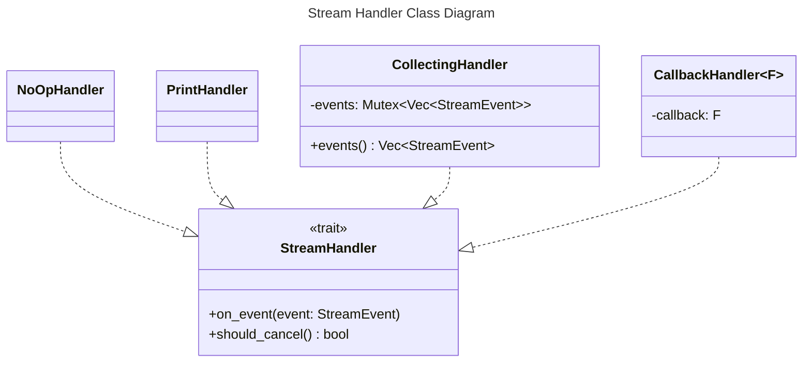

# Streaming Events Spec

## Overview
<!-- type: overview lang: markdown -->

The streaming interface reports agent execution progress through `StreamEvent`
values delivered to an async `StreamHandler`. Handlers may ignore events,
collect events for tests, print human-readable progress, or invoke a caller
callback.

`should_cancel` is a synchronous cancellation check available to agent loops.
The default implementation returns false.

## Schema
<!-- type: schema lang: yaml -->

```yaml
definitions:
  StreamEvent:
    oneOf:
      - type: object
        required: [type]
        properties:
          type: {type: string, const: started}
      - type: object
        required: [type, model]
        properties:
          type: {type: string, const: thinking}
          model: {type: string}
      - type: object
        required: [type, content]
        properties:
          type: {type: string, const: text_chunk}
          content: {type: string}
      - type: object
        required: [type, tool_name, arguments]
        properties:
          type: {type: string, const: tool_call_requested}
          tool_name: {type: string}
          arguments:
            type: object
            additionalProperties: true
      - type: object
        required: [type, tool_name]
        properties:
          type: {type: string, const: tool_execution_started}
          tool_name: {type: string}
      - type: object
        required: [type, tool_name, result, duration_ms]
        properties:
          type: {type: string, const: tool_execution_completed}
          tool_name: {type: string}
          result:
            type: object
            additionalProperties: true
          duration_ms: {type: integer, minimum: 0}
      - type: object
        required: [type, tool_name, error]
        properties:
          type: {type: string, const: tool_execution_failed}
          tool_name: {type: string}
          error: {type: string}
      - type: object
        required: [type, tool_name, description]
        properties:
          type: {type: string, const: approval_requested}
          tool_name: {type: string}
          description: {type: string}
      - type: object
        required: [type, approved]
        properties:
          type: {type: string, const: approval_received}
          approved: {type: boolean}
      - type: object
        required: [type, turn_number]
        properties:
          type: {type: string, const: turn_completed}
          turn_number: {type: integer, minimum: 0}
      - type: object
        required: [type, content]
        properties:
          type: {type: string, const: completed}
          content: {type: string}
      - type: object
        required: [type, message]
        properties:
          type: {type: string, const: error}
          message: {type: string}

  StreamHandler:
    type: object
    required: [on_event, should_cancel]
    properties:
      on_event:
        input: StreamEvent
        output: NovaResult
      should_cancel:
        output: boolean
```

## Interaction
<!-- type: interaction lang: mermaid -->





## Changes
<!-- type: changes lang: yaml -->

```yaml
changes:
  - path: projects/agent/core/src/stream.rs
    action: modify
    section: schema
    impl_mode: hand-written
    description: "Define StreamEvent variants and the StreamHandler trait."
  - path: projects/agent/core/src/stream.rs
    action: modify
    section: interaction
    impl_mode: hand-written
    description: "Implement NoOpHandler, CollectingHandler, PrintHandler, and CallbackHandler."
```
