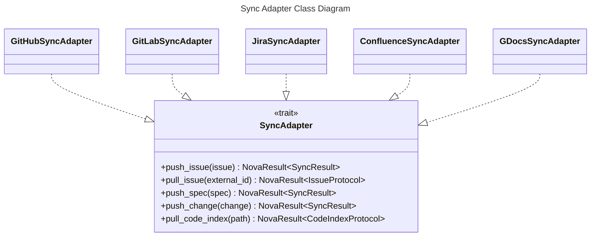
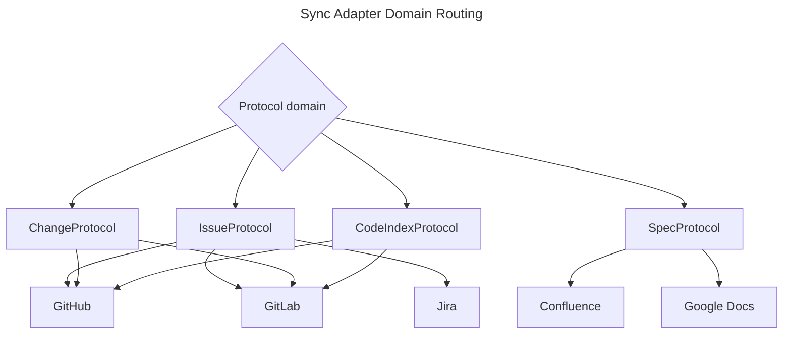

# Sync Adapter Spec

## Overview
<!-- type: overview lang: markdown -->

`SyncAdapter` is the generic async boundary for pushing and pulling protocol
types between `agent` and third-party platforms. Adapters implement the
methods relevant to their domain and return an unsupported error for methods
outside that domain.

GitHub and GitLab cover issue, change, and code-index sync. Jira covers issue
sync. Confluence and Google Docs cover spec sync. Credentials are injected at
adapter construction time, and adapters do not rely on global mutable state.

## Schema
<!-- type: schema lang: yaml -->

```yaml
definitions:
  SyncAction:
    type: string
    enum: [created, updated, no_change]

  SyncResult:
    type: object
    required: [external_id, action]
    properties:
      external_id: {type: string}
      url: {type: string}
      action:
        $ref: "#/definitions/SyncAction"

  SyncAdapterMethods:
    type: object
    required:
      - push_issue
      - pull_issue
      - push_spec
      - push_change
      - pull_code_index
    properties:
      push_issue:
        input: IssueProtocol
        output: SyncResult
      pull_issue:
        input: external_id
        output: IssueProtocol
      push_spec:
        input: SpecProtocol
        output: SyncResult
      push_change:
        input: ChangeProtocol
        output: SyncResult
      pull_code_index:
        input: path
        output: CodeIndexProtocol

  AdapterDomainMatrix:
    type: object
    properties:
      github:
        supports: [issue, change, code_index]
        unsupported: [spec]
      gitlab:
        supports: [issue, change, code_index]
        unsupported: [spec]
      jira:
        supports: [issue]
        unsupported: [spec, change, code_index]
      confluence:
        supports: [spec]
        unsupported: [issue, change, code_index]
      gdocs:
        supports: [spec]
        unsupported: [issue, change, code_index]
```

## Interaction
<!-- type: interaction lang: mermaid -->





## Changes
<!-- type: changes lang: yaml -->

```yaml
changes:
  - path: projects/agent/core/src/sync_adapter/mod.rs
    action: modify
    section: schema
    impl_mode: hand-written
    description: "Define SyncAction, SyncResult, and the SyncAdapter trait."
  - path: projects/agent/core/src/sync_adapter/github.rs
    action: modify
    section: interaction
    impl_mode: hand-written
    description: "Implement GitHub issue, change, and code-index sync behavior."
  - path: projects/agent/core/src/sync_adapter/gitlab.rs
    action: modify
    section: interaction
    impl_mode: hand-written
    description: "Implement GitLab issue, change, and code-index sync behavior."
  - path: projects/agent/core/src/sync_adapter/jira.rs
    action: modify
    section: interaction
    impl_mode: hand-written
    description: "Implement Jira issue sync behavior."
  - path: projects/agent/core/src/sync_adapter/confluence.rs
    action: modify
    section: interaction
    impl_mode: hand-written
    description: "Implement Confluence spec sync behavior."
  - path: projects/agent/core/src/sync_adapter/gdocs.rs
    action: modify
    section: interaction
    impl_mode: hand-written
    description: "Implement Google Docs spec sync behavior."
```
