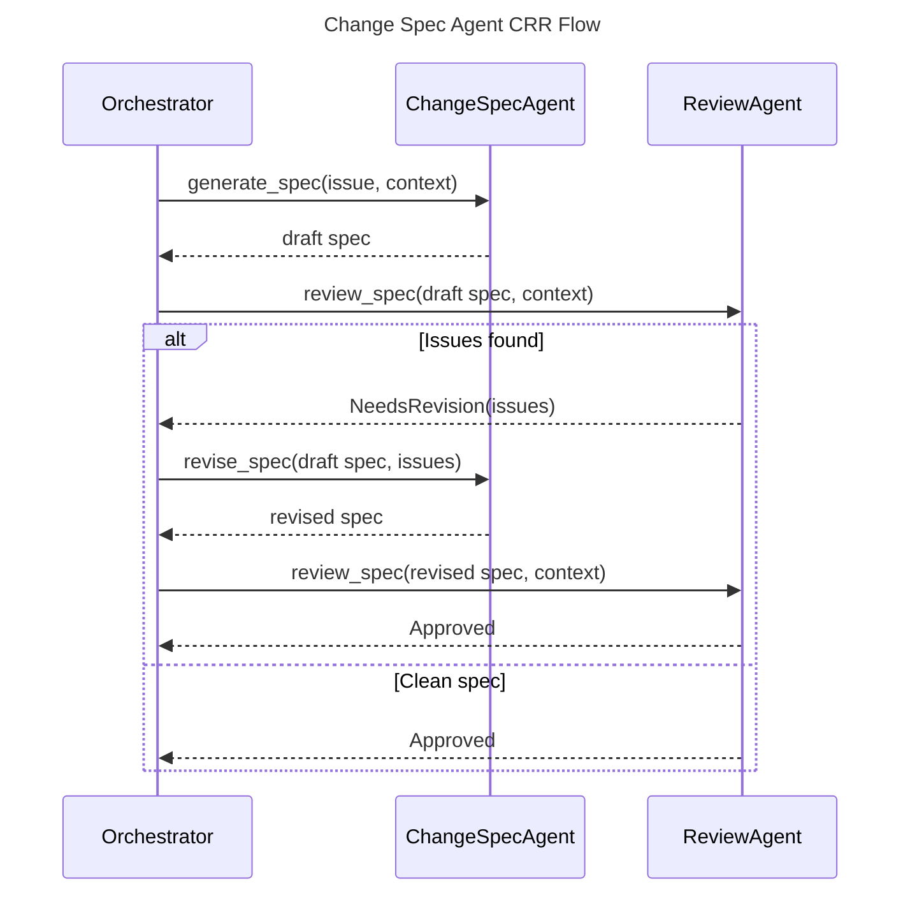

# Change Spec Agent Spec

## Overview
<!-- type: overview lang: markdown -->

`ChangeSpecAgent` generates and revises formal SDD technical specifications
from a `StructuredIssue` plus synthesized `ReferenceContextOutput`. It acts as
the creator in the CRR loop for initial spec generation and as a reviser when
the CRR cycle passes review issues back for repair.

## Requirements
<!-- type: requirements lang: mermaid -->

```mermaid
---
id: change-spec-agent-requirements
title: Change Spec Agent Requirements
requirements:
  R1:
    text: "ChangeSpecAgent MUST generate a complete technical specification from ChangeSpecInput."
    type: functional
    priority: high
    risk: high
    verification: test
  R2:
    text: "ChangeSpecAgent MUST enforce SDD format priority from OpenRPC through prose."
    type: functional
    priority: high
    risk: high
    verification: review
  R3:
    text: "ChangeSpecAgent MUST choose Mermaid diagram types according to structure semantics."
    type: functional
    priority: medium
    risk: medium
    verification: review
  R4:
    text: "ChangeSpecAgent MUST emit only the mandatory SDD sections."
    type: functional
    priority: high
    risk: high
    verification: test
  R5:
    text: "ChangeSpecAgent MUST revise an existing spec from ReviewIssue feedback."
    type: functional
    priority: high
    risk: high
    verification: test
  R6:
    text: "ChangeSpecAgent MUST NOT emit real Rust, Python, or TypeScript implementation code."
    type: constraint
    priority: high
    risk: high
    verification: review
---
requirementDiagram

requirement R1 {
  id: R1
  text: "ChangeSpecAgent MUST generate a complete technical specification from ChangeSpecInput."
  risk: High
  verifymethod: Test
}

requirement R2 {
  id: R2
  text: "ChangeSpecAgent MUST enforce SDD format priority from OpenRPC through prose."
  risk: High
  verifymethod: Review
}

requirement R3 {
  id: R3
  text: "ChangeSpecAgent MUST choose Mermaid diagram types according to structure semantics."
  risk: Medium
  verifymethod: Review
}

requirement R4 {
  id: R4
  text: "ChangeSpecAgent MUST emit only the mandatory SDD sections."
  risk: High
  verifymethod: Test
}

requirement R5 {
  id: R5
  text: "ChangeSpecAgent MUST revise an existing spec from ReviewIssue feedback."
  risk: High
  verifymethod: Test
}

requirement R6 {
  id: R6
  text: "ChangeSpecAgent MUST NOT emit real Rust, Python, or TypeScript implementation code."
  risk: High
  verifymethod: Review
}
```

## Scenarios
<!-- type: scenarios lang: yaml -->

```yaml
scenarios:
  - id: generate_spec_from_structured_issue
    given:
      - "A ChangeSpecInput contains a StructuredIssue and ReferenceContextOutput."
    when: "ChangeSpecAgent.generate_spec runs."
    then:
      - "The provider receives a prompt containing issue fields, acceptance criteria, labels, dependencies, and relevant specs."
      - "The returned spec follows mandatory SDD section structure."

  - id: revise_spec_from_review_issues
    given:
      - "A draft spec exists."
      - "ReviewIssue feedback identifies required corrections."
    when: "ChangeSpecAgent.revise_spec runs."
    then:
      - "The provider receives the original spec plus all review issues."
      - "The returned spec is the fully revised artifact."

  - id: run_mode_switches_on_json_input
    given:
      - "Agent.run receives an input string."
    when: "The input deserializes as ChangeSpecInput."
    then:
      - "The agent runs creator mode."
    otherwise:
      - "The agent treats the input as a CRR reviser prompt."
```

## Schema
<!-- type: schema lang: yaml -->

```yaml
definitions:
  ChangeSpecInput:
    type: object
    required: [issue, context]
    properties:
      issue:
        $ref: "agent/logic/agents/restructure-agent.md#/definitions/StructuredIssue"
      context:
        $ref: "agent/logic/reference-context-agent.md#/definitions/ReferenceContextOutput"

  ChangeSpecAgentConfig:
    type: object
    required: [model, max_retries]
    properties:
      model: {type: string}
      max_tokens: {type: integer, minimum: 1}
      temperature:
        type: number
        minimum: 0
        maximum: 2
      max_retries: {type: integer, minimum: 0}

  ChangeSpecAgentBuilder:
    type: object
    required: [provider]
    properties:
      provider:
        $ref: "agent/interfaces/llm/providers.md#/definitions/LLMProvider"
      config:
        $ref: "#/definitions/ChangeSpecAgentConfig"
```

## Interaction
<!-- type: interaction lang: mermaid -->



## Changes
<!-- type: changes lang: yaml -->

```yaml
changes:
  - path: projects/agentic-workflow/src/agents/change_spec.rs
    action: modify
    section: schema
    impl_mode: codegen
    description: "Define ChangeSpecInput, ChangeSpecAgentConfig, ChangeSpecAgent, and ChangeSpecAgentBuilder."
  - path: projects/agentic-workflow/src/agents/change_spec.rs
    action: modify
    section: interaction
    impl_mode: hand-written
    description: "Implement creator/reviser run modes, prompt construction, provider completion retries, and builder validation."
```
