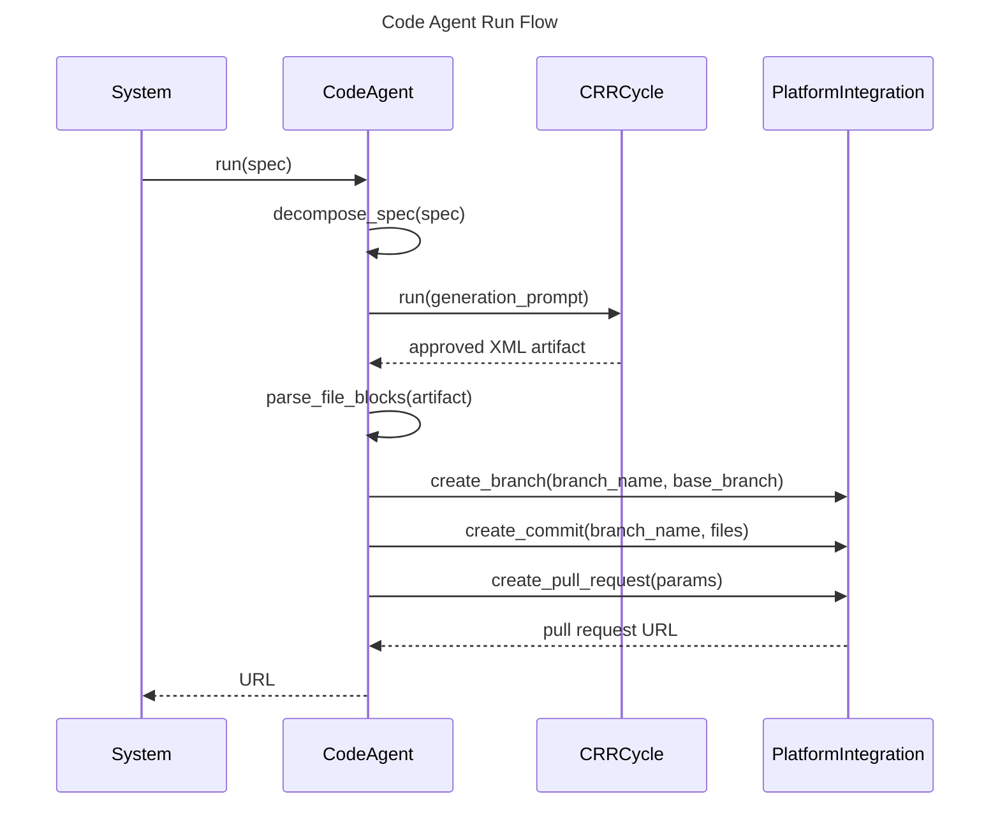

# Code Agent Spec

## Overview
<!-- type: overview lang: markdown -->

`CodeAgent` transforms an approved specification into a remote pull or merge
request. It decomposes the spec into implementation tasks, asks an LLM-backed
CRR cycle to produce a multi-file XML artifact, parses the approved file
blocks, creates a branch, commits all generated files, and opens a pull request
or merge request through `PlatformIntegration`.

## Requirements

```mermaid
---
id: code-agent-requirements
title: Code Agent Requirements
requirements:
  R1:
    text: "CodeAgent MUST decompose a specification into ordered implementation tasks."
    type: functional
    priority: high
    risk: high
    verification: test
  R2:
    text: "CodeAgent MUST require LLM output as file blocks with exact file paths."
    type: interface
    priority: high
    risk: high
    verification: test
  R3:
    text: "CodeAgent MUST run generation and revision through CRRCycle before source-control operations."
    type: functional
    priority: high
    risk: high
    verification: test
  R4:
    text: "CodeAgent MUST use PlatformIntegration for branch, commit, and pull request operations."
    type: interface
    priority: high
    risk: high
    verification: test
  R5:
    text: "CodeAgent MUST fail before remote writes when approved output cannot be parsed into file blocks."
    type: constraint
    priority: high
    risk: high
    verification: test
---
requirementDiagram

requirement R1 {
  id: R1
  text: "CodeAgent MUST decompose a specification into ordered implementation tasks."
  risk: High
  verifymethod: Test
}

requirement R2 {
  id: R2
  text: "CodeAgent MUST require LLM output as file blocks with exact file paths."
  risk: High
  verifymethod: Test
}

requirement R3 {
  id: R3
  text: "CodeAgent MUST run generation and revision through CRRCycle before source-control operations."
  risk: High
  verifymethod: Test
}

requirement R4 {
  id: R4
  text: "CodeAgent MUST use PlatformIntegration for branch, commit, and pull request operations."
  risk: High
  verifymethod: Test
}

requirement R5 {
  id: R5
  text: "CodeAgent MUST fail before remote writes when approved output cannot be parsed into file blocks."
  risk: High
  verifymethod: Test
}
```

<!-- type: requirements lang: mermaid -->



## Scenarios
<!-- type: scenarios lang: yaml -->

```yaml
scenarios:
  - id: approved_code_opens_pr
    given:
      - "CodeAgent has a provider, reviewer, and platform integration."
      - "The CRR cycle returns approved multi-file XML."
    when: "CodeAgent.run receives a full spec."
    then:
      - "The agent parses file blocks."
      - "The platform creates a branch from the configured base branch."
      - "The platform commits all generated files."
      - "The platform opens a pull or merge request and returns its URL."

  - id: malformed_xml_stops_before_remote_write
    given:
      - "The CRR cycle returns an artifact without valid file blocks."
    when: "CodeAgent parses the artifact."
    then:
      - "The run returns an error."
      - "No branch, commit, or pull request call is made."

  - id: missing_platform_rejected_at_build
    given:
      - "A builder has a provider but no platform integration."
    when: "build is called."
    then:
      - "The builder returns a configuration error."
```

## Schema
<!-- type: schema lang: yaml -->

```yaml
definitions:
  CodeAgentConfig:
    type: object
    required:
      - model
      - max_revisions
      - base_branch
      - branch_prefix
    properties:
      model: {type: string}
      max_tokens: {type: integer, minimum: 1}
      temperature:
        type: number
        minimum: 0
        maximum: 2
      max_revisions: {type: integer, minimum: 0}
      base_branch: {type: string}
      branch_prefix: {type: string}

  CodeAgentBuilder:
    type: object
    required: [provider, platform]
    properties:
      provider:
        $ref: "agent/interfaces/llm/providers.md#/definitions/LLMProvider"
      reviewer:
        $ref: "agent/logic/agents/review-agent.md#/definitions/Reviewer"
      platform:
        $ref: "agent/interfaces/platform/integrations.md#/definitions/PlatformIntegration"
      config:
        $ref: "#/definitions/CodeAgentConfig"

  FileBlock:
    type: object
    required: [path, content]
    properties:
      path: {type: string}
      content: {type: string}

  ImplementationTask:
    type: object
    required: [action, category, file_path, description]
    properties:
      action:
        type: string
        enum: [create, modify, delete]
      category:
        type: string
        enum: [data, logic, integration, test, docs, other]
      file_path: {type: string}
      description: {type: string}
```

## Interaction
<!-- type: interaction lang: mermaid -->



## Changes
<!-- type: changes lang: yaml -->

```yaml
changes:
  - path: projects/agentic-workflow/src/agents/code_agent/mod.rs
    action: modify
    section: schema
    impl_mode: codegen
    description: "Define CodeAgentConfig, CodeAgent, and CodeAgentBuilder."
  - path: projects/agentic-workflow/src/agents/code_agent/mod.rs
    action: modify
    section: interaction
    impl_mode: hand-written
    description: "Implement task decomposition orchestration, CRR execution, XML artifact parsing, and platform branch/commit/pull-request flow."
  - path: projects/agentic-workflow/src/agents/code_agent/parser.rs
    action: modify
    section: schema
    impl_mode: hand-written
    description: "Parse multi-file XML blocks into FileBlock values."
  - path: projects/agentic-workflow/src/agents/code_agent/tasks.rs
    action: modify
    section: schema
    impl_mode: hand-written
    description: "Decompose spec changes into ordered ImplementationTask values."
```
