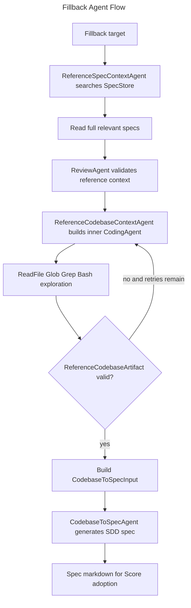

# Fillback Agents Spec

## Overview
<!-- type: overview lang: markdown -->

Fillback agents convert existing code and existing specs into SDD inputs.
`ReferenceSpecContextAgent` reads relevant specs and returns a reviewed
reference-context artifact. `ReferenceCodebaseContextAgent` explores a target
code path through an inner `CodingAgent` and returns structured codebase
context JSON. `CodebaseToSpecAgent` consumes that context and emits or revises
an SDD-formatted spec for adoption by Score.

## Requirements
<!-- type: requirements lang: mermaid -->

```mermaid
---
id: fillback-agents-requirements
title: Fillback Agents Requirements
requirements:
  R1:
    text: "ReferenceSpecContextAgent MUST search, read, and score relevant specs before producing reference context."
    type: functional
    priority: high
    risk: medium
    verification: test
  R2:
    text: "ReferenceSpecContextAgent MUST run one internal review-and-revise pass before final output when review issues exist."
    type: reliability
    priority: medium
    risk: medium
    verification: test
  R3:
    text: "ReferenceCodebaseContextAgent MUST explore target code with tool-backed file reads, globbing, grepping, and shell inspection."
    type: functional
    priority: high
    risk: high
    verification: test
  R4:
    text: "ReferenceCodebaseContextAgent MUST return only JSON that deserializes to ReferenceCodebaseArtifact."
    type: interface
    priority: high
    risk: high
    verification: test
  R5:
    text: "CodebaseToSpecAgent MUST generate or revise SDD-formatted specs from ReferenceCodebaseArtifact input."
    type: functional
    priority: high
    risk: high
    verification: review
---
requirementDiagram

requirement R1 {
  id: R1
  text: "ReferenceSpecContextAgent MUST search, read, and score relevant specs before producing reference context."
  risk: Medium
  verifymethod: Test
}

requirement R2 {
  id: R2
  text: "ReferenceSpecContextAgent MUST run one internal review-and-revise pass before final output when review issues exist."
  risk: Medium
  verifymethod: Test
}

requirement R3 {
  id: R3
  text: "ReferenceCodebaseContextAgent MUST explore target code with tool-backed file reads, globbing, grepping, and shell inspection."
  risk: High
  verifymethod: Test
}

requirement R4 {
  id: R4
  text: "ReferenceCodebaseContextAgent MUST return only JSON that deserializes to ReferenceCodebaseArtifact."
  risk: High
  verifymethod: Test
}

requirement R5 {
  id: R5
  text: "CodebaseToSpecAgent MUST generate or revise SDD-formatted specs from ReferenceCodebaseArtifact input."
  risk: High
  verifymethod: Review
}
```

## Scenarios
<!-- type: scenarios lang: yaml -->

```yaml
scenarios:
  - id: spec_context_approved
    given:
      - "SpecStore.search returns relevant specs for the change input."
      - "The reviewer approves the generated reference-context artifact."
    when: "ReferenceSpecContextAgent.run completes."
    then:
      - "The agent returns pretty JSON matching ReferenceContextOutput."

  - id: spec_context_needs_revision
    given:
      - "The reviewer returns needs-revision with concrete issues."
    when: "ReferenceSpecContextAgent.run continues."
    then:
      - "The agent builds one revision prompt and returns the revised structured JSON."

  - id: codebase_context_valid_json
    given:
      - "The inner CodingAgent returns text containing a JSON object."
    when: "ReferenceCodebaseContextAgent validates the output."
    then:
      - "The agent returns pretty JSON matching ReferenceCodebaseArtifact."

  - id: codebase_context_retry
    given:
      - "The inner CodingAgent returns invalid JSON and retries remain."
    when: "ReferenceCodebaseContextAgent validates the output."
    then:
      - "The agent invokes the inner CodingAgent again with the validation error and prior response."

  - id: generate_spec_from_context
    given:
      - "CodebaseToSpecAgent receives JSON-encoded CodebaseToSpecInput."
    when: "CodebaseToSpecAgent.run parses the input."
    then:
      - "The agent generates an SDD-formatted spec from the codebase artifact."

  - id: revise_spec_from_prompt
    given:
      - "CodebaseToSpecAgent receives plain text rather than CodebaseToSpecInput JSON."
    when: "CodebaseToSpecAgent.run processes the input."
    then:
      - "The agent treats the input as a CRR revision prompt."
```

## Schema
<!-- type: schema lang: yaml -->

```yaml
definitions:
  FillbackAgentChain:
    type: object
    required: [spec_context, codebase_context, spec_generation]
    properties:
      spec_context:
        type: string
        const: ReferenceSpecContextAgent
      codebase_context:
        type: string
        const: ReferenceCodebaseContextAgent
      spec_generation:
        type: string
        const: CodebaseToSpecAgent

  ReferenceContextOutput:
    type: object
    required: [specs, contradictions]
    properties:
      specs:
        type: array
        items:
          type: object
      contradictions:
        type: array
        items:
          type: object

  ReferenceCodebaseArtifact:
    type: object
    required:
      - target
      - key_files
      - architectural_patterns
      - dependencies
      - relationships
      - summary
    properties:
      target: {type: string}
      key_files:
        type: array
        items: {type: object}
      architectural_patterns:
        type: array
        items: {type: string}
      dependencies:
        type: array
        items: {type: object}
      relationships:
        type: array
        items: {type: object}
      summary: {type: string}

  CodebaseToSpecInput:
    type: object
    required: [codebase_context, target_spec_path, additional_context]
    properties:
      codebase_context:
        $ref: "#/definitions/ReferenceCodebaseArtifact"
      target_spec_path:
        type: string
        nullable: true
      additional_context:
        type: string
        nullable: true
```

## Interaction
<!-- type: interaction lang: mermaid -->



## Changes
<!-- type: changes lang: yaml -->

```yaml
changes:
  - path: projects/agentic-workflow/src/agents/reference_spec_context.rs
    action: modify
    section: schema
    impl_mode: codegen
    description: "Define ReferenceContextOutput, spec references, contradictions, config, agent, and builder types."
  - path: projects/agentic-workflow/src/agents/reference_spec_context.rs
    action: modify
    section: interaction
    impl_mode: hand-written
    description: "Search/read specs, produce structured output, run one internal CRR pass, and serialize final JSON."
  - path: projects/agentic-workflow/src/agents/reference_codebase_context.rs
    action: modify
    section: schema
    impl_mode: codegen
    description: "Define ReferenceCodebaseArtifact, key-file/dependency/relationship types, config, agent, and builder."
  - path: projects/agentic-workflow/src/agents/reference_codebase_context.rs
    action: modify
    section: interaction
    impl_mode: hand-written
    description: "Build the inner CodingAgent, extract JSON from responses, validate artifacts, and retry invalid output."
  - path: projects/agentic-workflow/src/agents/codebase_to_spec.rs
    action: modify
    section: schema
    impl_mode: codegen
    description: "Define CodebaseToSpecInput, config, agent, and builder types."
  - path: projects/agentic-workflow/src/agents/codebase_to_spec.rs
    action: modify
    section: interaction
    impl_mode: hand-written
    description: "Generate specs from CodebaseToSpecInput JSON or revise specs from CRR prompts."
```
