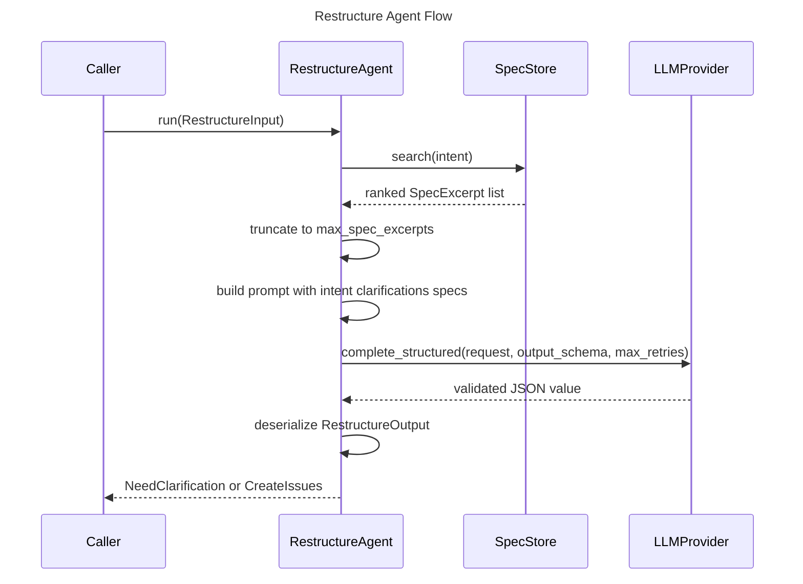

# Restructure Agent Spec

## Overview
<!-- type: overview lang: markdown -->

`RestructureAgent` turns a vague user intent into either spec-informed
clarifying questions or well-formed structured issues. It retrieves relevant
spec excerpts, assembles the user intent plus clarification history into a
prompt, calls the configured LLM provider with a structured-output schema, and
deserializes the validated JSON into typed output.

The agent is stateless after construction. The builder requires both an
`LLMProvider` and a `SpecStore`, so production callers can inject the real spec
index while tests can inject deterministic mocks.

## Schema
<!-- type: schema lang: yaml -->

```yaml
definitions:
  Clarification:
    type: object
    required: [question, answer]
    properties:
      question: {type: string}
      answer: {type: string}

  RestructureInput:
    type: object
    required: [intent, project_id, clarifications]
    properties:
      intent: {type: string}
      project_id: {type: string}
      clarifications:
        type: array
        items:
          $ref: "#/definitions/Clarification"

  Question:
    type: object
    required: [id, question, why, suggestions]
    properties:
      id: {type: string}
      question: {type: string}
      why: {type: string}
      suggestions:
        type: array
        items: {type: string}

  StructuredIssue:
    type: object
    required:
      - title
      - description
      - issue_type
      - priority
      - labels
      - acceptance_criteria
      - depends_on
      - scope
    properties:
      title: {type: string}
      description: {type: string}
      issue_type: {type: string}
      priority:
        type: string
        enum: [P0, P1, P2, P3]
      labels:
        type: array
        items: {type: string}
      acceptance_criteria:
        type: array
        items: {type: string}
      depends_on:
        type: array
        items: {type: string}
      scope:
        type: string
        enum: [small, medium, large]

  RestructureOutput:
    oneOf:
      - type: object
        required: [type, questions]
        properties:
          type: {type: string, const: need_clarification}
          questions:
            type: array
            items:
              $ref: "#/definitions/Question"
      - type: object
        required: [type, issues, summary]
        properties:
          type: {type: string, const: create_issues}
          issues:
            type: array
            items:
              $ref: "#/definitions/StructuredIssue"
          summary: {type: string}

  SpecExcerpt:
    type: object
    required: [path, content, relevance]
    properties:
      path: {type: string}
      content: {type: string}
      relevance:
        type: number
        minimum: 0
        maximum: 1

  RestructureAgentConfig:
    type: object
    required: [model, max_spec_excerpts, max_retries]
    properties:
      model: {type: string}
      max_tokens: {type: integer, minimum: 1}
      temperature:
        type: number
        minimum: 0
        maximum: 2
      max_spec_excerpts: {type: integer, minimum: 1}
      max_retries: {type: integer, minimum: 0}
```

## Interaction
<!-- type: interaction lang: mermaid -->



## Changes
<!-- type: changes lang: yaml -->

```yaml
changes:
  - path: projects/agentic-workflow/src/agents/restructure.rs
    action: modify
    section: schema
    impl_mode: codegen
    description: "Define Clarification, RestructureInput, Question, StructuredIssue, RestructureOutput, SpecExcerpt, and RestructureAgentConfig."
  - path: projects/agentic-workflow/src/agents/restructure.rs
    action: modify
    section: interaction
    impl_mode: hand-written
    description: "Implement SpecStore lookup, prompt assembly, structured completion, output deserialization, and builder validation."
```
