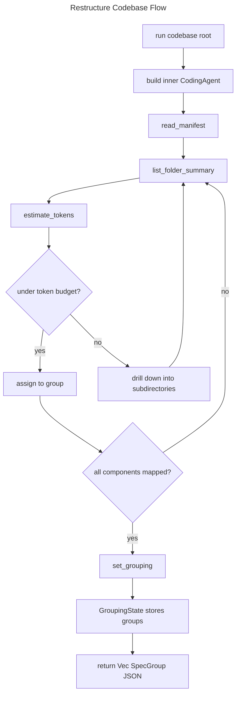

# Restructure Codebase Agent Spec

## Overview
<!-- type: overview lang: markdown -->

`RestructureCodebaseAgent` decomposes a codebase into budget-safe spec groups
for fillback. It builds an inner `CodingAgent` with `read_manifest`,
`list_folder_summary`, `estimate_tokens`, and `set_grouping`, then asks that
inner agent to explore the target root until it calls `set_grouping`.

The outer agent validates that non-empty groups were stored in shared
`GroupingState`, retries when grouping is missing or empty, and returns a
pretty JSON `Vec<SpecGroup>` for downstream context and codebase-to-spec agents.

## Requirements
<!-- type: requirements lang: mermaid -->

```mermaid
---
id: restructure-codebase-agent-requirements
title: Restructure Codebase Agent Requirements
requirements:
  R1:
    text: "RestructureCodebaseAgent MUST discover workspace members before deep directory exploration."
    type: functional
    priority: high
    risk: medium
    verification: test
  R2:
    text: "RestructureCodebaseAgent MUST estimate token counts before assigning components to groups."
    type: functional
    priority: high
    risk: high
    verification: test
  R3:
    text: "RestructureCodebaseAgent MUST drill down into components that exceed the configured token budget."
    type: functional
    priority: high
    risk: high
    verification: review
  R4:
    text: "RestructureCodebaseAgent MUST require set_grouping as the terminal grouping action."
    type: interface
    priority: high
    risk: high
    verification: test
  R5:
    text: "RestructureCodebaseAgent MUST retry when no groups or empty groups are produced."
    type: reliability
    priority: medium
    risk: medium
    verification: test
---
requirementDiagram

requirement R1 {
  id: R1
  text: "RestructureCodebaseAgent MUST discover workspace members before deep directory exploration."
  risk: Medium
  verifymethod: Test
}

requirement R2 {
  id: R2
  text: "RestructureCodebaseAgent MUST estimate token counts before assigning components to groups."
  risk: High
  verifymethod: Test
}

requirement R3 {
  id: R3
  text: "RestructureCodebaseAgent MUST drill down into components that exceed the configured token budget."
  risk: High
  verifymethod: Review
}

requirement R4 {
  id: R4
  text: "RestructureCodebaseAgent MUST require set_grouping as the terminal grouping action."
  risk: High
  verifymethod: Test
}

requirement R5 {
  id: R5
  text: "RestructureCodebaseAgent MUST retry when no groups or empty groups are produced."
  risk: Medium
  verifymethod: Test
}
```

## Scenarios
<!-- type: scenarios lang: yaml -->

```yaml
scenarios:
  - id: grouping_success
    given:
      - "The inner CodingAgent calls set_grouping with at least one group."
    when: "RestructureCodebaseAgent.run completes."
    then:
      - "The outer agent serializes the stored groups as pretty JSON."

  - id: set_grouping_never_called
    given:
      - "The inner CodingAgent finishes without calling set_grouping."
    when: "Retries remain."
    then:
      - "The outer agent prompts the inner agent to re-analyze and finalize grouping."
    otherwise:
      - "The run returns an error describing that set_grouping was never called."

  - id: empty_grouping_rejected
    given:
      - "The inner CodingAgent calls set_grouping with an empty group list."
    when: "Retries remain."
    then:
      - "The outer agent prompts the inner agent to produce at least one non-empty group."
```

## Schema
<!-- type: schema lang: yaml -->

```yaml
definitions:
  RestructureCodebaseAgentConfig:
    type: object
    required: [model, max_turns, max_retries, token_budget]
    properties:
      model: {type: string}
      temperature:
        type: number
        minimum: 0
        maximum: 2
      max_turns: {type: integer, minimum: 1}
      max_retries: {type: integer, minimum: 0}
      token_budget: {type: integer, minimum: 1}

  SpecGroup:
    type: object
    required: [name, paths, description]
    properties:
      name: {type: string}
      paths:
        type: array
        items: {type: string}
      description: {type: string}
      estimated_tokens: {type: integer, minimum: 0}

  SetGroupingInput:
    type: object
    required: [groups]
    properties:
      groups:
        type: array
        items:
          $ref: "#/definitions/SpecGroup"

  SetGroupingOutput:
    type: object
    required: [status, group_count, message]
    properties:
      status: {type: string, const: grouping_complete}
      group_count: {type: integer, minimum: 0}
      message: {type: string}
```

## Interaction
<!-- type: interaction lang: mermaid -->



## Changes
<!-- type: changes lang: yaml -->

```yaml
changes:
  - path: projects/agentic-workflow/src/agents/restructure_codebase.rs
    action: modify
    section: schema
    impl_mode: codegen
    description: "Define RestructureCodebaseAgentConfig, RestructureCodebaseAgent, and RestructureCodebaseAgentBuilder."
  - path: projects/agentic-workflow/src/agents/restructure_codebase.rs
    action: modify
    section: interaction
    impl_mode: hand-written
    description: "Implement the outer retry loop, inner CodingAgent construction, grouping validation, and JSON serialization."
  - path: projects/agent/core/src/tools/read_manifest.rs
    action: modify
    section: interaction
    impl_mode: hand-written
    description: "Discover workspace members and root components."
  - path: projects/agent/core/src/tools/list_folder_summary.rs
    action: modify
    section: interaction
    impl_mode: hand-written
    description: "Summarize directory structure, file counts, and line counts."
  - path: projects/agent/core/src/tools/estimate_tokens.rs
    action: modify
    section: interaction
    impl_mode: hand-written
    description: "Estimate token counts for files and folders."
  - path: projects/agent/core/src/tools/set_grouping.rs
    action: modify
    section: schema
    impl_mode: hand-written
    description: "Store final SpecGroup values in shared GroupingState."
```
