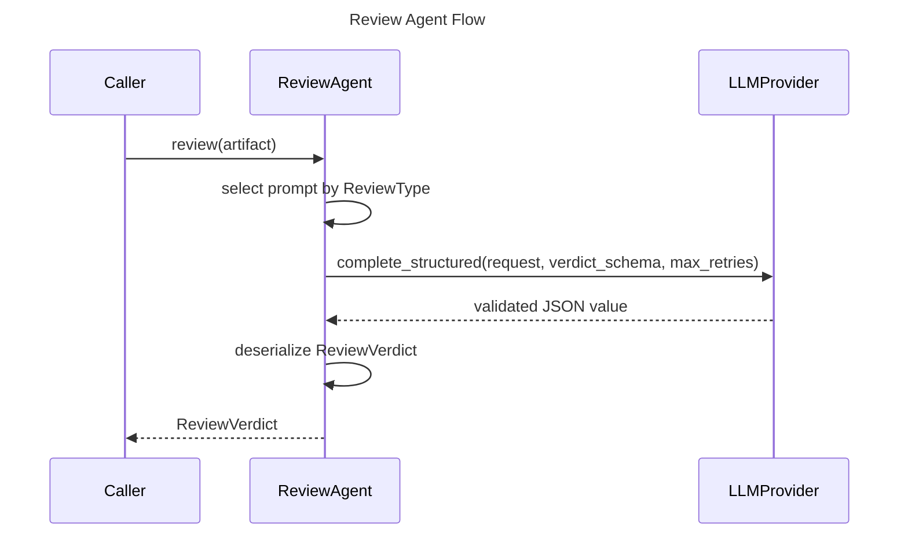

# Review Agent Spec

## Overview
<!-- type: overview lang: markdown -->

`ReviewAgent` is an LLM-backed reviewer for spec and code artifacts. It
implements the `Reviewer` trait, chooses a prompt from `ReviewType`, calls the
provider through structured completion, and deserializes the validated JSON into
`ReviewVerdict`.

The same `Reviewer` trait is consumed by CRR workflows, allowing tests or other
review implementations to be injected where deterministic behavior is needed.

## Schema
<!-- type: schema lang: yaml -->

```yaml
definitions:
  Reviewer:
    type: object
    required: [review]
    properties:
      review:
        input: artifact
        output: ReviewVerdict

  ReviewType:
    type: string
    enum: [spec, code]

  Severity:
    type: string
    enum: [high, medium, low]

  ReviewIssue:
    type: object
    required: [severity, description, suggestion]
    properties:
      severity:
        $ref: "#/definitions/Severity"
      description: {type: string}
      suggestion: {type: string}
      location: {type: string}

  ReviewVerdict:
    oneOf:
      - type: object
        required: [verdict]
        properties:
          verdict: {type: string, const: approved}
      - type: object
        required: [verdict, issues]
        properties:
          verdict: {type: string, const: needs_revision}
          issues:
            type: array
            items:
              $ref: "#/definitions/ReviewIssue"
      - type: object
        required: [verdict, reason]
        properties:
          verdict: {type: string, const: rejected}
          reason: {type: string}

  ReviewAgentConfig:
    type: object
    required: [review_type, model, max_retries]
    properties:
      review_type:
        $ref: "#/definitions/ReviewType"
      model: {type: string}
      max_tokens: {type: integer, minimum: 1}
      temperature:
        type: number
        minimum: 0
        maximum: 2
      max_retries: {type: integer, minimum: 0}
```

## Interaction
<!-- type: interaction lang: mermaid -->



## Changes
<!-- type: changes lang: yaml -->

```yaml
changes:
  - path: projects/agentic-workflow/src/agents/review/types.rs
    action: modify
    section: schema
    impl_mode: codegen
    description: "Define ReviewType, Severity, ReviewIssue, and ReviewVerdict."
  - path: projects/agentic-workflow/src/agents/review/mod.rs
    action: modify
    section: schema
    impl_mode: codegen
    description: "Define ReviewAgentConfig, ReviewAgent, and ReviewAgentBuilder."
  - path: projects/agentic-workflow/src/agents/review/mod.rs
    action: modify
    section: interaction
    impl_mode: hand-written
    description: "Implement Reviewer review flow, prompt selection, structured completion, verdict deserialization, and builder validation."
```
