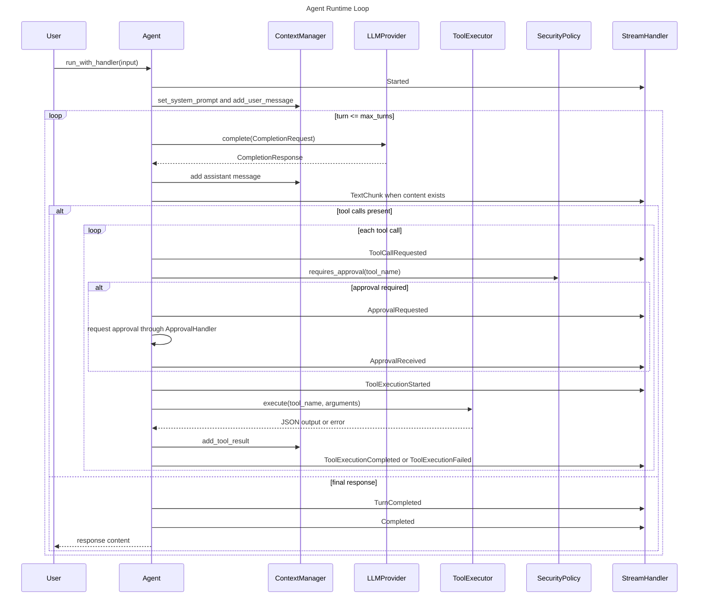
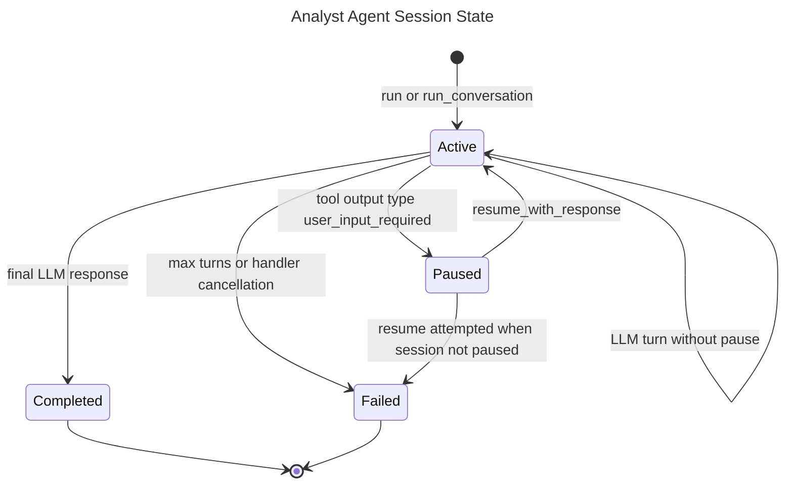
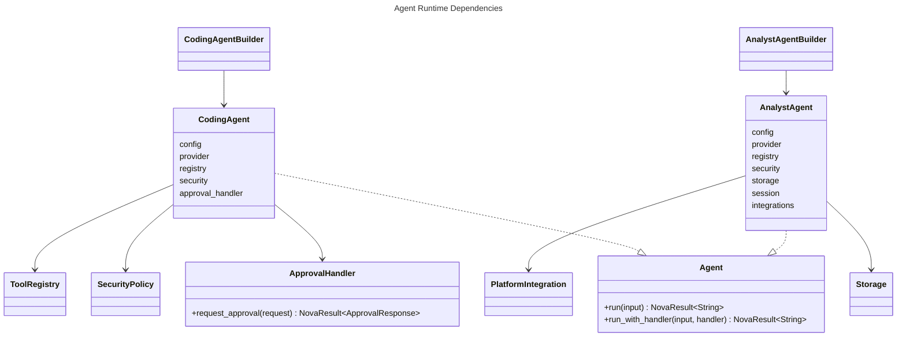

# Agent Runtime

## Overview
<!-- type: overview lang: markdown -->

The SDD agent runtime is centered on the `Agent` trait in
`projects/agentic-workflow/src/agents/mod.rs`. `CodingAgent` provides tool-backed coding
turns with security approval and context compaction. `AnalystAgent` uses the
same completion loop with session persistence, analysis tools, platform
integration tools, and pause/resume behavior for user clarification.

## Schema
<!-- type: schema lang: yaml -->

```yaml
definitions:
  Agent:
    type: object
    required: [run, run_with_handler]
    properties:
      run:
        type: string
        const: "async fn run(&self, input: &str) -> NovaResult<String>"
      run_with_handler:
        type: string
        const: "async fn run_with_handler(&self, input: &str, handler: &dyn StreamHandler) -> NovaResult<String>"

  ApprovalHandler:
    type: object
    required: [request_approval]
    properties:
      request_approval:
        type: string
        const: "async fn request_approval(ApprovalRequest) -> NovaResult<ApprovalResponse>"

  CodingAgentConfig:
    type: object
    required:
      - system_prompt
      - max_turns
      - model
      - temperature
      - max_tokens
      - max_context_tokens
      - compact_model
    properties:
      system_prompt: {type: string}
      max_turns: {type: integer, minimum: 1, default: 20}
      model: {type: string, default: "claude-sonnet-4-20250514"}
      temperature: {type: number, nullable: true, default: 0.0}
      max_tokens: {type: integer, nullable: true, default: 8192}
      max_context_tokens: {type: integer, minimum: 1, default: 128000}
      compact_model: {type: string, default: "claude-3-haiku-20240307"}

  AnalystAgentConfig:
    type: object
    required:
      - system_prompt
      - max_turns
      - model
      - temperature
      - max_tokens
      - max_context_tokens
      - compact_model
    properties:
      system_prompt: {type: string}
      max_turns: {type: integer, minimum: 1, default: 30}
      model: {type: string, default: "claude-sonnet-4-20250514"}
      temperature: {type: number, nullable: true, default: 0.3}
      max_tokens: {type: integer, nullable: true, default: 8192}
      max_context_tokens: {type: integer, minimum: 1, default: 128000}
      compact_model: {type: string, default: "claude-3-haiku-20240307"}

  BuilderRequirement:
    type: object
    required: [agent, required_fields, defaulted_fields]
    properties:
      agent: {type: string}
      required_fields:
        type: array
        items: {type: string}
      defaulted_fields:
        type: array
        items: {type: string}
```

## Interaction
<!-- type: interaction lang: mermaid -->



## State Machine
<!-- type: state-machine lang: mermaid -->



## Dependency
<!-- type: dependency lang: mermaid -->



## Changes
<!-- type: changes lang: yaml -->

```yaml
changes:
  - path: projects/agentic-workflow/src/agents/mod.rs
    action: modify
    section: schema
    impl_mode: codegen
    description: "Define AutoApproveHandler while keeping Agent and ApprovalHandler traits hand-written."
  - path: projects/agentic-workflow/src/agents/coding.rs
    action: modify
    section: schema
    impl_mode: codegen
    description: "Define CodingAgentConfig including compact_model."
  - path: projects/agentic-workflow/src/agents/coding.rs
    action: modify
    section: interaction
    impl_mode: hand-written
    description: "Implement the LLM/tool loop, approval handling, stream events, and builder validation."
  - path: projects/agentic-workflow/src/agents/analyst.rs
    action: modify
    section: schema
    impl_mode: codegen
    description: "Define AnalystAgentConfig, AnalystAgent, and AnalystAgentBuilder."
  - path: projects/agentic-workflow/src/agents/analyst.rs
    action: modify
    section: state-machine
    impl_mode: hand-written
    description: "Persist sessions, pause on user-input-required tool output, and resume from stored messages."
```
